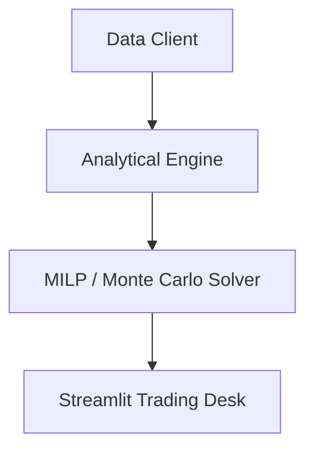

# design-facilitator

## Purpose
`design-facilitator` fires as **Transition $T_{\text{DESIGN}}$** in the **Agentic Coloured Petri Net (CPN)**. It consumes a `BrainstormToken` from $P_{\text{BRAINSTORM\_POOL}}$ (or directly an `IssueToken` from $P_{\text{ISSUE\_READY}}$ for Track B items) guarded by a human `ApprovalToken` from $P_{\text{HUMAN\_SEMAPHORE}}$, and produces an authoritative, spec-grade Technical Design token in $P_{\text{DESIGN\_READY}}$ (`docs/design/des_<ID>_<slug>.md`).

This skill integrates the mathematical rigor and institutional trading desk standards of Rubies Rangers:
1. **CPN Lifecycle & Provenance Governance**: Maintains unbroken provenance lineage (`Issue -> [Brainstorm] -> Design -> Plan -> Tasks -> Playbook`) using standardized Frontloader metadata.
2. **Mathematical Moneyball Formalism**: Explicitly defines optimization objective functions, knapsack constraints, probability distribution propagation, and tail risk metrics ($P_{10}/P_{50}/P_{90}$) conforming to `.agents/rules/moneyball_strategy.md`.
3. **Data Contracts & Pythonic Typing**: Mandates frozen `@dataclass` contracts, strict type annotations, vectorization requirements, and zero `.iterrows()` loops conforming to `.agents/rules/python_standards.md`.
4. **Visual Architecture**: Mandates Mermaid sequence and flowchart diagrams mapping component topology and data flow.
5. **Systematic Failure & Adversarial Audit**: Audits proposed architectures against concrete failure modes (API 403/429 errors, dropped lineups, budget overflows, duplicate IDs, simulation divergences).

## When to Activate
- When a user runs `/design-facilitator` to formalize a brainstorm into a technical design specification.
- When transitioning from Stage 2 (Brainstorm) to Stage 3 (Design).
- When asked to "write the technical design" or "produce the detailed design document".

## Operational Constraints (CRITICAL)
- **Zero-Shell Mandate**: Do not use `run_command` during design generation (only running `python scripts/ard_builder.py` is permitted).
- **CPN Lineage Rule**: The Design document MUST link back to the source Brainstorm in its OKF `sources` array: `sources: ["docs/brainstorm/brn_<ID>_<slug>.md"]` to preserve the immutable acyclic provenance trace.
- **Visual Mandate**: The design MUST include at least one Mermaid diagram (flowchart, sequence, or state transition).
- **Explain Before Declaring**: Every contract, class, or function must be preceded by descriptive prose explaining *why* it is shaped that way and what invariants it preserves.
- **Zero Hallucinated Scope**: Derive requirements strictly from the Brainstorm decisions. Label unstated details explicitly as `ASSUMPTION`.

## Execution Steps

### 1. Analyze the Source Brainstorm
- Read the input Brainstorm (`docs/brainstorm/brn_<ID>_<slug>.md`) using `view_file`.
- Note the Origin Issue from the Frontloader to preserve unbroken CPN lineage trace.

### 2. Formulate Mathematical & Architectural Specifications
- Define the objective functions and constraints.
- Define the component topology and data flows.
- Specify frozen `@dataclass` data contracts and typed interfaces.
- Enumerate failure modes and mitigation strategies.

### 3. Draft Design Document
Write `docs/design/des_<ID>_<slug>.md` using the template below.

### 4. Rebuild ARD Manifest
Run `python scripts/ard_builder.py`.

---

## Content Body Template

```markdown
---
type: Design
title: "[#<ID>] <Title> - Detailed Design"
description: "<Brief 1-2 sentence specification of components, mathematical models, and contracts>"
tags: [design, architecture, python, <domain>, <tech>]
status: Active
sources: ["docs/brainstorm/brn_<ID>_<slug>.md"]
generated:
  at: "<ISO-8601-UTC-Timestamp>"
  by: "agent:design-facilitator"
---

# Design [#<ID>]: <Title>

## 0. Frontloader (CPN Lifecycle Context)
> **Metadata for Downstream Skills & Audits**
> - **Origin Place**: `P_BRAINSTORM_POOL` (or `P_ISSUE_READY`)
> - **Current Transition**: `T_DESIGN`
> - **Next Place**: `P_DESIGN_READY`
> - **CPN Lineage**: Issue [#<ID>] -> [Brainstorm] -> Design [des_<ID>] -> Plan -> Tasks -> Playbook
> - **Origin Issue**: [`docs/issues/iss_<ID>_<slug>.md`](file:///c:/Users/cw171001/OneDrive%20-%20Teradata/Documents/GitHub/rubies_rangers/docs/issues/iss_<ID>_<slug>.md)
> - **Origin Brainstorm**: [`docs/brainstorm/brn_<ID>_<slug>.md`](file:///c:/Users/cw171001/OneDrive%20-%20Teradata/Documents/GitHub/rubies_rangers/docs/brainstorm/brn_<ID>_<slug>.md)
> - **Downstream Consumers**: `pln_<ID>`, `tsk_<ID>`
> - **URN**: urn:air:clydewatts1:rubies_rangers:docs:des_<ID>_<slug>

---

## 1. Purpose & Scope

### 1.1 Purpose
<Why this component or architecture is needed, baseline problems, and goals.>

### 1.2 In Scope
- <Bullet 1>
- <Bullet 2>

### 1.3 Out of Scope
- <Explicitly excluded items>

---

## 2. Mathematical & Quantitative Formalism
<Objective functions, knapsack formulation, probability distributions, tail risk definitions, or CPN net equations.>

$$\max \sum_{i=1}^{N} x_i \cdot \mathbb{E}[V_i] - \lambda \cdot \text{Var}(V)$$

---

## 3. Component Architecture & Topology



---

## 4. Data Contracts & Interfaces

### 4.1 Dataclass Contracts
```python
from dataclasses import dataclass
from typing import List, Optional

@dataclass(frozen=True)
class ExampleContract:
    """Immutable data contract for ..."""
    element_id: int
    expected_points: float
    tail_p90: float
```

---

## 5. Failure & Adversarial Modes

| Failure Mode | Root Cause | Systemic Consequence | Detection & Mitigation |
| :--- | :--- | :--- | :--- |
| **API 403/429** | Expired session or rate limit | Lineup submission dropped | Saga retry with exponential backoff; route to compensation |
| **Budget Invariant** | Squad cost exceeds limit | Illegal lineup rejected by FPL | Hard validation guard halts submission before network dispatch |

---

## 6. Verification & Testing Strategy
- Unit test coverage with `pytest`
- Property tests with `hypothesis`
- Vectorization checks (zero `.iterrows()`)
```
