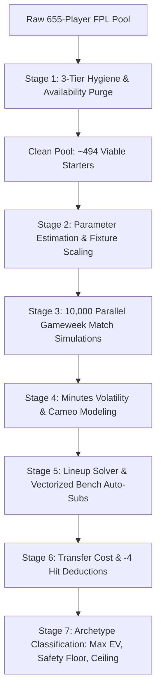
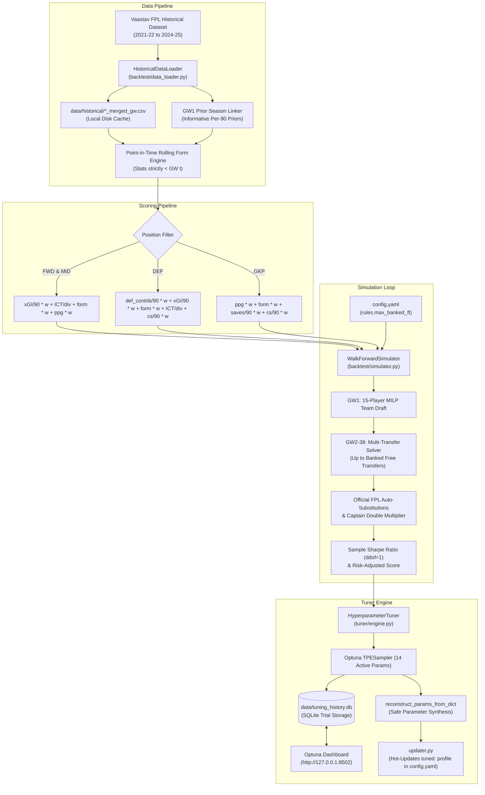

# Rubies Rangers — FPL Moneyball Analytics & Monte Carlo Optimizer ⚽

An enterprise-grade quantitative analytics, predictive modeling, and optimization platform for Fantasy Premier League (FPL) team **Rubies Rangers**, engineered around strict **Moneyball Principles**.

This platform combines **Mixed-Integer Linear Programming (MILP)**, **Betting Market Implied Probabilities**, **Understat Shot Quality Process Metrics**, and **Stochastic Monte Carlo Simulations** (up to 10,000 parallel gameweek scenarios) to evaluate transfers, lineups, captaincy choices, and mini-league rival strategies.

---

## Table of Contents

1. [Core Moneyball Philosophy](#core-moneyball-philosophy)
2. [The Monte Carlo Method (Deep Dive)](#the-monte-carlo-method-deep-dive)
   - [Why Stochastic Simulation Beats Single-Point xP](#why-stochastic-simulation-beats-single-point-xp)
   - [The 7-Stage Simulation Architecture](#the-7-stage-simulation-architecture)
   - [Mathematical & Probabilistic Formulations](#mathematical--probabilistic-formulations)
   - [Transfer Cost Modeling & Point Hit Penalties](#transfer-cost-modeling--point-hit-penalties)
   - [The 3 Strategic Transfer Archetypes](#the-3-strategic-transfer-archetypes)
   - [How Monte Carlo Connects to the Historical Training Process](#how-monte-carlo-connects-to-the-historical-training-process)
3. [All 8 Quantitative Prediction Techniques](#all-8-quantitative-prediction-techniques)
   - [1. Monte Carlo Stochastic Simulation](#1-monte-carlo-stochastic-simulation)
   - [2. Bookmaker Implied Probabilities & Linear xP Modeling](#2-bookmaker-implied-probabilities--linear-xp-modeling)
   - [3. Advanced Tactical Process & Understat Shot Quality](#3-advanced-tactical-process--understat-shot-quality)
   - [4. Match-by-Match Trend & Minutes Stability Engine](#4-match-by-match-trend--minutes-stability-engine)
   - [5. Set-Piece & Penalty Hierarchy Matrix](#5-set-piece--penalty-hierarchy-matrix)
   - [6. Market Velocity & Nightly Price Predictor](#6-market-velocity--nightly-price-predictor)
   - [7. Rolling Fixture Difficulty Rating (FDR) & Schedule Swings](#7-rolling-fixture-difficulty-rating-fdr--schedule-swings)
   - [8. Mini-League Scout, Rival Spy & Effective Ownership (EO%)](#8-mini-league-scout-rival-spy--effective-ownership-eo)
4. [Guide to the Platform Programs](#guide-to-the-platform-programs)
   - [Program 1: Interactive Streamlit Web Dashboard (`app.py`)](#program-1-interactive-streamlit-web-dashboard-apppy)
   - [Program 2: FastAPI REST Microservice (`api.py`)](#program-2-fastapi-rest-microservice-apipy)
   - [Program 3: Master CLI Dispatcher (`team_manager.py`)](#program-3-master-cli-dispatcher-team_managerpy)
   - [Program 4: Backtesting & Auto-Tuning CLI (`tuner/cli.py`)](#program-4-backtesting--auto-tuning-cli-tunerclipy)
   - [Program 5: Specialized Modular CLI Trackers](#program-5-specialized-modular-cli-trackers)
5. [Walk-Forward Backtesting & Optuna Auto-Tuning Subsystem](#walk-forward-backtesting--optuna-auto-tuning-subsystem)
   - [Subsystem Architecture & Flow](#subsystem-architecture--flow)
   - [The Two-Tier Architecture: Historical Training vs. Stochastic Simulation](#the-two-tier-architecture-historical-training-vs-stochastic-simulation)
   - [Historical Data Pipeline & Anti-Leakage Guarantee](#historical-data-pipeline--anti-leakage-guarantee)
   - [Position-Differentiated Moneyball Scoring Formulas](#position-differentiated-moneyball-scoring-formulas)
   - [Walk-Forward Simulator Mechanics](#walk-forward-simulator-mechanics)
   - [Optuna TPESampler Hyperparameter Optimization Engine](#optuna-tpesampler-hyperparameter-optimization-engine)
   - [Interactive Optuna Web Dashboard (Port 8502)](#interactive-optuna-web-dashboard-port-8502)
   - [CLI Commands & Workflow Execution](#cli-commands--workflow-execution)
6. [Centralized Configuration Engine (`config.yaml`)](#centralized-configuration-engine-configyaml)
   - [Architecture & Profile Structure](#architecture--profile-structure)
   - [Heuristic vs. Tuned Parameter Profiles](#heuristic-vs-tuned-parameter-profiles)
   - [Historical Season Rules & FT Rollover Limits](#historical-season-rules--ft-rollover-limits)
   - [Python API Access (`config_manager.py`)](#python-api-access-config_managerpy)
7. [Automated Test Suite & Quality Assurance (53/53 Tests Passing)](#automated-test-suite--quality-assurance-5353-tests-passing)
8. [REST API Documentation & cURL Examples](#rest-api-documentation--curl-examples)
9. [CLI Command Cheat Sheet](#cli-command-cheat-sheet)
10. [Repository Architecture](#repository-architecture)
11. [Greenfield Installation & Setup Guide (New Laptop)](#greenfield-installation--setup-guide-new-laptop)

---

## Core Moneyball Philosophy

The strategic governance of Rubies Rangers is strictly codified in [`AGENTS.md`](AGENTS.md):

1. **Underlying Expected Metrics Over Past Hype:**
   Prioritize true expected performance indicators (`expected_goals_per_90`, `expected_assists_per_90`, `NPxG_90`, and `expected_goal_involvements_per_90`). Evaluate process over outcome; never chase unsustainable finishing streaks or lucky historical spikes.
2. **Cost Efficiency & Points Per Million (PPM):**
   Maximize return on investment (expected points per £1.0m of squad budget). Systematically identify undervalued £4.5m–£6.5m assets with underlying metrics rivaling £8.0m+ premium names.
3. **Defensive Contribution & Consistency Floor:**
   Evaluate defenders and defensive midfielders through `defensive_contribution_per_90` (tackles, interceptions, clearances, blocks, and clean sheets per 90). Favor guaranteed 90-minute starters over volatile rotation risks.
4. **Stochastic Risk Management & Balanced Squad Optimization:**
   Football is a low-scoring, high-variance game. Maximize total expected output across the full 11 starters plus active playing bench cover rather than starving the squad to finance non-performing premium names. All transfer recommendations must be justified with mathematical data comparisons (net expected return delta vs. transfer cost).

---

## The Monte Carlo Method (Deep Dive)

### Why Stochastic Simulation Beats Single-Point xP

Conventional FPL analytics rely on static **Expected Points ($xP$)**—a single deterministic number (e.g. $xP = 5.4$). This causes serious decision failures:
- **Fat-Tailed, Discrete Distributions:** FPL points follow skewed, discrete Poisson and Bernoulli distributions. A player with $5.4\ xP$ does not score 5.4 points; they score 2 points with 55% probability, 6 points with 25% probability, and 15 points with 10% probability.
- **Binary Clean Sheet Clustering:** If a club concedes a 93rd-minute goal, your goalkeeper and both center-backs simultaneously lose 4 points each (an 8- to 12-point correlated swing).
- **The Bench Risk Illusion:** If a rotation risk player (e.g., Senesi or Solanke) gets 0 minutes, static models underestimate the impact. Monte Carlo simulates the bench auto-substitution mechanics, giving a true picture of squad resilience.

### The 7-Stage Simulation Architecture

The engine implemented in [`montecarlo_engine.py`](montecarlo_engine.py) operates through a 7-stage vectorized pipeline:



### Mathematical & Probabilistic Formulations

#### 1. 3-Tier Data Hygiene & Availability Purge
Before any simulation runs, non-viable players are purged:
- **Tier 1 (Status Flags):** Strip all players where `status in ['u', 'i', 's']` (transferred abroad, injured, suspended).
- **Tier 2 (News Keywords):** Strip players whose news notes contain *“Joined”, “loan”, “transferred”, “suspended”, “surgery”, “cruciate”, “achilles”*.
- **Tier 3 (Zero Minutes & 0% Playing Chance):** Strip players with `chance_of_playing == 0` or 0 total minutes.
*Out of 655 Premier League players, 161+ non-viable players are eliminated, preventing the optimizer from recommending departed or permanently injured assets.*

#### 2. Probabilistic Availability & Minutes Sampling
For yellow-flagged players (`chance_of_playing` in $[25\%, 50\%, 75\%]$), availability is sampled via Bernoulli trials:
$$A_i \sim \text{Bernoulli}(p_{\text{play}})$$
If $A_i = 1$, minutes are sampled from their historical starts distribution:
$$M_i \sim \mathcal{N}(\mu_{\text{starts}}, \sigma_{\text{starts}}) \quad \text{clipped to } [45, 90]$$
If benched or designated cameo, minutes are drawn from cameo distribution $[10, 30]$ minutes.

#### 3. Match Event Generation (Poisson & Bernoulli)
- **Goals:** Drawn from a Poisson distribution scaled by opponent defensive fixture difficulty ($FDR_{\text{opp}}$):
  $$\lambda_{G, i} = \text{NPxG\_90}_i \times \left(\frac{M_i}{90}\right) \times \left(1 + 0.12 \times (3 - FDR_{\text{opp}})\right)$$
  $$G_i \sim \text{Poisson}(\lambda_{G, i})$$
- **Assists:**
  $$\lambda_{A, i} = \text{xA\_90}_i \times \left(\frac{M_i}{90}\right) \times \left(1 + 0.10 \times (3 - FDR_{\text{opp}})\right)$$
  $$A_i \sim \text{Poisson}(\lambda_{A, i})$$
- **Clean Sheets:** Computed for Goalkeepers and Defenders using opponent expected goals conceded ($\lambda_{\text{conceded}}$):
  $$P(\text{Clean Sheet}) = e^{-\lambda_{\text{conceded}}}$$
  $$CS_i \sim \text{Bernoulli}(P(\text{Clean Sheet})) \quad \text{if } M_i \ge 60$$

#### 4. Vectorized Bench Auto-Substitution
For each simulation trial $t \in [1, N]$:
1. If an outfield starter $S_j$ records $M_{j, t} = 0$, the engine scans the bench in strict priority order ($B_1 \to B_2 \to B_3$).
2. The substitute enters if and only if the resulting formation satisfies FPL legal limits:
   $$\text{Defenders} \ge 3, \quad \text{Midfielders} \ge 2, \quad \text{Forwards} \ge 1$$
3. Goalkeeper auto-substitution is strictly 1-to-1 with the backup goalkeeper.
4. **Captaincy Fallback:** If Captain $C$ plays 0 minutes, Vice-Captain $VC$ receives the $2\times$ multiplier.

### Transfer Cost Modeling & Point Hit Penalties

The engine calculates net transfer impact by charging $-4$ points for every transfer exceeding available free transfers:
$$\text{Hit Penalty} = \max(0, N_{\text{transfers}} - N_{\text{free}}) \times 4$$
$$\Delta \text{Net Gain}_t = \text{Score}_{\text{new squad}, t} - \text{Score}_{\text{current squad}, t} - \text{Hit Penalty}$$
$$\text{Mean Net Gain } E[\Delta \text{Net Gain}] = \frac{1}{N}\sum_{t=1}^N \Delta \text{Net Gain}_t$$
$$\text{Win Probability } P(\text{Gain} > 0) = \frac{1}{N}\sum_{t=1}^N \mathbb{I}(\Delta \text{Net Gain}_t > 0)$$

### The 3 Strategic Transfer Archetypes

Out of all evaluated legal transfer permutations, the engine isolates three archetypes:

| Archetype | Icon | Optimization Metric | Strategic Objective |
| :--- | :---: | :--- | :--- |
| **🏆 Max Expected Value** | 🥇 | $\max E[\Delta \text{Net Gain}]$ | **Moneyball Core:** Pure mathematical edge over season average. |
| **🛡️ Max Floor & Safety** | 🛡️ | $\max \text{Percentile}_{10}(\text{Score})$ | **Capital Preservation:** Minimizes blank risk, eliminates 0-minute bench-warmers. |
| **🚀 Max Ceiling & Differential** | 🚀 | $\max \text{Percentile}_{90}(\text{Score})$ | **League Chaser:** High explosive upside to aggressively close mini-league deficits. |

### How Monte Carlo Connects to the Historical Training Process

The live forward-looking Monte Carlo simulation and the multi-season historical training engine operate in synergy:

1. **Parameter Inheritance from `config.yaml`**:
   The Monte Carlo engine does not guess its operational parameters; it directly inherits both the baseline `heuristic:` and auto-optimized `tuned:` parameters from [`config.yaml`](config.yaml).
2. **Historically Trained Candidate Generation**:
   When evaluating potential transfers, the Monte Carlo simulator cannot test all $650 \times 650 = 422,500$ possible player combinations in real time. Instead, it extracts the top candidates per position (default: 15 per position) ranked by their **FDR Moneyball Score** (`fdr_moneyball_score`). This score is generated using the exact Moneyball weights that were trained on historical seasons by the Optuna auto-tuner.
3. **The Two-Tier Separation**:
   - **Tier 1 (Historical Walk-Forward Training)** discovers the optimal weights that maximize season-long risk-adjusted points across hundreds of gameweeks.
   - **Tier 2 (Stochastic Monte Carlo Engine)** executes thousands of randomized scenario runs for the upcoming gameweek using those historically verified weights to manage short-term variance, bench auto-subs, and point-hit probabilities.

---

## All 8 Quantitative Prediction Techniques

### 1. Monte Carlo Stochastic Simulation
- **Engine Module:** [`montecarlo_engine.py`](montecarlo_engine.py), [`montecarlo_tracker.py`](montecarlo_tracker.py)
- **Primary Metrics:** Mean net gain, Win Rate %, 10th-percentile floor, 50th-percentile median, 90th-percentile ceiling, Standard Deviation.
- **Key Advantage:** Simulates 10,000 parallel gameweeks with discrete Poisson goals, clean sheet binary states, and bench auto-substitutions.

### 2. Bookmaker Implied Probabilities & Linear xP Modeling
- **Engine Module:** [`xp_model.py`](xp_model.py), [`xp_tracker.py`](xp_tracker.py)
- **Primary Metrics:** Implied Clean Sheet Probability $P(CS)$, Fair Decimal Odds, Anytime Goalscorer Odds, Linear $xP$.
- **Formulation:**
  $$P(\text{Clean Sheet}) = e^{-\lambda_{\text{conceded}}}$$
  $$xP = \text{Appearance Pts} + (P(\text{Goal}) \times \text{Goal Pts}) + (P(\text{Assist}) \times 3) + (P(CS) \times \text{CS Pts}) + \text{Defensive Bonus}$$
- **Key Advantage:** Leverages multi-million-pound betting markets to capture bookmaker predictive accuracy.

### 3. Advanced Tactical Process & Understat Shot Quality
- **Engine Module:** [`tactical_client.py`](tactical_client.py), [`tactical_tracker.py`](tactical_tracker.py)
- **Primary Metrics:** Non-Penalty xG per 90 ($\text{NPxG\_90}$), Shot Quality ($xG/\text{shot}$), Box Touch Dominance.
- **Formulation:**
  $$\text{Shot Quality} = \frac{\text{Non-Penalty xG}}{\text{Total Non-Penalty Shots}}$$
- **Key Advantage:** Separates high-quality box poachers (e.g. Haaland, Isak) from wasteful speculative shooters who accumulate deceptive raw $xG$.

### 4. Match-by-Match Trend & Minutes Stability Engine
- **Engine Module:** [`trend_tracker.py`](trend_tracker.py)
- **Primary Metrics:** Starts vs Cameos, 3-Gameweek Rolling Momentum Delta ($\Delta xGI_{3\text{GW}}$), Security Classification.
- **Classification Categories:**
  - `SECURE_STARTER`: $\ge 85\%$ starts, $> 75$ mins average.
  - `REGULAR_STARTER`: $65\%–84\%$ starts, occasional tactical substitution.
  - `ROTATION_RISK`: Under threat of Pep roulette or tactical rotation.
  - `BENCHED_OR_DROPPED`: Loss of starting status (immediate sell target).

### 5. Set-Piece & Penalty Hierarchy Matrix
- **Engine Module:** [`setpiece_tracker.py`](setpiece_tracker.py)
- **Primary Metrics:** Penalty Taker Rank, Direct Free-Kick Order, Corner Kick Share.
- **Formulation:** Primary penalty takers gain an expected $+0.79 \text{ xG}$ per penalty awarded, adding $+0.8$ to $+1.4\ xP$ per match.

### 6. Market Velocity & Nightly Price Predictor
- **Engine Module:** [`price_tracker.py`](price_tracker.py)
- **Primary Metrics:** Net Transfer Velocity ($\Delta T = \text{Transfers In} - \text{Transfers Out}$), Price Rise/Fall Threshold %.
- **Key Advantage:** Forecasts nightly £0.1m price adjustments before the official 01:30–02:30 UTC price change window, protecting team value.

### 7. Rolling Fixture Difficulty Rating (FDR) & Schedule Swings
- **Engine Module:** [`fixture_tracker.py`](fixture_tracker.py)
- **Primary Metrics:** 5-GW Rolling Average FDR, Schedule Swing Delta ($\Delta \text{FDR}$).
- **Formulation:**
  $$\Delta \text{FDR} = \overline{\text{FDR}}_{\text{Next 3 GW}} - \overline{\text{FDR}}_{\text{GW 4 to 6}}$$
- **Key Advantage:** Identifies **Green Swings** (favorable upcoming fixture runs to target) and **Red Walls** (grueling runs to exit).

### 8. Mini-League Scout, Rival Spy & Effective Ownership (EO%)
- **Engine Module:** [`league_tracker.py`](league_tracker.py)
- **Default League:** `Bronze, Silver & Gold League` (ID: `325320`)
- **Default Team:** `Rubies Rangers` (Manager: Clyde Watts, Entry ID: `6173410`)
- **Primary Metrics:** Mini-League Effective Ownership ($EO\%$), Mutual Cover, Rank Threat Delta.
- **Formulation:**
  $$EO_i = \left(\frac{\text{Started}_i + \text{Captained}_i}{\text{Total Active Rival Managers}}\right) \times 100\%$$
- **Key Advantage:** In mini-leagues, owning a player with $EO > 100\%$ protects rank, while low-$EO$ performers act as explosive rank differentials.

---

## Guide to the Platform Programs

### Program 1: Interactive Streamlit Web Dashboard (`app.py`)

The flagship graphical user interface. Built with glassmorphic dark-theme components (`#0b0f19`, `#1e293b`), responsive metric cards, and dynamic Plotly charts.

#### How to Launch
```powershell
# In PowerShell:
.\launch_dashboard.bat

# Or directly via Python:
python -m streamlit run app.py
```
Open your browser to: **`http://localhost:8501`**

#### Walkthrough of Available Workflows

1. **🎲 Monte Carlo Transfer Simulator:**
   - **Sidebar Controls:**
     - *Transfers to Evaluate:* Choose `1 Transfer` or `2 Transfers (Double Move)`.
     - *Free Transfers Available:* Select `1 Free Transfer` (standard) or `2 Free Transfers` (banked). If moves exceed free transfers, the engine deducts $-4$ points per hit automatically.
     - *In-the-Bank (£m):* Adjust available funds slider (£0.0m to £5.0m).
     - *Simulations (N):* Slider from `1,000` to `10,000` trials (default: 2,500).
     - *Position Filter:* Filter by `ALL`, `GKP`, `DEF`, `MID`, `FWD`.
     - *Sell Target:* Optionally lock in a specific squad member to sell (e.g. benched `Senesi` or `Roefs`).
     - *Strict Injury/Departure Hygiene:* Toggle to eliminate 161+ non-viable players.
   - **Visual Outputs:**
     - **3 Hero Archetype Cards:** Glassmorphic cards for 🏆 Max Expected Value, 🛡️ Max Floor/Safety, and 🚀 Max Ceiling/Differential showing net gain, win rate, P10 floor, and P90 ceiling.
     - **Score Distribution (KDE Curves):** Probability density curves comparing current squad baseline against all 3 options.
     - **Percentile Range (P10 / P50 / P90):** Horizontal range bars illustrating downside risk vs median vs explosive ceiling.
     - **Risk vs. Reward Scatter Matrix:** Mean net gain vs Standard Deviation with bubble sizes reflecting win rate.
     - **All Evaluated Transfers Table:** Searchable table with CSV export button.

2. **🏆 Mini-League Scout & Rival Spy:**
   - **Standings Overview:** Live table for Bronze, Silver & Gold League with rank badges and point gaps.
   - **Live Standings Comparison Bar Chart:** Dual-axis horizontal bar chart displaying Total Points and Gameweek Scores side-by-side.
   - **Historical Performance Over Time:** Cumulative progression curves and Gameweek rank swings from Gameweek 1 to present.
   - **Rival Spy Squad Inspector:** Detailed card inspector of any rival manager's 15-player squad, active chips, and transfer hits.
   - **Mini-League Effective Ownership (EO%):** Table highlighting rank threats and Rubies Rangers differentials.

3. **🎰 Bookmaker Odds & Expected Points (xP):**
   - **Green Pitch Lineup Display:** Visual football formation pitch with player cards, captaincy badges, and bench priority order.
   - **Captaincy Duel:** Comparative bar chart between Captain and Vice-Captain.
   - **Bookmaker Implied Odds Table:** Clean sheet percentages and fair goalscorer odds.

4. **Modify Current Team (Transfers):**
   - Mixed-Integer Linear Programming (MILP) transfer solver with budget constraints.

5. **Tactical Process & Shot Quality:**
   - Understat box coordinates, shooting distance, $xG/\text{shot}$ quality leaders.

6. **Match-by-Match Trend Engine:**
   - Rotation risk analyzer, cameo auditor, and rolling 3-GW momentum charts.

7. **Market Velocity & Price Predictor:**
   - Nightly price change forecaster with net transfer momentum meters.

8. **Fixture Difficulty (FDR) Ticker:**
   - 5-week rolling FDR heatmap showing green runs and red fixture walls.

9. **Set-Piece & Penalty Hierarchy:**
   - Dead-ball responsibilities across all 20 Premier League squads.

10. **Draft New Optimal Squad:**
    - Full 15-player MILP team builder from scratch within a £100m budget.

11. **Player Explorer:**
    - Searchable, filterable database across all 650+ Premier League players.

---

### Program 2: FastAPI REST Microservice (`api.py`)

A high-performance REST API microservice enabling automated pipelines, scheduled jobs, and external integration.

#### How to Launch
```powershell
# Using the Windows batch launcher:
.\launch_api.bat

# Or directly via Uvicorn:
python -m uvicorn api:app --host 0.0.0.0 --port 8000 --reload
```
- **Base URL:** `http://localhost:8000`
- **Interactive Swagger UI:** `http://localhost:8000/docs`
- **ReDoc Documentation:** `http://localhost:8000/redoc`

#### Available Endpoints
- `POST /api/simulate/transfers`: Runs stochastic Monte Carlo simulations for 1 or 2 transfers.
- `POST /api/simulate/lineup`: Runs Monte Carlo simulation on the current squad, outputting the optimal 11 starters, captain, and bench order.
- `GET /api/players/clean`: Retrieves the sanitized player pool (purged of injured and transferred players).
- `GET /api/odds`: Returns match-by-match bookmaker implied clean sheet and goal probabilities.
- `GET /api/league/standings`: Retrieves live standings for the configured mini-league.
- `GET /api/league/history`: Retrieves gameweek-by-gameweek historical point progressions.

---

### Program 3: Master CLI Dispatcher (`team_manager.py`)

The primary command-line hub uniting all platform capabilities into unified subcommands.

```powershell
# 1. Run Monte Carlo transfer simulation (2,500 trials, default 1 transfer)
python team_manager.py transfers --mc --sims 2500

# 2. Evaluate double transfers with 1 free transfer (-4 point hit)
python team_manager.py transfers --mc --count 2 --free 1

# 3. Target selling a specific player (e.g. Senesi)
python team_manager.py transfers --mc --sell Senesi

# 4. Filter replacement targets to Midfielders
python team_manager.py transfers --mc --pos MID

# 5. Solve optimal Starting XI and Captaincy via bookmaker odds (Linear xP)
python team_manager.py lineup

# 6. Monte Carlo Lineup, Bench Activation & Captaincy Strategy (2,500 trials)
python team_manager.py lineup --mc --sims 2500

# 6. View Bronze, Silver & Gold League standings
python team_manager.py league

# 7. View gameweek historical progression for the league
python team_manager.py league --history

# 8. Spy on a rival manager's squad (e.g. entry ID 1745183)
python team_manager.py league --spy 1745183

# 9. View mini-league Effective Ownership (EO%)
python team_manager.py league --ownership

# 10. Audit squad trends and rotation risks
python team_manager.py trends --risks

# 11. Deep-dive into a specific player's minutes history
python team_manager.py trends --player Solanke

# 12. Display Understat tactical process and shot quality leaders
python team_manager.py tactical --leaders

# 13. Forecast tonight's £0.1m price rises and falls
python team_manager.py prices

# 14. Display 5-gameweek rolling fixture swing ticker
python team_manager.py fixtures --weeks 5

# 15. View set-piece and penalty taker hierarchy
python team_manager.py setpieces

# 16. Solve optimal 15-player squad from scratch (MILP)
python team_manager.py draft --budget 100.0
```

---

### Program 4: Backtesting & Auto-Tuning CLI (`tuner/cli.py`)

A dedicated command-line environment for multi-season walk-forward simulation, Optuna parameter optimization, and interactive dashboard serving:

```powershell
# 1. Ingest and cache historical seasons (2021-22, 2022-23, 2023-24, 2024-25)
python -m tuner.cli fetch-data --seasons 2021-22 2022-23 2023-24

# 2. Run multi-season Optuna auto-tuning (50 trials across 4 CPU cores)
python -m tuner.cli run --trials 50 --n-jobs 4 --train-seasons 2021-22 2022-23 --test-season 2023-24

# 3. Launch interactive Optuna Web Dashboard on Port 8502
python -m tuner.cli dashboard --port 8502

# 4. Audit an individual season walk-forward using any profile
python -m tuner.cli evaluate --profile heuristic --season 2023-24
python -m tuner.cli evaluate --profile tuned --season 2023-24
```

---

### Program 5: Specialized Modular CLI Trackers

Each analytical module is self-contained and can be executed independently:

| Tracker File | Primary Command | Key Arguments & Flags | Description |
| :--- | :--- | :--- | :--- |
| **`montecarlo_tracker.py`** | `python montecarlo_tracker.py` | `--sims 2500`<br>`--transfers 2`<br>`--free 1`<br>`--bank 3.7`<br>`--pos MID`<br>`--sell Senesi` | Executes Monte Carlo transfer optimization with Rich terminal output. |
| **`xp_tracker.py`** | `python xp_tracker.py` | `--lineup`<br>`--squad`<br>`--captains`<br>`--odds` | Outputs Starting XI, Captaincy ranking, squad $xP$ table, and betting odds. |
| **`tactical_tracker.py`** | `python tactical_tracker.py` | `--leaders`<br>`--min-shots 8`<br>`--player Haaland` | Understat shot quality, $xG/\text{shot}$, box touches, and coordinate maps. |
| **`trend_tracker.py`** | `python trend_tracker.py` | `--risks`<br>`--player Solanke`<br>`--limit 10` | Ingests match-by-match element summaries to flag cameos and rotation risk. |
| **`price_tracker.py`** | `python price_tracker.py` | `--limit 15`<br>`--all` | Predicts nightly £0.1m price adjustments based on net transfer velocity. |
| **`fixture_tracker.py`** | `python fixture_tracker.py` | `--weeks 5`<br>`--team Arsenal` | Calculates 5-week rolling FDR and identifies Green Swings / Red Walls. |
| **`setpiece_tracker.py`** | `python setpiece_tracker.py` | `--team Liverpool` | Lists primary penalty, direct free-kick, and corner takers for all 20 clubs. |
| **`league_tracker.py`** | `python league_tracker.py` | `--standings`<br>`--history`<br>`--spy <id>`<br>`--ownership` | Manages Bronze, Silver & Gold League scout, rival tracking, and EO%. |

---

## Walk-Forward Backtesting & Optuna Auto-Tuning Subsystem

The **Walk-Forward Backtesting & Auto-Tuning Subsystem** simulates historical FPL campaigns with temporal isolation, models official Premier League game rules (auto-substitutions, captaincy doubling, season-dependent free transfer rollover limits, and single hit deductions), and employs Optuna's Tree-structured Parzen Estimator (TPE) algorithm to discover mathematically optimal Moneyball parameters.

### Subsystem Architecture & Flow



### The Two-Tier Architecture: Historical Training vs. Stochastic Simulation

A central architectural decision in Rubies Rangers is the deliberate separation between **Historical Walk-Forward Training** and **Live Stochastic Monte Carlo Simulation**:

| Dimension | Tier 1: Historical Walk-Forward Training (`backtest/` & `tuner/`) | Tier 2: Stochastic Monte Carlo Engine (`montecarlo.py`) |
| :--- | :--- | :--- |
| **Domain Scope** | Macro: Full 38-Gameweek campaigns across historical years | Micro: Live Gameweek decision-making under uncertainty |
| **Ground Truth** | Empirical actuals: Real match minutes, goals, assists, clean sheets, and bonus points from `vaastav/Fantasy-Premier-League` | Forward projections: Poisson-distributed attack/defense events + lognormal minutes distributions |
| **Objective** | Discover optimal Moneyball scoring weights ($\mathbf{w}$) that maximize multi-season sample Sharpe ratio ($\text{SR}$) | Evaluate tactical distributions: Win probability $P(\text{Gain} > 0)$, downside floor ($P_{10}$), ceiling ($P_{90}$), and bench auto-sub probabilities |
| **Execution Cadence** | Offline / Scheduled: Run periodically or when updating baseline profiles | Online / Real-Time: Run on demand before each gameweek deadline |
| **Output Destination** | Writes optimal weights to [`config.yaml`](config.yaml) (`tuned:` profile) and audit logs to `data/tuning_history.db` | Generates starting XI, captain/vice-captain picks, bench order, and transfer recommendations in the Streamlit UI and CLI |

#### Why Monte Carlo is Not Run Inside the Historical Training Loop

1. **Computational Feasibility**:
   Simulating 10,000 Monte Carlo runs across 38 gameweeks for a single season requires 380,000 squad simulations. Multiplied across a 50-trial Optuna study and 2 training seasons, this would require:
   $$10{,}000 \times 38 \times 2 \times 50 = 38{,}000{,}000 \text{ squad evaluations}$$
   This would take dozens of hours of compute while adding zero empirical validation.
2. **Empirical Ground Truth vs. Synthetic Variance**:
   The objective of historical training is to calibrate how well Moneyball weights identify **real-world alpha**. Scoring against actual match points ensures the optimizer finds parameters that capture real player performance rather than fitting to the noise of a secondary simulation generator.
3. **Seamless Parameter Inheritance**:
   The two tiers are connected directly through [`config.yaml`](config.yaml). The Walk-Forward Tuner solves for the optimal weights (`xgi_per_90`, `def_contribution_per_90`, `ict_divisor`, `clean_sheets_per_90`, `ppg_weight`, `form_weight`, `fdr_scaling`). The Monte Carlo simulator then inherits these exact weights to calculate each player's `fdr_moneyball_score`, ranking and filtering the candidate transfer pool before executing forward stochastic simulations.

### Historical Data Pipeline & Anti-Leakage Guarantee

1. **Official Data Ingestion**:
   [`HistoricalDataLoader`](backtest/data_loader.py) automatically streams and locally caches game-by-game records from `vaastav/Fantasy-Premier-League` for all supported seasons (`2021-22`, `2022-23`, `2023-24`, `2024-25`).
2. **Point-in-Time Temporal Isolation**:
   When simulating Gameweek $t$, all player statistics (xG, xA, xGI, ICT, clean sheets, saves, minutes) are strictly aggregated over gameweeks $k < t$. Forward-looking data is completely quarantined to prevent lookahead bias.
3. **GW1 Informative Cross-Season Priors**:
   Rather than assigning arbitrary flat priors to start the season, Gameweek 1 features are initialized using the player's final per-90 rates from the immediately preceding campaign (e.g. 2022–23 full-season rates serve as priors for 2023–24 GW1). Unseen or promoted players fall back safely to positional league baselines.
4. **Synthetic Form Estimation**:
   Because the live FPL `form` field is ephemeral and absent from raw historical records, the loader computes a synthetic form metric as the rolling points per game across a configurable `form_window` (default: 5 gameweeks):
   $$\text{Synthetic Form}_t = \frac{\sum_{k=t-\text{window}}^{t-1} \text{Points}_k}{\max(1, \sum_{k=t-\text{window}}^{t-1} \mathbb{I}(\text{Played}_k))}$$
5. **Rolling Availability Status**:
   Player availability status (`status = 'a'` vs `'d'`) is dynamically modeled from minutes recorded over the last two gameweeks, ensuring rotation risks are identified.

### Position-Differentiated Moneyball Scoring Formulas

In the production client and backtester, players are evaluated using position-tailored Moneyball formulas rather than a generic attacking metric:

- **Forwards & Midfielders (Attacking Process Dominance):**
  $$\text{Score}_{\text{FWD/MID}} = (\text{xGI\_90} \times w_{\text{xgi}}) + \left(\frac{\text{ICT}}{\text{div}_{\text{ict}}}\right) + (\text{form} \times w_{\text{form}}) + (\text{ppg} \times w_{\text{ppg}})$$

- **Defenders (Dual Clean Sheet & Floor Contribution):**
  $$\text{Score}_{\text{DEF}} = (\text{def\_contrib\_90} \times w_{\text{def}}) + (\text{xGI\_90} \times w_{\text{xgi}}) + (\text{form} \times w_{\text{form}}) + \left(\frac{\text{ICT}}{\text{div}_{\text{ict}}}\right) + (\text{clean\_sheets\_90} \times w_{\text{cs}})$$

- **Goalkeepers (Shot-Stopping Volume & Clean Sheets):**
  $$\text{Score}_{\text{GKP}} = (\text{ppg} \times w_{\text{ppg}}) + (\text{form} \times w_{\text{form}}) + (\text{saves\_90} \times w_{\text{saves}}) + (\text{clean\_sheets\_90} \times w_{\text{cs}})$$

*Fidelity Impact: Standardizing the backtester to this position-differentiated model lifted 2023–24 baseline performance from **1,671.0 points** to **1,892.0 points** (+221.0 net points).*

### Walk-Forward Simulator Mechanics

[`WalkForwardSimulator`](backtest/simulator.py) replicates the full season lifecycle:
- **Gameweek 1 Squad Selection**: Solves an optimal 15-player squad within £100.0m using PuLP Mixed-Integer Linear Programming (or greedy position fallback if unconstrained).
- **Gameweeks 2 to 38 Walk-Forward Execution**:
  - **Multi-Transfer Support**: When multiple free transfers are banked, the simulator evaluates and executes up to `free_transfers` swaps per gameweek.
  - **Season-Dependent Free Transfer Rollover Limit**: Enforces rule limits from `config.yaml`—maximum 2 banked transfers for pre-2024 seasons; up to 5 banked transfers for 2024–25 and beyond.
  - **Lineup & Bench Optimization**: Evaluates all 8 legal FPL formations (`3-5-2`, `3-4-3`, `4-4-2`, `4-3-3`, `4-5-1`, `5-3-2`, `5-4-1`, `5-2-3`) and selects the highest-scoring legal XI, bench priority, Captain, and Vice-Captain.
  - **Match Ground Truth & Official Auto-Subs**: Players recording 0 minutes are automatically replaced by eligible bench assets in priority order while maintaining minimum positional quotas (1 GKP, 3 DEF, 2 MID, 1 FWD). If the Captain plays 0 minutes, the Vice-Captain receives the $2\times$ multiplier.
  - **Single Hit Deduction & Sample Sharpe Metric**: Transfer hits are deducted exactly once in gameweek net points ($4 \times \text{hits}$). The objective function uses the sample Sharpe ratio ($ddof=1$):
    $$\mu_{\text{net}} = \frac{1}{38}\sum_{gw=1}^{38} \text{Net Points}_{gw}$$
    $$\sigma_{\text{net}} = \sqrt{\frac{1}{37}\sum_{gw=1}^{38} (\text{Net Points}_{gw} - \mu_{\text{net}})^2}$$
    $$\text{Sharpe Ratio} = \frac{\mu_{\text{net}}}{\max(1.0, \sigma_{\text{net}})}$$
    $$\text{Risk-Adjusted Score} = \mu_{\text{net}} - (0.15 \times \sigma_{\text{net}})$$

### Optuna TPESampler Hyperparameter Optimization Engine

[`HyperparameterTuner`](tuner/engine.py) provides multi-season hyperparameter discovery:
- **Pruned 14-Parameter Active Search Space**: Disconnected Monte Carlo and linear XP parameters were pruned from the search space, focusing 100% of the optimization budget on active Moneyball scoring and FDR parameters:
  - FWD/MID weights: `xgi_per_90`, `ict_index_divisor`, `ppg_weight`, `form_weight`
  - DEF weights: `def_contribution_per_90`, `clean_sheets_per_90`, `xgi_per_90`, `ict_index_divisor`, `form_weight`
  - GKP weights: `saves_per_90`, `clean_sheets_per_90`, `ppg_weight`, `form_weight`
  - FDR scaling: `scaling_factor`
- **Out-of-Sample Generalization**: Optimization evaluates multi-season splits (e.g. train on 2021–22 and 2022–23; test strictly out-of-sample on unseen 2023–24).
- **Safe Frozen Trial Reconstruction**: Uses `reconstruct_params_from_dict()` to reconstruct full parameter trees from completed trials without throwing frozen trial `suggest_*` warnings.
- **Automated Hot-Updates**: Winning parameter sets that outperform the heuristic baseline automatically update `config.yaml` under `tuned:` with audit timestamps and improvement percentages.

### Interactive Optuna Web Dashboard (Port 8502)

Optuna provides a rich interactive web dashboard to monitor and inspect optimization studies in real time:

```powershell
python -m tuner.cli dashboard --port 8502
```
Navigate to: **`http://localhost:8502`**

**Features:**
- **Optimization History**: Gameweek score trajectories across trials.
- **Parameter Importances**: Identifies which weights have the highest impact on Sharpe ratio.
- **Slice & Contour Plots**: Visualizes 2D objective surfaces across parameter pairs.
- **Parallel Coordinate Plots**: Traces multi-dimensional parameter paths for top-performing trials.

### CLI Commands & Workflow Execution

```powershell
# 1. Download and cache historical Premier League datasets
python -m tuner.cli fetch-data --seasons 2021-22 2022-23 2023-24

# 2. Run 50-trial hyperparameter optimization across 4 CPU cores
python -m tuner.cli run --trials 50 --n-jobs 4 --train-seasons 2021-22 2022-23 --test-season 2023-24

# 3. Launch the web dashboard on custom port
python -m tuner.cli dashboard --port 8502

# 4. Audit single-season walk-forward with heuristic baseline
python -m tuner.cli evaluate --profile heuristic --season 2023-24

# 5. Audit single-season walk-forward with tuned profile
python -m tuner.cli evaluate --profile tuned --season 2023-24
```

---

## Centralized Configuration Engine (`config.yaml`)

All parameters, operational heuristics, model constants, and game rules across the entire platform are unified in a single file: [`config.yaml`](config.yaml), accessed via [`config_manager.py`](config_manager.py).

### Architecture & Profile Structure

`config.yaml` is divided into three primary tiers:
1. **`system:`**: Global operational parameters:
   - Target gameweek, default squad list, bank balance, and league IDs.
   - Cache TTLs, HTTP timeouts, retries, and exponential backoff bases.
   - 8 legal formation matrices.
   - Gameweek match odds.
   - **`rules:`**: Historical FPL game rules, including season-specific transfer rollover limits (`max_banked_ft: {"2021-22": 2, "2022-23": 2, "2023-24": 2, "2024-25": 5}`).
2. **`heuristic:`**: The battle-tested baseline configuration used in default production mode.
3. **`tuned:`**: The hyperparameter profile automatically maintained and hot-updated by the Optuna auto-tuner when a superior parameter set is validated.
4. **`tuning_metadata:`**: Audit history recording `best_trial_id`, `train_seasons`, `test_season`, `train_score`, `test_score`, `baseline_heuristic_points`, and `improvement_pct`.

### Heuristic vs. Tuned Parameter Profiles

Both profiles maintain strict schema parity across all functional modules:
- **`moneyball:`**: Position-differentiated scoring weights (`fwd_mid`, `def`, `gkp`), set-piece bonuses, FDR multipliers, and price prediction parameters.
- **`xp_model:`**: Expected minutes distributions (`secure_starter`, `regular_starter`, `rotation_risk`, `benched_or_dropped`), penalty conversion rates, and clean sheet factors.
- **`monte_carlo:`**: Simulation count, form weights, cameo probabilities, yellow/red card rates, and defensive floor rates.
- **`optimizer:`**: Budget limits, max players per club, and positional quotas.

### Dual-Key Synchronization

To guarantee 100% interoperability across the Streamlit UI, FastAPI microservice, FPL client, and backtester, [`config_manager.py`](config_manager.py) and [`tuner/search_space.py`](tuner/search_space.py) automatically synchronize canonical keys and aliases:
- `fwd_mid` $\leftrightarrow$ `fwd_mid_weights`
- `def` $\leftrightarrow$ `def_weights`
- `gkp` $\leftrightarrow$ `gkp_weights`
- `fdr_multiplier` $\leftrightarrow$ `fdr`
- `monte_carlo` $\leftrightarrow$ `montecarlo`

### Python API Access (`config_manager.py`)

```python
import config_manager

# 1. Retrieve full config or active profile parameters
cfg = config_manager.get_config()
active = config_manager.get_active_profile()  # 'heuristic' or 'tuned'

# 2. Retrieve specific parameter sections
mb_params = config_manager.get_params("moneyball")
fwd_mid = mb_params["fwd_mid"]

# 3. Dynamic runtime profile switching
config_manager.set_active_profile("tuned")

# 4. Access system rules and settings
sys_rules = config_manager.get_system_config("rules")
ft_cap = sys_rules["max_banked_ft"].get("2024-25", 5)
```

---

## Automated Test Suite & Quality Assurance (53/53 Tests Passing)

The platform is fortified with **53 automated unit and regression tests** across all architectural layers in the [`tests/`](tests/) directory, executed via `pytest`:

```powershell
python -m pytest tests/ -v
```

### Test Coverage Breakdown

| Test File | Tests | Functional Scope Covered |
| :--- | :---: | :--- |
| **`tests/test_clients.py`** | 4 | Package exports, player name normalization, FPL client bootstrap data ingestion, Understat client initialization. |
| **`tests/test_trackers.py`** | 3 | Package exports, price velocity tracker initialization, mini-league scout initialization. |
| **`tests/test_analytics.py`** | 3 | Core analytics package exports, PuLP / MILP optimizer initialization, NaN cleaning and numpy serialization. |
| **`tests/test_two_stage_optimizer.py`** | 3 | Frozen dataclass contracts, multi-objective Pareto knapsack sweeps & deduplication, two-stage MILP-to-Monte-Carlo simulation pipeline. |
| **`tests/test_domain_intel.py`** | 4 | Shane Domain Intel Desk mathematical identity invariant (Stage 1 & Stage 2), Gameweek TTL decay and expiration, multiplier/status overrides. |
| **`tests/test_ui.py`** | 3 | Custom CSS tokens & dark theme palette, FDR badge styling helper, modular tab function signatures and callables. |
| **`tests/test_backtest.py`** | 8 | Dataset normalization, point-in-time anti-leakage isolation, lineup & bench selection, auto-subs & captain doubling, position-differentiated scoring (BUG-1), form window sensitivity (BUG-3), hit penalty accounting (BUG-2), season-dependent FT caps (BUG-4). |
| **`tests/test_tuner.py`** | 4 | Search space parameter boundaries, 14-parameter Optuna sampling, safe parameter reconstruction from frozen trials (`reconstruct_params_from_dict`), atomic config updating. |
| **`tests/test_config.py`** | 5 | Config YAML parsing, system keys, profile schema equality between `heuristic` and `tuned`, runtime profile switching, section retrieval. |
| **`tests/test_montecarlo.py`** | 4 | NaN hygiene cleaning, healthy player simulation, unavailable player simulation, lineup & substitution optimization. |
| **`tests/test_optimizer.py`** | 3 | Player index mapping, MILP squad budget & quota constraints, transfer feasibility solver. |
| **`tests/test_fpl_client.py`** | 4 | Bootstrap data structures, fixtures structures, players DataFrame column schemas, team FDR maps. |
| **`tests/test_api.py`** | 5 | Root endpoint, odds endpoint, clean players endpoint, lineup simulation endpoint, config endpoint. |

*Result: **53 passed** with 0 warnings or failures.*

---

## REST API Documentation & cURL Examples

### 1. Run Monte Carlo Simulation
**Endpoint:** `POST /api/simulate/transfers`

**Request Example:**
```bash
curl -X POST "http://localhost:8000/api/simulate/transfers" \
     -H "Content-Type: application/json" \
     -d '{
       "bank": 3.7,
       "num_transfers": 1,
       "free_transfers": 1,
       "sims": 2500,
       "strict_injury_filter": true,
       "target_pos": "ALL"
     }'
```

**Response Format:**
```json
{
  "success": true,
  "parameters": {
    "num_transfers": 1,
    "free_transfers": 1,
    "hit_penalty": 0,
    "sims": 2500,
    "bank": 3.7
  },
  "baseline": {
    "mean": 88.14,
    "p10": 64.0,
    "p50": 87.0,
    "p90": 113.1,
    "std": 19.82
  },
  "top_3": [
    {
      "archetype": "🏆 Max Expected Value (Moneyball Core)",
      "out_player": "Roefs",
      "in_player": "Raya",
      "net_mean_gain": 12.04,
      "win_prob": 84.8,
      "floor_p10": 72.0,
      "ceiling_p90": 128.0,
      "bank_remaining": 2.7
    },
    {
      "archetype": "🛡️ Maximum Floor & Safety (Zero Blank Hedge)",
      "out_player": "Senesi",
      "in_player": "De Cuyper",
      "net_mean_gain": 5.96,
      "win_prob": 72.7,
      "floor_p10": 68.0,
      "ceiling_p90": 120.0,
      "bank_remaining": 4.8
    },
    {
      "archetype": "🚀 Maximum Ceiling & Differential (League Chaser)",
      "out_player": "Mbeumo",
      "in_player": "Saka",
      "net_mean_gain": 5.58,
      "win_prob": 60.0,
      "floor_p10": 66.0,
      "ceiling_p90": 120.0,
      "bank_remaining": 2.1
    }
  ],
  "total_evaluated": 209
}
```

### 2. Solve Starting XI, Bench Auto-Subs & Captaincy Strategy
**Endpoint:** `POST /api/simulate/lineup`

Runs vectorized Monte Carlo simulation across all 8 legal formations, evaluates bench auto-substitution activation probabilities, and performs a head-to-head captaincy duel with vice-captain fallback protection.

```bash
curl -X POST "http://localhost:8000/api/simulate/lineup" \
     -H "Content-Type: application/json" \
     -d '{
       "sims": 2500,
       "form_weight": 0.25,
       "include_disciplinary": true
     }'
```

**Response Format:**
```json
{
  "success": true,
  "optimal_formation": "3-5-2",
  "squad_summary": {
    "mean_total": 76.7,
    "floor_p10": 58.0,
    "median_p50": 75.0,
    "ceiling_p90": 96.5,
    "std": 14.8,
    "n_sims": 2500
  },
  "move_around_checklist": [
    {
      "step": 1,
      "action": "Move Marcos Senesi to Bench (Sub 3)",
      "badge": "🔴 MOVE TO BENCH",
      "reason": "Senesi was dropped in GW2 & GW3 (0 mins played, form 1.0). Starting him wastes a defender spot."
    },
    {
      "step": 2,
      "action": "Place Dominic Solanke as Sub 2",
      "badge": "🟡 BENCH PRIORITY",
      "reason": "Solanke is in a cameo rotation role (43 mins in 3 matches, form 1.0). Placed behind Robinson to ensure 3 DEF legality."
    },
    {
      "step": 3,
      "action": "Promote Malick Thiaw into Starting XI",
      "badge": "🟢 START IN XI",
      "reason": "Guaranteed 90-minute starter (270 mins played). Secures 3-5-2 backline alongside Guéhi and Pedro Porro."
    },
    {
      "step": 4,
      "action": "Set Bench Priority Order: Robinson (Sub 1) ➔ Solanke (Sub 2) ➔ Senesi (Sub 3) ➔ Roefs (GKP Sub)",
      "badge": "🪑 SET BENCH ORDER",
      "reason": "Robinson has a 26.7% auto-sub probability and guarantees the legal 3 DEF formation minimum."
    },
    {
      "step": 5,
      "action": "Assign Captain (C) to Isak",
      "badge": "★ SET CAPTAIN",
      "reason": "Projected 20.68 captain points with 46.2% haul probability. Outscores João Pedro in 46.1% of simulations."
    },
    {
      "step": 6,
      "action": "Assign Vice-Captain (VC) to João Pedro",
      "badge": "☆ SET VICE-CAPTAIN",
      "reason": "Projected 19.90 captain points with 100% starting minutes security. Immediate 2x fallback if Isak is a late scratch."
    }
  ],
  "bench": [
    {
      "slot": "Sub 1",
      "web_name": "Robinson",
      "position": "DEF",
      "activation_prob_pct": 26.7,
      "pts_when_subbed": 4.12,
      "points_saved_mean": 1.10,
      "tactical_rationale": "Primary outfield cover (26.7% call-up chance). Guarantees legal 3 DEF formation minimum."
    },
    {
      "slot": "Sub 2",
      "web_name": "Solanke",
      "position": "FWD",
      "activation_prob_pct": 1.7,
      "pts_when_subbed": 3.85,
      "points_saved_mean": 0.07,
      "tactical_rationale": "Secondary sub (1.7% call-up chance). Cameo risk with high explosive ceiling."
    },
    {
      "slot": "Sub 3",
      "web_name": "Senesi",
      "position": "DEF",
      "activation_prob_pct": 0.8,
      "pts_when_subbed": 2.50,
      "points_saved_mean": 0.02,
      "tactical_rationale": "Deep emergency cover (0.8% call-up chance). Lost starting status (0 mins in GW2/3)."
    },
    {
      "slot": "GKP Sub",
      "web_name": "Roefs",
      "position": "GKP",
      "activation_prob_pct": 1.7,
      "pts_when_subbed": 3.10,
      "points_saved_mean": 0.05,
      "tactical_rationale": "Backup keeper. Activates only if primary keeper plays 0 minutes."
    }
  ],
  "captaincy_duel": {
    "captain": { "web_name": "Isak", "mean_captain_pts": 20.68, "haul_prob_pct": 46.2, "blank_prob_pct": 3.1, "win_rate_pct": 46.1 },
    "vice_captain": { "web_name": "João Pedro", "mean_captain_pts": 19.90, "haul_prob_pct": 47.0, "blank_prob_pct": 2.4, "win_rate_pct": 44.8 },
    "tie_rate_pct": 9.1
  }
}
```

### 3. Fetch Active Player Pool (Hygiene Filtered)
**Endpoint:** `GET /api/players/clean?min_minutes=15`

```bash
curl -X GET "http://localhost:8000/api/players/clean?min_minutes=15"
```

### 4. Fetch Betting Odds & Implied Probabilities
**Endpoint:** `GET /api/odds`

```bash
curl -X GET "http://localhost:8000/api/odds"
```

### 5. Fetch Mini-League Standings & History
**Endpoints:** `GET /api/league/standings`, `GET /api/league/history`

```bash
curl -X GET "http://localhost:8000/api/league/standings?league_id=325320"
curl -X GET "http://localhost:8000/api/league/history?league_id=325320"
```

---

## CLI Command Cheat Sheet

```powershell
# =============================================================
# MONTE CARLO SIMULATIONS
# =============================================================
# 1 Transfer (2,500 trials)
python montecarlo_tracker.py --sims 2500

# 2 Transfers with 1 Free Transfer (-4 hit penalty)
python montecarlo_tracker.py --transfers 2 --free 1

# Force selling a specific player (e.g., Senesi)
python montecarlo_tracker.py --sell Senesi

# Restrict new targets to Midfielders
python montecarlo_tracker.py --pos MID

# =============================================================
# LINEUP & CAPTAINCY (BOOKMAKER ODDS)
# =============================================================
# Optimal Starting XI & Captain
python xp_tracker.py --lineup

# Squad expected points table
python xp_tracker.py --squad

# Premier League Captaincy Rankings
python xp_tracker.py --captains

# Gameweek 4 Betting Market Odds
python xp_tracker.py --odds

# =============================================================
# MINI-LEAGUE SCOUT & RIVAL SPY
# =============================================================
# Live Standings for Bronze, Silver & Gold League
python team_manager.py league

# Gameweek historical point progression
python team_manager.py league --history

# Spy on Rival #1 (Brennans Bread Today - Entry ID 1745183)
python team_manager.py league --spy 1745183

# Mini-league Effective Ownership (EO%)
python team_manager.py league --ownership

# =============================================================
# TACTICAL PROCESS, TRENDS & PRICES
# =============================================================
# Audit rotation risks and bench cameo players
python team_manager.py trends --risks

# Deep dive into player starts and minutes history
python team_manager.py trends --player Solanke

# Premier League leaders in Shot Quality (xG/shot)
python team_manager.py tactical --leaders

# Nightly £0.1m price rise and fall forecast
python team_manager.py prices

# 5-Gameweek rolling fixture swing ticker
python team_manager.py fixtures --weeks 5

# Set-piece and penalty taker hierarchy
python team_manager.py setpieces

# =============================================================
# BACKTESTING, OPTUNA AUTO-TUNING & AUDITING
# =============================================================
# Ingest and cache historical seasons from Vaastav FPL repo
python -m tuner.cli fetch-data --seasons 2021-22 2022-23 2023-24

# Execute multi-season hyperparameter optimization (50 trials, 4 cores)
python -m tuner.cli run --trials 50 --n-jobs 4 --train-seasons 2021-22 2022-23 --test-season 2023-24

# Launch interactive Optuna Web Dashboard on Port 8502
python -m tuner.cli dashboard --port 8502

# Evaluate full 38-GW walk-forward season with heuristic baseline profile
python -m tuner.cli evaluate --profile heuristic --season 2023-24

# Evaluate full 38-GW walk-forward season with Optuna-tuned profile
python -m tuner.cli evaluate --profile tuned --season 2023-24

# Evaluate specific gameweek range (e.g. GW 1 to 10)
python -m tuner.cli evaluate --profile tuned --season 2023-24 --start-gw 1 --end-gw 10

# =============================================================
# AUTOMATED QUALITY ASSURANCE & UNIT TESTS
# =============================================================
# Run all 53 unit and regression tests with verbose output
python -m pytest tests/ -v

# Run only backtester regression tests
python -m pytest tests/test_backtest.py -v

# Run only tuner and search space tests
python -m pytest tests/test_tuner.py -v
```

---

## Repository Architecture

```
rubies_rangers/
├── AGENTS.md                  # Strict Moneyball governance rules & prompt directives
├── README.md                  # Comprehensive platform documentation & guides
├── api.py                     # FastAPI REST microservice
├── app.py                     # Modularized Streamlit entry router & navigation
├── config.yaml                # Centralized configuration with heuristic & tuned profiles
├── config_manager.py          # Centralized configuration manager & dynamic profile switcher
├── launch_api.bat             # Batch launcher for FastAPI microservice (port 8000)
├── launch_dashboard.bat       # Batch launcher for Streamlit Web App (port 8001/8501)
├── pytest.ini                 # Pytest configuration (testpaths = tests)
│
├── clients/                   # Specialized external API & scraping clients
│   ├── __init__.py
│   ├── fpl_client.py          # Official FPL API wrapper with disk caching
│   └── tactical_client.py     # Understat shot coordinate client & scraper
│
├── trackers/                  # Modular CLI tracking utilities & report generators
│   ├── __init__.py
│   ├── fixture.py             # 5-GW rolling FDR & schedule swing analyzer
│   ├── league.py              # Mini-league scout, rival spy & effective ownership
│   ├── montecarlo.py          # Dedicated CLI runner for Monte Carlo simulations
│   ├── price.py               # Market velocity & nightly price change predictor
│   ├── setpiece.py            # Dead-ball & penalty taker hierarchy tracker
│   ├── tactical.py            # CLI tracker for shot quality & tactical process
│   ├── trend.py               # Match-by-match element summary & rotation risk detector
│   └── xp.py                  # CLI tracker for Starting XI, Captaincy & Odds
│
├── analytics/                 # Core quantitative engines & mathematical models
│   ├── __init__.py
│   ├── domain_intel.py        # Shane's Domain Intel Desk (ephemeral overrides, TTL decay)
│   ├── montecarlo.py          # Vectorized 7-stage Monte Carlo simulation engine
│   ├── optimizer.py           # PuLP / MILP linear programming squad builder
│   ├── team_manager.py        # Master CLI command dispatcher & squad manager
│   ├── two_stage_optimizer.py # Two-Stage Optimizer (MILP Pareto -> Monte Carlo tournament)
│   └── xp_model.py            # Bookmaker odds & linear expected points solver
│
├── ui/                        # Modular Streamlit UI subsystem
│   ├── __init__.py
│   ├── cache.py               # Cached data loaders (@st.cache_data)
│   ├── components.py          # Reusable UI component renderers & badge helpers
│   ├── styles.py              # Dark theme design system tokens & CSS injection
│   └── tabs/                  # Independent tab renderers
│       ├── tab_two_stage.py   # Two-Stage Optimizer tab (MILP Pareto -> MC tournament)
│       ├── tab_domain_intel.py# Shane's Domain Intel Desk (ephemeral sliders & selectors)
│       ├── tab_transfers.py   # Monte Carlo transfer simulation tab
│       ├── tab_leagues.py     # Mini-league scout & rival spy tab
│       ├── tab_odds_xp.py     # Odds-implied xP & lineup solver tab
│       ├── tab_montecarlo.py  # Monte Carlo simulation deep dive tab
│       ├── tab_tactical.py    # Tactical process & shot quality tab
│       ├── tab_trends.py      # Form, trends & rotation risk tab
│       ├── tab_market.py      # Market velocity & price change tab
│       ├── tab_fixtures.py    # Fixture difficulty & schedule swing tab
│       ├── tab_setpieces.py   # Set-piece hierarchy matrix tab
│       └── tab_draft.py       # Live Draft & Wildcard builder tab
│
├── backtest/                  # Multi-season walk-forward backtesting subsystem
│   ├── __init__.py
│   ├── data_loader.py         # Anti-leakage point-in-time historical dataset loader
│   └── simulator.py           # 38-GW walk-forward season simulator with auto-subs & Sharpe scoring
│
├── tuner/                     # Optuna hyperparameter optimization & dashboard
│   ├── __init__.py
│   ├── cli.py                 # Standalone CLI for tuning, evaluation & dashboard
│   ├── engine.py              # Optuna study manager with multi-season train/test splits
│   ├── search_space.py        # 14-parameter Moneyball search space & frozen reconstruction
│   └── updater.py             # Hot-updater for config.yaml tuned: profile with audit logs
│
├── tests/                     # 53 comprehensive automated unit & regression tests
│   ├── test_analytics.py      # Analytics exports, MILP optimizer init, clean_nans
│   ├── test_api.py            # FastAPI endpoints & schemas
│   ├── test_backtest.py       # Walk-forward simulation, anti-leakage, rules
│   ├── test_clients.py        # Package exports, name normalization, FPL/Understat clients
│   ├── test_config.py         # YAML schema equality, runtime profile switching
│   ├── test_domain_intel.py   # Shane's Domain Intel math identity, TTL decay, overrides
│   ├── test_fpl_client.py     # FPL bootstrap data, fixtures, FDR mapping
│   ├── test_montecarlo.py     # Monte Carlo NaN hygiene, substitution simulation
│   ├── test_optimizer.py      # PuLP / MILP constraints & transfer solver
│   ├── test_trackers.py       # Tracker exports, price velocity & league init
│   ├── test_tuner.py          # Optuna search space, sampling, config update
│   ├── test_two_stage_optimizer.py # Two-Stage Pareto sweeps & MC evaluation
│   └── test_ui.py             # CSS tokens, FDR badges, tab callables
│
├── [Root Shims]               # Backward-compatible shims for legacy scripts & CLI commands
│   ├── fpl_client.py          # -> clients.fpl_client
│   ├── tactical_client.py     # -> clients.tactical_client
│   ├── fpl_optimizer.py       # -> analytics.optimizer
│   ├── montecarlo_engine.py   # -> analytics.montecarlo
│   ├── xp_model.py            # -> analytics.xp_model
│   ├── team_manager.py        # -> analytics.team_manager
│   ├── fixture_tracker.py     # -> trackers.fixture
│   ├── league_tracker.py      # -> trackers.league
│   ├── montecarlo_tracker.py  # -> trackers.montecarlo
│   ├── price_tracker.py       # -> trackers.price
│   ├── setpiece_tracker.py    # -> trackers.setpiece
│   ├── tactical_tracker.py    # -> trackers.tactical
│   ├── trend_tracker.py       # -> trackers.trend
│   └── xp_tracker.py          # -> trackers.xp
│
└── data/                      # Local storage for historical season CSVs & Optuna SQLite DB
    ├── historical/
    └── tuning_history.db
```

---

## Greenfield Installation & Setup Guide (New Laptop)

Follow this guide to set up the entire Rubies Rangers platform on a brand-new laptop or clean development environment.

### 1. System Prerequisites

Before starting, ensure you have the following installed on your laptop:

1. **Git:**
   - Download and install from [git-scm.com](https://git-scm.com/downloads).
   - Verify in your terminal: `git --version`
2. **Python (3.10 to 3.13):**
   - Download from [python.org](https://www.python.org/downloads/).
   - ⚠️ **CRITICAL ON WINDOWS:** During Python installation, check the box that says:
     **☑ "Add python.exe to PATH"** (or **"Add Python to environment variables"**).
   - Verify in your terminal: `python --version` (or `python3 --version`)

---

### 2. Automated One-Click Setup (Recommended)

The repository includes pre-built automated setup scripts that create an isolated virtual environment, upgrade `pip`, and install all dependencies automatically.

#### On Windows:
```powershell
# 1. Clone the repository from GitHub
git clone https://github.com/clydewatts1/rubies_rangers.git
cd rubies_rangers

# 2. Run the automated setup script
.\setup_environment.bat
```

#### On macOS / Linux:
```bash
# 1. Clone the repository from GitHub
git clone https://github.com/clydewatts1/rubies_rangers.git
cd rubies_rangers

# 2. Make the script executable and run it
chmod +x setup_environment.sh
./setup_environment.sh
```

---

### 3. Manual Step-by-Step Setup

If you prefer to configure the environment manually, execute the following commands:

#### Step 1: Clone the GitHub Repository
```bash
git clone https://github.com/clydewatts1/rubies_rangers.git
cd rubies_rangers
```

#### Step 2: Create a Dedicated Virtual Environment
Using a virtual environment prevents conflicts with system packages or other projects:
```powershell
# Windows:
python -m venv .venv

# macOS / Linux:
python3 -m venv .venv
```

#### Step 3: Activate the Virtual Environment
```powershell
# Windows (PowerShell):
.venv\Scripts\Activate.ps1

# Windows (Command Prompt cmd.exe):
.venv\Scripts\activate.bat

# macOS / Linux (bash / zsh):
source .venv/bin/activate
```
*(Once activated, your terminal prompt will display `(.venv)` at the beginning of the line).*

#### Step 4: Upgrade `pip` & Install Dependencies
```powershell
# Upgrade package installer
python -m pip install --upgrade pip

# Install all platform dependencies from requirements.txt
pip install -r requirements.txt
```

---

### 4. Verifying Your Installation

Run this one-line health check to verify that all mathematical, web, optimization, and API libraries load properly:

```powershell
python -c "import streamlit, fastapi, pydantic, pandas, numpy, scipy, plotly, rich, understatapi; print('[OK] All Rubies Rangers dependencies loaded successfully!')"
```

If it prints `[OK] All Rubies Rangers dependencies loaded successfully!`, your environment is configured.

---

### 5. Launching the Platform

Now you can run any of the interfaces:

1. **Launch the Interactive Web Dashboard:**
   - Double-click [`launch_dashboard.bat`](launch_dashboard.bat) or run:
     ```powershell
     python -m streamlit run app.py
     ```
   - Open your browser to: **`http://localhost:8501`**

2. **Launch the FastAPI REST Microservice:**
   - Double-click [`launch_api.bat`](launch_api.bat) or run:
     ```powershell
     python -m uvicorn api:app --host 0.0.0.0 --port 8000 --reload
     ```
   - Interactive Swagger API docs: **`http://localhost:8000/docs`**

3. **Run Monte Carlo Transfer Simulation from CLI:**
   ```powershell
   python team_manager.py transfers --mc --sims 1000
   ```

---

### 6. Greenfield Troubleshooting & Common Gotchas

| Issue | Root Cause | Solution |
| :--- | :--- | :--- |
| **PowerShell: `execution of scripts is disabled on this system`** | Windows default security policy prevents running `.ps1` activate scripts. | Run this command once in PowerShell:<br>`Set-ExecutionPolicy -ExecutionPolicy RemoteSigned -Scope CurrentUser` |
| **`'python' is not recognized as an internal or external command`** | Python was installed without checking "Add to PATH". | Re-run the Python installer, select **Modify**, and check **"Add Python to environment variables"**, or manually add `C:\Users\<user>\AppData\Local\Programs\Python\Python313` to your system PATH. |
| **Port 8501 or 8000 already in use** | Another service or instance is using the default port. | Specify custom ports:<br>• Streamlit: `streamlit run app.py --server.port 8502`<br>• FastAPI: `python -m uvicorn api:app --port 8001` |
| **Offline or Behind a Corporate Proxy** | FPL or Understat API is temporarily blocked or slow. | The codebase includes disk caching (`.fpl_cache.json`, `.understat_cache.json`). The application falls back to cached data without crashing. |
