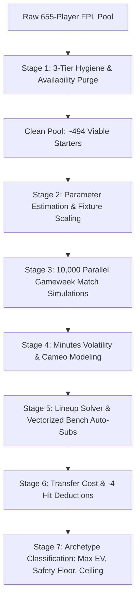

# Rubies Rangers — FPL Moneyball Analytics & Monte Carlo Optimizer ⚽

An enterprise-grade quantitative analytics, predictive modeling, and optimization platform for Fantasy Premier League (FPL) team **Rubies Rangers**, engineered around strict **Moneyball Principles**.

This platform combines **Mixed-Integer Linear Programming (MILP)**, **Betting Market Implied Probabilities**, **Understat Shot Quality Process Metrics**, and **Stochastic Monte Carlo Simulations** (up to 10,000 parallel gameweek scenarios) to evaluate transfers, lineups, captaincy choices, and mini-league rival strategies.

---

## Table of Contents

1. [Core Moneyball Philosophy](#core-moneyball-philosophy)
2. [The Monte Carlo Method (Deep Dive)](#the-monte-carlo-method-deep-dive)
   - [Why Stochastic Simulation Beats Single-Point xP](#why-stochastic-simulation-beats-single-point-xp)
   - [The 7-Stage Simulation Architecture](#the-7-stage-simulation-architecture)
   - [Mathematical & Probabilistic Formulations](#mathematical--probabilistic-formulations)
   - [Transfer Cost Modeling & Point Hit Penalties](#transfer-cost-modeling--point-hit-penalties)
   - [The 3 Strategic Transfer Archetypes](#the-3-strategic-transfer-archetypes)
3. [All 8 Quantitative Prediction Techniques](#all-8-quantitative-prediction-techniques)
   - [1. Monte Carlo Stochastic Simulation](#1-monte-carlo-stochastic-simulation)
   - [2. Bookmaker Implied Probabilities & Linear xP Modeling](#2-bookmaker-implied-probabilities--linear-xp-modeling)
   - [3. Advanced Tactical Process & Understat Shot Quality](#3-advanced-tactical-process--understat-shot-quality)
   - [4. Match-by-Match Trend & Minutes Stability Engine](#4-match-by-match-trend--minutes-stability-engine)
   - [5. Set-Piece & Penalty Hierarchy Matrix](#5-set-piece--penalty-hierarchy-matrix)
   - [6. Market Velocity & Nightly Price Predictor](#6-market-velocity--nightly-price-predictor)
   - [7. Rolling Fixture Difficulty Rating (FDR) & Schedule Swings](#7-rolling-fixture-difficulty-rating-fdr--schedule-swings)
   - [8. Mini-League Scout, Rival Spy & Effective Ownership (EO%)](#8-mini-league-scout-rival-spy--effective-ownership-eo)
4. [Guide to the Platform Programs](#guide-to-the-platform-programs)
   - [Program 1: Interactive Streamlit Web Dashboard (`app.py`)](#program-1-interactive-streamlit-web-dashboard-apppy)
   - [Program 2: FastAPI REST Microservice (`api.py`)](#program-2-fastapi-rest-microservice-apipy)
   - [Program 3: Master CLI Dispatcher (`team_manager.py`)](#program-3-master-cli-dispatcher-team_managerpy)
   - [Program 4: Specialized Modular CLI Trackers](#program-4-specialized-modular-cli-trackers)
5. [REST API Documentation & cURL Examples](#rest-api-documentation--curl-examples)
6. [CLI Command Cheat Sheet](#cli-command-cheat-sheet)
7. [Repository Architecture](#repository-architecture)
8. [Greenfield Installation & Setup Guide (New Laptop)](#greenfield-installation--setup-guide-new-laptop)

---

## Core Moneyball Philosophy

The strategic governance of Rubies Rangers is strictly codified in [`AGENTS.md`](AGENTS.md):

1. **Underlying Expected Metrics Over Past Hype:**
   Prioritize true expected performance indicators (`expected_goals_per_90`, `expected_assists_per_90`, `NPxG_90`, and `expected_goal_involvements_per_90`). Evaluate process over outcome; never chase unsustainable finishing streaks or lucky historical spikes.
2. **Cost Efficiency & Points Per Million (PPM):**
   Maximize return on investment (expected points per £1.0m of squad budget). Systematically identify undervalued £4.5m–£6.5m assets with underlying metrics rivaling £8.0m+ premium names.
3. **Defensive Contribution & Consistency Floor:**
   Evaluate defenders and defensive midfielders through `defensive_contribution_per_90` (tackles, interceptions, clearances, blocks, and clean sheets per 90). Favor guaranteed 90-minute starters over volatile rotation risks.
4. **Stochastic Risk Management & Balanced Squad Optimization:**
   Football is a low-scoring, high-variance game. Maximize total expected output across the full 11 starters plus active playing bench cover rather than starving the squad to finance non-performing premium names. All transfer recommendations must be justified with mathematical data comparisons (net expected return delta vs. transfer cost).

---

## The Monte Carlo Method (Deep Dive)

### Why Stochastic Simulation Beats Single-Point xP

Conventional FPL analytics rely on static **Expected Points ($xP$)**—a single deterministic number (e.g. $xP = 5.4$). This causes serious decision failures:
- **Fat-Tailed, Discrete Distributions:** FPL points follow skewed, discrete Poisson and Bernoulli distributions. A player with $5.4\ xP$ does not score 5.4 points; they score 2 points with 55% probability, 6 points with 25% probability, and 15 points with 10% probability.
- **Binary Clean Sheet Clustering:** If a club concedes a 93rd-minute goal, your goalkeeper and both center-backs simultaneously lose 4 points each (an 8- to 12-point correlated swing).
- **The Bench Risk Illusion:** If a rotation risk player (e.g., Senesi or Solanke) gets 0 minutes, static models underestimate the impact. Monte Carlo simulates the bench auto-substitution mechanics, giving a true picture of squad resilience.

### The 7-Stage Simulation Architecture

The engine implemented in [`montecarlo_engine.py`](montecarlo_engine.py) operates through a 7-stage vectorized pipeline:



### Mathematical & Probabilistic Formulations

#### 1. 3-Tier Data Hygiene & Availability Purge
Before any simulation runs, non-viable players are purged:
- **Tier 1 (Status Flags):** Strip all players where `status in ['u', 'i', 's']` (transferred abroad, injured, suspended).
- **Tier 2 (News Keywords):** Strip players whose news notes contain *“Joined”, “loan”, “transferred”, “suspended”, “surgery”, “cruciate”, “achilles”*.
- **Tier 3 (Zero Minutes & 0% Playing Chance):** Strip players with `chance_of_playing == 0` or 0 total minutes.
*Out of 655 Premier League players, 161+ non-viable players are eliminated, preventing the optimizer from recommending departed or permanently injured assets.*

#### 2. Probabilistic Availability & Minutes Sampling
For yellow-flagged players (`chance_of_playing` in $[25\%, 50\%, 75\%]$), availability is sampled via Bernoulli trials:
$$A_i \sim \text{Bernoulli}(p_{\text{play}})$$
If $A_i = 1$, minutes are sampled from their historical starts distribution:
$$M_i \sim \mathcal{N}(\mu_{\text{starts}}, \sigma_{\text{starts}}) \quad \text{clipped to } [45, 90]$$
If benched or designated cameo, minutes are drawn from cameo distribution $[10, 30]$ minutes.

#### 3. Match Event Generation (Poisson & Bernoulli)
- **Goals:** Drawn from a Poisson distribution scaled by opponent defensive fixture difficulty ($FDR_{\text{opp}}$):
  $$\lambda_{G, i} = \text{NPxG\_90}_i \times \left(\frac{M_i}{90}\right) \times \left(1 + 0.12 \times (3 - FDR_{\text{opp}})\right)$$
  $$G_i \sim \text{Poisson}(\lambda_{G, i})$$
- **Assists:**
  $$\lambda_{A, i} = \text{xA\_90}_i \times \left(\frac{M_i}{90}\right) \times \left(1 + 0.10 \times (3 - FDR_{\text{opp}})\right)$$
  $$A_i \sim \text{Poisson}(\lambda_{A, i})$$
- **Clean Sheets:** Computed for Goalkeepers and Defenders using opponent expected goals conceded ($\lambda_{\text{conceded}}$):
  $$P(\text{Clean Sheet}) = e^{-\lambda_{\text{conceded}}}$$
  $$CS_i \sim \text{Bernoulli}(P(\text{Clean Sheet})) \quad \text{if } M_i \ge 60$$

#### 4. Vectorized Bench Auto-Substitution
For each simulation trial $t \in [1, N]$:
1. If an outfield starter $S_j$ records $M_{j, t} = 0$, the engine scans the bench in strict priority order ($B_1 \to B_2 \to B_3$).
2. The substitute enters if and only if the resulting formation satisfies FPL legal limits:
   $$\text{Defenders} \ge 3, \quad \text{Midfielders} \ge 2, \quad \text{Forwards} \ge 1$$
3. Goalkeeper auto-substitution is strictly 1-to-1 with the backup goalkeeper.
4. **Captaincy Fallback:** If Captain $C$ plays 0 minutes, Vice-Captain $VC$ receives the $2\times$ multiplier.

### Transfer Cost Modeling & Point Hit Penalties

The engine calculates net transfer impact by charging $-4$ points for every transfer exceeding available free transfers:
$$\text{Hit Penalty} = \max(0, N_{\text{transfers}} - N_{\text{free}}) \times 4$$
$$\Delta \text{Net Gain}_t = \text{Score}_{\text{new squad}, t} - \text{Score}_{\text{current squad}, t} - \text{Hit Penalty}$$
$$\text{Mean Net Gain } E[\Delta \text{Net Gain}] = \frac{1}{N}\sum_{t=1}^N \Delta \text{Net Gain}_t$$
$$\text{Win Probability } P(\text{Gain} > 0) = \frac{1}{N}\sum_{t=1}^N \mathbb{I}(\Delta \text{Net Gain}_t > 0)$$

### The 3 Strategic Transfer Archetypes

Out of all evaluated legal transfer permutations, the engine isolates three archetypes:

| Archetype | Icon | Optimization Metric | Strategic Objective |
| :--- | :---: | :--- | :--- |
| **🏆 Max Expected Value** | 🥇 | $\max E[\Delta \text{Net Gain}]$ | **Moneyball Core:** Pure mathematical edge over season average. |
| **🛡️ Max Floor & Safety** | 🛡️ | $\max \text{Percentile}_{10}(\text{Score})$ | **Capital Preservation:** Minimizes blank risk, eliminates 0-minute bench-warmers. |
| **🚀 Max Ceiling & Differential** | 🚀 | $\max \text{Percentile}_{90}(\text{Score})$ | **League Chaser:** High explosive upside to aggressively close mini-league deficits. |

---

## All 8 Quantitative Prediction Techniques

### 1. Monte Carlo Stochastic Simulation
- **Engine Module:** [`montecarlo_engine.py`](montecarlo_engine.py), [`montecarlo_tracker.py`](montecarlo_tracker.py)
- **Primary Metrics:** Mean net gain, Win Rate %, 10th-percentile floor, 50th-percentile median, 90th-percentile ceiling, Standard Deviation.
- **Key Advantage:** Simulates 10,000 parallel gameweeks with discrete Poisson goals, clean sheet binary states, and bench auto-substitutions.

### 2. Bookmaker Implied Probabilities & Linear xP Modeling
- **Engine Module:** [`xp_model.py`](xp_model.py), [`xp_tracker.py`](xp_tracker.py)
- **Primary Metrics:** Implied Clean Sheet Probability $P(CS)$, Fair Decimal Odds, Anytime Goalscorer Odds, Linear $xP$.
- **Formulation:**
  $$P(\text{Clean Sheet}) = e^{-\lambda_{\text{conceded}}}$$
  $$xP = \text{Appearance Pts} + (P(\text{Goal}) \times \text{Goal Pts}) + (P(\text{Assist}) \times 3) + (P(CS) \times \text{CS Pts}) + \text{Defensive Bonus}$$
- **Key Advantage:** Leverages multi-million-pound betting markets to capture bookmaker predictive accuracy.

### 3. Advanced Tactical Process & Understat Shot Quality
- **Engine Module:** [`tactical_client.py`](tactical_client.py), [`tactical_tracker.py`](tactical_tracker.py)
- **Primary Metrics:** Non-Penalty xG per 90 ($\text{NPxG\_90}$), Shot Quality ($xG/\text{shot}$), Box Touch Dominance.
- **Formulation:**
  $$\text{Shot Quality} = \frac{\text{Non-Penalty xG}}{\text{Total Non-Penalty Shots}}$$
- **Key Advantage:** Separates high-quality box poachers (e.g. Haaland, Isak) from wasteful speculative shooters who accumulate deceptive raw $xG$.

### 4. Match-by-Match Trend & Minutes Stability Engine
- **Engine Module:** [`trend_tracker.py`](trend_tracker.py)
- **Primary Metrics:** Starts vs Cameos, 3-Gameweek Rolling Momentum Delta ($\Delta xGI_{3\text{GW}}$), Security Classification.
- **Classification Categories:**
  - `SECURE_STARTER`: $\ge 85\%$ starts, $> 75$ mins average.
  - `REGULAR_STARTER`: $65\%–84\%$ starts, occasional tactical substitution.
  - `ROTATION_RISK`: Under threat of Pep roulette or tactical rotation.
  - `BENCHED_OR_DROPPED`: Loss of starting status (immediate sell target).

### 5. Set-Piece & Penalty Hierarchy Matrix
- **Engine Module:** [`setpiece_tracker.py`](setpiece_tracker.py)
- **Primary Metrics:** Penalty Taker Rank, Direct Free-Kick Order, Corner Kick Share.
- **Formulation:** Primary penalty takers gain an expected $+0.79 \text{ xG}$ per penalty awarded, adding $+0.8$ to $+1.4\ xP$ per match.

### 6. Market Velocity & Nightly Price Predictor
- **Engine Module:** [`price_tracker.py`](price_tracker.py)
- **Primary Metrics:** Net Transfer Velocity ($\Delta T = \text{Transfers In} - \text{Transfers Out}$), Price Rise/Fall Threshold %.
- **Key Advantage:** Forecasts nightly £0.1m price adjustments before the official 01:30–02:30 UTC price change window, protecting team value.

### 7. Rolling Fixture Difficulty Rating (FDR) & Schedule Swings
- **Engine Module:** [`fixture_tracker.py`](fixture_tracker.py)
- **Primary Metrics:** 5-GW Rolling Average FDR, Schedule Swing Delta ($\Delta \text{FDR}$).
- **Formulation:**
  $$\Delta \text{FDR} = \overline{\text{FDR}}_{\text{Next 3 GW}} - \overline{\text{FDR}}_{\text{GW 4 to 6}}$$
- **Key Advantage:** Identifies **Green Swings** (favorable upcoming fixture runs to target) and **Red Walls** (grueling runs to exit).

### 8. Mini-League Scout, Rival Spy & Effective Ownership (EO%)
- **Engine Module:** [`league_tracker.py`](league_tracker.py)
- **Default League:** `Bronze, Silver & Gold League` (ID: `325320`)
- **Default Team:** `Rubies Rangers` (Manager: Clyde Watts, Entry ID: `6173410`)
- **Primary Metrics:** Mini-League Effective Ownership ($EO\%$), Mutual Cover, Rank Threat Delta.
- **Formulation:**
  $$EO_i = \left(\frac{\text{Started}_i + \text{Captained}_i}{\text{Total Active Rival Managers}}\right) \times 100\%$$
- **Key Advantage:** In mini-leagues, owning a player with $EO > 100\%$ protects rank, while low-$EO$ performers act as explosive rank differentials.

---

## Guide to the Platform Programs

### Program 1: Interactive Streamlit Web Dashboard (`app.py`)

The flagship graphical user interface. Built with glassmorphic dark-theme components (`#0b0f19`, `#1e293b`), responsive metric cards, and dynamic Plotly charts.

#### How to Launch
```powershell
# In PowerShell:
.\launch_dashboard.bat

# Or directly via Python:
python -m streamlit run app.py
```
Open your browser to: **`http://localhost:8501`**

#### Walkthrough of Available Workflows

1. **🎲 Monte Carlo Transfer Simulator:**
   - **Sidebar Controls:**
     - *Transfers to Evaluate:* Choose `1 Transfer` or `2 Transfers (Double Move)`.
     - *Free Transfers Available:* Select `1 Free Transfer` (standard) or `2 Free Transfers` (banked). If moves exceed free transfers, the engine deducts $-4$ points per hit automatically.
     - *In-the-Bank (£m):* Adjust available funds slider (£0.0m to £5.0m).
     - *Simulations (N):* Slider from `1,000` to `10,000` trials (default: 2,500).
     - *Position Filter:* Filter by `ALL`, `GKP`, `DEF`, `MID`, `FWD`.
     - *Sell Target:* Optionally lock in a specific squad member to sell (e.g. benched `Senesi` or `Roefs`).
     - *Strict Injury/Departure Hygiene:* Toggle to eliminate 161+ non-viable players.
   - **Visual Outputs:**
     - **3 Hero Archetype Cards:** Glassmorphic cards for 🏆 Max Expected Value, 🛡️ Max Floor/Safety, and 🚀 Max Ceiling/Differential showing net gain, win rate, P10 floor, and P90 ceiling.
     - **Score Distribution (KDE Curves):** Probability density curves comparing current squad baseline against all 3 options.
     - **Percentile Range (P10 / P50 / P90):** Horizontal range bars illustrating downside risk vs median vs explosive ceiling.
     - **Risk vs. Reward Scatter Matrix:** Mean net gain vs Standard Deviation with bubble sizes reflecting win rate.
     - **All Evaluated Transfers Table:** Searchable table with CSV export button.

2. **🏆 Mini-League Scout & Rival Spy:**
   - **Standings Overview:** Live table for Bronze, Silver & Gold League with rank badges and point gaps.
   - **Live Standings Comparison Bar Chart:** Dual-axis horizontal bar chart displaying Total Points and Gameweek Scores side-by-side.
   - **Historical Performance Over Time:** Cumulative progression curves and Gameweek rank swings from Gameweek 1 to present.
   - **Rival Spy Squad Inspector:** Detailed card inspector of any rival manager's 15-player squad, active chips, and transfer hits.
   - **Mini-League Effective Ownership (EO%):** Table highlighting rank threats and Rubies Rangers differentials.

3. **🎰 Bookmaker Odds & Expected Points (xP):**
   - **Green Pitch Lineup Display:** Visual football formation pitch with player cards, captaincy badges, and bench priority order.
   - **Captaincy Duel:** Comparative bar chart between Captain and Vice-Captain.
   - **Bookmaker Implied Odds Table:** Clean sheet percentages and fair goalscorer odds.

4. **Modify Current Team (Transfers):**
   - Mixed-Integer Linear Programming (MILP) transfer solver with budget constraints.

5. **Tactical Process & Shot Quality:**
   - Understat box coordinates, shooting distance, $xG/\text{shot}$ quality leaders.

6. **Match-by-Match Trend Engine:**
   - Rotation risk analyzer, cameo auditor, and rolling 3-GW momentum charts.

7. **Market Velocity & Price Predictor:**
   - Nightly price change forecaster with net transfer momentum meters.

8. **Fixture Difficulty (FDR) Ticker:**
   - 5-week rolling FDR heatmap showing green runs and red fixture walls.

9. **Set-Piece & Penalty Hierarchy:**
   - Dead-ball responsibilities across all 20 Premier League squads.

10. **Draft New Optimal Squad:**
    - Full 15-player MILP team builder from scratch within a £100m budget.

11. **Player Explorer:**
    - Searchable, filterable database across all 650+ Premier League players.

---

### Program 2: FastAPI REST Microservice (`api.py`)

A high-performance REST API microservice enabling automated pipelines, scheduled jobs, and external integration.

#### How to Launch
```powershell
# Using the Windows batch launcher:
.\launch_api.bat

# Or directly via Uvicorn:
python -m uvicorn api:app --host 0.0.0.0 --port 8000 --reload
```
- **Base URL:** `http://localhost:8000`
- **Interactive Swagger UI:** `http://localhost:8000/docs`
- **ReDoc Documentation:** `http://localhost:8000/redoc`

#### Available Endpoints
- `POST /api/simulate/transfers`: Runs stochastic Monte Carlo simulations for 1 or 2 transfers.
- `POST /api/simulate/lineup`: Runs Monte Carlo simulation on the current squad, outputting the optimal 11 starters, captain, and bench order.
- `GET /api/players/clean`: Retrieves the sanitized player pool (purged of injured and transferred players).
- `GET /api/odds`: Returns match-by-match bookmaker implied clean sheet and goal probabilities.
- `GET /api/league/standings`: Retrieves live standings for the configured mini-league.
- `GET /api/league/history`: Retrieves gameweek-by-gameweek historical point progressions.

---

### Program 3: Master CLI Dispatcher (`team_manager.py`)

The primary command-line hub uniting all platform capabilities into unified subcommands.

```powershell
# 1. Run Monte Carlo transfer simulation (2,500 trials, default 1 transfer)
python team_manager.py transfers --mc --sims 2500

# 2. Evaluate double transfers with 1 free transfer (-4 point hit)
python team_manager.py transfers --mc --count 2 --free 1

# 3. Target selling a specific player (e.g. Senesi)
python team_manager.py transfers --mc --sell Senesi

# 4. Filter replacement targets to Midfielders
python team_manager.py transfers --mc --pos MID

# 5. Solve optimal Starting XI and Captaincy via bookmaker odds
python team_manager.py lineup

# 6. View Bronze, Silver & Gold League standings
python team_manager.py league

# 7. View gameweek historical progression for the league
python team_manager.py league --history

# 8. Spy on a rival manager's squad (e.g. entry ID 1745183)
python team_manager.py league --spy 1745183

# 9. View mini-league Effective Ownership (EO%)
python team_manager.py league --ownership

# 10. Audit squad trends and rotation risks
python team_manager.py trends --risks

# 11. Deep-dive into a specific player's minutes history
python team_manager.py trends --player Solanke

# 12. Display Understat tactical process and shot quality leaders
python team_manager.py tactical --leaders

# 13. Forecast tonight's £0.1m price rises and falls
python team_manager.py prices

# 14. Display 5-gameweek rolling fixture swing ticker
python team_manager.py fixtures --weeks 5

# 15. View set-piece and penalty taker hierarchy
python team_manager.py setpieces

# 16. Solve optimal 15-player squad from scratch (MILP)
python team_manager.py draft --budget 100.0
```

---

### Program 4: Specialized Modular CLI Trackers

Each analytical module is self-contained and can be executed independently:

| Tracker File | Primary Command | Key Arguments & Flags | Description |
| :--- | :--- | :--- | :--- |
| **`montecarlo_tracker.py`** | `python montecarlo_tracker.py` | `--sims 2500`<br>`--transfers 2`<br>`--free 1`<br>`--bank 3.7`<br>`--pos MID`<br>`--sell Senesi` | Executes Monte Carlo transfer optimization with Rich terminal output. |
| **`xp_tracker.py`** | `python xp_tracker.py` | `--lineup`<br>`--squad`<br>`--captains`<br>`--odds` | Outputs Starting XI, Captaincy ranking, squad $xP$ table, and betting odds. |
| **`tactical_tracker.py`** | `python tactical_tracker.py` | `--leaders`<br>`--min-shots 8`<br>`--player Haaland` | Understat shot quality, $xG/\text{shot}$, box touches, and coordinate maps. |
| **`trend_tracker.py`** | `python trend_tracker.py` | `--risks`<br>`--player Solanke`<br>`--limit 10` | Ingests match-by-match element summaries to flag cameos and rotation risk. |
| **`price_tracker.py`** | `python price_tracker.py` | `--limit 15`<br>`--all` | Predicts nightly £0.1m price adjustments based on net transfer velocity. |
| **`fixture_tracker.py`** | `python fixture_tracker.py` | `--weeks 5`<br>`--team Arsenal` | Calculates 5-week rolling FDR and identifies Green Swings / Red Walls. |
| **`setpiece_tracker.py`** | `python setpiece_tracker.py` | `--team Liverpool` | Lists primary penalty, direct free-kick, and corner takers for all 20 clubs. |
| **`league_tracker.py`** | `python league_tracker.py` | `--standings`<br>`--history`<br>`--spy <id>`<br>`--ownership` | Manages Bronze, Silver & Gold League scout, rival tracking, and EO%. |

---

## REST API Documentation & cURL Examples

### 1. Run Monte Carlo Simulation
**Endpoint:** `POST /api/simulate/transfers`

**Request Example:**
```bash
curl -X POST "http://localhost:8000/api/simulate/transfers" \
     -H "Content-Type: application/json" \
     -d '{
       "bank": 3.7,
       "num_transfers": 1,
       "free_transfers": 1,
       "sims": 2500,
       "strict_injury_filter": true,
       "target_pos": "ALL"
     }'
```

**Response Format:**
```json
{
  "success": true,
  "parameters": {
    "num_transfers": 1,
    "free_transfers": 1,
    "hit_penalty": 0,
    "sims": 2500,
    "bank": 3.7
  },
  "baseline": {
    "mean": 88.14,
    "p10": 64.0,
    "p50": 87.0,
    "p90": 113.1,
    "std": 19.82
  },
  "top_3": [
    {
      "archetype": "🏆 Max Expected Value (Moneyball Core)",
      "out_player": "Roefs",
      "in_player": "Raya",
      "net_mean_gain": 12.04,
      "win_prob": 84.8,
      "floor_p10": 72.0,
      "ceiling_p90": 128.0,
      "bank_remaining": 2.7
    },
    {
      "archetype": "🛡️ Maximum Floor & Safety (Zero Blank Hedge)",
      "out_player": "Senesi",
      "in_player": "De Cuyper",
      "net_mean_gain": 5.96,
      "win_prob": 72.7,
      "floor_p10": 68.0,
      "ceiling_p90": 120.0,
      "bank_remaining": 4.8
    },
    {
      "archetype": "🚀 Maximum Ceiling & Differential (League Chaser)",
      "out_player": "Mbeumo",
      "in_player": "Saka",
      "net_mean_gain": 5.58,
      "win_prob": 60.0,
      "floor_p10": 66.0,
      "ceiling_p90": 120.0,
      "bank_remaining": 2.1
    }
  ],
  "total_evaluated": 209
}
```

### 2. Solve Starting XI & Auto-Subs
**Endpoint:** `POST /api/simulate/lineup`

```bash
curl -X POST "http://localhost:8000/api/simulate/lineup" \
     -H "Content-Type: application/json" \
     -d '{ "sims": 2500 }'
```

### 3. Fetch Active Player Pool (Hygiene Filtered)
**Endpoint:** `GET /api/players/clean?min_minutes=15`

```bash
curl -X GET "http://localhost:8000/api/players/clean?min_minutes=15"
```

### 4. Fetch Betting Odds & Implied Probabilities
**Endpoint:** `GET /api/odds`

```bash
curl -X GET "http://localhost:8000/api/odds"
```

### 5. Fetch Mini-League Standings & History
**Endpoints:** `GET /api/league/standings`, `GET /api/league/history`

```bash
curl -X GET "http://localhost:8000/api/league/standings?league_id=325320"
curl -X GET "http://localhost:8000/api/league/history?league_id=325320"
```

---

## CLI Command Cheat Sheet

```powershell
# =============================================================
# MONTE CARLO SIMULATIONS
# =============================================================
# 1 Transfer (2,500 trials)
python montecarlo_tracker.py --sims 2500

# 2 Transfers with 1 Free Transfer (-4 hit penalty)
python montecarlo_tracker.py --transfers 2 --free 1

# Force selling a specific player (e.g., Senesi)
python montecarlo_tracker.py --sell Senesi

# Restrict new targets to Midfielders
python montecarlo_tracker.py --pos MID

# =============================================================
# LINEUP & CAPTAINCY (BOOKMAKER ODDS)
# =============================================================
# Optimal Starting XI & Captain
python xp_tracker.py --lineup

# Squad expected points table
python xp_tracker.py --squad

# Premier League Captaincy Rankings
python xp_tracker.py --captains

# Gameweek 4 Betting Market Odds
python xp_tracker.py --odds

# =============================================================
# MINI-LEAGUE SCOUT & RIVAL SPY
# =============================================================
# Live Standings for Bronze, Silver & Gold League
python team_manager.py league

# Gameweek historical point progression
python team_manager.py league --history

# Spy on Rival #1 (Brennans Bread Today - Entry ID 1745183)
python team_manager.py league --spy 1745183

# Mini-league Effective Ownership (EO%)
python team_manager.py league --ownership

# =============================================================
# TACTICAL PROCESS, TRENDS & PRICES
# =============================================================
# Audit rotation risks and bench cameo players
python team_manager.py trends --risks

# Deep dive into player starts and minutes history
python team_manager.py trends --player Solanke

# Premier League leaders in Shot Quality (xG/shot)
python team_manager.py tactical --leaders

# Nightly £0.1m price rise and fall forecast
python team_manager.py prices

# 5-Gameweek rolling fixture swing ticker
python team_manager.py fixtures --weeks 5

# Set-piece and penalty taker hierarchy
python team_manager.py setpieces
```

---

## Repository Architecture

```
rubies_rangers/
├── AGENTS.md                  # Strict Moneyball governance rules & prompt directives
├── README.md                  # Comprehensive platform documentation & guides
├── api.py                     # FastAPI REST microservice
├── app.py                     # Streamlit multi-page dashboard application
├── launch_api.bat             # Batch launcher for FastAPI microservice (port 8000)
├── launch_dashboard.bat       # Batch launcher for Streamlit Web App (port 8001/8501)
├── montecarlo_engine.py       # Vectorized Monte Carlo simulation engine
├── montecarlo_tracker.py      # Dedicated CLI runner for Monte Carlo simulations
├── team_manager.py            # Master CLI command dispatcher
├── xp_model.py                # Bookmaker odds & linear expected points solver
├── xp_tracker.py              # CLI tracker for Starting XI, Captaincy & Odds
├── tactical_client.py         # Understat scraper & shot coordinate client
├── tactical_tracker.py        # CLI tracker for shot quality & tactical process
├── trend_tracker.py           # Match-by-match element summary & rotation risk detector
├── price_tracker.py           # Market velocity & nightly price change predictor
├── fixture_tracker.py         # 5-GW rolling FDR & schedule swing analyzer
├── setpiece_tracker.py        # Dead-ball & penalty taker hierarchy tracker
├── league_tracker.py          # Mini-league scout, rival spy & effective ownership
├── fpl_client.py              # Official FPL API wrapper with local caching
└── fpl_optimizer.py           # PuLP / MILP linear programming squad builder
```

---

## Greenfield Installation & Setup Guide (New Laptop)

Follow this guide to set up the entire Rubies Rangers platform on a brand-new laptop or clean development environment.

### 1. System Prerequisites

Before starting, ensure you have the following installed on your laptop:

1. **Git:**
   - Download and install from [git-scm.com](https://git-scm.com/downloads).
   - Verify in your terminal: `git --version`
2. **Python (3.10 to 3.13):**
   - Download from [python.org](https://www.python.org/downloads/).
   - ⚠️ **CRITICAL ON WINDOWS:** During Python installation, check the box that says:
     **☑ "Add python.exe to PATH"** (or **"Add Python to environment variables"**).
   - Verify in your terminal: `python --version` (or `python3 --version`)

---

### 2. Automated One-Click Setup (Recommended)

The repository includes pre-built automated setup scripts that create an isolated virtual environment, upgrade `pip`, and install all dependencies automatically.

#### On Windows:
```powershell
# 1. Clone the repository from GitHub
git clone https://github.com/clydewatts1/rubies_rangers.git
cd rubies_rangers

# 2. Run the automated setup script
.\setup_environment.bat
```

#### On macOS / Linux:
```bash
# 1. Clone the repository from GitHub
git clone https://github.com/clydewatts1/rubies_rangers.git
cd rubies_rangers

# 2. Make the script executable and run it
chmod +x setup_environment.sh
./setup_environment.sh
```

---

### 3. Manual Step-by-Step Setup

If you prefer to configure the environment manually, execute the following commands:

#### Step 1: Clone the GitHub Repository
```bash
git clone https://github.com/clydewatts1/rubies_rangers.git
cd rubies_rangers
```

#### Step 2: Create a Dedicated Virtual Environment
Using a virtual environment prevents conflicts with system packages or other projects:
```powershell
# Windows:
python -m venv .venv

# macOS / Linux:
python3 -m venv .venv
```

#### Step 3: Activate the Virtual Environment
```powershell
# Windows (PowerShell):
.venv\Scripts\Activate.ps1

# Windows (Command Prompt cmd.exe):
.venv\Scripts\activate.bat

# macOS / Linux (bash / zsh):
source .venv/bin/activate
```
*(Once activated, your terminal prompt will display `(.venv)` at the beginning of the line).*

#### Step 4: Upgrade `pip` & Install Dependencies
```powershell
# Upgrade package installer
python -m pip install --upgrade pip

# Install all platform dependencies from requirements.txt
pip install -r requirements.txt
```

---

### 4. Verifying Your Installation

Run this one-line health check to verify that all mathematical, web, optimization, and API libraries load properly:

```powershell
python -c "import streamlit, fastapi, pydantic, pandas, numpy, scipy, plotly, rich, understatapi; print('[OK] All Rubies Rangers dependencies loaded successfully!')"
```

If it prints `[OK] All Rubies Rangers dependencies loaded successfully!`, your environment is configured.

---

### 5. Launching the Platform

Now you can run any of the interfaces:

1. **Launch the Interactive Web Dashboard:**
   - Double-click [`launch_dashboard.bat`](launch_dashboard.bat) or run:
     ```powershell
     python -m streamlit run app.py
     ```
   - Open your browser to: **`http://localhost:8501`**

2. **Launch the FastAPI REST Microservice:**
   - Double-click [`launch_api.bat`](launch_api.bat) or run:
     ```powershell
     python -m uvicorn api:app --host 0.0.0.0 --port 8000 --reload
     ```
   - Interactive Swagger API docs: **`http://localhost:8000/docs`**

3. **Run Monte Carlo Transfer Simulation from CLI:**
   ```powershell
   python team_manager.py transfers --mc --sims 1000
   ```

---

### 6. Greenfield Troubleshooting & Common Gotchas

| Issue | Root Cause | Solution |
| :--- | :--- | :--- |
| **PowerShell: `execution of scripts is disabled on this system`** | Windows default security policy prevents running `.ps1` activate scripts. | Run this command once in PowerShell:<br>`Set-ExecutionPolicy -ExecutionPolicy RemoteSigned -Scope CurrentUser` |
| **`'python' is not recognized as an internal or external command`** | Python was installed without checking "Add to PATH". | Re-run the Python installer, select **Modify**, and check **"Add Python to environment variables"**, or manually add `C:\Users\<user>\AppData\Local\Programs\Python\Python313` to your system PATH. |
| **Port 8501 or 8000 already in use** | Another service or instance is using the default port. | Specify custom ports:<br>• Streamlit: `streamlit run app.py --server.port 8502`<br>• FastAPI: `python -m uvicorn api:app --port 8001` |
| **Offline or Behind a Corporate Proxy** | FPL or Understat API is temporarily blocked or slow. | The codebase includes disk caching (`.fpl_cache.json`, `.understat_cache.json`). The application falls back to cached data without crashing. |
