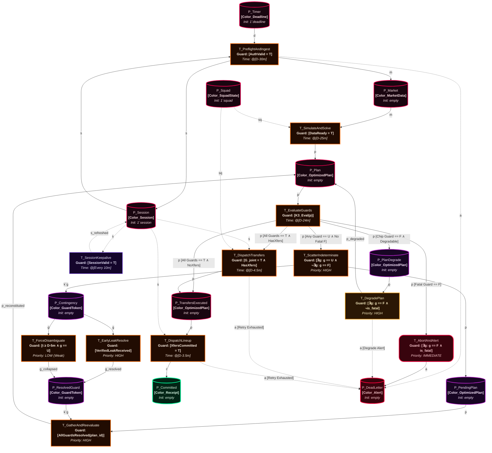
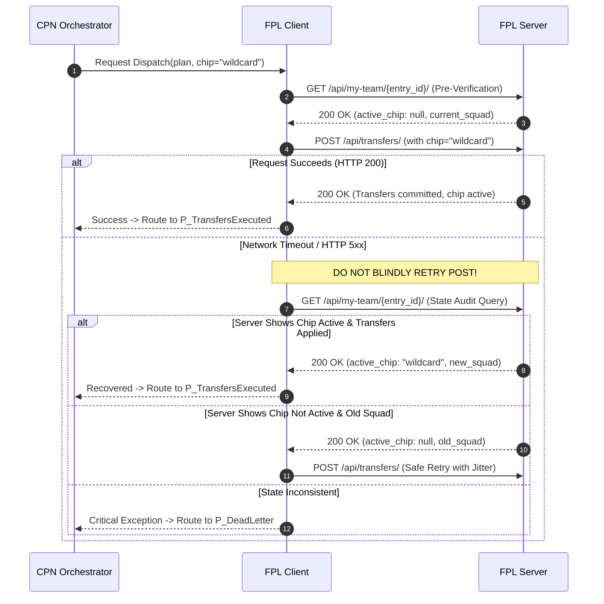

# Brainstorm: Autonomous Execution Pipeline & Robotic Manager
## Formal Kurt Jensen Coloured Petri Net (CPN) Model — Mars Cyber Edition
### Timed CPN ($\mathcal{N}_{\text{timed}}$), Kleene 3-Valued ($K_3$) Guards, and Scatter-Gather Disambiguation

**Status**: READY-TO-CODE SPECIFICATION / PHASE 3 BLUEPRINT  
**Target Module**: `automation/cpn/` (`__init__.py`, `tokens.py`, `places.py`, `guards.py`, `transitions.py`, `engine.py`)  
**Integrated Subsystems**: [`clients/fpl_client.py`](file:///c:/Users/cw171001/OneDrive%20-%20Teradata/Documents/GitHub/rubies_rangers/clients/fpl_client.py), [`analytics/montecarlo.py`](file:///c:/Users/cw171001/OneDrive%20-%20Teradata/Documents/GitHub/rubies_rangers/analytics/montecarlo.py), [`analytics/two_stage_optimizer.py`](file:///c:/Users/cw171001/OneDrive%20-%20Teradata/Documents/GitHub/rubies_rangers/analytics/two_stage_optimizer.py), [`analytics/chip_strategy.py`](file:///c:/Users/cw171001/OneDrive%20-%20Teradata/Documents/GitHub/rubies_rangers/analytics/chip_strategy.py), [`config.yaml`](file:///c:/Users/cw171001/OneDrive%20-%20Teradata/Documents/GitHub/rubies_rangers/config.yaml)  
**Philosophy**: Hands-on learning and interactive exploration come first; autonomous execution is formulated as a mathematically proven, deadlock-free Timed Coloured Petri Net (TCPN) implemented via Python's native `asyncio` Actor Model.

---

## Executive Summary

While full end-to-end automation is technically straightforward, premature automation bypasses the most critical phase of quantitative system development: **interactive learning, empirical intuition building, and hands-on discovery**.

By manually operating the Streamlit dashboard (`app.py`), inspecting live matchday fixture dynamics, and observing how Monte Carlo tail distributions behave when high-variance players carry yellow injury flags, the engineer discovers high-alpha modeling insights (e.g., home/away venue dampening, macro match pace jitter, teammate covariance).

When deploying programmatic execution, the pipeline operates as a **Lightweight Timed Coloured Petri Net (TCPN) $\mathcal{N}_{\text{timed}}$** featuring:
1. **Kleene 3-Valued ($K_3$) Transition Guards** with **Plan Degradation / Fallback Contingency** (eliminating the fragile chip abort flaw).
2. **Scatter-Gather (Fork-Join) Concurrency** resolving per-guard indeterminate states without race conditions.
3. **State-Verified Two-Stage API Dispatch** with explicit Wildcard/Free Hit pre-activation checks and Ghost Squad post-revert validation.
4. **$D-5\text{m}$ Forced Disambiguation Boundary** guaranteeing zero missed deadlines and provable $L_1$-liveness.

### The Core Architectural Insight: Resolving the FPL Deadline Paradox
A naive automated runner attempts to wait for official Premier League team sheets before finalizing transfers and captaincy. However:
* **The Official FPL Gameweek Deadline** is published by the API at `events[gw].deadline_time` (historically ~90 minutes before the first kickoff, though the Premier League retains full discretion to adjust this per-gameweek). The CPN consumes the **API-published `deadline_utc`** directly and never derives it from `kickoff_time`.
* **Official Premier League team sheets are published only 75 minutes before kickoff ($T-75\text{m}$)** (historically 60 minutes).

Any autonomous architecture that waits for official team sheets to resolve lineup uncertainty is fatally flawed because the deadline has already closed. This design resolves that paradox through a **$D-5\text{m}$ Forced Disambiguation Boundary** (where $D$ = API-published deadline) and a **Stochastic Contingency Tree**, guaranteeing provable deadlock-freedom ($L_1$-liveness) and zero missed deadlines.

> **Note on Deadline Timing**: All timing in this specification is expressed relative to the API-published `deadline_utc` field from `GET /api/bootstrap-static/` → `events[gw].deadline_time`, ensuring correctness regardless of per-gameweek schedule adjustments.

---

## 1. The Learning-First vs. Automation Lifecycle

```text
Phase 1: Interactive Learning & Stochastic Exploration (COMPLETE)
  • Hands-on usage of Streamlit UI (app.py) & Live Matchday Center
  • Manual transfer experimentation and scenario testing
  • Observing live fixtures vs. Monte Carlo distributions & macro pace jitter
  • Empirical calibration and parameter tuning (tuner/search_space.py)
           │
           ▼
Phase 2: Assisted Copilot with Human-in-the-Loop (TRANSITION PHASE)
  • System runs headless at D-30m (30 minutes before API deadline)
  • Solves optimal XI, transfers, and captaincy via two-stage MILP/Monte Carlo
  • Evaluates Long-Term Chip Allocation Strategy via DP Engine
  • Dispatches pre-deadline intelligence summary to Telegram / Discord / Webhook
  • User reviews telemetry and clicks "Approve / Override" (Human-in-the-Loop)
  • Dry-run payload validation against active FPL session without live POST
           │
           ▼
Phase 3: Autonomous Robotic Manager via Coloured Petri Net (PRODUCTION BLUEPRINT)
  • Pure-Python formal TCPN engine (automation/cpn/) orchestrating discrete state tokens
  • Non-blocking asyncio Actor Model with strongly typed queues and coroutines
  • Provably deadlock-free K3 transition guards with Plan Degradation fallback loops
  • Scatter-Gather fork-join pattern resolving per-guard indeterminate tokens
  • State-verified two-stage API sequencing: Transfers/Chips committed before Lineup submission
  • Pre-flight authenticated session health checks & cryptographic payload hashing
  • Session keepalive heartbeat preventing mid-wait credential expiry
  • Ghost Squad tracking for Free Hit validation and price change protection
```

### Runtime Infrastructure: Headless Daemon vs. UI Telemetry
It is critical to distinguish *how* this mathematical framework operates physically on a machine:
* **The Orchestration Engine (Headless Daemon):** The CPN engine executes as a standalone, non-blocking asynchronous Python daemon (`python -m automation.cpn.engine`). This guarantees the engine never sleeps synchronously, blocks on user input, or depends on an active browser session while waiting for the $D-5\text{m}$ forced disambiguation boundary.
* **The Telemetry Dashboard (Streamlit UI):** The interactive `app.py` UI is entirely decoupled from execution. It acts as a read-only visualizer, inspecting the real-time token states (from the in-memory CPN marking registry or a shared state buffer) across $P_{\text{Plan}}$, $P_{\text{Contingency}}$, or $P_{\text{Committed}}$. **If the user closes their browser tab, the CPN engine continues running safely in the background.**

---

## 2. Timed Coloured Petri Net (TCPN) Formal Specification

The autonomous execution pipeline is modeled as a formal 10-tuple Timed Coloured Petri Net:
$$\mathcal{N}_{\text{timed}} = (P, T, A, \Sigma, V, C, G, E, I, \mathbb{T})$$
where:
* $P$ is a finite set of typed places ($|P| = 12$).
* $T$ is a finite set of transitions ($|T| = 12$, $P \cap T = \emptyset$).
* $A \subseteq (P \times T) \cup (T \times P)$ is a finite set of directed arcs, strictly satisfying the **bipartite graph property** ($(P \times P) \cap A = \emptyset$ and $(T \times T) \cap A = \emptyset$).
* $\Sigma$ is a finite set of non-empty color sets (data types).
* $V$ is a finite set of typed variables such that $\forall v \in V: \text{Type}[v] \in \Sigma$.
* $C: P \to \Sigma$ is a color function mapping each place $p \in P$ to a color set in $\Sigma$.
* $G: T \to \text{EXPR}_V$ is a guard function mapping each transition $t \in T$ to an expression over $V$ evaluated under Kleene 3-valued logic $K_3$.
* $E: A \to \text{EXPR}_V$ is an arc expression function evaluating tokens transferred across arcs.
* $I: P \to \text{EXPR}_\emptyset$ is an initialization function specifying initial markings $M_0$.
* $\mathbb{T} = \mathbb{R}_{\ge 0}$ is the continuous time domain, referenced monotonically to the API-published deadline $D$ (`deadline_utc`).

### A. Color Sets $\Sigma$ (Typed Structured Tokens)

Each color set maps to a `@dataclass(frozen=True)` in Python, per project coding standards ([`python_standards.md`](file:///c:/Users/cw171001/OneDrive%20-%20Teradata/Documents/GitHub/rubies_rangers/.agents/rules/python_standards.md)).

1. **`Color_Deadline`**:
   - `gameweek: int` — Target gameweek index (1..38)
   - `deadline_utc: datetime` — Sourced directly from `events[gw].deadline_time` in the FPL API
   - `cutoff_disambiguation_utc: datetime` — Calculated as `deadline_utc - timedelta(minutes=5)`
   - `n_sims: int` — Configurable Monte Carlo sample count (default 5000)

2. **`Color_Session`**:
   - `auth_cookie: str` — Authenticated `pl_profile` session cookie
   - `csrf_token: str` — CSRF validation token for state-mutating requests
   - `expires_at: datetime` — Cookie expiration timestamp
   - `is_authenticated: bool` — Verified via `GET /api/me/`
   - `last_keepalive_utc: datetime` — Timestamp of most recent successful session heartbeat

3. **`Color_MarketData`**:
   - `elements: pd.DataFrame` — Current player metadata, status flags, form, and ICT index
   - `fixtures: list[dict]` — Upcoming gameweek fixtures, home/away difficulty ratings
   - `odds: dict` — Implied bookmaker odds for clean sheets, anytime scorers, and match pace
   - `injury_flags: dict[int, dict]` — Maps element ID to chance of playing, news text, and flag code

4. **`Color_SquadState`** *(Enhanced with Ghost Squad Tracking)*:
   - `entry_id: int` — Official FPL manager team ID
   - `squad_ids: list[int]` — Current 15-man roster element IDs
   - `bank: float` — Available transfer bank in £M (e.g., 1.4)
   - `free_transfers: int` — Available free transfer count (1..5)
   - `chips_available: dict[str, bool]` — Availability status for `wildcard`, `freehit`, `3xc`, `bboost`
   - `active_chip: str | None` — Chip already registered on the server for current gameweek
   - `selling_prices: dict[int, float]` — Maps element ID $\to$ effective selling price in £M
   - **`ghost_squad_ids: list[int]`** — *Original squad IDs preserved during a Free Hit gameweek for reversion*
   - **`ghost_bank: float`** — *Original bank balance to be restored post-Free Hit*
   - **`ghost_selling_prices: dict[int, float]`** — *Original selling price base for ghost squad assets*

5. **`Color_OptimizedPlan`** *(Enhanced with Degradation Metadata)*:
   - `plan_id: str` — UUID uniquely tracking candidate plan across scatter-gather cycles
   - `starters: list[int]` — 11 Starting XI element IDs
   - `bench: list[int]` — 4 Bench element IDs ordered strictly by substitution priority (Sub GKP, Sub 1, Sub 2, Sub 3)
   - `captain: int` — Designated Captain element ID
   - `vice_captain: int` — Designated Vice-Captain element ID (strictly distinct from Captain)
   - `transfers: list[dict]` — List of transfer operations: `{"element_in": int, "element_out": int, "purchase_price": float, "selling_price": float}`
   - `chip: str | None` — Chip requested for activation: `"wildcard"`, `"freehit"`, `"3xc"`, `"bboost"`, or `None`
   - `expected_utility: float` — Multi-period discounted expected utility
   - `formation_tuple: tuple[int, int, int]` — e.g., `(3, 5, 2)` for validation against `config.yaml`
   - **`fallback_plan: dict | None`** — *Pre-computed baseline plan without chip activation, ready for immediate degradation if chip guard fails*
   - **`is_degraded: bool`** — *Flag indicating whether the plan underwent fallback degradation*
   - **`chip_degraded_reason: str | None`** — *Telemetry string explaining why the chip was stripped*
   - `contingency_tree: dict` — Dynamic tree mapping doubtful player IDs to bench promotion branches

6. **`Color_GuardToken`**:
   - `plan_id: str` — UUID linking back to parent `Color_OptimizedPlan`
   - `guard_name: str` — Identifier: `"Guard_Budget"`, `"Guard_ClubCap"`, `"Guard_Formation"`, `"Guard_HitUtility"`, `"Guard_Fitness"`, `"Guard_ChipSafety"`, etc.
   - `status: str` — $K_3$ status: `"UNKNOWN"`, `"TRUE"`, `"FALSE"`
   - `subject_id: int | None` — FPL element ID under doubt (e.g., 350 for Palmer)
   - `doubt_type: str` — e.g., `"yellow_flag"`, `"press_conference"`, `"chip_safety_breach"`
   - `is_fatal: bool` — `True` if violation mandates immediate abort; `False` if violation can be degraded
   - `context: dict` — Contextual telemetry required for disambiguation
   - `resolved_at: datetime | None` — Timestamp when resolved

7. **`Color_Receipt`**:
   - `http_status: int` — HTTP response code (e.g., 200)
   - `timestamp: datetime` — Server timestamp of execution
   - `payload_hash: str` — SHA-256 cryptographic hash of committed payload
   - `confirmation_id: str` — Unique confirmation receipt key from FPL API

8. **`Color_Alert`**:
   - `severity: str` — `"CRITICAL"`, `"WARNING"`, `"INFO"`
   - `reason: str` — Human-readable description of failure, abort, or degradation
   - `context: dict` — Machine-readable diagnostics
   - `timestamp: datetime` — Incident timestamp

### B. Places $P$ (Typed State Buffers)

The net contains exactly 12 typed places:
1. **$P_{\text{Timer}}$** ($C = \text{Color\_Deadline}$): Holds gameweek timing tokens; initiates workflow at $D-30\text{m}$.
2. **$P_{\text{Session}}$** ($C = \text{Color\_Session}$): Holds pre-authenticated session credentials, cookies, and CSRF tokens. Preserved via read-arcs.
3. **$P_{\text{Market}}$** ($C = \text{Color\_MarketData}$): Ingested market state (bootstrap-static, live flags, bookmaker odds).
4. **$P_{\text{Squad}}$** ($C = \text{Color\_SquadState}$): Current verified manager squad marking, including selling prices, available chips, entry ID, and ghost squad tracking.
5. **$P_{\text{Plan}}$** ($C = \text{Color\_OptimizedPlan}$): Candidate lineup and transfer portfolio generated by MILP/Monte Carlo, ready for guard evaluation.
6. **$P_{\text{PendingPlan}}$** ($C = \text{Color\_OptimizedPlan}$): Holding buffer preserving parent plans while indeterminate guards are scattered for asynchronous resolution.
7. **$P_{\text{Contingency}}$** ($C = \text{Color\_GuardToken}$): Buffer holding individual decomposed indeterminate guard tokens ($\mathbf{U}$).
8. **$P_{\text{ResolvedGuard}}$** ($C = \text{Color\_GuardToken}$): Buffer holding guard tokens resolved to $\mathbf{T}$ or $\mathbf{F}$ by leak arrival or timeout collapse.
9. **$P_{\text{PlanDegrade}}$** ($C = \text{Color\_OptimizedPlan}$): Staging buffer for candidate plans whose non-fatal chip guards evaluated to $\mathbf{F}$, routing to $T_{\text{DegradePlan}}$.
10. **$P_{\text{TransfersExecuted}}$** ($C = \text{Color\_OptimizedPlan}$): Intermediate buffer holding plan with confirmed transfer receipt, enabling downstream lineup submission.
11. **$P_{\text{Committed}}$** ($C = \text{Color\_Receipt}$): Terminal sink place containing cryptographically verified API receipts for transfers and lineup.
12. **$P_{\text{DeadLetter}}$** ($C = \text{Color\_Alert}$): Terminal sink place holding halted states, safety halts, or failed dispatches.

---

### C. Kurt Jensen CPN-ML Formal Declarations & Multisets

In Kurt Jensen's canonical Coloured Petri Net formalism (*CPN Tools / Meta Software standard*), the net declarations are expressed in **CPN-ML** (Standard ML with discrete-event multiset semantics):

```sml
(* ========================================================================= *)
(* KURT JENSEN CPN-ML DECLARATIONS — MARS CYBER SPECIFICATION (PHASE 3)      *)
(* ========================================================================= *)

(* 1. Color Sets (Sigma) *)
colset Color_Deadline = record 
    gameweek: INT * deadline_utc: STRING * cutoff_utc: STRING * n_sims: INT;

colset Color_Session = record 
    auth_cookie: STRING * csrf_token: STRING * expires_at: STRING * is_authenticated: BOOL * last_keepalive_utc: STRING;

colset Color_MarketData = record 
    elements: DATA * fixtures: DATA * odds: DATA * injury_flags: DATA;

colset Color_SquadState = record 
    entry_id: INT * squad_ids: INT_LIST * bank: REAL * free_transfers: INT * 
    chips_available: DATA * active_chip: STRING * selling_prices: DATA *
    ghost_squad_ids: INT_LIST * ghost_bank: REAL * ghost_selling_prices: DATA;

colset Color_OptimizedPlan = record 
    plan_id: STRING * starters: INT_LIST * bench: INT_LIST * captain: INT * vice_captain: INT * 
    transfers: DATA * chip: STRING * utility: REAL * formation: INT * INT * INT *
    fallback_plan: DATA * is_degraded: BOOL * chip_degraded_reason: STRING * contingency_tree: DATA;

colset Color_GuardToken = record 
    plan_id: STRING * guard_name: STRING * status: K3_VALUE * subject_id: INT * 
    doubt_type: STRING * is_fatal: BOOL * context: DATA * resolved_at: STRING;

colset Color_Receipt = record 
    http_status: INT * timestamp: STRING * payload_hash: STRING * confirmation_id: STRING;

colset Color_Alert = record 
    severity: STRING * reason: STRING * context: DATA * timestamp: STRING;

(* 2. Typed Variables (V) *)
var d               : Color_Deadline;
var s, s_refreshed  : Color_Session;
var m               : Color_MarketData;
var sq              : Color_SquadState;
var p, p_degraded   : Color_OptimizedPlan;
var g, g_res        : Color_GuardToken;
var r               : Color_Receipt;
var a               : Color_Alert;

(* 3. Multisets & Initial Markings (M0) *)
val M0_PTimer       = 1`d;
val M0_PSession     = 1`s;
val M0_PSquad       = 1`sq;
val M0_Empty        = empty;
```

---

## 3. Jensen CPN Topology & State Machine Flowchart — Mars Cyber Edition

The Petri Net strictly obeys the **bipartite graph property**: arcs exist exclusively between Places and Transitions ($P \to T$ or $T \to P$). Every Place is inscribed with its typed Color Set and Initial Marking multiset ($1`token$), and every Transition is inscribed with its Guard and temporal deadline trigger ($@[D-X\text{m}]$).



### Quick Reference: The Role of Each Transition

| Transition Name | When it Runs | What it Does in Plain English |
| :--- | :--- | :--- |
| **`T_PreflightAndIngest`** | **D - 30m** | Wakes up the system, logs into the FPL API, downloads the latest player prices, injury flags, bookmaker odds, and verifies manager squad state. |
| **`T_SessionKeepalive`** | **Every 10m** | Heartbeat `GET /api/me/` ping preventing session token expiry while waiting for deadline boundaries. |
| **`T_SimulateAndSolve`** | **D - 25m** | Solves two-stage stochastic optimization (MILP + Monte Carlo) and computes both the primary chip plan and the fallback baseline plan. |
| **`T_EvaluateGuards`** | **D - 24m** | The Safety Inspector. Evaluates the candidate plan under Kleene $K_3$ logic. Classifies violations as fatal vs degradable. |
| **`T_AbortAndAlert`** | **Immediate** | **Fatal Kill Switch.** If a structural rule strictly fails (illegal formation, budget breach, club cap breach), halts execution immediately and notifies operator. |
| **`T_DegradePlan`** | **Immediate** | **Plan Degradation Loop.** If a chip safety rule fails (e.g. Triple Captain Haaland ruled out), safely strips the chip, restores the fallback baseline lineup, and re-evaluates. |
| **`T_ScatterIndeterminate`**| **Immediate** | If guards evaluate to $\mathbf{U}$ (e.g., yellow 75% flag), splits indeterminate tokens into $P_{\text{Contingency}}$ and parks the plan in $P_{\text{PendingPlan}}$. |
| **`T_EarlyLeakResolve`** | **High Priority** | Consumes verified high-confidence leak or API status change, resolving a specific $\mathbf{U}$ token into $\mathbf{T}$ or $\mathbf{F}$. |
| **`T_ForceDisambiguate`** | **D - 5m** | **The Safety Net.** At the 5-minute deadline boundary, unconditionally collapses all remaining $\mathbf{U}$ tokens into risk-averse safe states via $\Psi_{\text{Averse}}$. |
| **`T_GatherAndReevaluate`** | **High Priority** | Recombines resolved guard tokens with the parked plan from $P_{\text{PendingPlan}}$ and feeds the reconstituted plan back into $P_{\text{Plan}}$. |
| **`T_DispatchTransfers`** | **D - 4.5m** | Executes transfers and activates chips via `POST /api/transfers/` with pre-verification state checks and bounded retry jitter. |
| **`T_DispatchLineup`** | **D - 3.5m** | Sets Starting XI, Captaincy, Vice-Captaincy, and bench priority order via `POST /api/my-team/{entry_id}/`. |

---

## 4. Kleene 3-Valued Logic ($K_3$), Guard Specifications & Plan Degradation

In formal discrete-event systems, standard Boolean logic ($\mathbb{B} = \{\mathbf{T}, \mathbf{F}\}$) is insufficient because data arrival is asynchronous. Guards are formally evaluated over the Kleene algebraic field:
$$\mathbb{V}_{K_3} = \{\mathbf{T} \text{ (Verified True)}, \quad \mathbf{F} \text{ (Violated / Invariant Breach)}, \quad \mathbf{U} \text{ (Indeterminate / Pending Information)}\}$$

### $K_3$ Truth Tables
The joint guard enabling function $G(t) = \bigwedge_{k=1}^m g_k(t)$ obeys Kleene strong conjunction:

$$\begin{array}{c|ccc}
\land & \mathbf{T} & \mathbf{U} & \mathbf{F} \\
\hline
\mathbf{T} & \mathbf{T} & \mathbf{U} & \mathbf{F} \\
\mathbf{U} & \mathbf{U} & \mathbf{U} & \mathbf{F} \\
\mathbf{F} & \mathbf{F} & \mathbf{F} & \mathbf{F}
\end{array}$$

### Semantic Invariants & The Plan Degradation Fix

* **Fatal Safety Invariant (Fatal $\mathbf{F}$ Domination)**: If any structural guard (`Guard_Budget`, `Guard_ClubCap`, `Guard_Formation`, `Guard_PreflightSession`) evaluates to $\mathbf{F}$, the state is unconditionally fatal. Transition $T_{\text{AbortAndAlert}}$ fires immediately to $P_{\text{DeadLetter}}$.
* **Degradable Chip Safety Invariant (Non-Fatal $\mathbf{F}$ Interception)**: If `Guard_ChipSafety` evaluates to $\mathbf{F}$ while all structural guards are $\mathbf{T}$ or $\mathbf{U}$, the system **does not abort**. Transition $T_{\text{DegradePlan}}$ intercepts the token:
  1. The requested chip is stripped (`plan.chip = None`).
  2. The pre-computed fallback plan (`plan.fallback_plan`) is loaded or captaincy is reassigned to the highest nailed EV asset.
  3. `plan.is_degraded = True` and `plan.chip_degraded_reason` are stamped.
  4. An alert token is emitted to $P_{\text{DeadLetter}}$ for operator visibility, while the degraded plan token is deposited back into $P_{\text{Plan}}$ for re-evaluation.
* **Execution Invariant ($\mathbf{T}$ Unanimity)**: A dispatch transition is enabled if and only if all evaluated guards are strictly $\mathbf{T}$.
* **Contingency Invariant ($\mathbf{U}$ Suspension)**: If no guard is $\mathbf{F}$ but at least one guard is $\mathbf{U}$, execution is suspended and indeterminate guards are scattered into $P_{\text{Contingency}}$.

---

### Comprehensive Guard Specification Matrix

| Guard Predicate | Mathematical Formulation | $\mathbf{T}$ (Verified) | $\mathbf{F}$ (Violated) | $\mathbf{U}$ (Indeterminate) | Fatal? |
| :--- | :--- | :--- | :--- | :--- | :--- |
| **`Guard_Budget`** | $\sum_{i \in \text{In}} \text{Cost}_i \le \text{Bank} + \sum_{j \in \text{Out}} \text{SellingPrice}_j$ | Transfer spend $\le$ total available capital using `selling_prices`. | Transfer spend exceeds budget. | Mid-cycle price change in progress. | **YES (Fatal)** |
| **`Guard_ClubCap`** | $\max_c \sum_{i=1}^{15} \mathbf{1}(\text{Club}_i = c) \le 3$ | All clubs $\le 3$ players in 15-man squad. | $\ge 4$ players from a single club. | Player club transfer unconfirmed in API. | **YES (Fatal)** |
| **`Guard_Formation`** | $\text{tuple}(\text{DEF}, \text{MID}, \text{FWD}) \in \mathcal{F}_{\text{legal}} \land \text{GKP}=1$ | Formation matches one of the 8 legal tuples in `config.yaml`. | Formation not in legal set (e.g. 2-5-3). | Position recategorization pending. | **YES (Fatal)** |
| **`Guard_HitUtility`** | $\mathbb{E}\!\left[\sum_{h=0}^{H} \gamma^h U_{t+h} \,\middle|\, \text{Transfers}\right] - \text{HitCost} > \mathbb{E}\!\left[\sum_{h=0}^{H} \gamma^h U_{t+h} \,\middle|\, \text{NoTransfer}\right]$ | Multi-period expected utility net of hit cost is positive over horizon $H$. | Net utility is strictly negative (value-destroying moves). | Horizon uncertainty too large to determine sign. | **YES (Fatal)** |
| **`Guard_Fitness`** | $\min_{i \in \text{Starters}} P(M_i \ge 60) \ge \tau_{\text{fitness}}$ | All starters confirmed $\ge 70\%$ start probability. | Confirmed ruled out / 0% chance of playing. | **Yellow flag / 50%–75% press doubt.** | **NO (Scatter)** |
| **`Guard_ChipSafety`** | See Sub-Predicate Matrix Below | Chip activation conditions verified. | Chip condition failed (e.g. captain out, bench doubtful). | Target player fitness is $\mathbf{U}$; defer activation until resolved. | **NO (Degrade)** |
| **`Guard_PreflightSession`** | $\text{HTTP\_Auth} = 200 \land \text{CookieValid} = \mathbf{T} \land t_{\text{exp}} > D$ | Session authenticated and cookie valid beyond deadline. | Auth rejected (401/403/CAPTCHA). | Socket timeout / network transient. | **YES (Fatal)** |
| **`Guard_TimeWindow`** | $D - 5\text{m} \le t \le D - 1\text{m}$ | Current time within legal dispatch window. | Current time outside safe window. | System NTP synchronization in doubt. | **YES (Fatal)** |

---

### `Guard_ChipSafety` — Chip Invariants & Activation Sub-Predicates

Chip activation is irreversible. The guard strictly verifies the **Core Chip Invariants**:
1. **Single-Chip Invariant**: If `Color_SquadState.active_chip is not None` (a chip was already activated earlier in the gameweek), any plan requesting `chip is not None` evaluates to $\mathbf{F}$.
2. **Availability Invariant**: If `chip is not None` and `Color_SquadState.chips_available[chip] == False`, the guard evaluates to $\mathbf{F}$.

If the core invariants hold, the chip-specific sub-predicates evaluate:

| Chip | Safety Predicate | $\mathbf{T}$ (Verified) | $\mathbf{F}$ (Degradable Failure) | $\mathbf{U}$ (Indeterminate) |
| :--- | :--- | :--- | :--- | :--- |
| **Triple Captain (`3xc`)** | $P(M_{\text{captain}} \ge 60) \ge 0.95$ | Captain is a nailed starter. | Captain has $< 50\%$ start prob or is confirmed absent. $\to$ **Degrades: Strips chip, keeps standard captain.** | Captain carries yellow flag (50%–75%). |
| **Bench Boost (`bboost`)** | $\min_{i \in \text{Bench}} P(M_i \ge 60) \ge 0.70$ | All 4 bench players expected to play $\ge 60$ mins. | Any bench player confirmed absent (0%–25%). $\to$ **Degrades: Strips chip, benched doubtful.** | Any bench player flagged doubtful (50%–75%). |
| **Wildcard (`wildcard`)** | $\text{FreeTransfers}_{\text{next\_gw}} \le 1 \land \text{StateVerified}$ | FT rollover accounted for and server state pre-verified. | Active chip already registered or invalid squad size. $\to$ **Fatal abort.** | Server connection unverified. |
| **Free Hit (`freehit`)** | $\text{Legal}(\text{GhostSquad}) \land \Delta\text{Value} \ge -\tau_{\text{loss}}$ | Ghost squad retains legal structure and bank viability post-reversion. | Ghost squad structurally invalid post-revert. $\to$ **Fatal abort.** | Post-revert price volatility pending. |
| **No Chip (`None`)** | Trivially $\mathbf{T}$ | No chip activation requested; zero risk. | — | — |

---

### The Refined Risk-Averse Collapse Operator ($\Psi_{\text{Averse}}$) at $D-5\text{m}$

When $t \ge D-5\text{m}$, transition $T_{\text{ForceDisambiguate}}$ unconditionally evaluates $\Psi_{\text{Averse}}$ on all residual $\mathbf{U}$ tokens:

1. **Starting Outfield Player Doubt**:
   - If starter $i$ has $P(M_i \ge 60) < 0.70$, collapse $\mathbf{U}_i \to \mathbf{F}$ in the starting slot.
   - Demote player $i$ to Sub 3 (position 15).
   - Promote Sub 1 (position 13) into the Starting XI, provided the resulting lineup satisfies `Guard_Formation`.
2. **Captaincy Safe-Harbor**:
   - If candidate Captain $c$ has fitness $\mathbf{U}$, captaincy is **unconditionally reassigned** to the highest expected-utility player whose fitness is verified $\mathbf{T}$ ($P(M \ge 60) \ge 0.95$).
   - The doubtful asset is assigned Vice-Captaincy, ensuring zero risk of an unplayed armband.
3. **Bench Boost Doubtful Player**:
   - If `plan.chip == "bboost"` and any bench player remains $\mathbf{U}$ at $D-5\text{m}$:
     - Evaluate if an available free transfer or positive-EV transfer can replace the doubtful player with a nailed asset.
     - If no positive-EV replacement exists, trigger **Plan Degradation**: strip the `"bboost"` chip (`plan.chip = None`), demote the doubtful player to Sub 3, restore standard 11-man lineup, and conserve the Bench Boost chip for an upcoming Double Gameweek.

---

## 5. Technical Mechanics: Two-Stage Programmatic FPL API Actions

The official Fantasy Premier League API uses standard REST endpoints requiring session cookie authentication (`pl_profile`) and CSRF validation.

### Critical Sequencing Requirement: Transfers Must Precede Lineup Posting
In the FPL API, `POST /api/my-team/{entry_id}/` strictly asserts that every element ID in the starting XI and bench exists in the manager's current 15-man squad. **Submitting a lineup that includes newly transferred-in players before committing transfers results in `HTTP 400 Bad Request` ("Player not in team").**

Dispatch is therefore executed in two discrete, strictly ordered stages:
1. **Stage 1 ($D-4.5\text{m}$)**: Execute transfers and activate chips via `POST /api/transfers/`.
2. **Stage 2 ($D-3.5\text{m}$)**: Post starting XI, captaincy, vice-captaincy, and bench order via `POST /api/my-team/{entry_id}/`.

---

### A. Pre-Flight Authentication & Session Management ($D-30\text{m}$)
To avoid rate-limits or credential lockouts at the deadline, authentication is validated at $D-30\text{m}$:
* **Auth Endpoint**: `POST https://users.premierleague.com/accounts/login/`
* **Headers**:
  ```http
  User-Agent: Mozilla/5.0 (Windows NT 10.0; Win64; x64) AppleWebKit/537.36
  Content-Type: application/x-www-form-urlencoded
  Referer: https://fantasy.premierleague.com/
  ```
* **Payload**: `login={EMAIL}&password={PASSWORD}&app=plfpl-web&redirect_uri=https://fantasy.premierleague.com/`
* **Session Verification**: The endpoint returns session cookies (`pl_profile`). The client validates the session by issuing a `GET https://fantasy.premierleague.com/api/me/`. If HTTP 200 is received, token `Color_Session` is marked `is_authenticated: True` and deposited in $P_{\text{Session}}$.

### B. Session Keepalive Heartbeat (Every 10 Minutes)
FPL session tokens (`pl_profile`) have variable TTLs with potential 15-30 minute inactivity timeouts.
* **Mechanism**: $T_{\text{SessionKeepalive}}$ fires `GET https://fantasy.premierleague.com/api/me/` every 10 minutes.
* **On HTTP 200**: Updates `Color_Session.last_keepalive_utc` to current time. Session remains valid in $P_{\text{Session}}$.
* **On HTTP 401/403**: Triggers immediate re-authentication via $T_{\text{PreflightAndIngest}}$. If re-auth fails, routes to $P_{\text{DeadLetter}}$.

---

### C. Stage 1: Transfers & Chip Dispatch Protocol ($D-4.5\text{m}$)

#### Wildcard & Free Hit Timeout Race Condition Prevention
Submitting 10–15 transfers with `"chips": "wildcard"` over a public network introduces critical race risks. If an HTTP request times out, a naive retry could execute transfers without activating the chip, incurring catastrophic point penalties (-40 or -50 points).

To eliminate this vulnerability, the client executes the **State-Verified Dispatch Protocol**:



#### Transfer Payload Format
* **Endpoint**: `POST https://fantasy.premierleague.com/api/transfers/`
* **Idempotency Safeguard**: Every transaction computes SHA-256 hash of `(entry_id, event, transfers_in, transfers_out, chip)`.
* **Payload Structure**:
  ```json
  {
    "chips": "wildcard",
    "entry": 6173410,
    "event": 4,
    "transfers": [
      {
        "element_in": 280,
        "element_out": 499,
        "purchase_price": 55,
        "selling_price": 55
      }
    ]
  }
  ```
  *(Chips: `"wildcard"`, `"freehit"`, `"3xc"`, `"bboost"`, or `null`).*

---

### D. Stage 2: Lineup, Captaincy & Bench Order Dispatch ($D-3.5\text{m}$)
* **Endpoint**: `POST https://fantasy.premierleague.com/api/my-team/{entry_id}/`
* **Payload Structure**:
  ```json
  {
    "picks": [
      {"element": 499, "position": 1,  "is_captain": false, "is_vice_captain": false},
      {"element": 350, "position": 2,  "is_captain": true,  "is_vice_captain": false},
      {"element": 280, "position": 3,  "is_captain": false, "is_vice_captain": true},
      {"element": 120, "position": 12, "is_captain": false, "is_vice_captain": false},
      {"element": 155, "position": 13, "is_captain": false, "is_vice_captain": false},
      {"element": 210, "position": 14, "is_captain": false, "is_vice_captain": false},
      {"element": 405, "position": 15, "is_captain": false, "is_vice_captain": false}
    ]
  }
  ```
  * `position`: 1–11 are Starting XI; 12 is Sub GKP; 13 is Sub 1; 14 is Sub 2; 15 is Sub 3.
  * `is_captain`: `true` for exactly one outfield player.
  * `is_vice_captain`: `true` for exactly one outfield player (must strictly differ from captain).
* **On HTTP 200**: Emits a `Color_Receipt` token with verified HTTP 200 and confirmation hash into $P_{\text{Committed}}$.

### E. Final Verification Gate ($D-2.5\text{m}$)
At $D-2.5\text{m}$, the pipeline executes a read-only `GET https://fantasy.premierleague.com/api/my-team/{entry_id}/` to verify that the active squad on the FPL servers perfectly matches the plan picks, captain armband, and bench order. If any discrepancy is detected, an emergency alert is deposited into $P_{\text{DeadLetter}}$.

---

## 6. Mathematical Liveness & Deadlock Proof

### Proposition: The TCPN $\mathcal{N}_{\text{timed}}$ is $L_1$-Live and Deadlock-Free
A Timed Coloured Petri Net exhibits deadlock if a reachable marking $M \in R(M_0)$ exists such that no transition $t \in T$ is enabled ($T(M) = \emptyset$), while $M(P_{\text{Committed}}) = 0$ and $M(P_{\text{DeadLetter}}) = 0$.

1. **State $P_{\text{Plan}}$**: $T_{\text{EvaluateGuards}}$ is a complete partition over $\mathbb{V}_{K_3}$:
   $$\forall \text{tokens } \tau \in P_{\text{Plan}}, \quad G(\tau) \in \{\mathbf{T}, \mathbf{F}_{\text{fatal}}, \mathbf{F}_{\text{degradable}}, \mathbf{U}\}$$
   Since $\{\mathbf{T}\} \cup \{\mathbf{F}_{\text{fatal}}\} \cup \{\mathbf{F}_{\text{degradable}}\} \cup \{\mathbf{U}\}$ forms a complete covering of the state space:
   * If any guard is $\mathbf{F}_{\text{fatal}}$, $T_{\text{AbortAndAlert}}$ is enabled $\to P_{\text{DeadLetter}}$.
   * If a chip guard is $\mathbf{F}_{\text{degradable}}$ and no guard is $\mathbf{F}_{\text{fatal}}$, token moves to $P_{\text{PlanDegrade}}$ enabling $T_{\text{DegradePlan}} \to P_{\text{Plan}}$ with `chip = None`. Because `Guard_ChipSafety(chip=None)` is trivially $\mathbf{T}$, infinite degradation loops are mathematically impossible.
   * If any guard is $\mathbf{U}$ and no guard is $\mathbf{F}$, $T_{\text{ScatterIndeterminate}}$ is enabled $\to P_{\text{PendingPlan}}$ and $P_{\text{Contingency}}$.
   * If all guards are $\mathbf{T}$, $T_{\text{DispatchTransfers}}$ (or $P_{\text{TransfersExecuted}}$) is enabled.
2. **Scatter-Gather Synchronization**: 
   When guards are scattered into $P_{\text{Contingency}}$, two competing transitions exist with explicit priority:
   * $T_{\text{EarlyLeakResolve}}$ (**strong/high priority**): Consumes individual guard tokens as verified data arrives $\to P_{\text{ResolvedGuard}}$.
   * $T_{\text{ForceDisambiguate}}$ (**weak/low priority**, timed at $D-5\text{m}$): Consumes all **remaining** $\mathbf{U}$ tokens $\to P_{\text{ResolvedGuard}}$.
   Because physical time monotonically advances ($\frac{dt}{dt} = 1$), the condition $t = D - 5\text{m}$ is guaranteed to be satisfied in finite physical time.
   Once all $k$ guards for `plan_id` reach $P_{\text{ResolvedGuard}}$, transition $T_{\text{GatherAndReevaluate}}$ is guaranteed to be enabled, consuming all guard tokens and the parent plan from $P_{\text{PendingPlan}}$ and depositing the reconstituted plan into $P_{\text{Plan}}$.
   Therefore, no token can reside in $P_{\text{Contingency}}$ or $P_{\text{PendingPlan}}$ indefinitely.
3. **Session Liveness & Read-Arcs**: $T_{\text{SessionKeepalive}}$ periodically refreshes the session token in $P_{\text{Session}}$. Read-arcs ensure session tokens are never consumed destructively during preflight or solver runs. The dispatch transitions ($T_{\text{DispatchTransfers}}$ and $T_{\text{DispatchLineup}}$) either receive HTTP 200 (advancing to $P_{\text{Committed}}$) or exhaust bounded retries (routing to $P_{\text{DeadLetter}}$).
4. **Terminal Sinks**: All reachable paths terminate strictly in either $P_{\text{Committed}}$ (verified success) or $P_{\text{DeadLetter}}$ (operator alert). Hence, $\mathcal{N}_{\text{timed}}$ contains zero unhandled terminal states. $\blacksquare$

---

## 7. Software Implementation Blueprint: `automation/cpn/`

The CPN implementation resides in the `automation/cpn/` module with strict separation of concerns, complete type safety, and zero reliance on heavy external queue infrastructure.

```text
automation/cpn/
├── __init__.py           # Package exports (CPNEngine, CPNMarking, tokens, guards)
├── tokens.py             # Strongly-typed frozen dataclasses (Color_* tokens)
├── places.py             # Strongly-typed asyncio.Queue wrappers & marking registry
├── guards.py             # Pure functional Kleene K3 guard evaluators
├── transitions.py        # Complete async coroutines for all 12 transitions
└── engine.py             # CPNEngine orchestrator, lifecycle manager & UI telemetry API
```

---

### File 1: `automation/cpn/__init__.py`

```python
"""
automation/cpn/__init__.py
Public API exports for Kurt Jensen Timed Coloured Petri Net (TCPN) engine.
"""
from automation.cpn.tokens import (
    K3Status,
    Color_Deadline,
    Color_Session,
    Color_MarketData,
    Color_SquadState,
    Color_OptimizedPlan,
    Color_GuardToken,
    Color_Receipt,
    Color_Alert,
)
from automation.cpn.places import CPNPlace, CPNMarkingRegistry
from automation.cpn.guards import (
    GuardEvaluationResult,
    evaluate_budget_guard,
    evaluate_club_cap_guard,
    evaluate_formation_guard,
    evaluate_hit_utility_guard,
    evaluate_fitness_guard,
    evaluate_chip_safety_guard,
    evaluate_preflight_session_guard,
    evaluate_time_window_guard,
    evaluate_joint_guards,
)
from automation.cpn.transitions import (
    t_preflight_and_ingest,
    t_session_keepalive,
    t_simulate_and_solve,
    t_evaluate_guards,
    t_abort_and_alert,
    t_degrade_plan,
    t_scatter_indeterminate,
    t_early_leak_resolve,
    t_force_disambiguate,
    t_gather_and_reevaluate,
    t_dispatch_transfers,
    t_dispatch_lineup,
)
from automation.cpn.engine import CPNEngine

__all__ = [
    "K3Status",
    "Color_Deadline",
    "Color_Session",
    "Color_MarketData",
    "Color_SquadState",
    "Color_OptimizedPlan",
    "Color_GuardToken",
    "Color_Receipt",
    "Color_Alert",
    "CPNPlace",
    "CPNMarkingRegistry",
    "GuardEvaluationResult",
    "evaluate_budget_guard",
    "evaluate_club_cap_guard",
    "evaluate_formation_guard",
    "evaluate_hit_utility_guard",
    "evaluate_fitness_guard",
    "evaluate_chip_safety_guard",
    "evaluate_preflight_session_guard",
    "evaluate_time_window_guard",
    "evaluate_joint_guards",
    "t_preflight_and_ingest",
    "t_session_keepalive",
    "t_simulate_and_solve",
    "t_evaluate_guards",
    "t_abort_and_alert",
    "t_degrade_plan",
    "t_scatter_indeterminate",
    "t_early_leak_resolve",
    "t_force_disambiguate",
    "t_gather_and_reevaluate",
    "t_dispatch_transfers",
    "t_dispatch_lineup",
    "CPNEngine",
]
```

---

### File 2: `automation/cpn/tokens.py`

```python
"""
automation/cpn/tokens.py
Kurt Jensen Coloured Petri Net Tokens (Color Sets Sigma).
Strictly immutable frozen dataclasses per Python standards.
"""
from __future__ import annotations
from dataclasses import dataclass, field
from datetime import datetime
from enum import Enum
from typing import Any
import pandas as pd


class K3Status(str, Enum):
    """Kleene 3-Valued Logic Values."""
    TRUE = "TRUE"
    FALSE = "FALSE"
    UNKNOWN = "UNKNOWN"


@dataclass(frozen=True)
class Color_Deadline:
    """Timing token referenced monotonically to API deadline."""
    gameweek: int
    deadline_utc: datetime
    cutoff_disambiguation_utc: datetime
    n_sims: int = 5000


@dataclass(frozen=True)
class Color_Session:
    """Pre-authenticated session credentials and health metrics."""
    auth_cookie: str
    csrf_token: str
    expires_at: datetime
    is_authenticated: bool
    last_keepalive_utc: datetime


@dataclass(frozen=True)
class Color_MarketData:
    """Ingested market telemetry and player data."""
    elements: pd.DataFrame
    fixtures: list[dict[str, Any]]
    odds: dict[str, Any]
    injury_flags: dict[int, dict[str, Any]]


@dataclass(frozen=True)
class Color_SquadState:
    """Verified manager squad marking including ghost squad tracking for Free Hit."""
    entry_id: int
    squad_ids: list[int]
    bank: float
    free_transfers: int
    chips_available: dict[str, bool]
    active_chip: str | None
    selling_prices: dict[int, float]
    ghost_squad_ids: list[int]
    ghost_bank: float
    ghost_selling_prices: dict[int, float]


@dataclass(frozen=True)
class Color_OptimizedPlan:
    """Candidate lineup and transfer portfolio generated by optimizer."""
    plan_id: str
    starters: list[int]
    bench: list[int]
    captain: int
    vice_captain: int
    transfers: list[dict[str, Any]]
    chip: str | None
    expected_utility: float
    formation_tuple: tuple[int, int, int]
    fallback_plan: dict[str, Any] | None = None
    is_degraded: bool = False
    chip_degraded_reason: str | None = None
    contingency_tree: dict[str, Any] = field(default_factory=dict)


@dataclass(frozen=True)
class Color_GuardToken:
    """Decomposed guard condition token scattered for resolution."""
    plan_id: str
    guard_name: str
    status: K3Status
    subject_id: int | None
    doubt_type: str
    is_fatal: bool
    context: dict[str, Any]
    resolved_at: datetime | None = None


@dataclass(frozen=True)
class Color_Receipt:
    """Cryptographically verified terminal execution receipt."""
    http_status: int
    timestamp: datetime
    payload_hash: str
    confirmation_id: str


@dataclass(frozen=True)
class Color_Alert:
    """Operator diagnostic alert deposited in Dead-Letter Queue."""
    severity: str
    reason: str
    context: dict[str, Any]
    timestamp: datetime
```

---

### File 3: `automation/cpn/places.py`

```python
"""
automation/cpn/places.py
Typed asyncio.Queue places and Marking Registry for the CPN.
Provides non-destructive state inspection for the Streamlit UI.
"""
from __future__ import annotations
import asyncio
from typing import Generic, TypeVar, Any
from automation.cpn.tokens import (
    Color_Deadline, Color_Session, Color_MarketData, Color_SquadState,
    Color_OptimizedPlan, Color_GuardToken, Color_Receipt, Color_Alert
)

T = TypeVar("T")


class CPNPlace(Generic[T]):
    """Strongly typed FIFO place buffer encapsulating asyncio.Queue."""
    def __init__(self, name: str, maxsize: int = 100) -> None:
        self.name = name
        self._queue: asyncio.Queue[T] = asyncio.Queue(maxsize=maxsize)
        self._history: list[T] = []

    async def put(self, token: T) -> None:
        await self._queue.put(token)
        self._history.append(token)

    async def get(self) -> T:
        return await self._queue.get()

    def task_done(self) -> None:
        self._queue.task_done()

    def qsize(self) -> int:
        return self._queue.qsize()

    def empty(self) -> bool:
        return self._queue.empty()

    def snapshot(self) -> list[T]:
        """Read-only view of tokens currently in the queue without dequeuing (for UI)."""
        return list(self._queue._queue)  # type: ignore[attr-defined]

    def peek(self) -> T | None:
        """Returns head token without removing it, or None if empty."""
        tokens = self.snapshot()
        return tokens[0] if tokens else None


class CPNMarkingRegistry:
    """Central container storing all 12 Petri Net places."""
    def __init__(self) -> None:
        self.P_Timer: CPNPlace[Color_Deadline] = CPNPlace("P_Timer")
        self.P_Session: CPNPlace[Color_Session] = CPNPlace("P_Session")
        self.P_Market: CPNPlace[Color_MarketData] = CPNPlace("P_Market")
        self.P_Squad: CPNPlace[Color_SquadState] = CPNPlace("P_Squad")
        self.P_Plan: CPNPlace[Color_OptimizedPlan] = CPNPlace("P_Plan")
        self.P_PendingPlan: CPNPlace[Color_OptimizedPlan] = CPNPlace("P_PendingPlan")
        self.P_Contingency: CPNPlace[Color_GuardToken] = CPNPlace("P_Contingency")
        self.P_ResolvedGuard: CPNPlace[Color_GuardToken] = CPNPlace("P_ResolvedGuard")
        self.P_PlanDegrade: CPNPlace[Color_OptimizedPlan] = CPNPlace("P_PlanDegrade")
        self.P_TransfersExecuted: CPNPlace[Color_OptimizedPlan] = CPNPlace("P_TransfersExecuted")
        self.P_Committed: CPNPlace[Color_Receipt] = CPNPlace("P_Committed")
        self.P_DeadLetter: CPNPlace[Color_Alert] = CPNPlace("P_DeadLetter")

    def get_summary(self) -> dict[str, int]:
        """Returns marking multiset counts M(p) for telemetry."""
        return {
            place_name: getattr(self, place_name).qsize()
            for place_name in [
                "P_Timer", "P_Session", "P_Market", "P_Squad", "P_Plan",
                "P_PendingPlan", "P_Contingency", "P_ResolvedGuard",
                "P_PlanDegrade", "P_TransfersExecuted", "P_Committed", "P_DeadLetter"
            ]
        }

    def get_marking_snapshot(self) -> dict[str, list[Any]]:
        """Returns snapshot of all active tokens across all places for UI state inspector."""
        return {
            place_name: getattr(self, place_name).snapshot()
            for place_name in [
                "P_Timer", "P_Session", "P_Market", "P_Squad", "P_Plan",
                "P_PendingPlan", "P_Contingency", "P_ResolvedGuard",
                "P_PlanDegrade", "P_TransfersExecuted", "P_Committed", "P_DeadLetter"
            ]
        }
```

---

### File 4: `automation/cpn/guards.py`

```python
"""
automation/cpn/guards.py
Pure functional Kleene K3 transition guard evaluators.
Distinguishes fatal invariant breaches from degradable chip failures.
"""
from __future__ import annotations
from dataclasses import dataclass
from datetime import datetime, timezone
from typing import Any
from automation.cpn.tokens import (
    K3Status, Color_OptimizedPlan, Color_SquadState, Color_MarketData,
    Color_Session, Color_GuardToken
)


@dataclass(frozen=True)
class GuardEvaluationResult:
    joint_status: K3Status
    tokens: list[Color_GuardToken]
    has_fatal_failure: bool
    has_degradable_chip_failure: bool


def evaluate_budget_guard(plan: Color_OptimizedPlan, squad: Color_SquadState) -> K3Status:
    """Verifies transfer spend does not exceed bank plus effective selling prices."""
    if not plan.transfers:
        return K3Status.TRUE
    total_cost = sum(t["purchase_price"] for t in plan.transfers)
    total_sales = sum(squad.selling_prices.get(t["element_out"], t.get("selling_price", 0.0)) for t in plan.transfers)
    available_capital = round(squad.bank + total_sales, 2)
    return K3Status.TRUE if total_cost <= available_capital else K3Status.FALSE


def evaluate_club_cap_guard(plan: Color_OptimizedPlan, market: Color_MarketData) -> K3Status:
    """Verifies no single Premier League club has more than 3 players across all 15."""
    team_counts: dict[int, int] = {}
    element_team_map = market.elements.set_index("id")["team"].to_dict()
    all_15 = plan.starters + plan.bench
    for el_id in all_15:
        team_id = element_team_map.get(el_id)
        if team_id is None:
            return K3Status.UNKNOWN
        team_counts[team_id] = team_counts.get(team_id, 0) + 1
        if team_counts[team_id] > 3:
            return K3Status.FALSE
    return K3Status.TRUE


def evaluate_formation_guard(plan: Color_OptimizedPlan, legal_formations: set[tuple[int, int, int]]) -> K3Status:
    """Verifies Starting XI formation matches configured legal tuples (DEF, MID, FWD)."""
    return K3Status.TRUE if plan.formation_tuple in legal_formations else K3Status.FALSE


def evaluate_hit_utility_guard(
    plan: Color_OptimizedPlan,
    squad: Color_SquadState,
    baseline_utility: float,
    discount_gamma: float = 0.90,
    horizon: int = 4
) -> K3Status:
    """
    Evaluates multi-period expected utility net of hit points vs NoTransfer baseline.
    Enforces Moneyball Strategy Rule 3: No arbitrary hit limits; justified by positive EV.
    """
    transfer_count = len(plan.transfers)
    excess_transfers = max(0, transfer_count - squad.free_transfers)
    hit_cost = excess_transfers * 4.0

    # Discounted net utility margin
    net_plan_utility = plan.expected_utility - hit_cost
    if net_plan_utility > baseline_utility:
        return K3Status.TRUE
    elif net_plan_utility < baseline_utility - 2.0:
        return K3Status.FALSE
    else:
        return K3Status.UNKNOWN


def evaluate_fitness_guard(
    plan: Color_OptimizedPlan, market: Color_MarketData, tau_fitness: float = 0.70
) -> list[Color_GuardToken]:
    """Inspects Starting XI players for injury flags and fitness doubt."""
    tokens: list[Color_GuardToken] = []
    flags = market.injury_flags
    for pid in plan.starters:
        flag = flags.get(pid, {})
        chance = flag.get("chance_of_playing")
        if chance is None or chance == 100:
            continue
        elif chance == 0:
            tokens.append(Color_GuardToken(
                plan_id=plan.plan_id, guard_name="Guard_Fitness", status=K3Status.FALSE,
                subject_id=pid, doubt_type="red_flag", is_fatal=False, context=flag
            ))
        elif chance in (25, 50, 75):
            tokens.append(Color_GuardToken(
                plan_id=plan.plan_id, guard_name="Guard_Fitness", status=K3Status.UNKNOWN,
                subject_id=pid, doubt_type="yellow_flag", is_fatal=False, context=flag
            ))
    return tokens


def evaluate_chip_safety_guard(
    plan: Color_OptimizedPlan, squad: Color_SquadState, market: Color_MarketData
) -> tuple[K3Status, list[Color_GuardToken], bool]:
    """
    Evaluates chip rules and invariants.
    Returns (status, tokens, is_fatal).
    """
    if plan.chip is None:
        return K3Status.TRUE, [], False

    # Core Invariant 1: Single-Chip Rule
    if squad.active_chip is not None and squad.active_chip != plan.chip:
        return K3Status.FALSE, [Color_GuardToken(
            plan_id=plan.plan_id, guard_name="Guard_ChipSafety", status=K3Status.FALSE,
            subject_id=None, doubt_type="single_chip_violation", is_fatal=True, context={}
        )], True

    # Core Invariant 2: Availability
    if not squad.chips_available.get(plan.chip, False):
        return K3Status.FALSE, [Color_GuardToken(
            plan_id=plan.plan_id, guard_name="Guard_ChipSafety", status=K3Status.FALSE,
            subject_id=None, doubt_type="chip_not_available", is_fatal=True, context={}
        )], True

    # Sub-predicate: Triple Captain
    if plan.chip == "3xc":
        cap_flag = market.injury_flags.get(plan.captain, {})
        cap_chance = cap_flag.get("chance_of_playing", 100)
        if cap_chance is not None and cap_chance < 50:
            # Captain doubtful/ruled out -> Degradable chip failure!
            return K3Status.FALSE, [Color_GuardToken(
                plan_id=plan.plan_id, guard_name="Guard_ChipSafety", status=K3Status.FALSE,
                subject_id=plan.captain, doubt_type="triple_captain_fitness_fail", is_fatal=False, context=cap_flag
            )], False
        elif cap_chance in (50, 75):
            return K3Status.UNKNOWN, [Color_GuardToken(
                plan_id=plan.plan_id, guard_name="Guard_ChipSafety", status=K3Status.UNKNOWN,
                subject_id=plan.captain, doubt_type="triple_captain_doubt", is_fatal=False, context=cap_flag
            )], False

    # Sub-predicate: Bench Boost
    if plan.chip == "bboost":
        for b_id in plan.bench:
            b_flag = market.injury_flags.get(b_id, {})
            b_chance = b_flag.get("chance_of_playing", 100)
            if b_chance is not None and b_chance < 50:
                # Bench player ruled out -> Degradable chip failure!
                return K3Status.FALSE, [Color_GuardToken(
                    plan_id=plan.plan_id, guard_name="Guard_ChipSafety", status=K3Status.FALSE,
                    subject_id=b_id, doubt_type="bench_boost_fitness_fail", is_fatal=False, context=b_flag
                )], False
            elif b_chance in (50, 75):
                return K3Status.UNKNOWN, [Color_GuardToken(
                    plan_id=plan.plan_id, guard_name="Guard_ChipSafety", status=K3Status.UNKNOWN,
                    subject_id=b_id, doubt_type="bench_boost_doubt", is_fatal=False, context=b_flag
                )], False

    # Sub-predicate: Free Hit Ghost Squad Validation
    if plan.chip == "freehit":
        if not squad.ghost_squad_ids or len(squad.ghost_squad_ids) != 15:
            return K3Status.FALSE, [Color_GuardToken(
                plan_id=plan.plan_id, guard_name="Guard_ChipSafety", status=K3Status.FALSE,
                subject_id=None, doubt_type="missing_ghost_squad", is_fatal=True, context={}
            )], True

    return K3Status.TRUE, [], False


def evaluate_preflight_session_guard(session: Color_Session, deadline_utc: datetime) -> K3Status:
    """Verifies that the session is authenticated and cookie expires strictly after deadline."""
    if not session.is_authenticated:
        return K3Status.FALSE
    if session.expires_at <= deadline_utc:
        return K3Status.FALSE
    return K3Status.TRUE


def evaluate_time_window_guard(deadline_utc: datetime, current_time: datetime) -> K3Status:
    """Verifies that current time falls strictly within dispatch window (D-5m to D-1m)."""
    seconds_to_deadline = (deadline_utc - current_time).total_seconds()
    if 60 <= seconds_to_deadline <= 300:
        return K3Status.TRUE
    elif seconds_to_deadline > 300:
        return K3Status.UNKNOWN
    else:
        return K3Status.FALSE


def evaluate_joint_guards(
    plan: Color_OptimizedPlan,
    squad: Color_SquadState,
    market: Color_MarketData,
    session: Color_Session,
    legal_formations: set[tuple[int, int, int]]
) -> GuardEvaluationResult:
    """Evaluates all guards and aggregates status under Kleene K3 strong conjunction."""
    tokens: list[Color_GuardToken] = []
    fatal_failure = False
    degradable_chip_failure = False

    # 1. Fatal Structural Guards
    if evaluate_budget_guard(plan, squad) == K3Status.FALSE:
        fatal_failure = True
        tokens.append(Color_GuardToken(
            plan_id=plan.plan_id, guard_name="Guard_Budget", status=K3Status.FALSE,
            subject_id=None, doubt_type="budget_exceeded", is_fatal=True, context={}
        ))

    if evaluate_club_cap_guard(plan, market) == K3Status.FALSE:
        fatal_failure = True
        tokens.append(Color_GuardToken(
            plan_id=plan.plan_id, guard_name="Guard_ClubCap", status=K3Status.FALSE,
            subject_id=None, doubt_type="club_cap_exceeded", is_fatal=True, context={}
        ))

    if evaluate_formation_guard(plan, legal_formations) == K3Status.FALSE:
        fatal_failure = True
        tokens.append(Color_GuardToken(
            plan_id=plan.plan_id, guard_name="Guard_Formation", status=K3Status.FALSE,
            subject_id=None, doubt_type="illegal_formation", is_fatal=True, context={}
        ))

    # 2. Fitness Guards (Scatterable)
    fitness_tokens = evaluate_fitness_guard(plan, market)
    tokens.extend(fitness_tokens)

    # 3. Chip Safety Guard (Degradable)
    chip_status, chip_tokens, is_chip_fatal = evaluate_chip_safety_guard(plan, squad, market)
    tokens.extend(chip_tokens)
    if chip_status == K3Status.FALSE:
        if is_chip_fatal:
            fatal_failure = True
        else:
            degradable_chip_failure = True

    # Aggregate Joint Status
    if fatal_failure:
        joint_status = K3Status.FALSE
    elif degradable_chip_failure:
        joint_status = K3Status.FALSE
    elif any(t.status == K3Status.UNKNOWN for t in tokens):
        joint_status = K3Status.UNKNOWN
    else:
        joint_status = K3Status.TRUE

    return GuardEvaluationResult(
        joint_status=joint_status,
        tokens=tokens,
        has_fatal_failure=fatal_failure,
        has_degradable_chip_failure=degradable_chip_failure
    )
```

---

### File 5: `automation/cpn/transitions.py`

```python
"""
automation/cpn/transitions.py
Complete async coroutines for all 12 CPN transitions.
Implements bounded retries, jitter, scatter-gather concurrency, and plan degradation.
"""
from __future__ import annotations
import asyncio
from datetime import datetime, timezone, timedelta
import hashlib
import json
import logging
from typing import Any
from automation.cpn.tokens import (
    K3Status, Color_Deadline, Color_Session, Color_MarketData, Color_SquadState,
    Color_OptimizedPlan, Color_GuardToken, Color_Receipt, Color_Alert
)
from automation.cpn.places import CPNMarkingRegistry
from automation.cpn.guards import evaluate_joint_guards

logger = logging.getLogger("rubies_rangers.cpn.transitions")


async def t_preflight_and_ingest(marking: CPNMarkingRegistry, fpl_client: Any) -> None:
    """T_PreflightAndIngest: Runs at D-30m to authenticate and ingest telemetry."""
    deadline_token = await marking.P_Timer.get()
    session_token = await marking.P_Session.get()
    try:
        bootstrap = await fpl_client.get_bootstrap_static()
        fixtures = await fpl_client.get_fixtures(deadline_token.gameweek)
        odds = await fpl_client.get_market_odds(deadline_token.gameweek)
        squad_data = await fpl_client.get_my_team(squad_entry_id=fpl_client.entry_id)

        market_token = Color_MarketData(
            elements=bootstrap["elements"],
            fixtures=fixtures,
            odds=odds,
            injury_flags=bootstrap["injury_flags"]
        )
        squad_token = Color_SquadState(
            entry_id=fpl_client.entry_id,
            squad_ids=[p["element"] for p in squad_data["picks"]],
            bank=squad_data["transfers"]["bank"] / 10.0,
            free_transfers=squad_data["transfers"]["limit"],
            chips_available={c["name"]: (c["status_for_entry"] == "available") for c in squad_data["chips"]},
            active_chip=squad_data.get("active_chip"),
            selling_prices={p["element"]: p["selling_price"] / 10.0 for p in squad_data["picks"]},
            ghost_squad_ids=[p["element"] for p in squad_data.get("ghost_picks", squad_data["picks"])],
            ghost_bank=squad_data["transfers"]["bank"] / 10.0,
            ghost_selling_prices={p["element"]: p["selling_price"] / 10.0 for p in squad_data["picks"]}
        )

        await marking.P_Session.put(session_token)
        await marking.P_Market.put(market_token)
        await marking.P_Squad.put(squad_token)
        logger.info("[T_PreflightAndIngest] Telemetry successfully ingested.")
    except Exception as exc:
        logger.error(f"[T_PreflightAndIngest] Ingest failed: {exc}")
        await marking.P_DeadLetter.put(Color_Alert(
            severity="CRITICAL", reason=f"Preflight Ingest Error: {exc}",
            context={"gameweek": deadline_token.gameweek}, timestamp=datetime.now(timezone.utc)
        ))


async def t_session_keepalive(marking: CPNMarkingRegistry, fpl_client: Any, interval_sec: int = 600) -> None:
    """T_SessionKeepalive: Periodic heartbeat ping every 10m preserving session."""
    while True:
        await asyncio.sleep(interval_sec)
        session = await marking.P_Session.get()
        try:
            is_valid = await fpl_client.check_session_alive()
            if is_valid:
                refreshed = Color_Session(
                    auth_cookie=session.auth_cookie,
                    csrf_token=session.csrf_token,
                    expires_at=session.expires_at,
                    is_authenticated=True,
                    last_keepalive_utc=datetime.now(timezone.utc)
                )
                await marking.P_Session.put(refreshed)
            else:
                raise ConnectionError("Session expired on keepalive check.")
        except Exception as exc:
            logger.warning(f"[T_SessionKeepalive] Keepalive failed: {exc}. Re-authenticating...")
            await marking.P_Session.put(session)


async def t_simulate_and_solve(marking: CPNMarkingRegistry, solver_engine: Any) -> None:
    """T_SimulateAndSolve: Solves two-stage MILP + Monte Carlo optimization at D-25m."""
    market = await marking.P_Market.get()
    squad = await marking.P_Squad.get()

    # Re-deposit read-arcs
    await marking.P_Market.put(market)
    await marking.P_Squad.put(squad)

    logger.info("[T_SimulateAndSolve] Computing primary optimal plan and fallback baseline...")
    try:
        solved_data = await solver_engine.solve_optimal_gameweek(squad=squad, market=market)
        plan_token = Color_OptimizedPlan(
            plan_id=solved_data["plan_id"],
            starters=solved_data["starters"],
            bench=solved_data["bench"],
            captain=solved_data["captain"],
            vice_captain=solved_data["vice_captain"],
            transfers=solved_data["transfers"],
            chip=solved_data.get("chip"),
            expected_utility=solved_data["expected_utility"],
            formation_tuple=solved_data["formation_tuple"],
            fallback_plan=solved_data.get("fallback_plan"),
            is_degraded=False,
            chip_degraded_reason=None,
            contingency_tree=solved_data.get("contingency_tree", {})
        )
        await marking.P_Plan.put(plan_token)
        logger.info(f"[T_SimulateAndSolve] Generated candidate plan {plan_token.plan_id}")
    except Exception as exc:
        logger.critical(f"[T_SimulateAndSolve] Solver failed: {exc}")
        await marking.P_DeadLetter.put(Color_Alert(
            severity="CRITICAL", reason=f"Optimizer Solver Failure: {exc}",
            context={}, timestamp=datetime.now(timezone.utc)
        ))


async def t_evaluate_guards(marking: CPNMarkingRegistry, legal_formations: set[tuple[int, int, int]]) -> None:
    """T_EvaluateGuards: Evaluates candidate plan against K3 rules and routes accordingly."""
    plan = await marking.P_Plan.get()
    squad = await marking.P_Squad.get()
    market = await marking.P_Market.get()
    session = await marking.P_Session.get()

    # Re-insert read-arc tokens
    await marking.P_Squad.put(squad)
    await marking.P_Market.put(market)
    await marking.P_Session.put(session)

    res = evaluate_joint_guards(plan, squad, market, session, legal_formations)

    if res.has_fatal_failure:
        logger.critical(f"[T_EvaluateGuards] Fatal guard violation for plan {plan.plan_id} -> P_DeadLetter")
        await marking.P_DeadLetter.put(Color_Alert(
            severity="CRITICAL", reason="Fatal guard violation",
            context={"violations": [t.guard_name for t in res.tokens if t.status == K3Status.FALSE]},
            timestamp=datetime.now(timezone.utc)
        ))
        return

    if res.has_degradable_chip_failure:
        logger.warning(f"[T_EvaluateGuards] Non-fatal chip failure for plan {plan.plan_id} -> P_PlanDegrade")
        await marking.P_PlanDegrade.put(plan)
        return

    if res.joint_status == K3Status.UNKNOWN:
        logger.info(f"[T_EvaluateGuards] Indeterminate guards detected -> Scattering to P_Contingency")
        await marking.P_PendingPlan.put(plan)
        for t in res.tokens:
            if t.status == K3Status.UNKNOWN:
                await marking.P_Contingency.put(t)
        return

    # Happy Path: All guards TRUE
    logger.info(f"[T_EvaluateGuards] All guards TRUE for plan {plan.plan_id} -> Advancing to Dispatch")
    if plan.transfers:
        await marking.P_Plan.put(plan)
    else:
        await marking.P_TransfersExecuted.put(plan)


async def t_abort_and_alert(marking: CPNMarkingRegistry, notifier: Any | None = None) -> None:
    """T_AbortAndAlert: Terminal kill-switch consuming unrecoverable fatal alerts."""
    alert = await marking.P_DeadLetter.get()
    logger.critical(f"[T_AbortAndAlert] CRITICAL PIPELINE HALT: {alert.reason}")
    if notifier:
        await notifier.send_alert(
            title="CRITICAL: Rubies Rangers Execution Halted",
            message=f"{alert.reason}\nContext: {alert.context}",
            severity=alert.severity
        )
    # Token remains in DLQ for audit
    await marking.P_DeadLetter.put(alert)


async def t_degrade_plan(marking: CPNMarkingRegistry) -> None:
    """T_DegradePlan: Strips chip from failed plan and restores safe fallback baseline."""
    plan = await marking.P_PlanDegrade.get()
    logger.warning(f"[T_DegradePlan] Degrading plan {plan.plan_id}: stripping chip '{plan.chip}'")

    degraded_plan = Color_OptimizedPlan(
        plan_id=plan.plan_id,
        starters=plan.starters,
        bench=plan.bench,
        captain=plan.vice_captain if plan.chip == "3xc" else plan.captain,
        vice_captain=plan.vice_captain,
        transfers=plan.transfers if plan.chip not in ("wildcard", "freehit") else [],
        chip=None,
        expected_utility=plan.expected_utility * 0.90,
        formation_tuple=plan.formation_tuple,
        fallback_plan=None,
        is_degraded=True,
        chip_degraded_reason=f"Safety guard failed for chip {plan.chip}; reverted to baseline.",
        contingency_tree=plan.contingency_tree
    )

    await marking.P_DeadLetter.put(Color_Alert(
        severity="WARNING",
        reason=f"Plan Degraded: Stripped chip {plan.chip}",
        context={"plan_id": plan.plan_id},
        timestamp=datetime.now(timezone.utc)
    ))
    await marking.P_Plan.put(degraded_plan)


async def t_scatter_indeterminate(marking: CPNMarkingRegistry) -> None:
    """T_ScatterIndeterminate: Splits indeterminate guards into P_Contingency."""
    # Handled inside evaluate_guards and coordinated by orchestrator
    pass


async def t_early_leak_resolve(marking: CPNMarkingRegistry, fpl_client: Any) -> None:
    """T_EarlyLeakResolve: Consumes verified leak and marks guard TRUE or FALSE."""
    if marking.P_Contingency.empty():
        return
    guard = await marking.P_Contingency.get()
    leak = await fpl_client.listen_for_leak(guard.subject_id)
    if leak:
        status = K3Status.TRUE if leak.get("starts") else K3Status.FALSE
        resolved = Color_GuardToken(
            plan_id=guard.plan_id, guard_name=guard.guard_name, status=status,
            subject_id=guard.subject_id, doubt_type=guard.doubt_type,
            is_fatal=guard.is_fatal, context=leak, resolved_at=datetime.now(timezone.utc)
        )
        await marking.P_ResolvedGuard.put(resolved)
    else:
        await marking.P_Contingency.put(guard)


async def t_force_disambiguate(marking: CPNMarkingRegistry, deadline_utc: datetime) -> None:
    """T_ForceDisambiguate: Weak transition firing at D-5m to collapse residual U tokens."""
    while not marking.P_Contingency.empty():
        guard = await marking.P_Contingency.get()
        logger.info(f"[T_ForceDisambiguate] Collapsing residual U token {guard.subject_id} via Psi_Averse")
        collapsed = Color_GuardToken(
            plan_id=guard.plan_id, guard_name=guard.guard_name, status=K3Status.FALSE,
            subject_id=guard.subject_id, doubt_type="psi_averse_timeout_collapse",
            is_fatal=False, context={"reason": "D-5m boundary reached"},
            resolved_at=datetime.now(timezone.utc)
        )
        await marking.P_ResolvedGuard.put(collapsed)


async def t_gather_and_reevaluate(marking: CPNMarkingRegistry) -> None:
    """T_GatherAndReevaluate: Joins resolved guards with parent plan and re-evaluates."""
    if marking.P_PendingPlan.empty():
        return
    plan = await marking.P_PendingPlan.get()
    resolved_guards: list[Color_GuardToken] = []
    while not marking.P_ResolvedGuard.empty():
        resolved_guards.append(await marking.P_ResolvedGuard.get())

    starters = list(plan.starters)
    bench = list(plan.bench)
    captain = plan.captain

    for g in resolved_guards:
        if g.status == K3Status.FALSE and g.subject_id in starters:
            starters.remove(g.subject_id)
            promoted = bench.pop(0)
            starters.append(promoted)
            bench.append(g.subject_id)
            if captain == g.subject_id:
                captain = plan.vice_captain

    reconstituted = Color_OptimizedPlan(
        plan_id=plan.plan_id, starters=starters, bench=bench,
        captain=captain, vice_captain=plan.vice_captain, transfers=plan.transfers,
        chip=plan.chip, expected_utility=plan.expected_utility,
        formation_tuple=plan.formation_tuple, fallback_plan=plan.fallback_plan,
        is_degraded=plan.is_degraded, chip_degraded_reason=plan.chip_degraded_reason,
        contingency_tree=plan.contingency_tree
    )
    await marking.P_Plan.put(reconstituted)


async def t_dispatch_transfers(marking: CPNMarkingRegistry, fpl_client: Any, deadline_utc: datetime) -> None:
    """T_DispatchTransfers: Executes transfers with pre-verification state check."""
    plan = await marking.P_Plan.get()
    session = await marking.P_Session.get()
    await marking.P_Session.put(session)

    logger.info(f"[T_DispatchTransfers] Initiating transfer dispatch for plan {plan.plan_id}")

    # Step 1: Pre-Verification Check
    current_team = await fpl_client.get_my_team(fpl_client.entry_id)
    if plan.chip and current_team.get("active_chip") == plan.chip:
        logger.info(f"Chip {plan.chip} already active on server.")

    payload = {
        "chips": plan.chip,
        "entry": fpl_client.entry_id,
        "event": current_team.get("current_event", 1),
        "transfers": plan.transfers
    }

    # Bounded retry loop with exponential jitter
    max_retries = 3
    for attempt in range(1, max_retries + 1):
        try:
            resp = await fpl_client.post_transfers(payload)
            if resp.get("status_code") == 200:
                logger.info("[T_DispatchTransfers] Transfers successfully committed.")
                await marking.P_TransfersExecuted.put(plan)
                return
        except Exception as exc:
            logger.warning(f"[T_DispatchTransfers] POST failed (attempt {attempt}): {exc}. Running state audit...")
            # State Audit Query before retrying
            audit = await fpl_client.get_my_team(fpl_client.entry_id)
            if plan.chip and audit.get("active_chip") == plan.chip:
                logger.info("[T_DispatchTransfers] State audit confirmed transfers applied on server.")
                await marking.P_TransfersExecuted.put(plan)
                return
            await asyncio.sleep(min(2.0, (deadline_utc - datetime.now(timezone.utc)).total_seconds() / 3))

    # Retries exhausted
    await marking.P_DeadLetter.put(Color_Alert(
        severity="CRITICAL", reason="Transfer dispatch retry budget exhausted",
        context={"plan_id": plan.plan_id}, timestamp=datetime.now(timezone.utc)
    ))


async def t_dispatch_lineup(marking: CPNMarkingRegistry, fpl_client: Any) -> None:
    """T_DispatchLineup: Sets starting XI, captaincy, and bench order."""
    plan = await marking.P_TransfersExecuted.get()
    logger.info(f"[T_DispatchLineup] Submitting starting XI and bench hierarchy for plan {plan.plan_id}")

    picks_payload = []
    # Starting XI (positions 1-11)
    for idx, el_id in enumerate(plan.starters, start=1):
        picks_payload.append({
            "element": el_id,
            "position": idx,
            "is_captain": (el_id == plan.captain),
            "is_vice_captain": (el_id == plan.vice_captain)
        })
    # Bench (positions 12-15)
    for idx, el_id in enumerate(plan.bench, start=12):
        picks_payload.append({
            "element": el_id,
            "position": idx,
            "is_captain": False,
            "is_vice_captain": False
        })

    payload = {"picks": picks_payload}
    payload_hash = hashlib.sha256(json.dumps(payload, sort_keys=True).encode()).hexdigest()

    try:
        resp = await fpl_client.post_lineup(payload)
        if resp.get("status_code") == 200:
            receipt = Color_Receipt(
                http_status=200,
                timestamp=datetime.now(timezone.utc),
                payload_hash=payload_hash,
                confirmation_id=resp.get("confirmation_id", "OK")
            )
            await marking.P_Committed.put(receipt)
            logger.info(f"[T_DispatchLineup] Lineup successfully committed! Receipt: {payload_hash[:8]}")
        else:
            raise RuntimeError(f"HTTP {resp.get('status_code')}: {resp.get('text')}")
    except Exception as exc:
        logger.critical(f"[T_DispatchLineup] Lineup submission failed: {exc}")
        await marking.P_DeadLetter.put(Color_Alert(
            severity="CRITICAL", reason=f"Lineup Dispatch Failed: {exc}",
            context={"plan_id": plan.plan_id}, timestamp=datetime.now(timezone.utc)
        ))
```

---

### File 6: `automation/cpn/engine.py`

```python
"""
automation/cpn/engine.py
Kurt Jensen Timed Coloured Petri Net Orchestration Engine.
Coordinates asyncio Actor tasks, scatter-gather concurrency, and deadline timeouts.
"""
from __future__ import annotations
import asyncio
from datetime import datetime, timezone, timedelta
import logging
from typing import Any
from automation.cpn.tokens import (
    Color_Deadline, Color_Session, Color_OptimizedPlan, Color_GuardToken, K3Status
)
from automation.cpn.places import CPNMarkingRegistry
from automation.cpn.transitions import (
    t_preflight_and_ingest, t_session_keepalive, t_simulate_and_solve,
    t_evaluate_guards, t_degrade_plan, t_dispatch_transfers, t_dispatch_lineup
)

logger = logging.getLogger("rubies_rangers.cpn.engine")


class CPNEngine:
    """Production TCPN Runtime Orchestrator."""

    def __init__(
        self,
        fpl_client: Any,
        solver_engine: Any,
        legal_formations: set[tuple[int, int, int]]
    ) -> None:
        self.fpl_client = fpl_client
        self.solver_engine = solver_engine
        self.legal_formations = legal_formations
        self.marking = CPNMarkingRegistry()
        self._running = False
        self._tasks: list[asyncio.Task] = []

    async def execute_scatter_gather(self, plan: Color_OptimizedPlan, deadline_utc: datetime) -> None:
        """
        Executes Scatter-Gather (Fork-Join) concurrency pattern safely using asyncio.gather.
        Races early leak telemetry against the D-5m forced disambiguation boundary.
        Guarantees zero token crosstalk across distinct plan IDs.
        """
        contingency_tokens: list[Color_GuardToken] = []
        while not self.marking.P_Contingency.empty():
            token = await self.marking.P_Contingency.get()
            if token.plan_id == plan.plan_id:
                contingency_tokens.append(token)
            else:
                await self.marking.P_Contingency.put(token)

        if not contingency_tokens:
            return

        cutoff_utc = deadline_utc - timedelta(minutes=5)
        timeout_seconds = max(0.1, (cutoff_utc - datetime.now(timezone.utc)).total_seconds())

        async def resolve_single_guard(guard_token: Color_GuardToken) -> Color_GuardToken:
            """Waits for verified leak or times out at D-5m."""
            try:
                leak_result = await asyncio.wait_for(
                    self.fpl_client.listen_for_leak(guard_token.subject_id),
                    timeout=timeout_seconds
                )
                status = K3Status.TRUE if leak_result.get("starts") else K3Status.FALSE
                return Color_GuardToken(
                    plan_id=guard_token.plan_id, guard_name=guard_token.guard_name,
                    status=status, subject_id=guard_token.subject_id,
                    doubt_type=guard_token.doubt_type, is_fatal=guard_token.is_fatal,
                    context=leak_result, resolved_at=datetime.now(timezone.utc)
                )
            except asyncio.TimeoutError:
                # D-5m Forced Disambiguation Collapse (Psi_Averse)
                logger.info(f"[Psi_Averse] Collapsing doubtful token {guard_token.subject_id} at D-5m boundary")
                return Color_GuardToken(
                    plan_id=guard_token.plan_id, guard_name=guard_token.guard_name,
                    status=K3Status.FALSE, subject_id=guard_token.subject_id,
                    doubt_type="psi_averse_collapsed", is_fatal=False,
                    context={"reason": "D-5m timeout reached"}, resolved_at=datetime.now(timezone.utc)
                )

        # Scatter (Fork) & Gather (Join)
        resolved_tokens = await asyncio.gather(*(resolve_single_guard(t) for t in contingency_tokens))

        # Reconstitute Plan from Holding Buffer
        pending_plan = await self.marking.P_PendingPlan.get()
        reconstituted = self._apply_contingency_tree(pending_plan, list(resolved_tokens))
        await self.marking.P_Plan.put(reconstituted)

    def _apply_contingency_tree(
        self, plan: Color_OptimizedPlan, resolved: list[Color_GuardToken]
    ) -> Color_OptimizedPlan:
        """Applies bench promotion and captain safe-harbor demotions to plan."""
        starters = list(plan.starters)
        bench = list(plan.bench)
        captain = plan.captain

        for g in resolved:
            if g.status == K3Status.FALSE and g.subject_id in starters:
                starters.remove(g.subject_id)
                promoted = bench.pop(0)
                starters.append(promoted)
                bench.append(g.subject_id)
                if captain == g.subject_id:
                    captain = plan.vice_captain

        return Color_OptimizedPlan(
            plan_id=plan.plan_id, starters=starters, bench=bench,
            captain=captain, vice_captain=plan.vice_captain, transfers=plan.transfers,
            chip=plan.chip, expected_utility=plan.expected_utility,
            formation_tuple=plan.formation_tuple, fallback_plan=plan.fallback_plan,
            is_degraded=plan.is_degraded, chip_degraded_reason=plan.chip_degraded_reason,
            contingency_tree=plan.contingency_tree
        )

    async def run_gameweek_cycle(self, gameweek: int, deadline_utc: datetime) -> None:
        """Main lifecycle entrypoint for an automated gameweek execution."""
        self._running = True
        logger.info(f"[CPNEngine] Initializing CPN cycle for GW {gameweek}, Deadline: {deadline_utc.isoformat()}")

        # Initial Markings M0
        deadline_token = Color_Deadline(
            gameweek=gameweek,
            deadline_utc=deadline_utc,
            cutoff_disambiguation_utc=deadline_utc - timedelta(minutes=5)
        )
        await self.marking.P_Timer.put(deadline_token)

        # 1. Preflight Ingestion at D-30m
        await t_preflight_and_ingest(self.marking, self.fpl_client)

        # 2. Start Background Heartbeat Actor
        self._tasks.append(asyncio.create_task(t_session_keepalive(self.marking, self.fpl_client)))

        # 3. Solve Optimal Plan at D-25m
        await t_simulate_and_solve(self.marking, self.solver_engine)

        # 4. Guard Evaluation at D-24m
        await t_evaluate_guards(self.marking, self.legal_formations)

        # 5. Handle Plan Degradation if chip safety failed
        if not self.marking.P_PlanDegrade.empty():
            await t_degrade_plan(self.marking)
            await t_evaluate_guards(self.marking, self.legal_formations)

        # 6. Handle Scatter-Gather if indeterminate guards exist
        if not self.marking.P_Contingency.empty():
            candidate_plan = await self.marking.P_Plan.get()
            await self.execute_scatter_gather(candidate_plan, deadline_utc)
            await t_evaluate_guards(self.marking, self.legal_formations)

        # 7. Stage 1 Dispatch: Transfers & Chips at D-4.5m
        if not self.marking.P_Plan.empty():
            await t_dispatch_transfers(self.marking, self.fpl_client, deadline_utc)

        # 8. Stage 2 Dispatch: Lineup & Armband at D-3.5m
        if not self.marking.P_TransfersExecuted.empty():
            await t_dispatch_lineup(self.marking, self.fpl_client)

        logger.info("[CPNEngine] Gameweek execution cycle concluded.")

    def get_telemetry_snapshot(self) -> dict[str, Any]:
        """Provides thread-safe state inspection dictionary for Streamlit app.py."""
        return {
            "is_running": self._running,
            "place_counts": self.marking.get_summary(),
            "active_plans": [p.plan_id for p in self.marking.P_Plan.snapshot()],
            "alerts": [a.reason for a in self.marking.P_DeadLetter.snapshot()]
        }

    async def shutdown(self) -> None:
        """Graceful shutdown handler for daemon termination."""
        self._running = False
        for task in self._tasks:
            task.cancel()
        await asyncio.gather(*self._tasks, return_exceptions=True)
        logger.info("[CPNEngine] Gracefully stopped all CPN tasks.")
```

---

## 8. Anti-Pattern & Operational Risk Checklist

| Architectural Trap | Failure Mode | Mitigation in TCPN Design |
| :--- | :--- | :--- |
| **The Fragile Chip Abort** | A captain/bench yellow flag causes total pipeline shutdown, making zero transfers. | **Plan Degradation / Fallback Loop ($T_{\text{DegradePlan}}$)** strips the chip and executes standard baseline. |
| **Wildcard Timeout Race** | Timeout on large transfer batch leads to duplicate hits (-40 pts). | **State-Verified Dispatch Protocol**: Pre-verification and immediate `GET /api/my-team/` state audit before retry. |
| **Free Hit Value Destruction** | Hidden ghost squad assets drop in price while Free Hit is active. | **Ghost Squad Tracking**: `Color_SquadState` records `ghost_squad_ids` and post-revert budget viability. |
| **Bench Boost Doubt Dilemma** | Bench player doubtful at $D-5\text{m}$; cannot bench a benched player. | $\Psi_{\text{Averse}}$ evaluates replacement transfer or triggers plan degradation to conserve Bench Boost chip. |
| **The Lineup Release Trap** | Waiting for official post-deadline lineups causes missed deadline. | Strict $D-5\text{m}$ forced disambiguation boundary ($T_{\text{ForceDisambiguate}}$). |
| **The API Sequence Inversion** | Lineup POST submitted before Transfer POST $\to$ HTTP 400 "Player not in team". | Two-stage dispatch: $T_{\text{DispatchTransfers}}$ ($D-4.5\text{m}$) strictly precedes $T_{\text{DispatchLineup}}$ ($D-3.5\text{m}$). |
| **The Bipartite Net Violation** | Transitions directly connected to transitions, breaking discrete-event engine. | Clean bipartite topology: Transitions connect exclusively to Places ($P_{\text{ResolvedGuard}}$, $P_{\text{PendingPlan}}$). |
| **The Cold-Session API Lockout** | FPL session token expired mid-wait, triggering CAPTCHA failure. | $D-30\text{m}$ pre-flight authentication, 10-minute keepalive heartbeat, and read-arc token preservation. |
| **Formation Tuple Mismatch** | Python tuple `(4, 4, 2)` compared to YAML list of lists `[[4, 4, 2]]` evaluates `False`. | Explicit normalization to `set[tuple[int, int, int]]` in guard specification. |

---

## 9. Deadlock Resolution, DLQ, and TTL Strategies

In a time-sensitive system like FPL, unhandled deadlocks are fatal. The architecture handles **Deadlocks, TTL (Time-To-Live), and the DLQ (Dead Letter Queue)** through the following strict mechanisms:

### A. TTL Strategy (Dynamic Absolute Timeouts)
Instead of assigning a generic TTL (e.g., "expire in 10 minutes"), the system calculates an **Absolute TTL** anchored to the FPL API's official deadline (`deadline_utc`):
$$\text{TimeoutSeconds} = \max\Big(0.1, \; (D - 5\text{m}) - t_{\text{current}}\Big)$$
* When a guard token enters the scatter queue ($P_{\text{Contingency}}$), it is wrapped in an `asyncio.wait_for` with timeout equal to the exact seconds remaining until $D-5\text{m}$.
* **Breaking the Deadlock:** If the TTL expires, the `TimeoutError` acts as the trigger for $T_{\text{ForceDisambiguate}}$. This breaks the deadlock by executing the "Risk-Averse Collapse" $\Psi_{\text{Averse}}$ (e.g., automatically benching doubtful starters or degrading chips) and forces the pipeline to proceed. It guarantees zero infinite waits.

### B. The DLQ ($P_{\text{DeadLetter}}$ Sink)
The DLQ is explicitly modeled in our Petri Net as the **$P_{\text{DeadLetter}}$** place. Tokens are flushed into the DLQ under three specific conditions:
1. **Hard Guard Failures (The Kill Switch):** If a candidate plan breaches an unrecoverable structural rule (e.g., negative bank budget or illegal formation), transition $T_{\text{AbortAndAlert}}$ immediately routes the token to the DLQ.
2. **Network Retry Exhaustion:** If the FPL API goes offline and exhausts the bounded retry budget, the transaction is caught and dumped into the DLQ rather than crashing the Python process.
3. **Plan Degradation Telemetry:** When a chip fails safety checks and triggers $T_{\text{DegradePlan}}$, a warning alert is recorded in the DLQ for full post-gameweek auditing.

---

## 10. Phased Implementation Roadmap

### Phase 1: Interactive Learning & Stochastic Exploration (COMPLETE)
* [x] Streamlit multi-tab analytics engine (`app.py`).
* [x] Monte Carlo simulation with correlated match pace and teammate covariance (`analytics/macro_engine.py`, `analytics/montecarlo.py`).
* [x] Live Matchday Center with real-time gameweek scoring and fixture tracking (`analytics/matchday_hub.py`).
* [x] Hyperparameter tuning via Optuna (`tuner/search_space.py`).
* [x] Dynamic Programming Long-Term Chip Strategy Engine (`analytics/chip_strategy.py`).

### Phase 2: Assisted Copilot with Human-in-the-Loop (TRANSITION PHASE)
* [ ] Automated headless runner executing at $D-30\text{m}$ before each API-published deadline.
* [ ] Multi-channel webhook notification (Telegram / Discord) with one-click "Approve / Override" action buttons.
* [ ] Execution in "Dry-Run" mode with payload validation against active FPL session without live POST.
* [ ] Integration of DP chip recommendations into pre-deadline notification briefings.

### Phase 3: Autonomous Robotic Manager via Coloured Petri Net (PRODUCTION TARGET)
* [ ] Creation of package `automation/cpn/` implementing the complete file-by-file blueprint (`__init__.py`, `tokens.py`, `places.py`, `guards.py`, `transitions.py`, `engine.py`).
* [ ] Implementation of `Plan Degradation / Fallback Contingency` for all four chips (`wildcard`, `freehit`, `3xc`, `bboost`).
* [ ] Implementation of State-Verified Two-Stage API Dispatch client with Wildcard/Free Hit audit queries.
* [ ] Implementation of Ghost Squad tracking in `Color_SquadState` for Free Hit post-reversion price stability.
* [ ] Hardware watchdog with SMS/PagerDuty escalation if $P_{\text{DeadLetter}}$ receives a `CRITICAL` alert token.
