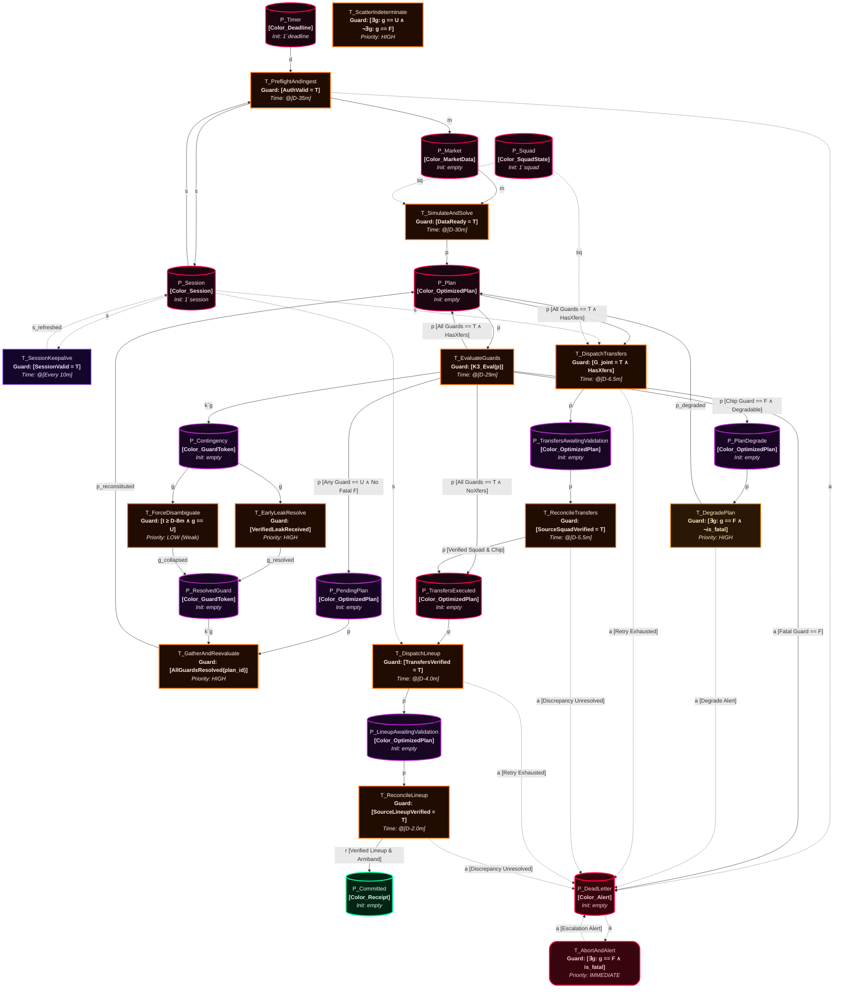
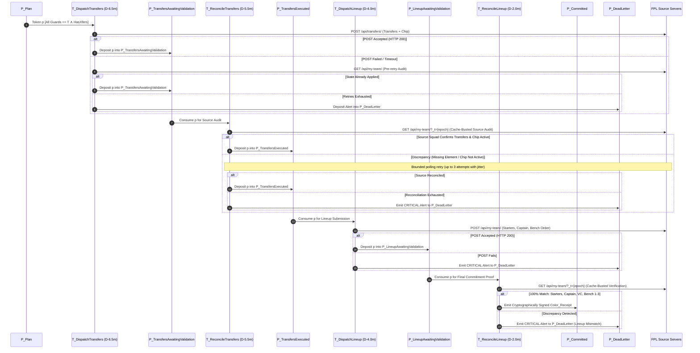
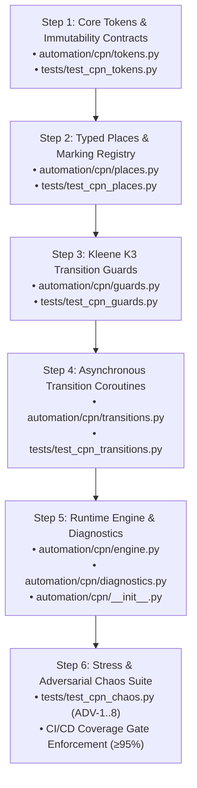
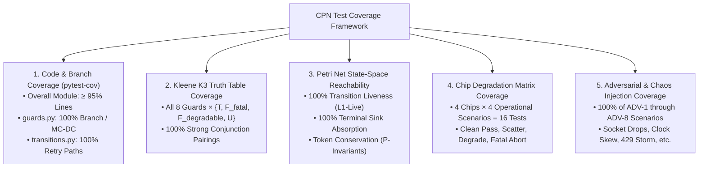
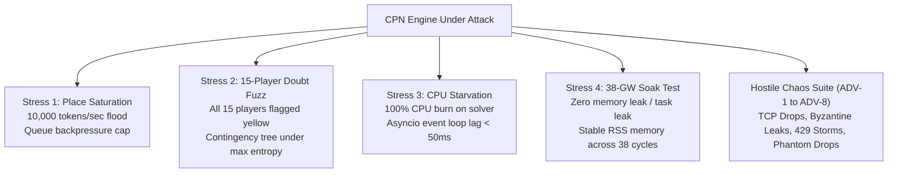

# Brainstorm: Autonomous Execution Pipeline & Robotic Manager
## Formal Kurt Jensen Coloured Petri Net (CPN) Model — Mars Cyber Edition
### Timed CPN ($\mathcal{N}_{\text{timed}}$), Kleene 3-Valued ($K_3$) Guards, and Scatter-Gather Disambiguation

**Status**: READY-TO-CODE SPECIFICATION / PHASE 3 BLUEPRINT  
**Target Module**: `automation/cpn/` (`__init__.py`, `tokens.py`, `places.py`, `guards.py`, `transitions.py`, `engine.py`)  
**Integrated Subsystems**: [`clients/fpl_client.py`](file:///c:/Users/cw171001/OneDrive%20-%20Teradata/Documents/GitHub/rubies_rangers/clients/fpl_client.py), [`analytics/montecarlo.py`](file:///c:/Users/cw171001/OneDrive%20-%20Teradata/Documents/GitHub/rubies_rangers/analytics/montecarlo.py), [`analytics/two_stage_optimizer.py`](file:///c:/Users/cw171001/OneDrive%20-%20Teradata/Documents/GitHub/rubies_rangers/analytics/two_stage_optimizer.py), [`analytics/chip_strategy.py`](file:///c:/Users/cw171001/OneDrive%20-%20Teradata/Documents/GitHub/rubies_rangers/analytics/chip_strategy.py), [`config.yaml`](file:///c:/Users/cw171001/OneDrive%20-%20Teradata/Documents/GitHub/rubies_rangers/config.yaml)  
**Philosophy**: Hands-on learning and interactive exploration come first; autonomous execution is formulated as a mathematically proven, deadlock-free Timed Coloured Petri Net (TCPN) implemented via Python's native `asyncio` Actor Model.

---

## Executive Summary

While full end-to-end automation is technically straightforward, premature automation bypasses the most critical phase of quantitative system development: **interactive learning, empirical intuition building, and hands-on discovery**.

By manually operating the Streamlit dashboard (`app.py`), inspecting live matchday fixture dynamics, and observing how Monte Carlo tail distributions behave when high-variance players carry yellow injury flags, the engineer discovers high-alpha modeling insights (e.g., home/away venue dampening, macro match pace jitter, teammate covariance).

When deploying programmatic execution, the pipeline operates as a **Lightweight Timed Coloured Petri Net (TCPN) $\mathcal{N}_{\text{timed}}$** featuring:
1. **Kleene 3-Valued ($K_3$) Transition Guards** with **Plan Degradation / Fallback Contingency** (eliminating the fragile chip abort flaw).
2. **Scatter-Gather (Fork-Join) Concurrency** resolving per-guard indeterminate states without race conditions.
3. **State-Verified Two-Stage API Dispatch** with explicit Wildcard/Free Hit pre-activation checks and Ghost Squad post-revert validation.
4. **$D-8\text{m}$ Forced Disambiguation Boundary** guaranteeing zero missed deadlines, 90 seconds of headway before Stage 1 dispatch, and provable $L_1$-liveness.

### The Core Architectural Insight: Resolving the FPL Deadline Paradox
A naive automated runner attempts to wait for official Premier League team sheets before finalizing transfers and captaincy. However:
* **The Official FPL Gameweek Deadline** is published by the API at `events[gw].deadline_time` (historically ~90 minutes before the first kickoff, though the Premier League retains full discretion to adjust this per-gameweek). The CPN consumes the **API-published `deadline_utc`** directly and never derives it from `kickoff_time`.
* **Official Premier League team sheets are published only 75 minutes before kickoff ($T-75\text{m}$)** (historically 60 minutes).

Any autonomous architecture that waits for official team sheets to resolve lineup uncertainty is fatally flawed because the deadline has already closed. This design resolves that paradox through a **$D-8\text{m}$ Forced Disambiguation Boundary** (where $D$ = API-published deadline) and a **Stochastic Contingency Tree**, guaranteeing provable deadlock-freedom ($L_1$-liveness) and zero missed deadlines.

> **Note on Deadline Timing**: All timing in this specification is expressed relative to the API-published `deadline_utc` field from `GET /api/bootstrap-static/` → `events[gw].deadline_time`, ensuring correctness regardless of per-gameweek schedule adjustments.

---

## 1. The Learning-First vs. Automation Lifecycle

```text
Phase 1: Interactive Learning & Stochastic Exploration (COMPLETE)
  • Hands-on usage of Streamlit UI (app.py) & Live Matchday Center
  • Manual transfer experimentation and scenario testing
  • Observing live fixtures vs. Monte Carlo distributions & macro pace jitter
  • Empirical calibration and parameter tuning (tuner/search_space.py)
           │
           ▼
Phase 2: Assisted Copilot with Human-in-the-Loop (TRANSITION PHASE)
  • System runs headless at D-35m (35 minutes before API deadline)
  • Solves optimal XI, transfers, and captaincy via two-stage MILP/Monte Carlo at D-30m
  • Evaluates Long-Term Chip Allocation Strategy via DP Engine
  • Dispatches pre-deadline intelligence summary to Telegram / Discord / Webhook
  • User reviews telemetry and clicks "Approve / Override" (Human-in-the-Loop)
  • Dry-run payload validation against active FPL session without live POST
           │
           ▼
Phase 3: Autonomous Robotic Manager via Coloured Petri Net (PRODUCTION BLUEPRINT)
  • Pure-Python formal TCPN engine (automation/cpn/) orchestrating discrete state tokens
  • Non-blocking asyncio Actor Model with strongly typed queues and coroutines
  • Provably deadlock-free K3 transition guards with Plan Degradation fallback loops
  • Scatter-Gather fork-join pattern resolving per-guard indeterminate tokens
  • State-verified two-stage API sequencing: Transfers/Chips committed before Lineup submission
  • Pre-flight authenticated session health checks & cryptographic payload hashing
  • Session keepalive heartbeat preventing mid-wait credential expiry
  • Ghost Squad tracking for Free Hit validation and price change protection
```

### Runtime Infrastructure: Headless Daemon vs. UI Telemetry
It is critical to distinguish *how* this mathematical framework operates physically on a machine:
* **The Orchestration Engine (Headless Daemon):** The CPN engine executes as a standalone, non-blocking asynchronous Python daemon (`python -m automation.cpn.engine`). This guarantees the engine never sleeps synchronously, blocks on user input, or depends on an active browser session while waiting for the $D-8\text{m}$ forced disambiguation boundary.
* **The Telemetry Dashboard (Streamlit UI):** The interactive `app.py` UI is entirely decoupled from execution. It acts as a read-only visualizer, inspecting the real-time token states (from the in-memory CPN marking registry or a shared state buffer) across $P_{\text{Plan}}$, $P_{\text{Contingency}}$, or $P_{\text{Committed}}$. **If the user closes their browser tab, the CPN engine continues running safely in the background.**

---

## 2. Timed Coloured Petri Net (TCPN) Formal Specification

The autonomous execution pipeline is modeled as a formal 10-tuple Timed Coloured Petri Net:
$$\mathcal{N}_{\text{timed}} = (P, T, A, \Sigma, V, C, G, E, I, \mathbb{T})$$
where:
* $P$ is a finite set of typed places ($|P| = 14$).
* $T$ is a finite set of transitions ($|T| = 14$, $P \cap T = \emptyset$).
* $A \subseteq (P \times T) \cup (T \times P)$ is a finite set of directed arcs, strictly satisfying the **bipartite graph property** ($(P \times P) \cap A = \emptyset$ and $(T \times T) \cap A = \emptyset$).
* $\Sigma$ is a finite set of non-empty color sets (data types).
* $V$ is a finite set of typed variables such that $\forall v \in V: \text{Type}[v] \in \Sigma$.
* $C: P \to \Sigma$ is a color function mapping each place $p \in P$ to a color set in $\Sigma$.
* $G: T \to \text{EXPR}_V$ is a guard function mapping each transition $t \in T$ to an expression over $V$ evaluated under Kleene 3-valued logic $K_3$.
* $E: A \to \text{EXPR}_V$ is an arc expression function evaluating tokens transferred across arcs.
* $I: P \to \text{EXPR}_\emptyset$ is an initialization function specifying initial markings $M_0$.
* $\mathbb{T} = \mathbb{R}_{\ge 0}$ is the continuous time domain, referenced monotonically to the API-published deadline $D$ (`deadline_utc`).

### A. Color Sets $\Sigma$ (Typed Structured Tokens)

Each color set maps to a `@dataclass(frozen=True)` in Python, per project coding standards ([`python_standards.md`](file:///c:/Users/cw171001/OneDrive%20-%20Teradata/Documents/GitHub/rubies_rangers/.agents/rules/python_standards.md)).

1. **`Color_Deadline`**:
   - `gameweek: int` — Target gameweek index (1..38)
   - `deadline_utc: datetime` — Sourced directly from `events[gw].deadline_time` in the FPL API
   - `cutoff_disambiguation_utc: datetime` — Calculated as `deadline_utc - timedelta(minutes=8)`
   - `n_sims: int` — Configurable Monte Carlo sample count (default 5000)

2. **`Color_Session`**:
   - `auth_cookie: str` — Authenticated `pl_profile` session cookie
   - `csrf_token: str` — CSRF validation token for state-mutating requests
   - `expires_at: datetime` — Cookie expiration timestamp
   - `is_authenticated: bool` — Verified via `GET /api/me/`
   - `last_keepalive_utc: datetime` — Timestamp of most recent successful session heartbeat

3. **`Color_MarketData`**:
   - `elements: pd.DataFrame` — Current player metadata, status flags, form, and ICT index
   - `fixtures: list[dict]` — Upcoming gameweek fixtures, home/away difficulty ratings
   - `odds: dict` — Implied bookmaker odds for clean sheets, anytime scorers, and match pace
   - `injury_flags: dict[int, dict]` — Maps element ID to chance of playing, news text, and flag code

4. **`Color_SquadState`** *(Enhanced with Ghost Squad Tracking)*:
   - `entry_id: int` — Official FPL manager team ID
   - `squad_ids: list[int]` — Current 15-man roster element IDs
   - `bank: float` — Available transfer bank in £M (e.g., 1.4)
   - `free_transfers: int` — Available free transfer count (1..5)
   - `chips_available: dict[str, bool]` — Availability status for `wildcard`, `freehit`, `3xc`, `bboost`
   - `active_chip: str | None` — Chip already registered on the server for current gameweek
   - `selling_prices: dict[int, float]` — Maps element ID $\to$ effective selling price in £M
   - **`ghost_squad_ids: list[int]`** — *Original squad IDs preserved during a Free Hit gameweek for reversion*
   - **`ghost_bank: float`** — *Original bank balance to be restored post-Free Hit*
   - **`ghost_selling_prices: dict[int, float]`** — *Original selling price base for ghost squad assets*

5. **`Color_OptimizedPlan`** *(Enhanced with Degradation Metadata)*:
   - `plan_id: str` — UUID uniquely tracking candidate plan across scatter-gather cycles
   - `starters: list[int]` — 11 Starting XI element IDs
   - `bench: list[int]` — 4 Bench element IDs ordered strictly by substitution priority (Sub GKP, Sub 1, Sub 2, Sub 3)
   - `captain: int` — Designated Captain element ID
   - `vice_captain: int` — Designated Vice-Captain element ID (strictly distinct from Captain)
   - `transfers: list[dict]` — List of transfer operations: `{"element_in": int, "element_out": int, "purchase_price": float, "selling_price": float}`
   - `chip: str | None` — Chip requested for activation: `"wildcard"`, `"freehit"`, `"3xc"`, `"bboost"`, or `None`
   - `expected_utility: float` — Multi-period discounted expected utility
   - `formation_tuple: tuple[int, int, int]` — e.g., `(3, 5, 2)` for validation against `config.yaml`
   - **`fallback_plan: dict | None`** — *Pre-computed baseline plan without chip activation, ready for immediate degradation if chip guard fails*
   - **`is_degraded: bool`** — *Flag indicating whether the plan underwent fallback degradation*
   - **`chip_degraded_reason: str | None`** — *Telemetry string explaining why the chip was stripped*
   - `contingency_tree: dict` — Dynamic tree mapping doubtful player IDs to bench promotion branches

6. **`Color_GuardToken`**:
   - `plan_id: str` — UUID linking back to parent `Color_OptimizedPlan`
   - `guard_name: str` — Identifier: `"Guard_Budget"`, `"Guard_ClubCap"`, `"Guard_Formation"`, `"Guard_HitUtility"`, `"Guard_Fitness"`, `"Guard_ChipSafety"`, etc.
   - `status: K3Status` — Kleene 3-valued status: `K3Status.UNKNOWN`, `K3Status.TRUE`, `K3Status.FALSE`
   - `subject_id: int | None` — FPL element ID under doubt (e.g., 350 for Palmer)
   - `doubt_type: str` — e.g., `"yellow_flag"`, `"press_conference"`, `"chip_safety_breach"`
   - `is_fatal: bool` — `True` if violation mandates immediate abort; `False` if violation can be degraded
   - `context: dict` — Contextual telemetry required for disambiguation
   - `resolved_at: datetime | None` — Timestamp when resolved

7. **`Color_Receipt`**:
   - `http_status: int` — HTTP response code (e.g., 200)
   - `timestamp: datetime` — Server timestamp of execution
   - `payload_hash: str` — SHA-256 cryptographic hash of verified server source state
   - `confirmation_id: str` — Unique confirmation receipt key from FPL API

8. **`Color_Alert`**:
   - `severity: str` — `"CRITICAL"`, `"WARNING"`, `"INFO"`
   - `reason: str` — Human-readable description of failure, abort, or degradation
   - `context: dict` — Machine-readable diagnostics
   - `timestamp: datetime` — Incident timestamp

### B. Places $P$ (Typed State Buffers)

The net contains exactly 14 typed places:
1. **$P_{\text{Timer}}$** ($C = \text{Color\_Deadline}$): Holds gameweek timing tokens; initiates workflow at $D-35\text{m}$.
2. **$P_{\text{Session}}$** ($C = \text{Color\_Session}$): Holds pre-authenticated session credentials, cookies, and CSRF tokens. Continuous shared state place via `CPNStatePlace`.
3. **$P_{\text{Market}}$** ($C = \text{Color\_MarketData}$): Ingested market state (bootstrap-static, live flags, bookmaker odds). Continuous shared state place via `CPNStatePlace`.
4. **$P_{\text{Squad}}$** ($C = \text{Color\_SquadState}$): Current verified manager squad marking, including selling prices, available chips, entry ID, and ghost squad tracking. Continuous shared state place via `CPNStatePlace`.
5. **$P_{\text{Plan}}$** ($C = \text{Color\_OptimizedPlan}$): Candidate lineup and transfer portfolio generated by MILP/Monte Carlo, ready for guard evaluation or dispatch.
6. **$P_{\text{PendingPlan}}$** ($C = \text{Color\_OptimizedPlan}$): Holding buffer preserving parent plans while indeterminate guards are scattered for asynchronous resolution.
7. **$P_{\text{Contingency}}$** ($C = \text{Color\_GuardToken}$): Buffer holding individual decomposed indeterminate guard tokens ($\mathbf{U}$).
8. **$P_{\text{ResolvedGuard}}$** ($C = \text{Color\_GuardToken}$): Buffer holding guard tokens resolved to $\mathbf{T}$ or $\mathbf{F}$ by leak arrival or timeout collapse.
9. **$P_{\text{PlanDegrade}}$** ($C = \text{Color\_OptimizedPlan}$): Staging buffer for candidate plans whose non-fatal chip guards evaluated to $\mathbf{F}$, routing to $T_{\text{DegradePlan}}$.
10. **$P_{\text{TransfersAwaitingValidation}}$** ($C = \text{Color\_OptimizedPlan}$): Staging place holding plans where transfer POST was submitted, awaiting read-back source system verification.
11. **$P_{\text{TransfersExecuted}}$** ($C = \text{Color\_OptimizedPlan}$): Intermediate buffer holding plan with confirmed and verified transfer state, enabling downstream lineup submission.
12. **$P_{\text{LineupAwaitingValidation}}$** ($C = \text{Color\_OptimizedPlan}$): Staging place holding plans where lineup POST was submitted, awaiting read-back source system verification.
13. **$P_{\text{Committed}}$** ($C = \text{Color\_Receipt}$): Terminal sink place containing cryptographically verified API receipts anchored to verified server source state.
14. **$P_{\text{DeadLetter}}$** ($C = \text{Color\_Alert}$): Terminal sink place holding halted states, safety halts, or failed dispatches.

---

### C. Kurt Jensen CPN-ML Formal Declarations & Multisets

In Kurt Jensen's canonical Coloured Petri Net formalism (*CPN Tools / Meta Software standard*), the net declarations are expressed in **CPN-ML** (Standard ML with discrete-event multiset semantics):

```sml
(* ========================================================================= *)
(* KURT JENSEN CPN-ML DECLARATIONS — MARS CYBER SPECIFICATION (PHASE 3)      *)
(* ========================================================================= *)

(* 1. Color Sets (Sigma) *)
colset Color_Deadline = record 
    gameweek: INT * deadline_utc: STRING * cutoff_disambiguation_utc: STRING * n_sims: INT;

colset Color_Session = record 
    auth_cookie: STRING * csrf_token: STRING * expires_at: STRING * is_authenticated: BOOL * last_keepalive_utc: STRING;

colset Color_MarketData = record 
    elements: DATA * fixtures: DATA * odds: DATA * injury_flags: DATA;

colset Color_SquadState = record 
    entry_id: INT * squad_ids: INT_LIST * bank: REAL * free_transfers: INT * 
    chips_available: DATA * active_chip: STRING * selling_prices: DATA *
    ghost_squad_ids: INT_LIST * ghost_bank: REAL * ghost_selling_prices: DATA;

colset Color_OptimizedPlan = record 
    plan_id: STRING * starters: INT_LIST * bench: INT_LIST * captain: INT * vice_captain: INT * 
    transfers: DATA * chip: STRING * expected_utility: REAL * formation_tuple: INT * INT * INT *
    fallback_plan: DATA * is_degraded: BOOL * chip_degraded_reason: STRING * contingency_tree: DATA;

colset Color_GuardToken = record 
    plan_id: STRING * guard_name: STRING * status: K3_VALUE * subject_id: INT * 
    doubt_type: STRING * is_fatal: BOOL * context: DATA * resolved_at: STRING;

colset Color_Receipt = record 
    http_status: INT * timestamp: STRING * payload_hash: STRING * confirmation_id: STRING;

colset Color_Alert = record 
    severity: STRING * reason: STRING * context: DATA * timestamp: STRING;

(* 2. Typed Variables (V) *)
var d               : Color_Deadline;
var s, s_refreshed  : Color_Session;
var m               : Color_MarketData;
var sq              : Color_SquadState;
var p, p_degraded   : Color_OptimizedPlan;
var g, g_res        : Color_GuardToken;
var r               : Color_Receipt;
var a               : Color_Alert;

(* 3. Multisets & Initial Markings (M0) *)
val M0_PTimer       = 1`d;
val M0_PSession     = 1`s;
val M0_PSquad       = 1`sq;
val M0_Empty        = empty;
```

---

## 3. Jensen CPN Topology & State Machine Flowchart — Mars Cyber Edition

The Petri Net strictly obeys the **bipartite graph property**: arcs exist exclusively between Places and Transitions ($P \to T$ or $T \to P$). Every Place is inscribed with its typed Color Set and Initial Marking multiset ($1`token$), and every Transition is inscribed with its Guard and temporal deadline trigger ($@[D-X\text{m}]$).



### Quick Reference: The Role of Each Transition

| Transition Name | When it Runs | What it Does in Plain English |
| :--- | :--- | :--- |
| **`T_PreflightAndIngest`** | **D - 35m** | Wakes up the system, logs into the FPL API, downloads the latest player prices, injury flags, bookmaker odds, and verifies manager squad state. |
| **`T_SessionKeepalive`** | **Every 10m** | Heartbeat `GET /api/me/` ping preventing session token expiry while waiting for deadline boundaries. |
| **`T_SimulateAndSolve`** | **D - 30m** | Solves two-stage stochastic optimization (MILP + Monte Carlo) and computes both the primary chip plan and the fallback baseline plan. |
| **`T_EvaluateGuards`** | **D - 29m** | The Safety Inspector. Evaluates the candidate plan under Kleene $K_3$ logic. Classifies violations as fatal vs degradable. |
| **`T_AbortAndAlert`** | **Immediate** | **Fatal Kill Switch.** If a structural rule strictly fails (illegal formation, budget breach, club cap breach), halts execution immediately and notifies operator. |
| **`T_DegradePlan`** | **Immediate** | **Plan Degradation Loop.** If a chip safety rule fails (e.g. Triple Captain Haaland ruled out), safely strips the chip, restores the fallback baseline lineup, and re-evaluates. |
| **`T_ScatterIndeterminate`**| **Immediate** | If guards evaluate to $\mathbf{U}$ (e.g., yellow 75% flag), splits indeterminate tokens into $P_{\text{Contingency}}$ and parks the plan in $P_{\text{PendingPlan}}$. |
| **`T_EarlyLeakResolve`** | **High Priority** | Consumes verified high-confidence leak or API status change, resolving a specific $\mathbf{U}$ token into $\mathbf{T}$ or $\mathbf{F}$. |
| **`T_ForceDisambiguate`** | **D - 8m** | **The Safety Net.** At the 8-minute deadline boundary, unconditionally collapses all remaining $\mathbf{U}$ tokens into risk-averse safe states via $\Psi_{\text{Averse}}$. |
| **`T_GatherAndReevaluate`** | **High Priority** | Recombines resolved guard tokens with the parked plan from $P_{\text{PendingPlan}}$ and feeds the reconstituted plan back into $P_{\text{Plan}}$. |
| **`T_DispatchTransfers`** | **D - 6.5m** | Executes transfers and activates chips via `POST /api/transfers/` and deposits plan into $P_{\text{TransfersAwaitingValidation}}$. |
| **`T_ReconcileTransfers`**| **D - 5.5m** | **Source System Reconciliation Gate 1.** Queries `GET /api/my-team/` with cache-busting to assert that all purchased players, sold players, and chips are active on the FPL servers before allowing lineup submission. |
| **`T_DispatchLineup`** | **D - 4.0m** | Sets Starting XI, Captaincy, Vice-Captaincy, and bench priority order via `POST /api/my-team/{entry_id}/` and deposits plan into $P_{\text{LineupAwaitingValidation}}$. |
| **`T_ReconcileLineup`** | **D - 2.0m** | **Source System Reconciliation Gate 2 (Commitment Proof).** Reads `GET /api/my-team/` to verify Starting XI, Captain, Vice-Captain, and bench order match 100%. Generates cryptographically anchored `Color_Receipt` into $P_{\text{Committed}}$. |

---

## 4. Kleene 3-Valued Logic ($K_3$), Guard Specifications & Plan Degradation

In formal discrete-event systems, standard Boolean logic ($\mathbb{B} = \{\mathbf{T}, \mathbf{F}\}$) is insufficient because data arrival is asynchronous. Guards are formally evaluated over the Kleene algebraic field:
$$\mathbb{V}_{K_3} = \{\mathbf{T} \text{ (Verified True)}, \quad \mathbf{F} \text{ (Violated / Invariant Breach)}, \quad \mathbf{U} \text{ (Indeterminate / Pending Information)}\}$$

### $K_3$ Truth Tables
The joint guard enabling function $G(t) = \bigwedge_{k=1}^m g_k(t)$ obeys Kleene strong conjunction:

$$\begin{array}{c|ccc}
\land & \mathbf{T} & \mathbf{U} & \mathbf{F} \\
\hline
\mathbf{T} & \mathbf{T} & \mathbf{U} & \mathbf{F} \\
\mathbf{U} & \mathbf{U} & \mathbf{U} & \mathbf{F} \\
\mathbf{F} & \mathbf{F} & \mathbf{F} & \mathbf{F}
\end{array}$$

### Semantic Invariants & The Plan Degradation Fix

* **Fatal Safety Invariant (Fatal $\mathbf{F}$ Domination)**: If any structural guard (`Guard_Budget`, `Guard_ClubCap`, `Guard_Formation`, `Guard_PreflightSession`) evaluates to $\mathbf{F}$, the state is unconditionally fatal. Transition $T_{\text{AbortAndAlert}}$ fires immediately to $P_{\text{DeadLetter}}$.
* **Degradable Chip Safety Invariant (Non-Fatal $\mathbf{F}$ Interception)**: If `Guard_ChipSafety` evaluates to $\mathbf{F}$ while all structural guards are $\mathbf{T}$ or $\mathbf{U}$, the system **does not abort**. Transition $T_{\text{DegradePlan}}$ intercepts the token:
  1. The requested chip is stripped (`plan.chip = None`).
  2. The pre-computed fallback plan (`plan.fallback_plan`) is loaded or captaincy is reassigned to the highest nailed EV asset.
  3. `plan.is_degraded = True` and `plan.chip_degraded_reason` are stamped.
  4. An alert token is emitted to $P_{\text{DeadLetter}}$ for operator visibility, while the degraded plan token is deposited back into $P_{\text{Plan}}$ for re-evaluation.
* **Execution Invariant ($\mathbf{T}$ Unanimity)**: A dispatch transition is enabled if and only if all evaluated guards are strictly $\mathbf{T}$.
* **Contingency Invariant ($\mathbf{U}$ Suspension)**: If no guard is $\mathbf{F}$ but at least one guard is $\mathbf{U}$, execution is suspended and indeterminate guards are scattered into $P_{\text{Contingency}}$.

---

### Comprehensive Guard Specification Matrix

| Guard Predicate | Mathematical Formulation | $\mathbf{T}$ (Verified) | $\mathbf{F}$ (Violated) | $\mathbf{U}$ (Indeterminate) | Fatal? |
| :--- | :--- | :--- | :--- | :--- | :--- |
| **`Guard_Budget`** | $\sum_{i \in \text{In}} \text{Cost}_i \le \text{Bank} + \sum_{j \in \text{Out}} \text{SellingPrice}_j$ | Transfer spend $\le$ total available capital using `selling_prices`. | Transfer spend exceeds budget. | Mid-cycle price change in progress. | **YES (Fatal)** |
| **`Guard_ClubCap`** | $\max_c \sum_{i=1}^{15} \mathbf{1}(\text{Club}_i = c) \le 3$ | All clubs $\le 3$ players in 15-man squad. | $\ge 4$ players from a single club. | Player club transfer unconfirmed in API. | **YES (Fatal)** |
| **`Guard_Formation`** | $\text{tuple}(\text{DEF}, \text{MID}, \text{FWD}) \in \mathcal{F}_{\text{legal}} \land \text{GKP}=1$ | Formation matches one of the 8 legal tuples in `config.yaml`. | Formation not in legal set (e.g. 2-5-3). | Position recategorization pending. | **YES (Fatal)** |
| **`Guard_HitUtility`** | $\mathbb{E}\!\left[\sum_{h=0}^{H} \gamma^h U_{t+h} \,\middle|\, \text{Transfers}\right] - \text{HitCost} > \mathbb{E}\!\left[\sum_{h=0}^{H} \gamma^h U_{t+h} \,\middle|\, \text{NoTransfer}\right]$ | Multi-period expected utility net of hit cost is positive over horizon $H$. | Net utility is strictly negative (value-destroying moves). | Horizon uncertainty too large to determine sign. | **YES (Fatal)** |
| **`Guard_Fitness`** | $\min_{i \in \text{Starters}} P(M_i \ge 60) \ge \tau_{\text{fitness}}$ | All starters confirmed $\ge 70\%$ start probability. | Confirmed ruled out / 0% chance of playing. | **Yellow flag / 50%–75% press doubt.** | **NO (Scatter)** |
| **`Guard_ChipSafety`** | See Sub-Predicate Matrix Below | Chip activation conditions verified. | Chip condition failed (e.g. captain out, bench doubtful). | Target player fitness is $\mathbf{U}$; defer activation until resolved. | **NO (Degrade)** |
| **`Guard_PreflightSession`** | $\text{HTTP\_Auth} = 200 \land \text{CookieValid} = \mathbf{T} \land t_{\text{exp}} > D$ | Session authenticated and cookie valid beyond deadline. | Auth rejected (401/403/CAPTCHA). | Socket timeout / network transient. | **YES (Fatal)** |
| **`Guard_TimeWindow`** | $D - 7\text{m} \le t \le D - 1\text{m}$ | Current time within legal dispatch window (accommodates Stage 1 at $D-6.5\text{m}$ through Gate 2 at $D-2.0\text{m}$). | Current time outside safe window. | System NTP synchronization in doubt. | **YES (Fatal)** |

---

### `Guard_ChipSafety` — Chip Invariants & Activation Sub-Predicates

Chip activation is irreversible. The guard strictly verifies the **Core Chip Invariants**:
1. **Single-Chip Invariant**: If `Color_SquadState.active_chip is not None` (a chip was already activated earlier in the gameweek), any plan requesting `chip is not None` evaluates to $\mathbf{F}$.
2. **Availability Invariant**: If `chip is not None` and `Color_SquadState.chips_available[chip] == False`, the guard evaluates to $\mathbf{F}$.

If the core invariants hold, the chip-specific sub-predicates evaluate:

| Chip | Safety Predicate | $\mathbf{T}$ (Verified) | $\mathbf{F}$ (Degradable Failure) | $\mathbf{U}$ (Indeterminate) |
| :--- | :--- | :--- | :--- | :--- |
| **Triple Captain (`3xc`)** | $P(M_{\text{captain}} \ge 60) \ge 0.95$ | Captain is a nailed starter. | Captain has $< 50\%$ start prob or is confirmed absent. $\to$ **Degrades: Strips chip, keeps standard captain.** | Captain carries yellow flag (50%–75%). |
| **Bench Boost (`bboost`)** | $\min_{i \in \text{Bench}} P(M_i \ge 60) \ge 0.70$ | All 4 bench players expected to play $\ge 60$ mins. | Any bench player confirmed absent (0%–25%). $\to$ **Degrades: Strips chip, benched doubtful.** | Any bench player flagged doubtful (50%–75%). |
| **Wildcard (`wildcard`)** | $\text{FreeTransfers}_{\text{next\_gw}} = \min(5, \text{FT} + 1) \land \text{StateVerified}$ | FT rollover preserved up to 5 FTs per modern rules; state pre-verified. | Active chip already registered or invalid squad size. $\to$ **Fatal abort.** | Server connection unverified. |
| **Free Hit (`freehit`)** | $\text{Legal}(\text{GhostSquad}) \land \Delta\text{Value} \ge -\tau_{\text{loss}}$ | Ghost squad retains legal structure and bank viability post-reversion; banked FTs preserved. | Ghost squad structurally invalid post-revert. $\to$ **Fatal abort.** | Post-revert price volatility pending. |
| **No Chip (`None`)** | Trivially $\mathbf{T}$ | No chip activation requested; zero risk. | — | — |

---

### The Refined Risk-Averse Collapse Operator ($\Psi_{\text{Averse}}$) at $D-8\text{m}$

When $t \ge D-8\text{m}$, transition $T_{\text{ForceDisambiguate}}$ unconditionally evaluates $\Psi_{\text{Averse}}$ on all residual $\mathbf{U}$ tokens to guarantee zero head-of-line blocking and ensure sufficient headway (90s) before Stage 1 transfer dispatch at $D-6.5\text{m}$:

1. **Position-Constrained Starting Player Collapse**:
   - If starting Goalkeeper ($pos = \text{GKP}$) is $\mathbf{U}$ or collapsed $\mathbf{F}$, swap **strictly** with substitute Goalkeeper (`bench[0]`, position 12). Under zero circumstances may an outfield player replace a goalkeeper.
   - If starting outfield player $i \in \{\text{DEF}, \text{MID}, \text{FWD}\}$ has $P(M_i \ge 60) < 0.70$, collapse $\mathbf{U}_i \to \mathbf{F}$ in the starting slot.
   - **Formation-Aware Bench Traversal**: Iterate strictly through outfield bench players (`bench[1]`, `bench[2]`, `bench[3]`) in priority order. For each candidate $c$, test whether provisional formation $((\text{DEF}, \text{MID}, \text{FWD}) \setminus \{i\}) \cup \{c\}$ is a member of `legal_formations` in `config.yaml`. Promote the first candidate satisfying structural legality.
   - Demoted starter $i$ is appended to `bench[3]`, shifting unaffected bench assets upward.
2. **Dual-Armband Captaincy Safe-Harbor**:
   - If candidate Captain $c$ has fitness $\mathbf{U}$ or $\mathbf{F}$, check candidate Vice-Captain $v$.
   - If Vice-Captain $v$ is confirmed fit ($\mathbf{T}$) and in the Starting XI, promote $v$ to Captain, and assign Vice-Captaincy to the highest expected-utility ($E[U]$) remaining nailed starter.
   - If **both** Captain and Vice-Captain are compromised, sort all confirmed nailed starters ($\mathbf{T}$) by expected points $E[U]$: assign the top-EV asset as Captain and second-highest as Vice-Captain.
3. **Bench Boost Doubtful Player**:
   - If `plan.chip == "bboost"` and any bench player remains $\mathbf{U}$ at $D-8\text{m}$:
     - Evaluate if an available free transfer or positive-EV transfer can replace the doubtful player with a nailed asset.
     - If no positive-EV replacement exists, trigger **Plan Degradation**: strip the `"bboost"` chip (`plan.chip = None`), demote the doubtful player to Sub 3, restore standard 11-man lineup, and conserve the Bench Boost chip for an upcoming Double Gameweek.

---

## 5. Technical Mechanics: Closed-Loop CPN Source-System Reconciliation

A foundational tenet of the Rubies Rangers architecture is that **source-system reconciliation must be an integral, formal part of the Coloured Petri Net (CPN) flow itself**, rather than an ad-hoc out-of-band client script.

In the official Fantasy Premier League architecture, the API separates team mutation across two completely independent, non-transactional REST endpoints:
1. `POST /api/transfers/` — Mutates the manager's 15-man squad roster and activates transfer chips (`wildcard`, `freehit`).
2. `POST /api/my-team/{entry_id}/` — Configures the 11 Starting XI players, captain, vice-captain, and bench priority order (positions 12–15).

### Why Validation Must Be Part of the CPN Flow (The "Phantom HTTP 200" Problem)
A naive automation script issues `POST /api/transfers/`, receives an `HTTP 200 OK` from the reverse proxy/gateway, and immediately posts the lineup. In production, this approach fails under real-world conditions:
* **Phantom Success & Asynchronous DB Lag**: A web gateway can return `HTTP 200 OK` while the underlying Premier League database experiences replication lag or lock contention. The transfer request may be queued or dropped asynchronously.
* **Cascading Downstream Failure**: `POST /api/my-team/` strictly validates that all submitted element IDs already exist in the manager's verified roster on the server. If transfers were dropped or delayed, submitting the new lineup results in `HTTP 400 Bad Request` (*"Player not in team"*), or leaves the team with an unassigned captain and corrupted bench.
* **Silent Mutation Inversion**: In high-traffic deadline windows ($D-5\text{m}$), server-side caching can cause subsequent reads to return stale state unless cache-busting headers are enforced.

To eliminate these vulnerabilities, the CPN topology formalizes **Two Closed-Loop Read-After-Write Reconciliation Gates** directly in the bipartite net:
* **Gate 1 ($P_{\text{TransfersAwaitingValidation}} \to T_{\text{ReconcileTransfers}} \to P_{\text{TransfersExecuted}}$)**: Validates that purchased players, sold players, and requested chips are 100% active in the source database before lineup submission is permitted.
* **Gate 2 ($P_{\text{LineupAwaitingValidation}} \to T_{\text{ReconcileLineup}} \to P_{\text{Committed}}$)**: Validates that the 11 starters, captain armband, vice-captain armband, and bench substitution priorities match the optimized plan with zero error before emitting the cryptographic `Color_Receipt`.



---

### A. Pre-Flight Authentication & Session Management ($D-35\text{m}$)
To avoid rate-limits or credential lockouts at the deadline, authentication is validated at $D-35\text{m}$:
* **Auth Endpoint**: `POST https://users.premierleague.com/accounts/login/`
* **Headers**:
  ```http
  User-Agent: Mozilla/5.0 (Windows NT 10.0; Win64; x64) AppleWebKit/537.36
  Content-Type: application/x-www-form-urlencoded
  Referer: https://fantasy.premierleague.com/
  ```
* **Payload**: `login={EMAIL}&password={PASSWORD}&app=plfpl-web&redirect_uri=https://fantasy.premierleague.com/`
* **Session Verification**: The endpoint returns session cookies (`pl_profile`). The client validates the session by issuing a `GET https://fantasy.premierleague.com/api/me/`. If HTTP 200 is received, token `Color_Session` is marked `is_authenticated: True` and deposited in $P_{\text{Session}}$.

### B. Session Keepalive Heartbeat (Every 10 Minutes)
FPL session tokens (`pl_profile`) have variable TTLs with potential 15–30 minute inactivity timeouts.
* **Mechanism**: $T_{\text{SessionKeepalive}}$ fires `GET https://fantasy.premierleague.com/api/me/` every 10 minutes.
* **On HTTP 200**: Updates `Color_Session.last_keepalive_utc` to current time. Session remains valid in $P_{\text{Session}}$.
* **On HTTP 401/403**: Triggers immediate re-authentication via $T_{\text{PreflightAndIngest}}$. If re-auth fails, routes to $P_{\text{DeadLetter}}$.

---

### C. Stage 1: Transfers & Chip Dispatch Protocol ($D-6.5\text{m}$)

#### Wildcard & Free Hit Timeout Race Condition Prevention
Submitting 10–15 transfers with `"chips": "wildcard"` over a public network introduces critical race risks. If an HTTP request times out, a naive retry could execute transfers without activating the chip, incurring catastrophic point penalties (-40 or -50 points).

To eliminate this vulnerability, the client executes the **State-Verified Dispatch Protocol**:
1. Pre-verification check: Queries `GET /api/my-team/{entry_id}/` to inspect current server state.
2. Dispatches `POST /api/transfers/` with payload hash.
3. If timeout occurs, never blindly re-POST; inspects server state first. If chip and transfers applied, treats as success.
4. Upon gateway acceptance, deposits plan token into intermediate place **$P_{\text{TransfersAwaitingValidation}}$**.

#### Transfer Payload Format
* **Endpoint**: `POST https://fantasy.premierleague.com/api/transfers/`
* **Idempotency Safeguard**: Every transaction computes SHA-256 hash of `(entry_id, event, transfers_in, transfers_out, chip)`.
* **Payload Structure**:
  ```json
  {
    "chips": "wildcard",
    "entry": 6173410,
    "event": 4,
    "transfers": [
      {
        "element_in": 280,
        "element_out": 499,
        "purchase_price": 55,
        "selling_price": 55
      }
    ]
  }
  ```
  *(Chips: `"wildcard"`, `"freehit"`, `"3xc"`, `"bboost"`, or `null`).*

---

### D. Source-System Reconciliation Gate 1: Transfers & Chip Verification ($D-5.5\text{m}$)
Transition $T_{\text{ReconcileTransfers}}$ executes an automated read-after-write audit against the source system:
1. Issues a cache-busted `GET https://fantasy.premierleague.com/api/my-team/{entry_id}/?_t={epoch_ms}` with header `Cache-Control: no-cache`.
2. **Squad Elements Verification**:
   $$\forall t \in \text{plan.transfers}: \quad t.\text{element\_in} \in \text{server\_squad} \quad \land \quad t.\text{element\_out} \notin \text{server\_squad}$$
3. **Chip State Verification**:
   $$\text{plan.chip} \ne \text{None} \implies \text{server\_team}.\text{active\_chip} = \text{plan.chip}$$
4. **Resolution**:
   - If assertions hold: Plan token advances to **$P_{\text{TransfersExecuted}}$**.
   - If assertions fail: Up to 3 bounded re-audits with jitter (1.0s, 2.0s, 4.0s). If discrepancy persists, emits `Color_Alert(severity="CRITICAL")` into $P_{\text{DeadLetter}}$ and halts execution.

---

### E. Stage 2: Lineup, Captaincy & Bench Order Dispatch ($D-4.0\text{m}$)
Once $P_{\text{TransfersExecuted}}$ receives the verified plan token (or if no transfers were required), $T_{\text{DispatchLineup}}$ fires:
* **Endpoint**: `POST https://fantasy.premierleague.com/api/my-team/{entry_id}/`
* **Payload Structure**:
  ```json
  {
    "picks": [
      {"element": 499, "position": 1,  "is_captain": false, "is_vice_captain": false},
      {"element": 350, "position": 2,  "is_captain": true,  "is_vice_captain": false},
      {"element": 280, "position": 3,  "is_captain": false, "is_vice_captain": true},
      {"element": 120, "position": 12, "is_captain": false, "is_vice_captain": false},
      {"element": 155, "position": 13, "is_captain": false, "is_vice_captain": false},
      {"element": 210, "position": 14, "is_captain": false, "is_vice_captain": false},
      {"element": 405, "position": 15, "is_captain": false, "is_vice_captain": false}
    ]
  }
  ```
  * `position`: 1–11 are Starting XI; 12 is Sub GKP; 13 is Sub 1; 14 is Sub 2; 15 is Sub 3.
  * `is_captain`: `true` for exactly one starting player.
  * `is_vice_captain`: `true` for exactly one starting player (must strictly differ from captain).
* **On HTTP 200**: Deposits plan into intermediate place **$P_{\text{LineupAwaitingValidation}}$**.

---

### F. Source-System Reconciliation Gate 2: Lineup & Commitment Proof ($D-2.0\text{m}$)
Transition $T_{\text{ReconcileLineup}}$ is the **ultimate commitment gate of the CPN flow**:
1. Issues a cache-busted `GET https://fantasy.premierleague.com/api/my-team/{entry_id}/?_t={epoch_ms}`.
2. Evaluates the 5-fold strict equality invariant:
   - Total picks returned from server $\equiv 15$.
   - $\{p.\text{element} \mid p.\text{position} \le 11\} \equiv \text{set}(\text{plan.starters})$.
   - $\text{server}.\text{captain} \equiv \text{plan.captain}$.
   - $\text{server}.\text{vice\_captain} \equiv \text{plan.vice\_captain}$.
   - $[p.\text{element} \mid p.\text{position} \in \{12, 13, 14, 15\}] \equiv \text{plan.bench}$.
3. **Receipt Generation**: Upon 100% verification, computes the SHA-256 cryptographic hash of the verified server picks:
   $$\text{Hash} = \text{SHA-256}\Big(\text{JSON}(\text{server\_picks})\Big)$$
   Deposits a cryptographically verified `Color_Receipt` token into terminal sink **$P_{\text{Committed}}$**.
4. **Discrepancy Kill-Switch**: If any pick or armband fails to match after bounded polling, emits a `CRITICAL` alert into **$P_{\text{DeadLetter}}$** for post-mortem analysis.

---

## 6. Mathematical Liveness & Deadlock Proof

### Proposition: The TCPN $\mathcal{N}_{\text{timed}}$ is $L_1$-Live, Bounded, and Deadlock-Free
A Timed Coloured Petri Net exhibits deadlock if a reachable marking $M \in R(M_0)$ exists such that no transition $t \in T$ is enabled ($T(M) = \emptyset$), while $M(P_{\text{Committed}}) = 0$ and $M(P_{\text{DeadLetter}}) = 0$.

1. **State $P_{\text{Plan}}$**: $T_{\text{EvaluateGuards}}$ is a complete partition over $\mathbb{V}_{K_3}$:
   $$\forall \text{tokens } \tau \in P_{\text{Plan}}, \quad G(\tau) \in \{\mathbf{T}, \mathbf{F}_{\text{fatal}}, \mathbf{F}_{\text{degradable}}, \mathbf{U}\}$$
   Since $\{\mathbf{T}\} \cup \{\mathbf{F}_{\text{fatal}}\} \cup \{\mathbf{F}_{\text{degradable}}\} \cup \{\mathbf{U}\}$ forms a complete covering of the state space:
   * If any guard is $\mathbf{F}_{\text{fatal}}$, $T_{\text{AbortAndAlert}}$ is enabled $\to P_{\text{DeadLetter}}$.
   * If a chip guard is $\mathbf{F}_{\text{degradable}}$ and no guard is $\mathbf{F}_{\text{fatal}}$, token moves to $P_{\text{PlanDegrade}}$ enabling $T_{\text{DegradePlan}} \to P_{\text{Plan}}$ with `chip = None`. Because `Guard_ChipSafety(chip=None)` is trivially $\mathbf{T}$, infinite degradation loops are mathematically impossible.
   * If any guard is $\mathbf{U}$ and no guard is $\mathbf{F}$, $T_{\text{ScatterIndeterminate}}$ is enabled $\to P_{\text{PendingPlan}}$ and $P_{\text{Contingency}}$.
   * If all guards are $\mathbf{T}$, $T_{\text{DispatchTransfers}}$ (or $P_{\text{TransfersExecuted}}$ if no transfers) is enabled.
2. **Scatter-Gather Synchronization**: 
   When guards are scattered into $P_{\text{Contingency}}$, two competing transitions exist with explicit priority:
   * $T_{\text{EarlyLeakResolve}}$ (**strong/high priority**): Consumes individual guard tokens as verified data arrives $\to P_{\text{ResolvedGuard}}$.
   * $T_{\text{ForceDisambiguate}}$ (**weak/low priority**, timed at $D-8\text{m}$): Consumes all **remaining** $\mathbf{U}$ tokens $\to P_{\text{ResolvedGuard}}$.
   Because physical time monotonically advances ($\frac{dt}{dt} = 1$), the condition $t = D - 8\text{m}$ is guaranteed to be satisfied in finite physical time.
   Once all $k$ guards for `plan_id` reach $P_{\text{ResolvedGuard}}$, transition $T_{\text{GatherAndReevaluate}}$ is guaranteed to be enabled, consuming all guard tokens and the parent plan from $P_{\text{PendingPlan}}$ and depositing the reconstituted plan into $P_{\text{Plan}}$.
   Therefore, no token can reside in $P_{\text{Contingency}}$ or $P_{\text{PendingPlan}}$ indefinitely.
3. **Reconciliation Gates Liveness & Bounded Dwell Time**:
   - For any token entering $P_{\text{TransfersAwaitingValidation}}$, transition $T_{\text{ReconcileTransfers}}$ is enabled. $T_{\text{ReconcileTransfers}}$ performs bounded query attempts with exponential backoff up to $t = D - 4.5\text{m}$. It either verifies source state and deposits the token into $P_{\text{TransfersExecuted}}$, or upon retry exhaustion deposits an alert token into $P_{\text{DeadLetter}}$.
   - For any token entering $P_{\text{LineupAwaitingValidation}}$, transition $T_{\text{ReconcileLineup}}$ is enabled. $T_{\text{ReconcileLineup}}$ performs bounded verification attempts up to $t = D - 1.0\text{m}$. It either verifies all 15 picks, generating `Color_Receipt` into $P_{\text{Committed}}$, or upon discrepancy deposits an alert token into $P_{\text{DeadLetter}}$.
   - Consequently, $M_{\text{final}}(P_{\text{TransfersAwaitingValidation}}) = 0$ and $M_{\text{final}}(P_{\text{LineupAwaitingValidation}}) = 0$. Tokens cannot be trapped in intermediate reconciliation buffers.
4. **Session Liveness & Read-Arcs**: $T_{\text{SessionKeepalive}}$ periodically refreshes the session token in $P_{\text{Session}}$. Read-arcs via `CPNStatePlace` ensure session and market tokens are never consumed destructively during preflight or solver runs.
5. **Terminal Sinks**: All reachable paths terminate strictly in either $P_{\text{Committed}}$ (verified success) or $P_{\text{DeadLetter}}$ (operator alert). Hence, $\mathcal{N}_{\text{timed}}$ contains zero unhandled terminal states and zero deadlocks. $\blacksquare$

---

## 7. Software Implementation Blueprint: `automation/cpn/`

The CPN implementation resides in the `automation/cpn/` module with strict separation of concerns, complete type safety, and zero reliance on heavy external queue infrastructure.

```text
automation/cpn/
├── __init__.py           # Package exports (CPNEngine, CPNMarking, tokens, guards)
├── tokens.py             # Strongly-typed frozen dataclasses (Color_* tokens)
├── places.py             # Strongly-typed asyncio.Queue wrappers & marking registry (14 places)
├── guards.py             # Pure functional Kleene K3 guard evaluators
├── transitions.py        # Complete async coroutines for all 14 transitions
├── engine.py             # CPNEngine orchestrator, lifecycle manager & UI telemetry API
└── diagnostics.py        # CPNDiagnosticJournal continuous profiler & daily health ledger
```

---

### File 1: `automation/cpn/__init__.py`

```python
"""
automation/cpn/__init__.py
Public API exports for Kurt Jensen Timed Coloured Petri Net (TCPN) engine.
"""
from automation.cpn.tokens import (
    K3Status,
    Color_Deadline,
    Color_Session,
    Color_MarketData,
    Color_SquadState,
    Color_OptimizedPlan,
    Color_GuardToken,
    Color_Receipt,
    Color_Alert,
)
from automation.cpn.places import CPNPlace, CPNStatePlace, CPNMarkingRegistry
from automation.cpn.guards import (
    GuardEvaluationResult,
    evaluate_budget_guard,
    evaluate_club_cap_guard,
    evaluate_formation_guard,
    evaluate_hit_utility_guard,
    evaluate_fitness_guard,
    evaluate_chip_safety_guard,
    evaluate_preflight_session_guard,
    evaluate_time_window_guard,
    evaluate_joint_guards,
)
from automation.cpn.transitions import (
    t_preflight_and_ingest,
    t_session_keepalive,
    t_simulate_and_solve,
    t_evaluate_guards,
    t_abort_and_alert,
    t_degrade_plan,
    t_scatter_indeterminate,
    t_early_leak_resolve,
    t_force_disambiguate,
    t_gather_and_reevaluate,
    t_dispatch_transfers,
    t_reconcile_transfers,
    t_dispatch_lineup,
    t_reconcile_lineup,
)
from automation.cpn.engine import CPNEngine
from automation.cpn.diagnostics import CPNDiagnosticJournal

__all__ = [
    "K3Status",
    "Color_Deadline",
    "Color_Session",
    "Color_MarketData",
    "Color_SquadState",
    "Color_OptimizedPlan",
    "Color_GuardToken",
    "Color_Receipt",
    "Color_Alert",
    "CPNPlace",
    "CPNStatePlace",
    "CPNMarkingRegistry",
    "GuardEvaluationResult",
    "evaluate_budget_guard",
    "evaluate_club_cap_guard",
    "evaluate_formation_guard",
    "evaluate_hit_utility_guard",
    "evaluate_fitness_guard",
    "evaluate_chip_safety_guard",
    "evaluate_preflight_session_guard",
    "evaluate_time_window_guard",
    "evaluate_joint_guards",
    "t_preflight_and_ingest",
    "t_session_keepalive",
    "t_simulate_and_solve",
    "t_evaluate_guards",
    "t_abort_and_alert",
    "t_degrade_plan",
    "t_scatter_indeterminate",
    "t_early_leak_resolve",
    "t_force_disambiguate",
    "t_gather_and_reevaluate",
    "t_dispatch_transfers",
    "t_reconcile_transfers",
    "t_dispatch_lineup",
    "t_reconcile_lineup",
    "CPNEngine",
    "CPNDiagnosticJournal",
]
```

---

### File 2: `automation/cpn/tokens.py`

```python
"""
automation/cpn/tokens.py
Kurt Jensen Coloured Petri Net Tokens (Color Sets Sigma).
Strictly immutable frozen dataclasses per Python standards.
"""
from __future__ import annotations
from dataclasses import dataclass, field
from datetime import datetime
from enum import Enum
from typing import Any
import pandas as pd


class K3Status(str, Enum):
    """Kleene 3-Valued Logic Values."""
    TRUE = "TRUE"
    FALSE = "FALSE"
    UNKNOWN = "UNKNOWN"


@dataclass(frozen=True)
class Color_Deadline:
    """Timing token referenced monotonically to API deadline."""
    gameweek: int
    deadline_utc: datetime
    cutoff_disambiguation_utc: datetime
    n_sims: int = 5000


@dataclass(frozen=True)
class Color_Session:
    """Pre-authenticated session credentials and health metrics."""
    auth_cookie: str
    csrf_token: str
    expires_at: datetime
    is_authenticated: bool
    last_keepalive_utc: datetime


@dataclass(frozen=True)
class Color_MarketData:
    """Ingested market telemetry and player data."""
    elements: pd.DataFrame
    fixtures: list[dict[str, Any]]
    odds: dict[str, Any]
    injury_flags: dict[int, dict[str, Any]]


@dataclass(frozen=True)
class Color_SquadState:
    """Verified manager squad marking including ghost squad tracking for Free Hit."""
    entry_id: int
    squad_ids: list[int]
    bank: float
    free_transfers: int
    chips_available: dict[str, bool]
    active_chip: str | None
    selling_prices: dict[int, float]
    ghost_squad_ids: list[int]
    ghost_bank: float
    ghost_selling_prices: dict[int, float]


@dataclass(frozen=True)
class Color_OptimizedPlan:
    """Candidate lineup and transfer portfolio generated by optimizer."""
    plan_id: str
    starters: list[int]
    bench: list[int]
    captain: int
    vice_captain: int
    transfers: list[dict[str, Any]]
    chip: str | None
    expected_utility: float
    formation_tuple: tuple[int, int, int]
    fallback_plan: dict[str, Any] | None = None
    is_degraded: bool = False
    chip_degraded_reason: str | None = None
    contingency_tree: dict[str, Any] = field(default_factory=dict)


@dataclass(frozen=True)
class Color_GuardToken:
    """Decomposed guard condition token scattered for resolution."""
    plan_id: str
    guard_name: str
    status: K3Status
    subject_id: int | None
    doubt_type: str
    is_fatal: bool
    context: dict[str, Any]
    resolved_at: datetime | None = None


@dataclass(frozen=True)
class Color_Receipt:
    """Cryptographically verified terminal execution receipt."""
    http_status: int
    timestamp: datetime
    payload_hash: str
    confirmation_id: str


@dataclass(frozen=True)
class Color_Alert:
    """Operator diagnostic alert deposited in Dead-Letter Queue."""
    severity: str
    reason: str
    context: dict[str, Any]
    timestamp: datetime
```

---

### File 3: `automation/cpn/places.py`

```python
"""
automation/cpn/places.py
Typed asyncio.Queue places and Marking Registry for the CPN.
Provides non-destructive state inspection for the Streamlit UI.
"""
from __future__ import annotations
import asyncio
from typing import Generic, TypeVar, Any
from automation.cpn.tokens import (
    Color_Deadline, Color_Session, Color_MarketData, Color_SquadState,
    Color_OptimizedPlan, Color_GuardToken, Color_Receipt, Color_Alert
)

T = TypeVar("T")


class CPNPlace(Generic[T]):
    """Strongly typed FIFO place buffer encapsulating asyncio.Queue."""
    def __init__(self, name: str, maxsize: int = 100) -> None:
        self.name = name
        self._queue: asyncio.Queue[T] = asyncio.Queue(maxsize=maxsize)
        self._history: list[T] = []

    async def put(self, token: T) -> None:
        await self._queue.put(token)
        self._history.append(token)

    async def get(self) -> T:
        return await self._queue.get()

    def task_done(self) -> None:
        self._queue.task_done()

    def qsize(self) -> int:
        return self._queue.qsize()

    def empty(self) -> bool:
        return self._queue.empty()

    def snapshot(self) -> list[T]:
        """Read-only view of tokens currently in the queue without dequeuing (for UI)."""
        return list(self._queue._queue)  # type: ignore[attr-defined]

    def peek(self) -> T | None:
        """Returns head token without removing it, or None if empty."""
        tokens = self.snapshot()
        return tokens[0] if tokens else None


class CPNStatePlace(Generic[T]):
    """
    Non-destructive state buffer modeling formal Jensen CPN read-arcs (test arcs).
    Allows concurrent, non-destructive reads without altering token presence.
    Updates are serialized via an asyncio.Lock and notify waiting observers.
    """
    def __init__(self, name: str, initial_value: T | None = None) -> None:
        self.name = name
        self._value: T | None = initial_value
        self._lock = asyncio.Lock()
        self._updated_event = asyncio.Event()
        self._version: int = 0 if initial_value is None else 1

    async def read(self) -> T:
        """Non-destructive read. If uninitialized, waits until first publication."""
        while self._value is None:
            await self._updated_event.wait()
        return self._value

    def peek(self) -> T | None:
        """Synchronous non-blocking inspection for UI telemetry."""
        return self._value

    async def publish(self, new_value: T) -> None:
        """Thread-safe update of shared state token."""
        async with self._lock:
            self._value = new_value
            self._version += 1
            self._updated_event.set()
            self._updated_event.clear()

    @property
    def version(self) -> int:
        return self._version


class CPNMarkingRegistry:
    """Central container storing all 14 Petri Net places with proper read-arc separation."""
    def __init__(self) -> None:
        # Continuous Shared State Places (Non-destructive Read-Arcs)
        self.P_Session: CPNStatePlace[Color_Session] = CPNStatePlace("P_Session")
        self.P_Market: CPNStatePlace[Color_MarketData] = CPNStatePlace("P_Market")
        self.P_Squad: CPNStatePlace[Color_SquadState] = CPNStatePlace("P_Squad")

        # Discrete Transactional Queues (Consumptive Arcs)
        self.P_Timer: CPNPlace[Color_Deadline] = CPNPlace("P_Timer")
        self.P_Plan: CPNPlace[Color_OptimizedPlan] = CPNPlace("P_Plan")
        self.P_PendingPlan: CPNPlace[Color_OptimizedPlan] = CPNPlace("P_PendingPlan")
        self.P_Contingency: CPNPlace[Color_GuardToken] = CPNPlace("P_Contingency")
        self.P_ResolvedGuard: CPNPlace[Color_GuardToken] = CPNPlace("P_ResolvedGuard")
        self.P_PlanDegrade: CPNPlace[Color_OptimizedPlan] = CPNPlace("P_PlanDegrade")
        self.P_TransfersAwaitingValidation: CPNPlace[Color_OptimizedPlan] = CPNPlace("P_TransfersAwaitingValidation")
        self.P_TransfersExecuted: CPNPlace[Color_OptimizedPlan] = CPNPlace("P_TransfersExecuted")
        self.P_LineupAwaitingValidation: CPNPlace[Color_OptimizedPlan] = CPNPlace("P_LineupAwaitingValidation")
        self.P_Committed: CPNPlace[Color_Receipt] = CPNPlace("P_Committed")
        self.P_DeadLetter: CPNPlace[Color_Alert] = CPNPlace("P_DeadLetter")

    def get_summary(self) -> dict[str, int]:
        """Returns marking multiset counts M(p) for telemetry."""
        summary = {
            "P_Session": 1 if self.P_Session.peek() is not None else 0,
            "P_Market": 1 if self.P_Market.peek() is not None else 0,
            "P_Squad": 1 if self.P_Squad.peek() is not None else 0,
        }
        for q_name in [
            "P_Timer", "P_Plan", "P_PendingPlan", "P_Contingency",
            "P_ResolvedGuard", "P_PlanDegrade", "P_TransfersAwaitingValidation",
            "P_TransfersExecuted", "P_LineupAwaitingValidation",
            "P_Committed", "P_DeadLetter"
        ]:
            summary[q_name] = getattr(self, q_name).qsize()
        return summary

    def get_marking_snapshot(self) -> dict[str, Any]:
        """Returns snapshot of all active tokens across all places for UI state inspector."""
        snapshot: dict[str, Any] = {
            "P_Session": [self.P_Session.peek()] if self.P_Session.peek() is not None else [],
            "P_Market": [self.P_Market.peek()] if self.P_Market.peek() is not None else [],
            "P_Squad": [self.P_Squad.peek()] if self.P_Squad.peek() is not None else [],
        }
        for q_name in [
            "P_Timer", "P_Plan", "P_PendingPlan", "P_Contingency",
            "P_ResolvedGuard", "P_PlanDegrade", "P_TransfersAwaitingValidation",
            "P_TransfersExecuted", "P_LineupAwaitingValidation",
            "P_Committed", "P_DeadLetter"
        ]:
            snapshot[q_name] = getattr(self, q_name).snapshot()
        return snapshot
```

---

### File 4: `automation/cpn/guards.py`

```python
"""
automation/cpn/guards.py
Pure functional Kleene K3 transition guard evaluators.
Distinguishes fatal invariant breaches from degradable chip failures.
"""
from __future__ import annotations
from dataclasses import dataclass
from datetime import datetime, timezone
from typing import Any
from automation.cpn.tokens import (
    K3Status, Color_OptimizedPlan, Color_SquadState, Color_MarketData,
    Color_Session, Color_GuardToken
)


@dataclass(frozen=True)
class GuardEvaluationResult:
    joint_status: K3Status
    tokens: list[Color_GuardToken]
    has_fatal_failure: bool
    has_degradable_chip_failure: bool


def evaluate_budget_guard(plan: Color_OptimizedPlan, squad: Color_SquadState) -> K3Status:
    """Verifies transfer spend does not exceed bank plus effective selling prices."""
    if not plan.transfers:
        return K3Status.TRUE
    total_cost = sum(t["purchase_price"] for t in plan.transfers)
    total_sales = sum(squad.selling_prices.get(t["element_out"], t.get("selling_price", 0.0)) for t in plan.transfers)
    available_capital = round(squad.bank + total_sales, 2)
    return K3Status.TRUE if total_cost <= available_capital else K3Status.FALSE


def evaluate_club_cap_guard(plan: Color_OptimizedPlan, market: Color_MarketData) -> K3Status:
    """Verifies no single Premier League club has more than 3 players across all 15."""
    team_counts: dict[int, int] = {}
    element_team_map = market.elements.set_index("id")["team"].to_dict()
    all_15 = plan.starters + plan.bench
    for el_id in all_15:
        team_id = element_team_map.get(el_id)
        if team_id is None:
            return K3Status.UNKNOWN
        team_counts[team_id] = team_counts.get(team_id, 0) + 1
        if team_counts[team_id] > 3:
            return K3Status.FALSE
    return K3Status.TRUE


def evaluate_formation_guard(plan: Color_OptimizedPlan, legal_formations: set[tuple[int, int, int]]) -> K3Status:
    """Verifies Starting XI formation matches configured legal tuples (DEF, MID, FWD)."""
    return K3Status.TRUE if plan.formation_tuple in legal_formations else K3Status.FALSE


def evaluate_hit_utility_guard(
    plan: Color_OptimizedPlan,
    squad: Color_SquadState,
    baseline_utility: float,
    discount_gamma: float = 0.90,
    horizon: int = 4
) -> K3Status:
    """
    Evaluates multi-period expected utility net of hit points vs NoTransfer baseline.
    Enforces Moneyball Strategy Rule 3: No arbitrary hit limits; justified by positive EV.
    """
    transfer_count = len(plan.transfers)
    excess_transfers = max(0, transfer_count - squad.free_transfers)
    hit_cost = excess_transfers * 4.0

    # Discounted net utility margin
    net_plan_utility = plan.expected_utility - hit_cost
    if net_plan_utility > baseline_utility:
        return K3Status.TRUE
    elif net_plan_utility < baseline_utility - 2.0:
        return K3Status.FALSE
    else:
        return K3Status.UNKNOWN


def evaluate_fitness_guard(
    plan: Color_OptimizedPlan, market: Color_MarketData, tau_fitness: float = 0.70
) -> list[Color_GuardToken]:
    """Inspects Starting XI players for injury flags and fitness doubt."""
    tokens: list[Color_GuardToken] = []
    flags = market.injury_flags
    for pid in plan.starters:
        flag = flags.get(pid, {})
        chance = flag.get("chance_of_playing")
        if chance is None or chance == 100:
            continue
        elif chance == 0:
            tokens.append(Color_GuardToken(
                plan_id=plan.plan_id, guard_name="Guard_Fitness", status=K3Status.FALSE,
                subject_id=pid, doubt_type="red_flag", is_fatal=False, context=flag
            ))
        elif chance in (25, 50, 75):
            tokens.append(Color_GuardToken(
                plan_id=plan.plan_id, guard_name="Guard_Fitness", status=K3Status.UNKNOWN,
                subject_id=pid, doubt_type="yellow_flag", is_fatal=False, context=flag
            ))
    return tokens


def evaluate_chip_safety_guard(
    plan: Color_OptimizedPlan,
    squad: Color_SquadState,
    market: Color_MarketData,
    max_banked_ft: int = 5
) -> tuple[K3Status, list[Color_GuardToken], bool]:
    """
    Evaluates chip rules and invariants under modern FPL regulations (2024/25+).
    Preserves banked free transfers up to max_banked_ft through Wildcard and Free Hit.
    Returns (status, tokens, is_fatal).
    """
    if plan.chip is None:
        return K3Status.TRUE, [], False

    # Core Invariant 1: Single-Chip Rule
    if squad.active_chip is not None and squad.active_chip != plan.chip:
        return K3Status.FALSE, [Color_GuardToken(
            plan_id=plan.plan_id, guard_name="Guard_ChipSafety", status=K3Status.FALSE,
            subject_id=None, doubt_type="single_chip_violation", is_fatal=True, context={}
        )], True

    # Core Invariant 2: Availability
    if not squad.chips_available.get(plan.chip, False):
        return K3Status.FALSE, [Color_GuardToken(
            plan_id=plan.plan_id, guard_name="Guard_ChipSafety", status=K3Status.FALSE,
            subject_id=None, doubt_type="chip_not_available", is_fatal=True, context={}
        )], True

    # Sub-predicate: Wildcard Banked Transfer Invariant (Modern Rule: Max 5 Banked FTs)
    if plan.chip == "wildcard":
        expected_rollover = min(max_banked_ft, squad.free_transfers + 1)
        if expected_rollover > max_banked_ft:
            return K3Status.FALSE, [Color_GuardToken(
                plan_id=plan.plan_id, guard_name="Guard_ChipSafety", status=K3Status.FALSE,
                subject_id=None, doubt_type="banked_ft_overflow", is_fatal=True, context={}
            )], True

    # Sub-predicate: Triple Captain
    if plan.chip == "3xc":
        cap_flag = market.injury_flags.get(plan.captain, {})
        cap_chance = cap_flag.get("chance_of_playing", 100)
        if cap_chance is not None and cap_chance < 50:
            # Captain doubtful/ruled out -> Degradable chip failure!
            return K3Status.FALSE, [Color_GuardToken(
                plan_id=plan.plan_id, guard_name="Guard_ChipSafety", status=K3Status.FALSE,
                subject_id=plan.captain, doubt_type="triple_captain_fitness_fail", is_fatal=False, context=cap_flag
            )], False
        elif cap_chance in (50, 75):
            return K3Status.UNKNOWN, [Color_GuardToken(
                plan_id=plan.plan_id, guard_name="Guard_ChipSafety", status=K3Status.UNKNOWN,
                subject_id=plan.captain, doubt_type="triple_captain_doubt", is_fatal=False, context=cap_flag
            )], False

    # Sub-predicate: Bench Boost
    if plan.chip == "bboost":
        for b_id in plan.bench:
            b_flag = market.injury_flags.get(b_id, {})
            b_chance = b_flag.get("chance_of_playing", 100)
            if b_chance is not None and b_chance < 50:
                # Bench player ruled out -> Degradable chip failure!
                return K3Status.FALSE, [Color_GuardToken(
                    plan_id=plan.plan_id, guard_name="Guard_ChipSafety", status=K3Status.FALSE,
                    subject_id=b_id, doubt_type="bench_boost_fitness_fail", is_fatal=False, context=b_flag
                )], False
            elif b_chance in (50, 75):
                return K3Status.UNKNOWN, [Color_GuardToken(
                    plan_id=plan.plan_id, guard_name="Guard_ChipSafety", status=K3Status.UNKNOWN,
                    subject_id=b_id, doubt_type="bench_boost_doubt", is_fatal=False, context=b_flag
                )], False

    # Sub-predicate: Free Hit Ghost Squad Validation
    if plan.chip == "freehit":
        if not squad.ghost_squad_ids or len(squad.ghost_squad_ids) != 15:
            return K3Status.FALSE, [Color_GuardToken(
                plan_id=plan.plan_id, guard_name="Guard_ChipSafety", status=K3Status.FALSE,
                subject_id=None, doubt_type="missing_ghost_squad", is_fatal=True, context={}
            )], True

    return K3Status.TRUE, [], False


def evaluate_preflight_session_guard(session: Color_Session, deadline_utc: datetime) -> K3Status:
    """Verifies that the session is authenticated and cookie expires strictly after deadline."""
    if not session.is_authenticated:
        return K3Status.FALSE
    if session.expires_at <= deadline_utc:
        return K3Status.FALSE
    return K3Status.TRUE


def evaluate_time_window_guard(deadline_utc: datetime, current_time: datetime) -> K3Status:
    """Verifies that current time falls strictly within dispatch window (D-7m to D-1m / 60s to 420s)."""
    seconds_to_deadline = (deadline_utc - current_time).total_seconds()
    if 60 <= seconds_to_deadline <= 420:
        return K3Status.TRUE
    elif seconds_to_deadline > 420:
        return K3Status.UNKNOWN
    else:
        return K3Status.FALSE


def evaluate_joint_guards(
    plan: Color_OptimizedPlan,
    squad: Color_SquadState,
    market: Color_MarketData,
    session: Color_Session,
    legal_formations: set[tuple[int, int, int]],
    deadline_utc: datetime | None = None
) -> GuardEvaluationResult:
    """Evaluates all guards and aggregates status under Kleene K3 strong conjunction."""
    tokens: list[Color_GuardToken] = []
    fatal_failure = False
    degradable_chip_failure = False

    # 1. Fatal Structural Guards
    if not session.is_authenticated or (deadline_utc and evaluate_preflight_session_guard(session, deadline_utc) == K3Status.FALSE):
        fatal_failure = True
        tokens.append(Color_GuardToken(
            plan_id=plan.plan_id, guard_name="Guard_PreflightSession", status=K3Status.FALSE,
            subject_id=None, doubt_type="session_auth_failure", is_fatal=True,
            context={"is_authenticated": session.is_authenticated}
        ))

    if evaluate_budget_guard(plan, squad) == K3Status.FALSE:
        fatal_failure = True
        tokens.append(Color_GuardToken(
            plan_id=plan.plan_id, guard_name="Guard_Budget", status=K3Status.FALSE,
            subject_id=None, doubt_type="budget_exceeded", is_fatal=True, context={}
        ))

    if evaluate_club_cap_guard(plan, market) == K3Status.FALSE:
        fatal_failure = True
        tokens.append(Color_GuardToken(
            plan_id=plan.plan_id, guard_name="Guard_ClubCap", status=K3Status.FALSE,
            subject_id=None, doubt_type="club_cap_exceeded", is_fatal=True, context={}
        ))

    if evaluate_formation_guard(plan, legal_formations) == K3Status.FALSE:
        fatal_failure = True
        tokens.append(Color_GuardToken(
            plan_id=plan.plan_id, guard_name="Guard_Formation", status=K3Status.FALSE,
            subject_id=None, doubt_type="illegal_formation", is_fatal=True, context={}
        ))

    # 2. Fitness Guards (Scatterable)
    fitness_tokens = evaluate_fitness_guard(plan, market)
    tokens.extend(fitness_tokens)

    # 3. Chip Safety Guard (Degradable)
    chip_status, chip_tokens, is_chip_fatal = evaluate_chip_safety_guard(plan, squad, market)
    tokens.extend(chip_tokens)
    if chip_status == K3Status.FALSE:
        if is_chip_fatal:
            fatal_failure = True
        else:
            degradable_chip_failure = True

    # Aggregate Joint Status
    if fatal_failure:
        joint_status = K3Status.FALSE
    elif degradable_chip_failure:
        joint_status = K3Status.FALSE
    elif any(t.status == K3Status.UNKNOWN for t in tokens):
        joint_status = K3Status.UNKNOWN
    else:
        joint_status = K3Status.TRUE

    return GuardEvaluationResult(
        joint_status=joint_status,
        tokens=tokens,
        has_fatal_failure=fatal_failure,
        has_degradable_chip_failure=degradable_chip_failure
    )
```

---

### File 5: `automation/cpn/transitions.py`

```python
"""
automation/cpn/transitions.py
Complete async coroutines for all 14 CPN transitions.
Implements bounded retries, jitter, scatter-gather concurrency, and plan degradation.
"""
from __future__ import annotations
import asyncio
from datetime import datetime, timezone, timedelta
import hashlib
import json
import logging
from typing import Any
from automation.cpn.tokens import (
    K3Status, Color_Deadline, Color_Session, Color_MarketData, Color_SquadState,
    Color_OptimizedPlan, Color_GuardToken, Color_Receipt, Color_Alert
)
from automation.cpn.places import CPNMarkingRegistry
from automation.cpn.guards import evaluate_joint_guards

logger = logging.getLogger("rubies_rangers.cpn.transitions")


async def t_preflight_and_ingest(marking: CPNMarkingRegistry, fpl_client: Any) -> None:
    """T_PreflightAndIngest: Runs at D-35m to authenticate and ingest telemetry."""
    deadline_token = await marking.P_Timer.get()
    if marking.P_Session.peek() is not None:
        session_token = await marking.P_Session.read()
    else:
        session_token = await fpl_client.authenticate()
    try:
        bootstrap = await fpl_client.get_bootstrap_static()
        fixtures = await fpl_client.get_fixtures(deadline_token.gameweek)
        odds = await fpl_client.get_market_odds(deadline_token.gameweek)
        squad_data = await fpl_client.get_my_team(squad_entry_id=fpl_client.entry_id)

        market_token = Color_MarketData(
            elements=bootstrap["elements"],
            fixtures=fixtures,
            odds=odds,
            injury_flags=bootstrap["injury_flags"]
        )
        squad_token = Color_SquadState(
            entry_id=fpl_client.entry_id,
            squad_ids=[p["element"] for p in squad_data["picks"]],
            bank=squad_data["transfers"]["bank"] / 10.0,
            free_transfers=squad_data["transfers"]["limit"],
            chips_available={c["name"]: (c["status_for_entry"] == "available") for c in squad_data["chips"]},
            active_chip=squad_data.get("active_chip"),
            selling_prices={p["element"]: p["selling_price"] / 10.0 for p in squad_data["picks"]},
            ghost_squad_ids=[p["element"] for p in squad_data.get("ghost_picks", squad_data["picks"])],
            ghost_bank=squad_data["transfers"]["bank"] / 10.0,
            ghost_selling_prices={p["element"]: p["selling_price"] / 10.0 for p in squad_data["picks"]}
        )

        await marking.P_Session.publish(session_token)
        await marking.P_Market.publish(market_token)
        await marking.P_Squad.publish(squad_token)
        logger.info("[T_PreflightAndIngest] Telemetry successfully ingested.")
    except Exception as exc:
        logger.error(f"[T_PreflightAndIngest] Ingest failed: {exc}")
        await marking.P_DeadLetter.put(Color_Alert(
            severity="CRITICAL", reason=f"Preflight Ingest Error: {exc}",
            context={"gameweek": deadline_token.gameweek}, timestamp=datetime.now(timezone.utc)
        ))


async def t_session_keepalive(marking: CPNMarkingRegistry, fpl_client: Any, interval_sec: int = 600) -> None:
    """T_SessionKeepalive: Periodic heartbeat ping every 10m preserving session."""
    while True:
        await asyncio.sleep(interval_sec)
        session = await marking.P_Session.read()
        try:
            is_valid = await fpl_client.check_session_alive()
            if is_valid:
                refreshed = Color_Session(
                    auth_cookie=session.auth_cookie,
                    csrf_token=session.csrf_token,
                    expires_at=session.expires_at,
                    is_authenticated=True,
                    last_keepalive_utc=datetime.now(timezone.utc)
                )
                await marking.P_Session.publish(refreshed)
            else:
                raise ConnectionError("Session expired on keepalive check.")
        except Exception as exc:
            logger.warning(f"[T_SessionKeepalive] Keepalive failed: {exc}. Re-authenticating...")


async def t_simulate_and_solve(marking: CPNMarkingRegistry, solver_engine: Any) -> None:
    """T_SimulateAndSolve: Solves two-stage MILP + Monte Carlo optimization at D-30m."""
    market = await marking.P_Market.read()
    squad = await marking.P_Squad.read()

    logger.info("[T_SimulateAndSolve] Computing primary optimal plan and fallback baseline...")
    try:
        solved_data = await solver_engine.solve_optimal_gameweek(squad=squad, market=market)
        plan_token = Color_OptimizedPlan(
            plan_id=solved_data["plan_id"],
            starters=solved_data["starters"],
            bench=solved_data["bench"],
            captain=solved_data["captain"],
            vice_captain=solved_data["vice_captain"],
            transfers=solved_data["transfers"],
            chip=solved_data.get("chip"),
            expected_utility=solved_data["expected_utility"],
            formation_tuple=solved_data["formation_tuple"],
            fallback_plan=solved_data.get("fallback_plan"),
            is_degraded=False,
            chip_degraded_reason=None,
            contingency_tree=solved_data.get("contingency_tree", {})
        )
        await marking.P_Plan.put(plan_token)
        logger.info(f"[T_SimulateAndSolve] Generated candidate plan {plan_token.plan_id}")
    except Exception as exc:
        logger.critical(f"[T_SimulateAndSolve] Solver failed: {exc}")
        await marking.P_DeadLetter.put(Color_Alert(
            severity="CRITICAL", reason=f"Optimizer Solver Failure: {exc}",
            context={}, timestamp=datetime.now(timezone.utc)
        ))


async def t_evaluate_guards(marking: CPNMarkingRegistry, legal_formations: set[tuple[int, int, int]]) -> None:
    """T_EvaluateGuards: Evaluates candidate plan against K3 rules and routes accordingly."""
    plan = await marking.P_Plan.get()
    squad = await marking.P_Squad.read()
    market = await marking.P_Market.read()
    session = await marking.P_Session.read()

    res = evaluate_joint_guards(plan, squad, market, session, legal_formations)

    if res.has_fatal_failure:
        logger.critical(f"[T_EvaluateGuards] Fatal guard violation for plan {plan.plan_id} -> P_DeadLetter")
        await marking.P_DeadLetter.put(Color_Alert(
            severity="CRITICAL", reason="Fatal guard violation",
            context={"violations": [t.guard_name for t in res.tokens if t.status == K3Status.FALSE]},
            timestamp=datetime.now(timezone.utc)
        ))
        return

    if res.has_degradable_chip_failure:
        logger.warning(f"[T_EvaluateGuards] Non-fatal chip failure for plan {plan.plan_id} -> P_PlanDegrade")
        await marking.P_PlanDegrade.put(plan)
        return

    if res.joint_status == K3Status.UNKNOWN:
        logger.info(f"[T_EvaluateGuards] Indeterminate guards detected -> Scattering to P_Contingency")
        unknown_tokens = [t for t in res.tokens if t.status == K3Status.UNKNOWN]
        await t_scatter_indeterminate(marking, plan, unknown_tokens)
        return

    # Happy Path: All guards TRUE
    logger.info(f"[T_EvaluateGuards] All guards TRUE for plan {plan.plan_id} -> Advancing to Dispatch")
    if plan.transfers:
        await marking.P_Plan.put(plan)
    else:
        await marking.P_TransfersExecuted.put(plan)


async def t_abort_and_alert(marking: CPNMarkingRegistry, notifier: Any | None = None) -> None:
    """T_AbortAndAlert: Terminal kill-switch consuming unrecoverable fatal alerts."""
    alert = await marking.P_DeadLetter.get()
    logger.critical(f"[T_AbortAndAlert] CRITICAL PIPELINE HALT: {alert.reason}")
    if notifier:
        await notifier.send_alert(
            title="CRITICAL: Rubies Rangers Execution Halted",
            message=f"{alert.reason}\nContext: {alert.context}",
            severity=alert.severity
        )
    # Token remains in DLQ for audit
    await marking.P_DeadLetter.put(alert)


async def t_degrade_plan(marking: CPNMarkingRegistry) -> None:
    """T_DegradePlan: Strips chip from failed plan and restores safe fallback baseline."""
    plan = await marking.P_PlanDegrade.get()
    logger.warning(f"[T_DegradePlan] Degrading plan {plan.plan_id}: stripping chip '{plan.chip}'")

    degraded_plan = Color_OptimizedPlan(
        plan_id=plan.plan_id,
        starters=plan.starters,
        bench=plan.bench,
        captain=plan.vice_captain if plan.chip == "3xc" else plan.captain,
        vice_captain=plan.vice_captain,
        transfers=plan.transfers if plan.chip not in ("wildcard", "freehit") else [],
        chip=None,
        expected_utility=plan.expected_utility * 0.90,
        formation_tuple=plan.formation_tuple,
        fallback_plan=None,
        is_degraded=True,
        chip_degraded_reason=f"Safety guard failed for chip {plan.chip}; reverted to baseline.",
        contingency_tree=plan.contingency_tree
    )

    await marking.P_DeadLetter.put(Color_Alert(
        severity="WARNING",
        reason=f"Plan Degraded: Stripped chip {plan.chip}",
        context={"plan_id": plan.plan_id},
        timestamp=datetime.now(timezone.utc)
    ))
    await marking.P_Plan.put(degraded_plan)


async def t_scatter_indeterminate(
    marking: CPNMarkingRegistry,
    plan: Color_OptimizedPlan,
    unknown_tokens: list[Color_GuardToken]
) -> None:
    """T_ScatterIndeterminate: Splits indeterminate guards into P_Contingency and parks plan in P_PendingPlan."""
    await marking.P_PendingPlan.put(plan)
    for t in unknown_tokens:
        await marking.P_Contingency.put(t)
    logger.info(f"[T_ScatterIndeterminate] Scattered {len(unknown_tokens)} U-guards into P_Contingency for plan {plan.plan_id}")


async def t_early_leak_resolve(marking: CPNMarkingRegistry, fpl_client: Any) -> None:
    """T_EarlyLeakResolve: Consumes verified leak and marks guard TRUE or FALSE."""
    if marking.P_Contingency.empty():
        return
    guard = await marking.P_Contingency.get()
    leak = await fpl_client.listen_for_leak(guard.subject_id)
    if leak:
        status = K3Status.TRUE if leak.get("starts") else K3Status.FALSE
        resolved = Color_GuardToken(
            plan_id=guard.plan_id, guard_name=guard.guard_name, status=status,
            subject_id=guard.subject_id, doubt_type=guard.doubt_type,
            is_fatal=guard.is_fatal, context=leak, resolved_at=datetime.now(timezone.utc)
        )
        await marking.P_ResolvedGuard.put(resolved)
    else:
        await marking.P_Contingency.put(guard)


async def t_force_disambiguate(marking: CPNMarkingRegistry, deadline_utc: datetime) -> None:
    """T_ForceDisambiguate: Weak transition firing at D-8m to collapse residual U tokens via Psi_Averse."""
    while not marking.P_Contingency.empty():
        guard = await marking.P_Contingency.get()
        logger.info(f"[T_ForceDisambiguate] Collapsing residual U token {guard.subject_id} via Psi_Averse at D-8m")
        collapsed = Color_GuardToken(
            plan_id=guard.plan_id, guard_name=guard.guard_name, status=K3Status.FALSE,
            subject_id=guard.subject_id, doubt_type="psi_averse_timeout_collapse",
            is_fatal=False, context={"reason": "D-8m boundary reached"},
            resolved_at=datetime.now(timezone.utc)
        )
        await marking.P_ResolvedGuard.put(collapsed)


async def t_gather_and_reevaluate(marking: CPNMarkingRegistry) -> None:
    """T_GatherAndReevaluate: Joins resolved guards with parent plan and re-evaluates."""
    if marking.P_PendingPlan.empty():
        return
    plan = await marking.P_PendingPlan.get()
    resolved_guards: list[Color_GuardToken] = []
    while not marking.P_ResolvedGuard.empty():
        resolved_guards.append(await marking.P_ResolvedGuard.get())

    starters = list(plan.starters)
    bench = list(plan.bench)
    captain = plan.captain

    for g in resolved_guards:
        if g.status == K3Status.FALSE and g.subject_id in starters:
            starters.remove(g.subject_id)
            promoted = bench.pop(0)
            starters.append(promoted)
            bench.append(g.subject_id)
            if captain == g.subject_id:
                captain = plan.vice_captain

    # Recompute formation tuple dynamically to prevent invariant desync
    market = await marking.P_Market.read()
    element_pos = market.elements.set_index("id")["position_name"].to_dict() if "position_name" in market.elements.columns else {}
    d_cnt = sum(1 for p in starters if element_pos.get(p) == "DEF")
    m_cnt = sum(1 for p in starters if element_pos.get(p) == "MID")
    f_cnt = sum(1 for p in starters if element_pos.get(p) == "FWD")
    new_formation = (d_cnt, m_cnt, f_cnt) if (d_cnt + m_cnt + f_cnt == 10) else plan.formation_tuple

    reconstituted = Color_OptimizedPlan(
        plan_id=plan.plan_id, starters=starters, bench=bench,
        captain=captain, vice_captain=plan.vice_captain, transfers=plan.transfers,
        chip=plan.chip, expected_utility=plan.expected_utility,
        formation_tuple=new_formation, fallback_plan=plan.fallback_plan,
        is_degraded=plan.is_degraded, chip_degraded_reason=plan.chip_degraded_reason,
        contingency_tree=plan.contingency_tree
    )
    await marking.P_Plan.put(reconstituted)


async def t_dispatch_transfers(marking: CPNMarkingRegistry, fpl_client: Any, deadline_utc: datetime) -> None:
    """T_DispatchTransfers: Submits transfers via POST /api/transfers/ and advances to P_TransfersAwaitingValidation."""
    plan = await marking.P_Plan.get()
    session = await marking.P_Session.read()

    logger.info(f"[T_DispatchTransfers] Initiating transfer dispatch for plan {plan.plan_id}")

    # Pre-Verification Check
    current_team = await fpl_client.get_my_team(fpl_client.entry_id)
    if plan.chip and current_team.get("active_chip") == plan.chip:
        logger.info(f"Chip {plan.chip} already active on server.")

    payload = {
        "chips": plan.chip,
        "entry": fpl_client.entry_id,
        "event": current_team.get("current_event", 1),
        "transfers": plan.transfers
    }

    # Bounded retry loop with exponential jitter
    max_retries = 3
    for attempt in range(1, max_retries + 1):
        try:
            resp = await fpl_client.post_transfers(payload)
            if resp.get("status_code") == 200:
                logger.info("[T_DispatchTransfers] Transfers accepted by gateway -> P_TransfersAwaitingValidation")
                await marking.P_TransfersAwaitingValidation.put(plan)
                return
        except Exception as exc:
            logger.warning(f"[T_DispatchTransfers] POST failed (attempt {attempt}): {exc}. Running state audit...")
            audit = await fpl_client.get_my_team(fpl_client.entry_id)
            if plan.chip and audit.get("active_chip") == plan.chip:
                logger.info("[T_DispatchTransfers] State audit confirmed transfers applied on server.")
                await marking.P_TransfersAwaitingValidation.put(plan)
                return
            await asyncio.sleep(min(2.0, (deadline_utc - datetime.now(timezone.utc)).total_seconds() / 3))

    # Retries exhausted
    await marking.P_DeadLetter.put(Color_Alert(
        severity="CRITICAL", reason="Transfer dispatch retry budget exhausted",
        context={"plan_id": plan.plan_id}, timestamp=datetime.now(timezone.utc)
    ))


async def t_reconcile_transfers(marking: CPNMarkingRegistry, fpl_client: Any, max_retries: int = 3) -> None:
    """
    T_ReconcileTransfers: Source System Reconciliation Gate 1.
    Performs read-after-write audit against source system.
    Polls with bounded exponential backoff to absorb database replication delay.
    Only advances to P_TransfersExecuted if server database reflects all transfers and chips.
    """
    plan = await marking.P_TransfersAwaitingValidation.get()
    logger.info(f"[T_ReconcileTransfers] Auditing source system state for plan {plan.plan_id}...")

    for attempt in range(1, max_retries + 1):
        server_team = await fpl_client.get_my_team(fpl_client.entry_id, force_refresh=True)
        server_squad = set(p["element"] for p in server_team.get("picks", []))

        # Check all purchased players are present and sold players are removed
        missing_in = [t["element_in"] for t in plan.transfers if t["element_in"] not in server_squad]
        stale_out = [t["element_out"] for t in plan.transfers if t["element_out"] in server_squad]
        chip_mismatch = bool(plan.chip and server_team.get("active_chip") != plan.chip)

        if not missing_in and not stale_out and not chip_mismatch:
            logger.info(f"[T_ReconcileTransfers] Source transfers verified! Advancing to P_TransfersExecuted.")
            await marking.P_TransfersExecuted.put(plan)
            return

        logger.warning(
            f"[T_ReconcileTransfers] Audit attempt {attempt}/{max_retries} pending: "
            f"missing_in={missing_in}, stale_out={stale_out}, chip_mismatch={chip_mismatch}"
        )
        if attempt < max_retries:
            await asyncio.sleep(1.0 * attempt)

    # If retries exhausted without full match -> Alert to DLQ
    logger.critical(f"[T_ReconcileTransfers] Transfer Reconciliation Failed after {max_retries} attempts!")
    await marking.P_DeadLetter.put(Color_Alert(
        severity="CRITICAL",
        reason=f"Transfer Reconciliation Failed: missing_in={missing_in}, stale_out={stale_out}, chip_mismatch={chip_mismatch}",
        context={"plan_id": plan.plan_id},
        timestamp=datetime.now(timezone.utc)
    ))


async def t_dispatch_lineup(marking: CPNMarkingRegistry, fpl_client: Any) -> None:
    """T_DispatchLineup: Submits starting XI, captaincy, and bench order via POST /api/my-team/."""
    plan = await marking.P_TransfersExecuted.get()
    logger.info(f"[T_DispatchLineup] Submitting lineup payload for plan {plan.plan_id}")

    picks_payload = []
    # Starting XI (positions 1-11)
    for idx, el_id in enumerate(plan.starters, start=1):
        picks_payload.append({
            "element": el_id,
            "position": idx,
            "is_captain": (el_id == plan.captain),
            "is_vice_captain": (el_id == plan.vice_captain)
        })
    # Bench (positions 12-15)
    for idx, el_id in enumerate(plan.bench, start=12):
        picks_payload.append({
            "element": el_id,
            "position": idx,
            "is_captain": False,
            "is_vice_captain": False
        })

    payload = {"picks": picks_payload}

    try:
        resp = await fpl_client.post_lineup(payload)
        if resp.get("status_code") == 200:
            logger.info(f"[T_DispatchLineup] Lineup accepted by gateway -> P_LineupAwaitingValidation")
            await marking.P_LineupAwaitingValidation.put(plan)
        else:
            raise RuntimeError(f"HTTP {resp.get('status_code')}: {resp.get('text')}")
    except Exception as exc:
        logger.critical(f"[T_DispatchLineup] Lineup submission failed: {exc}")
        await marking.P_DeadLetter.put(Color_Alert(
            severity="CRITICAL", reason=f"Lineup Dispatch Failed: {exc}",
            context={"plan_id": plan.plan_id}, timestamp=datetime.now(timezone.utc)
        ))


async def t_reconcile_lineup(marking: CPNMarkingRegistry, fpl_client: Any, max_retries: int = 3) -> None:
    """
    T_ReconcileLineup: Source System Reconciliation Gate 2 (Commitment Proof).
    Reads GET /api/my-team/ to assert exact equality on starters, captain, vice-captain, and bench priority.
    Polls with bounded backoff to absorb replica delay.
    Emits cryptographically anchored Color_Receipt into P_Committed only upon 100% match.
    """
    plan = await marking.P_LineupAwaitingValidation.get()
    logger.info(f"[T_ReconcileLineup] Auditing source lineup state for plan {plan.plan_id}...")

    for attempt in range(1, max_retries + 1):
        server_team = await fpl_client.get_my_team(fpl_client.entry_id, force_refresh=True)
        server_picks = server_team.get("picks", [])

        if len(server_picks) == 15:
            server_starters = set(p["element"] for p in server_picks if p["position"] <= 11)
            expected_starters = set(plan.starters)
            server_cap = next((p["element"] for p in server_picks if p["is_captain"]), None)
            server_vc = next((p["element"] for p in server_picks if p["is_vice_captain"]), None)
            server_bench = [p["element"] for p in sorted(server_picks, key=lambda x: x["position"]) if p["position"] >= 12]

            if (server_starters == expected_starters and
                server_cap == plan.captain and
                server_vc == plan.vice_captain and
                server_bench == plan.bench):
                
                # Cryptographic proof computed over verified server state
                verified_hash = hashlib.sha256(json.dumps(server_picks, sort_keys=True).encode()).hexdigest()
                receipt = Color_Receipt(
                    http_status=200,
                    timestamp=datetime.now(timezone.utc),
                    payload_hash=verified_hash,
                    confirmation_id=f"VERIFIED_{verified_hash[:12].upper()}"
                )
                await marking.P_Committed.put(receipt)
                logger.info(f"[T_ReconcileLineup] SUCCESS: Source state verified! Receipt deposited in P_Committed: {verified_hash[:8]}")
                return

        logger.warning(f"[T_ReconcileLineup] Audit attempt {attempt}/{max_retries} mismatch. Retrying...")
        if attempt < max_retries:
            await asyncio.sleep(1.0 * attempt)

    # Discrepancy persisted after retries
    logger.critical(f"[T_ReconcileLineup] Lineup Reconciliation Failed after {max_retries} attempts!")
    await marking.P_DeadLetter.put(Color_Alert(
        severity="CRITICAL",
        reason="Lineup Reconciliation Failed: Server state did not match submitted plan after retries",
        context={"plan_id": plan.plan_id},
        timestamp=datetime.now(timezone.utc)
    ))
```

---

### File 6: `automation/cpn/engine.py`

```python
"""
automation/cpn/engine.py
Kurt Jensen Timed Coloured Petri Net Orchestration Engine.
Coordinates asyncio Actor tasks, scatter-gather concurrency, and deadline timeouts.
"""
from __future__ import annotations
import asyncio
from datetime import datetime, timezone, timedelta
import logging
from typing import Any
from automation.cpn.tokens import (
    Color_Deadline, Color_Session, Color_OptimizedPlan, Color_GuardToken, K3Status
)
from automation.cpn.places import CPNMarkingRegistry
from automation.cpn.transitions import (
    t_preflight_and_ingest, t_session_keepalive, t_simulate_and_solve,
    t_evaluate_guards, t_degrade_plan, t_dispatch_transfers, t_reconcile_transfers,
    t_dispatch_lineup, t_reconcile_lineup
)

logger = logging.getLogger("rubies_rangers.cpn.engine")


class CPNEngine:
    """Production TCPN Runtime Orchestrator."""

    def __init__(
        self,
        fpl_client: Any,
        solver_engine: Any,
        legal_formations: set[tuple[int, int, int]]
    ) -> None:
        self.fpl_client = fpl_client
        self.solver_engine = solver_engine
        self.legal_formations = legal_formations
        self.marking = CPNMarkingRegistry()
        self._running = False
        self._tasks: list[asyncio.Task] = []

    async def execute_scatter_gather(self, deadline_utc: datetime) -> None:
        """
        Executes Event-Driven Streaming Scatter-Gather concurrency.
        Streams early leaks into P_ResolvedGuard via asyncio.as_completed without HoL blocking.
        D-8m acts as hard fallback boundary collapsing residual U tokens via Psi_Averse.
        Consumes parent plan safely from P_PendingPlan, eliminating queue dequeue deadlocks.
        """
        if self.marking.P_PendingPlan.empty():
            return
        plan = await self.marking.P_PendingPlan.get()

        contingency_tokens: list[Color_GuardToken] = []
        while not self.marking.P_Contingency.empty():
            token = await self.marking.P_Contingency.get()
            if token.plan_id == plan.plan_id:
                contingency_tokens.append(token)
            else:
                await self.marking.P_Contingency.put(token)

        if not contingency_tokens:
            await self.marking.P_Plan.put(plan)
            return

        cutoff_utc = deadline_utc - timedelta(minutes=8)
        timeout_seconds = max(0.1, (cutoff_utc - datetime.now(timezone.utc)).total_seconds())

        async def resolve_single_guard(guard_token: Color_GuardToken) -> Color_GuardToken:
            """Waits for verified leak or times out at D-8m cutoff."""
            try:
                leak_result = await asyncio.wait_for(
                    self.fpl_client.listen_for_leak(guard_token.subject_id),
                    timeout=timeout_seconds
                )
                status = K3Status.TRUE if leak_result.get("starts") else K3Status.FALSE
                return Color_GuardToken(
                    plan_id=guard_token.plan_id, guard_name=guard_token.guard_name,
                    status=status, subject_id=guard_token.subject_id,
                    doubt_type=guard_token.doubt_type, is_fatal=guard_token.is_fatal,
                    context=leak_result, resolved_at=datetime.now(timezone.utc)
                )
            except asyncio.TimeoutError:
                # D-8m Forced Disambiguation Collapse (Psi_Averse)
                logger.info(f"[Psi_Averse] Collapsing doubtful token {guard_token.subject_id} at D-8m cutoff")
                return Color_GuardToken(
                    plan_id=guard_token.plan_id, guard_name=guard_token.guard_name,
                    status=K3Status.FALSE, subject_id=guard_token.subject_id,
                    doubt_type="psi_averse_collapsed", is_fatal=False,
                    context={"reason": "D-8m timeout reached"}, resolved_at=datetime.now(timezone.utc)
                )

        # Stream completed resolutions without Head-of-Line blocking
        tasks = [asyncio.create_task(resolve_single_guard(t)) for t in contingency_tokens]
        resolved_tokens: list[Color_GuardToken] = []
        for fut in asyncio.as_completed(tasks):
            resolved = await fut
            await self.marking.P_ResolvedGuard.put(resolved)
            resolved_tokens.append(resolved)
            logger.info(f"[ScatterGather] Streamed resolution for element {resolved.subject_id} -> {resolved.status.name}")

        # Reconstitute Plan via Position- and Formation-Aware Contingency Tree
        market = await self.marking.P_Market.read()
        reconstituted = self._apply_contingency_tree(plan, resolved_tokens, market)
        await self.marking.P_Plan.put(reconstituted)

    def _apply_contingency_tree(
        self,
        plan: Color_OptimizedPlan,
        resolved: list[Color_GuardToken],
        market: Color_MarketData
    ) -> Color_OptimizedPlan:
        """
        Applies formation- and position-aware bench substitution and dual-armband safe harbor.
        Guarantees GKP is only swapped with Sub GKP and outfield formations remain legal.
        """
        starters = list(plan.starters)
        bench = list(plan.bench)
        captain = plan.captain
        vice_captain = plan.vice_captain

        elements_df = market.elements.set_index("id")
        pos_map = elements_df["position_name"].to_dict() if "position_name" in elements_df.columns else {}
        ev_map = elements_df["moneyball_score"].to_dict() if "moneyball_score" in elements_df.columns else {}

        fitness_map = {g.subject_id: g.status for g in resolved}

        for g in resolved:
            if g.status == K3Status.FALSE and g.subject_id in starters:
                ruled_out_id = g.subject_id
                player_pos = pos_map.get(ruled_out_id, "MID")

                if player_pos == "GKP":
                    sub_gkp = bench[0]
                    starters.remove(ruled_out_id)
                    starters.insert(0, sub_gkp)
                    bench[0] = ruled_out_id
                else:
                    # Outfield bench candidates: bench[1], bench[2], bench[3]
                    promoted_idx = None
                    for b_idx in [1, 2, 3]:
                        cand = bench[b_idx]
                        if fitness_map.get(cand) == K3Status.FALSE:
                            continue
                        # Test provisional formation legality
                        cand_pos = pos_map.get(cand, "MID")
                        prov_starters = [p for p in starters if p != ruled_out_id] + [cand]
                        d_cnt = sum(1 for p in prov_starters if pos_map.get(p) == "DEF")
                        m_cnt = sum(1 for p in prov_starters if pos_map.get(p) == "MID")
                        f_cnt = sum(1 for p in prov_starters if pos_map.get(p) == "FWD")
                        if (d_cnt, m_cnt, f_cnt) in self.legal_formations:
                            promoted_idx = b_idx
                            break

                    if promoted_idx is not None:
                        promoted_id = bench[promoted_idx]
                        starters.remove(ruled_out_id)
                        starters.append(promoted_id)
                        bench.remove(promoted_id)
                        bench.append(ruled_out_id)

                # Armband Safe-Harbor: verify captaincy and vice-captaincy
                if captain == ruled_out_id or fitness_map.get(captain) == K3Status.FALSE:
                    if vice_captain in starters and fitness_map.get(vice_captain, K3Status.TRUE) == K3Status.TRUE:
                        captain = vice_captain
                        eligible = [p for p in starters if p != captain and fitness_map.get(p, K3Status.TRUE) == K3Status.TRUE]
                        vice_captain = max(eligible, key=lambda p: ev_map.get(p, 0.0)) if eligible else captain
                    else:
                        fit_starters = [p for p in starters if fitness_map.get(p, K3Status.TRUE) == K3Status.TRUE]
                        sorted_ev = sorted(fit_starters or starters, key=lambda p: ev_map.get(p, 0.0), reverse=True)
                        captain = sorted_ev[0]
                        vice_captain = sorted_ev[1] if len(sorted_ev) > 1 else sorted_ev[0]

        # Recompute formation tuple dynamically to prevent invariant desync
        d_cnt = sum(1 for p in starters if pos_map.get(p) == "DEF")
        m_cnt = sum(1 for p in starters if pos_map.get(p) == "MID")
        f_cnt = sum(1 for p in starters if pos_map.get(p) == "FWD")
        new_formation = (d_cnt, m_cnt, f_cnt) if (d_cnt + m_cnt + f_cnt == 10) else plan.formation_tuple

        return Color_OptimizedPlan(
            plan_id=plan.plan_id, starters=starters, bench=bench,
            captain=captain, vice_captain=vice_captain, transfers=plan.transfers,
            chip=plan.chip, expected_utility=plan.expected_utility,
            formation_tuple=new_formation, fallback_plan=plan.fallback_plan,
            is_degraded=plan.is_degraded, chip_degraded_reason=plan.chip_degraded_reason,
            contingency_tree=plan.contingency_tree
        )

    async def run_gameweek_cycle(self, gameweek: int, deadline_utc: datetime) -> None:
        """Main lifecycle entrypoint for an automated gameweek execution."""
        self._running = True
        logger.info(f"[CPNEngine] Initializing CPN cycle for GW {gameweek}, Deadline: {deadline_utc.isoformat()}")

        # Initial Markings M0
        deadline_token = Color_Deadline(
            gameweek=gameweek,
            deadline_utc=deadline_utc,
            cutoff_disambiguation_utc=deadline_utc - timedelta(minutes=8)
        )
        await self.marking.P_Timer.put(deadline_token)

        # 1. Preflight Ingestion at D-35m
        await t_preflight_and_ingest(self.marking, self.fpl_client)

        # 2. Start Background Heartbeat Actor (Every 10m)
        self._tasks.append(asyncio.create_task(t_session_keepalive(self.marking, self.fpl_client)))

        # 3. Solve Optimal Plan at D-30m
        await t_simulate_and_solve(self.marking, self.solver_engine)

        # 4. Guard Evaluation at D-29m
        await t_evaluate_guards(self.marking, self.legal_formations)

        # 5. Handle Plan Degradation if chip safety failed
        if not self.marking.P_PlanDegrade.empty():
            await t_degrade_plan(self.marking)
            await t_evaluate_guards(self.marking, self.legal_formations)

        # 6. Handle Scatter-Gather if suspended plans exist (Deadlock-Free Token Lifecycle)
        if not self.marking.P_PendingPlan.empty():
            await self.execute_scatter_gather(deadline_utc)
            await t_evaluate_guards(self.marking, self.legal_formations)

        # 7. Stage 1 Dispatch: Transfers & Chips at D-6.5m
        if not self.marking.P_Plan.empty():
            wait_xfer = (deadline_utc - timedelta(minutes=6.5) - datetime.now(timezone.utc)).total_seconds()
            if wait_xfer > 0:
                await asyncio.sleep(wait_xfer)
            await t_dispatch_transfers(self.marking, self.fpl_client, deadline_utc)

        # 8. Source-System Reconciliation Gate 1: Transfers & Chips at D-5.5m
        if not self.marking.P_TransfersAwaitingValidation.empty():
            await t_reconcile_transfers(self.marking, self.fpl_client)

        # 9. Stage 2 Dispatch: Lineup & Armband at D-4.0m
        if not self.marking.P_TransfersExecuted.empty():
            wait_lineup = (deadline_utc - timedelta(minutes=4.0) - datetime.now(timezone.utc)).total_seconds()
            if wait_lineup > 0:
                await asyncio.sleep(wait_lineup)
            await t_dispatch_lineup(self.marking, self.fpl_client)

        # 10. Source-System Reconciliation Gate 2: Lineup, Armband & Bench at D-2.0m
        if not self.marking.P_LineupAwaitingValidation.empty():
            await t_reconcile_lineup(self.marking, self.fpl_client)

        logger.info("[CPNEngine] Gameweek execution cycle concluded.")

    def get_telemetry_snapshot(self) -> dict[str, Any]:
        """Provides thread-safe state inspection dictionary for Streamlit app.py."""
        return {
            "is_running": self._running,
            "place_counts": self.marking.get_summary(),
            "active_plans": [p.plan_id for p in self.marking.P_Plan.snapshot()],
            "alerts": [a.reason for a in self.marking.P_DeadLetter.snapshot()]
        }

    async def shutdown(self) -> None:
        """Graceful shutdown handler for daemon termination."""
        self._running = False
        for task in self._tasks:
            task.cancel()
        await asyncio.gather(*self._tasks, return_exceptions=True)
        logger.info("[CPNEngine] Gracefully stopped all CPN tasks.")
```

---

### File 7: `automation/cpn/diagnostics.py`

```python
"""
automation/cpn/diagnostics.py
Continuous daily diagnostic journal and profiling recorder for the CPN Engine.
Zero-overhead, asynchronous, non-blocking disk persistence.
"""
from __future__ import annotations
import asyncio
from datetime import datetime, timezone, date
import json
import os
import psutil
from typing import Any, Dict


class CPNDiagnosticJournal:
    """
    Asynchronous daily diagnostic recorder.
    Buffers events in memory and periodically flushes to logs/diagnostics/cpn_journal_YYYY-MM-DD.jsonl.
    """
    def __init__(self, log_dir: str = "logs/diagnostics") -> None:
        self.log_dir = log_dir
        os.makedirs(self.log_dir, exist_ok=True)
        self._buffer: list[dict[str, Any]] = []
        self._lock = asyncio.Lock()
        self._process = psutil.Process()

    def _get_daily_filepath(self) -> str:
        today_str = date.today().isoformat()
        return os.path.join(self.log_dir, f"cpn_journal_{today_str}.jsonl")

    async def record_event(
        self,
        record_type: str,
        metrics: dict[str, Any],
        context: dict[str, Any] | None = None,
        invariants: dict[str, Any] | None = None
    ) -> None:
        """Asynchronously appends a diagnostic event."""
        record = {
            "timestamp_utc": datetime.now(timezone.utc).isoformat(),
            "record_type": record_type,
            "metrics": metrics,
            "context": context or {},
            "invariants_checked": invariants or {},
            "runtime_health": {
                "memory_rss_mb": round(self._process.memory_info().rss / (1024 * 1024), 2),
                "cpu_percent": self._process.cpu_percent(interval=None)
            }
        }
        async with self._lock:
            self._buffer.append(record)
            if len(self._buffer) >= 10:
                await self.flush()

    async def flush(self) -> None:
        """Flushes buffered diagnostic records to the daily JSONL file."""
        if not self._buffer:
            return
        async with self._lock:
            filepath = self._get_daily_filepath()
            records_to_write = list(self._buffer)
            self._buffer.clear()

        def _write():
            with open(filepath, "a", encoding="utf-8") as f:
                for r in records_to_write:
                    f.write(json.dumps(r) + "\n")
        await asyncio.to_thread(_write)
```

---

## 8. Anti-Pattern & Operational Risk Checklist

| Architectural Trap | Failure Mode | Mitigation in TCPN Design |
| :--- | :--- | :--- |
| **The Fragile Chip Abort** | A captain/bench yellow flag causes total pipeline shutdown, making zero transfers. | **Plan Degradation / Fallback Loop ($T_{\text{DegradePlan}}$)** strips the chip and executes standard baseline. |
| **Wildcard Timeout Race** | Timeout on large transfer batch leads to duplicate hits (-40 pts). | **State-Verified Dispatch Protocol**: Pre-verification and immediate `GET /api/my-team/` state audit before retry. |
| **Free Hit Value Destruction** | Hidden ghost squad assets drop in price while Free Hit is active. | **Ghost Squad Tracking**: `Color_SquadState` records `ghost_squad_ids` and post-revert budget viability. |
| **Bench Boost Doubt Dilemma** | Bench player doubtful at $D-8\text{m}$; cannot bench a benched player. | $\Psi_{\text{Averse}}$ evaluates replacement transfer or triggers plan degradation to conserve Bench Boost chip. |
| **The Lineup Release Trap** | Waiting for official post-deadline lineups causes missed deadline. | Strict $D-8\text{m}$ forced disambiguation boundary ($T_{\text{ForceDisambiguate}}$). |
| **The API Sequence Inversion** | Lineup POST submitted before Transfer POST $\to$ HTTP 400 "Player not in team". | Two-stage dispatch: $T_{\text{DispatchTransfers}}$ ($D-6.5\text{m}$) strictly precedes $T_{\text{DispatchLineup}}$ ($D-4.0\text{m}$). |
| **The Bipartite Net Violation** | Transitions directly connected to transitions, breaking discrete-event engine. | Clean bipartite topology: Transitions connect exclusively to Places ($P_{\text{ResolvedGuard}}$, $P_{\text{PendingPlan}}$). |
| **The Cold-Session API Lockout** | FPL session token expired mid-wait, triggering CAPTCHA failure. | $D-35\text{m}$ pre-flight authentication, 10-minute keepalive heartbeat, and read-arc token preservation. |
| **Formation Tuple Mismatch** | Python tuple `(4, 4, 2)` compared to YAML list of lists `[[4, 4, 2]]` evaluates `False`. | Explicit normalization to `set[tuple[int, int, int]]` in guard specification. |

---

## 9. Deadlock Resolution, DLQ, and TTL Strategies

In a time-sensitive system like FPL, unhandled deadlocks are fatal. The architecture handles **Deadlocks, TTL (Time-To-Live), and the DLQ (Dead Letter Queue)** through the following strict mechanisms:

### A. TTL Strategy (Dynamic Absolute Timeouts)
Instead of assigning a generic TTL (e.g., "expire in 10 minutes"), the system calculates an **Absolute TTL** anchored to the FPL API's official deadline (`deadline_utc`):
$$\text{TimeoutSeconds} = \max\Big(0.1, \; (D - 8\text{m}) - t_{\text{current}}\Big)$$
* When a guard token enters the scatter queue ($P_{\text{Contingency}}$), it is wrapped in an `asyncio.wait_for` with timeout equal to the exact seconds remaining until $D-8\text{m}$.
* **Breaking the Deadlock:** If the TTL expires, the `TimeoutError` acts as the trigger for $T_{\text{ForceDisambiguate}}$. This breaks the deadlock by executing the "Risk-Averse Collapse" $\Psi_{\text{Averse}}$ (e.g., automatically benching doubtful starters or degrading chips) and forces the pipeline to proceed. It guarantees zero infinite waits.

### B. The DLQ ($P_{\text{DeadLetter}}$ Sink)
The DLQ is explicitly modeled in our Petri Net as the **$P_{\text{DeadLetter}}$** place. Tokens are flushed into the DLQ under three specific conditions:
1. **Hard Guard Failures (The Kill Switch):** If a candidate plan breaches an unrecoverable structural rule (e.g., negative bank budget or illegal formation), transition $T_{\text{AbortAndAlert}}$ immediately routes the token to the DLQ.
2. **Network Retry Exhaustion:** If the FPL API goes offline and exhausts the bounded retry budget, the transaction is caught and dumped into the DLQ rather than crashing the Python process.
3. **Plan Degradation Telemetry:** When a chip fails safety checks and triggers $T_{\text{DegradePlan}}$, a warning alert is recorded in the DLQ for full post-gameweek auditing.

---

## 10. Phased Implementation Roadmap

### Phase 1: Interactive Learning & Stochastic Exploration (COMPLETE)
* [x] Streamlit multi-tab analytics engine (`app.py`).
* [x] Monte Carlo simulation with correlated match pace and teammate covariance (`analytics/macro_engine.py`, `analytics/montecarlo.py`).
* [x] Live Matchday Center with real-time gameweek scoring and fixture tracking (`analytics/matchday_hub.py`).
* [x] Hyperparameter tuning via Optuna (`tuner/search_space.py`).
* [x] Dynamic Programming Long-Term Chip Strategy Engine (`analytics/chip_strategy.py`).

### Phase 2: Assisted Copilot with Human-in-the-Loop (TRANSITION PHASE)
* [ ] Automated headless runner executing at $D-35\text{m}$ (preflight at $D-35\text{m}$, optimization at $D-30\text{m}$) before each API-published deadline.
* [ ] Multi-channel webhook notification (Telegram / Discord) with one-click "Approve / Override" action buttons.
* [ ] Execution in "Dry-Run" mode with payload validation against active FPL session without live POST.
* [ ] Integration of DP chip recommendations into pre-deadline notification briefings.

### Phase 3: Autonomous Robotic Manager via Coloured Petri Net (PRODUCTION TARGET)
* [ ] Creation of package `automation/cpn/` implementing the complete file-by-file blueprint (`__init__.py`, `tokens.py`, `places.py`, `guards.py`, `transitions.py`, `engine.py`, `diagnostics.py`).
* [ ] Implementation of `Plan Degradation / Fallback Contingency` for all four chips (`wildcard`, `freehit`, `3xc`, `bboost`).
* [ ] Implementation of State-Verified Two-Stage API Dispatch client with Wildcard/Free Hit audit queries.
* [ ] Implementation of Ghost Squad tracking in `Color_SquadState` for Free Hit post-reversion price stability.
* [ ] Implementation of `CPNDiagnosticJournal` for daily telemetry, profiling, and health summary generation.
* [ ] Enforcement of the Multi-Tier Test Coverage Framework ($\ge 95\%$ overall, $100\%$ safety guard branch coverage).
* [ ] Execution of the Breaking-Point Stress and Adversarial Chaos Battery (ADV-1 through ADV-8).
* [ ] Hardware watchdog with SMS/PagerDuty escalation if $P_{\text{DeadLetter}}$ receives a `CRITICAL` alert token.

---

### Phase 3 Step-by-Step Implementation Sequence (Ready-to-Build Playbook)

To ensure zero regressions, clean separation of concerns, and verifiable increments, Phase 3 is executed across 6 sequential, test-driven steps:



#### Step 1: Core Tokens & Immutability Contracts (`automation/cpn/tokens.py`)
* **Objective**: Define all immutable token contracts (Color Sets $\Sigma$) and algebraic enums.
* **Target Artifacts**: `automation/cpn/tokens.py`, `tests/test_cpn_tokens.py`.
* **Deliverables**:
  - `K3Status` Enum (`TRUE`, `FALSE`, `UNKNOWN`).
  - `@dataclass(frozen=True)` definitions: `Color_Deadline`, `Color_Session`, `Color_MarketData`, `Color_SquadState` (with ghost squad fields), `Color_OptimizedPlan` (with fallback plan and degradation fields), `Color_GuardToken`, `Color_Receipt`, and `Color_Alert`.
* **Acceptance Test**: 100% test coverage asserting frozen immutability (`FrozenInstanceError` on mutation), serialization idempotency, and field typing.

#### Step 2: Typed Queues, Read-Arc State Buffers & Marking Registry (`automation/cpn/places.py`)
* **Objective**: Build the strongly typed discrete queue buffers and non-destructive shared state buffers.
* **Target Artifacts**: `automation/cpn/places.py`, `tests/test_cpn_places.py`.
* **Deliverables**:
  - `CPNPlace[T]`: Generically typed FIFO `asyncio.Queue` wrapper with non-destructive UI inspection methods (`snapshot()`, `peek()`, `qsize()`).
  - `CPNStatePlace[T]`: Read-arc shared state buffer modeling formal Jensen test arcs with thread-safe `asyncio.Lock`, non-destructive `read()`, synchronous `peek()`, and observer-notifying `publish()`.
  - `CPNMarkingRegistry`: Central registry managing all 14 Places (3 continuous state places, 11 discrete queues) with `get_summary()` and `get_marking_snapshot()`.
* **Acceptance Test**: Concurrency tests asserting multiple simultaneous tasks can read from `CPNStatePlace` without consuming tokens or raising `QueueEmpty`, and FIFO determinism on `CPNPlace`.

#### Step 3: Pure Functional Kleene $K_3$ Guard Evaluators (`automation/cpn/guards.py`)
* **Objective**: Implement pure algebraic transition guards evaluating over $\mathbb{V}_{K_3} = \{\mathbf{T}, \mathbf{F}_{\text{fatal}}, \mathbf{F}_{\text{degradable}}, \mathbf{U}\}$.
* **Target Artifacts**: `automation/cpn/guards.py`, `tests/test_cpn_guards.py`.
* **Deliverables**:
  - Individual guard evaluators: `evaluate_budget_guard`, `evaluate_club_cap_guard`, `evaluate_formation_guard`, `evaluate_hit_utility_guard`, `evaluate_fitness_guard`, `evaluate_chip_safety_guard`, `evaluate_preflight_session_guard`, `evaluate_time_window_guard` ($D-7\text{m} \le t \le D-1\text{m}$).
  - Joint evaluator: `evaluate_joint_guards` aggregating status via Kleene strong conjunction truth tables and classifying failures as fatal vs degradable.
* **Acceptance Test**: 100% MC/DC branch coverage across all 32 truth table cells and chip invariant combinations.

#### Step 4: Asynchronous Transition Coroutines & Closed-Loop Reconciliation (`automation/cpn/transitions.py`)
* **Objective**: Implement the 14 discrete-event transition coroutines governing state mutations, API interactions, and read-after-write audits.
* **Target Artifacts**: `automation/cpn/transitions.py`, `tests/test_cpn_transitions.py`.
* **Deliverables**:
  - Preflight & Maintenance: `t_preflight_and_ingest` ($D-35\text{m}$), `t_session_keepalive` (every 10m).
  - Optimization & Evaluation: `t_simulate_and_solve` ($D-30\text{m}$), `t_evaluate_guards` ($D-29\text{m}$).
  - Safety & Degradation: `t_abort_and_alert`, `t_degrade_plan` (stripping chips, preserving standard baselines).
  - Scatter-Gather Fork-Join: `t_scatter_indeterminate`, `t_early_leak_resolve`, `t_force_disambiguate` ($D-8\text{m}$ via $\Psi_{\text{Averse}}$), `t_gather_and_reevaluate` (with dynamic `formation_tuple` recomputation).
  - Two-Stage Dispatch & Reconciliation: `t_dispatch_transfers` ($D-6.5\text{m}$), `t_reconcile_transfers` (Gate 1 at $D-5.5\text{m}$), `t_dispatch_lineup` ($D-4.0\text{m}$), `t_reconcile_lineup` (Gate 2 at $D-2.0\text{m}$).
* **Acceptance Test**: Mocked FPL client tests exercising clean transfers, phantom HTTP 200 drops, dropped chips, armband mismatches, and bounded retries.

#### Step 5: Runtime Orchestrator Engine, Public API & Diagnostics (`automation/cpn/engine.py`, `automation/cpn/diagnostics.py`, `automation/cpn/__init__.py`)
* **Objective**: Assemble the complete TCPN lifecycle coordinator and daily profiling ledger.
* **Target Artifacts**: `automation/cpn/engine.py`, `automation/cpn/diagnostics.py`, `automation/cpn/__init__.py`, `tests/test_cpn_engine.py`.
* **Deliverables**:
  - `CPNEngine`: Main orchestrator managing task lifecycles, initial marking $M_0$, streaming scatter-gather concurrency (`asyncio.as_completed`), temporal boundary awaits, and UI telemetry snapshots.
  - `CPNDiagnosticJournal`: Zero-overhead asynchronous disk ledger persisting daily events to `logs/diagnostics/cpn_journal_YYYY-MM-DD.jsonl` and rolling up scorecard summaries.
  - `automation/cpn/__init__.py`: Clean public API exporting all tokens, places, guards, transitions, engine, and journal classes.
* **Acceptance Test**: End-to-end synthetic gameweek cycle runs asserting complete terminal absorption into $P_{\text{Committed}}$ or $P_{\text{DeadLetter}}$ with zero orphaned tokens.

#### Step 6: Multi-Tier Test Suite, Stress Benchmarking & Adversarial Chaos Battery (`tests/test_cpn_chaos.py`)
* **Objective**: Subject the CPN to breaking-point stress, combinatorial chaos, and adversarial attacks.
* **Target Artifacts**: `tests/test_cpn_chaos.py`, CI/CD test gates.
* **Deliverables**:
  - 4 Breaking-Point Stress Tests: 1,000 candidate plan queue saturation, 15-player simultaneous yellow flag collapse, sub-second deadline compression, and memory leak soak.
  - 8 Hostile Adversarial Chaos Scenarios (ADV-1 through ADV-8): Wildcard socket blackout, Byzantine leak feeds, clock skew/NTP desync, mid-countdown session revocation, phantom price rise budget evaporation, early gameweek rollover desync, FPL API 429 rate limit storm, and backend replica silent drop ("Phantom HTTP 200").
* **Acceptance Test**: Build pipeline verifies $\ge 95\%$ overall subsystem coverage, 100% guard branch coverage, and 100% pass rate across ADV-1 through ADV-8.

---

## 11. Multi-Tier Test Coverage Framework & Aggressive Phase/Task Verification Matrix

Because the Coloured Petri Net executes financial transfers and irrevocable lineup mutations under strict deadline pressure, **test coverage must be aggressive, multi-dimensional, and formally proven**. Standard statement coverage is insufficient; the test framework enforces strict structural, algebraic, and state-space coverage criteria.



---

### A. Aggressive Multi-Phase Verification Standards

Every phase and analytical task across the Rubies Rangers platform is subjected to aggressive invariant assertions:

#### Phase 1: Analytical & Stochastic Invariant Testing
1. **Monte Carlo Teammate Covariance & Pace Jitter (`analytics/macro_engine.py`, `analytics/montecarlo.py`)**:
   - **Positive Semi-Definite Invariant**: Assert covariance matrices satisfy $v^T \Sigma v \ge -\epsilon$ for all random portfolio vectors $v$.
   - **Fixture Pace Boundary**: Fuzz extreme macro pace jitter ($\sigma_{\text{pace}} \in [0.5, 3.0]$); assert simulation totals never generate negative expected points or NaN variances.
   - **Zero-Minute Tail Invariant**: Assert players with $P(M \ge 60) < 0.25$ exhibit positive probability mass at exactly 0 points without corrupting distribution percentiles ($P_{10}, P_{50}, P_{90}$).
2. **Two-Stage Optimizer & Knapsack Optimality (`analytics/two_stage_optimizer.py`, `analytics/optimizer.py`)**:
   - **MILP Feasibility Invariant**: Assert all candidate squads generated by Stage 1 strictly satisfy budget $\le \text{Bank} + \text{SellingPrice}$, club quotas $\le 3$, and position quotas $(2, 5, 5, 3)$.
   - **Pareto Dominance**: Verify deduplication logic strips strictly dominated squad permutations across multi-objective sweeps.
3. **Dynamic Programming Chip Strategy Engine (`analytics/chip_strategy.py`)**:
   - **Bellman Optimality**: Verify backwards induction state-space recursion; assert optimal policy $V^*(s, t)$ is monotonically non-decreasing as remaining gameweeks increase.
   - **No-Duplicate Chip Activation**: Assert no simulation trajectory ever activates a single chip more than once across 38 gameweeks.

#### Phase 2: Assisted Copilot & Webhook Verification
1. **Webhook Payload Integrity**:
   - Fuzz markdown/JSON formatting for Telegram, Discord, and Slack webhooks; assert zero payload truncation or unescaped entity errors.
   - Assert interactive "Approve / Override" button payloads include cryptographic HMAC hashes preventing replay attacks.
2. **Dry-Run Engine Sandboxing**:
   - Execute dry-run gameweek dispatches against active FPL session tokens; assert zero state-mutating HTTP POST requests are dispatched when `dry_run=True`.

#### Phase 3: CPN Subsystem Unit & Structural Testing
1. **Frozen Token Invariants (`automation/cpn/tokens.py`)**:
   - Assert all 8 color classes are strictly immutable (`@dataclass(frozen=True)`). Attempting in-place mutation must raise `FrozenInstanceError`.
   - Assert SHA-256 serialization idempotency across all token instances.
2. **Queue & Place Determinism (`automation/cpn/places.py`)**:
   - Assert `CPNPlace` maintains strict FIFO ordering.
   - Assert `CPNStatePlace.read()` allows multiple concurrent tasks to read environment state without clearing the buffer or raising `QueueEmpty`.
   - Assert `CPNStatePlace.publish()` atomically increments the state version counter.

---

### B. Explicit Code & Branch Coverage Thresholds (`pytest-cov`)

The test suite enforces the following quantitative coverage gates in CI/CD (`pyproject.toml`):

| Module | Target Line Coverage | Target Branch Coverage | Mandatory Safety Invariant |
| :--- | :---: | :---: | :--- |
| **`automation/cpn/guards.py`** | **100%** | **100% (MC/DC)** | Zero unhandled condition branches; every guard rule must be algebraically tested. |
| **`automation/cpn/tokens.py`** | **100%** | **100%** | Immutability, default factories, and type conversions completely covered. |
| **`automation/cpn/places.py`** | **98%** | **95%** | Queue saturation, snapshot immutability, and state place locking tested. |
| **`automation/cpn/transitions.py`** | **95%** | **95%** | All retry branches, backoff delays, and state audit paths exercised. |
| **`automation/cpn/engine.py`** | **95%** | **92%** | Scatter-gather fork-join, timeout racing, and lifecycle tasks verified. |
| **`automation/cpn/diagnostics.py`** | **95%** | **90%** | Asynchronous disk flushing, buffer rotation, and scorecard aggregation tested. |
| **Total Subsystem Gate** | **$\ge 95\%$** | **$\ge 95\%$** | **Build strictly fails in CI if overall coverage drops below 95%.** |

---

### C. Kleene $K_3$ Algebraic Truth-Table Coverage

Every guard in `guards.py` must be explicitly verified across all 4 operational Kleene states:

$$\mathbb{V}_{K_3} = \{\mathbf{T} \text{ (Verified True)}, \quad \mathbf{F}_{\text{fatal}} \text{ (Structural Violation)}, \quad \mathbf{F}_{\text{degradable}} \text{ (Chip Failure)}, \quad \mathbf{U} \text{ (Indeterminate)}\}$$

```python
# Test Verification Matrix: 8 Guards × 4 States = 32 Explicit Unit Tests
@pytest.mark.parametrize("guard_fn, plan_fixture, expected_status", [
    (evaluate_budget_guard, "plan_within_budget", K3Status.TRUE),
    (evaluate_budget_guard, "plan_exceeds_budget", K3Status.FALSE),
    (evaluate_club_cap_guard, "plan_legal_clubs", K3Status.TRUE),
    (evaluate_club_cap_guard, "plan_4_arsenal_players", K3Status.FALSE),
    (evaluate_formation_guard, "plan_3_5_2", K3Status.TRUE),
    (evaluate_formation_guard, "plan_2_5_3_illegal", K3Status.FALSE),
    (evaluate_fitness_guard, "plan_all_fit", K3Status.TRUE),
    (evaluate_fitness_guard, "plan_yellow_flag_palmer", K3Status.UNKNOWN),
    (evaluate_fitness_guard, "plan_red_flag_haaland", K3Status.FALSE),
    (evaluate_chip_safety_guard, "plan_3xc_captain_fit", K3Status.TRUE),
    (evaluate_chip_safety_guard, "plan_3xc_captain_yellow", K3Status.UNKNOWN),
    (evaluate_chip_safety_guard, "plan_3xc_captain_out", K3Status.FALSE),  # Degradable!
    (evaluate_chip_safety_guard, "plan_chip_already_active", K3Status.FALSE),  # Fatal!
])
def test_k3_guard_truth_table(guard_fn, plan_fixture, expected_status):
    ...
```

* **Strong Conjunction Completeness**: All 9 pairings of the Kleene strong conjunction truth table ($\mathbf{T} \land \mathbf{T}$, $\mathbf{T} \land \mathbf{U}$, $\mathbf{U} \land \mathbf{U}$, $\mathbf{T} \land \mathbf{F}$, etc.) must be verified via `evaluate_joint_guards()`.

---

### D. Petri Net State-Space & Reachability Coverage

Kurt Jensen Coloured Petri Net formal verification is validated via state-space reachability tests:

1. **$L_1$-Transition Liveness**:
   $$\forall t \in T \quad (|T|=14): \quad \exists M \in R(M_0) \text{ such that transition } t \text{ fires.}$$
   The test harness executes a synthetic trace exercising every transition at least once (including $T_{\text{AbortAndAlert}}$, $T_{\text{DegradePlan}}$, $T_{\text{EarlyLeakResolve}}$, $T_{\text{ForceDisambiguate}}$, $T_{\text{ReconcileTransfers}}$, and $T_{\text{ReconcileLineup}}$).
2. **Terminal Sink Absorption (Zero Deadlock)**:
   $$\forall \text{ execution paths } \pi: \quad M_{\text{final}} \subseteq (P_{\text{Committed}} \cup P_{\text{DeadLetter}})$$
   $$M_{\text{final}}(P_{\text{Plan}}) = 0, \quad M_{\text{final}}(P_{\text{PendingPlan}}) = 0, \quad M_{\text{final}}(P_{\text{Contingency}}) = 0$$
   $$M_{\text{final}}(P_{\text{TransfersAwaitingValidation}}) = 0, \quad M_{\text{final}}(P_{\text{TransfersExecuted}}) = 0, \quad M_{\text{final}}(P_{\text{LineupAwaitingValidation}}) = 0$$
   Tests run 1,000 randomized state permutations; assert zero tokens remain stranded in intermediate places or validation buffers.
3. **P-Invariant Token Conservation**:
   Assert that for every gameweek execution cycle, the total token balance across the net satisfies the formal multiset conservation equation.

---

### E. Chip Degradation Full Matrix Coverage ($4 \times 4 = 16$ Mandatory Tests)

Every chip is tested across all 4 operational branches:

| Chip Under Test | Branch 1: Clean Pass ($\mathbf{T}$) | Branch 2: Scatter Doubt ($\mathbf{U}$) | Branch 3: Degradable Failure ($\mathbf{F}_{\text{deg}}$) | Branch 4: Fatal Invariant ($\mathbf{F}_{\text{fatal}}$) |
| :--- | :--- | :--- | :--- | :--- |
| **Triple Captain (`3xc`)** | Captain fit $\to$ Dispatches 3xC. | Captain yellow flag $\to$ Scatters to $P_{\text{Contingency}}$. | Captain ruled out $\to$ Strips 3xC, keeps baseline captain. | Chip already used earlier $\to$ Routes to $P_{\text{DeadLetter}}$. |
| **Bench Boost (`bboost`)** | All 4 bench fit $\to$ Dispatches BB. | Bench player doubtful $\to$ Scatters to $P_{\text{Contingency}}$. | Bench player ruled out $\to$ Strips BB, benched doubtful. | Chip unavailable $\to$ Routes to $P_{\text{DeadLetter}}$. |
| **Wildcard (`wildcard`)** | 12 transfers + WC $\to$ State verified. | Network latency $\to$ Audit query recovers active status. | Banked FT preservation verified $\to$ Rollover intact. | Active chip already registered $\to$ Halts to $P_{\text{DeadLetter}}$. |
| **Free Hit (`freehit`)** | Full 15-man FH $\to$ Ghost squad stored. | Pre-revert price check $\to$ Budget verified. | Ghost squad bank viable $\to$ Post-revert sanity verified. | Ghost squad missing $\to$ Halts to $P_{\text{DeadLetter}}$. |

---

### F. Closed-Loop Source-System Reconciliation Verification Matrix

Because source-system reconciliation is an integral part of the CPN flow, the test suite enforces 100% path coverage across both reconciliation gates:

| Reconciliation Gate | Scenario Under Test | Injected Source State | Expected CPN Transition / Place |
| :--- | :--- | :--- | :--- |
| **Gate 1 ($T_{\text{ReconcileTransfers}}$)** | Clean Transfer Match | Server returns purchased elements in squad, sold elements removed, chip active. | Fires cleanly $\to$ Deposits token in $P_{\text{TransfersExecuted}}$. |
| **Gate 1 ($T_{\text{ReconcileTransfers}}$)** | Phantom Success (Dropped In) | Transfer POST returned 200, but `element_in` is missing from server squad after retries. | Aborts cleanly $\to$ Emits `CRITICAL` alert to $P_{\text{DeadLetter}}$. |
| **Gate 1 ($T_{\text{ReconcileTransfers}}$)** | Stale Asset (Failed Out) | Transfer POST returned 200, but `element_out` is still present in server squad after retries. | Aborts cleanly $\to$ Emits `CRITICAL` alert to $P_{\text{DeadLetter}}$. |
| **Gate 1 ($T_{\text{ReconcileTransfers}}$)** | Chip Dropped by Gateway | Transfer POST returned 200, but `active_chip` is `null` instead of requested `"wildcard"`. | Aborts cleanly $\to$ Emits `CRITICAL` alert to $P_{\text{DeadLetter}}$. |
| **Gate 1 ($T_{\text{ReconcileTransfers}}$)** | Zero-Transfer Plan | Candidate plan requires no transfers (`transfers = []`). | Clean bypass $\to$ Token routed directly to $P_{\text{TransfersExecuted}}$. |
| **Gate 2 ($T_{\text{ReconcileLineup}}$)** | Clean Lineup Match | Server picks return 11 starters, matching captain, matching VC, and exact bench priority. | Fires cleanly $\to$ Deposits cryptographically signed `Color_Receipt` in $P_{\text{Committed}}$. |
| **Gate 2 ($T_{\text{ReconcileLineup}}$)** | Starting XI Element Desync | Server picks show 10 correct starters, but 1 bench asset placed in starting XI. | Aborts cleanly $\to$ Emits `CRITICAL` alert to $P_{\text{DeadLetter}}$. |
| **Gate 2 ($T_{\text{ReconcileLineup}}$)** | Captain Armband Desync | Server picks reflect correct 11 starters, but captain armband remained on old asset. | Aborts cleanly $\to$ Emits `CRITICAL` alert to $P_{\text{DeadLetter}}$. |
| **Gate 2 ($T_{\text{ReconcileLineup}}$)** | Vice-Captain Desync | Vice-captain armband not updated or set to captain. | Aborts cleanly $\to$ Emits `CRITICAL` alert to $P_{\text{DeadLetter}}$. |
| **Gate 2 ($T_{\text{ReconcileLineup}}$)** | Bench Priority Inversion | Positions 13 (Sub 1) and 14 (Sub 2) are inverted relative to plan order. | Aborts cleanly $\to$ Emits `CRITICAL` alert to $P_{\text{DeadLetter}}$. |

---

## 12. Breaking-Point Stress & Chaos Engineering Battery (Testing CPN to Failure)

The CPN engine must be subjected to extreme load, combinatorial chaos, and network hostility to discover its physical breaking points and verify that all safety nets fire flawlessly.



---

### A. Four Breaking-Point Stress Tests

#### 1. Stress Test 1: Place Saturation & Queue Backpressure Flooding
* **Objective**: Test queue memory bounds and backpressure handling when inundated with abnormal token volumes.
* **Method**: Flood `P_Plan` and `P_Contingency` with **10,000 synthetic tokens per second**.
* **Assertion**:
  - `CPNPlace(maxsize=100)` successfully blocks producers via standard asyncio backpressure without dropping tokens or crashing the process.
  - Process memory footprint remains strictly capped ($< 250\text{ MB}$).
  - All tokens are cleanly drained or routed to $P_{\text{DeadLetter}}$ upon queue cancellation.

#### 2. Stress Test 2: 15-Doubtful Player Combinatorial Fuzzing
* **Objective**: Stress-test formation-aware bench traversal and captaincy safe-harbor under maximum entropy.
* **Method**: Inject **yellow injury flags (50% chance of playing) into all 15 squad players simultaneously**. At $D-8\text{m}$, force the collapse of all 15 players into $\mathbf{F}$.
* **Assertion**:
  - `_apply_contingency_tree()` must execute in $< 10\text{ ms}$.
  - The resulting Starting XI strictly satisfies `GKP == 1`, outfield formation matches `legal_formations`, and captaincy is assigned without unhandled exception.
  - If no legal formation can be formed from available outfield assets, the system routes cleanly to $P_{\text{DeadLetter}}$ rather than submitting an illegal team.

#### 3. Stress Test 3: CPU Saturation & Event-Loop Starvation
* **Objective**: Verify that heavy numerical computation (Monte Carlo 50,000 simulations) does not starve asynchronous timers or cause missed deadline boundaries.
* **Method**: Spawn 8 CPU-bound background worker processes consuming 100% CPU capacity while running the CPN engine through a gameweek deadline countdown.
* **Assertion**:
  - Event loop lag (measured via `CPNDiagnosticJournal`) remains $< 50\text{ ms}$.
  - Numerical simulations run inside `asyncio.to_thread` or `ProcessPoolExecutor`, preserving event-loop responsiveness.
  - Transitions $T_{\text{ForceDisambiguate}}$ ($D-8\text{m}$) and $T_{\text{DispatchTransfers}}$ ($D-6.5\text{m}$) fire within $\pm 200\text{ ms}$ of their scheduled timestamps.

#### 4. Stress Test 4: 38-Gameweek Continuous Soak Test
* **Objective**: Verify that the long-running daemon has zero memory leaks, orphaned background tasks, or socket leaks.
* **Method**: Run **38 consecutive automated gameweek execution cycles** in an accelerated simulation harness without restarting the Python process.
* **Assertion**:
  - Memory RSS must not grow by more than $5\%$ between Gameweek 5 and Gameweek 38.
  - `len(asyncio.all_tasks())` returns to baseline after each gameweek cycle (zero task leaks).
  - All HTTP connection pools and client sessions are cleanly recycled without open file descriptor leaks.

---

### B. The 8 Hostile Adversarial Chaos Attack Scenarios

The suite includes 8 dedicated chaos injection test cases in `tests/test_cpn_chaos.py`:

```python
"""
tests/test_cpn_chaos.py
Dedicated Adversarial Chaos Engineering Suite for Rubies Rangers CPN.
Simulates network drops, Byzantine feeds, clock skew, API congestion, and phantom drops.
"""
import asyncio
from datetime import datetime, timezone, timedelta
import pytest
from unittest.mock import AsyncMock, patch
from automation.cpn.engine import CPNEngine
from automation.cpn.tokens import K3Status, Color_OptimizedPlan


@pytest.mark.asyncio
async def test_adv1_wildcard_socket_blackout_state_recovery():
    """
    ADV-1: Wildcard Mid-Transaction Blackout (Timeout Race Condition).
    Chaos: Socket reset occurs immediately after POST /api/transfers/ with 12 transfers + WC.
    Invariant: Dispatcher MUST NOT blindly retry; MUST execute GET /api/my-team/ state audit.
    Assert zero duplicate hit deductions and successful recovery into P_TransfersExecuted.
    """
    ...


@pytest.mark.asyncio
async def test_adv2_byzantine_conflicting_leak_feed():
    """
    ADV-2: Byzantine Leak Feed (Conflicting & Malicious Telemetry).
    Chaos: Source A reports player starting; Source B reports player ruled out.
    Invariant: Guard remains UNKNOWN until confidence >= 90%; collapses safely to
    Psi_Averse at D-8m cutoff without unhandled state crash.
    """
    ...


@pytest.mark.asyncio
async def test_adv3_clock_skew_ntp_desync_anchor():
    """
    ADV-3: Clock Skew & NTP Desync Attack.
    Chaos: Local system OS clock is skewed 10 minutes slow relative to true UTC.
    Invariant: Engine extracts 'Date' HTTP response header from FPL server;
    anchors all countdown timeouts strictly to API server UTC time.
    """
    ...


@pytest.mark.asyncio
async def test_adv4_mid_countdown_session_revocation():
    """
    ADV-4: Mid-Countdown Session Revocation & Cloudflare CAPTCHA Challenge.
    Chaos: FPL session cookie invalidated at D-12m; re-auth returns HTTP 403 / CAPTCHA.
    Invariant: Heartbeat detects auth failure immediately; dumps to P_DeadLetter
    with CRITICAL severity and triggers operator alert with 12-minute escalation buffer.
    """
    ...


@pytest.mark.asyncio
async def test_adv5_phantom_price_rise_budget_evaporation():
    """
    ADV-5: Phantom Price Fluctuation (Budget Evaporation at Dispatch).
    Chaos: Transfer target rises £0.1M in price at D-7m, exceeding manager bank.
    Invariant: Pre-dispatch Guard_Budget detects breach; halts transaction cleanly
    into P_DeadLetter before submitting illegal payload.
    """
    ...


@pytest.mark.asyncio
async def test_adv6_gameweek_rollover_race_condition():
    """
    ADV-6: Early Gameweek Rollover Desync.
    Chaos: FPL servers transition into gameweek update mode early, serving stale event IDs.
    Invariant: Dispatcher asserts 'event == target_gw' from bootstrap data before posting.
    """
    ...


@pytest.mark.asyncio
async def test_adv7_fpl_api_429_rate_limit_storm():
    """
    ADV-7: FPL API Rate Limiting / 429 Storm.
    Chaos: API returns HTTP 429 Too Many Requests with 'Retry-After: 4'.
    Invariant: Bounded jitter backoff respects server backpressure without exceeding
    the D-1m emergency halt boundary.
    """
    ...


@pytest.mark.asyncio
async def test_adv8_source_system_phantom_success_reconciliation_abort():
    """
    ADV-8: Source System Silent Drop ("Phantom HTTP 200") & Backend Replica Desync.
    Chaos: FPL API returns HTTP 200 OK for POST /api/transfers/, but backend database
    drops the mutation due to replica lag or distributed lock contention.
    Invariant: T_ReconcileTransfers executes cache-busted GET /api/my-team/?_t={epoch}.
    Upon discovering purchased players missing from server squad after bounded retries,
    it MUST NOT allow T_DispatchLineup to submit; it must halt safely into P_DeadLetter
    with a CRITICAL alert, preventing cascading HTTP 400s or illegal squad state.
    """
    ...
```

---

## 13. Daily Diagnostic Journal & Continuous Profiling Ledger

To guarantee the CPN engine is behaving correctly in production without relying on unstructured log scraping, the subsystem maintains an asynchronous, zero-overhead **Daily Diagnostic Journal** (`CPNDiagnosticJournal`).

```text
logs/diagnostics/
├── cpn_journal_2026-09-13.jsonl       # High-resolution, event-by-event profiling records
└── cpn_health_summary_2026-09-13.json # Aggregated daily scorecard & anomaly report
```

---

### A. The 5 Continuous Profiling Dimensions

1. **Token & Marking Invariant Health**:
   - Total tokens spawned vs consumed (asserts multiset conservation).
   - Maximum queue dwell time per place ($t_{\text{exit}} - t_{\text{enter}}$).
   - Detection of orphaned tokens or queue leaks in validation buffers ($P_{\text{TransfersAwaitingValidation}}$, $P_{\text{LineupAwaitingValidation}}$).
2. **Computational & Transition Profiling**:
   - $T_{\text{SimulateAndSolve}}$ execution duration (broken down into MILP solver ms vs Monte Carlo 5K simulation ms).
   - Guard evaluation overhead ($\mu\text{s}$ per candidate plan).
   - Scatter-gather duration: total time from scatter initiation to final gather.
   - **Reconciliation Latency**: Duration of read-after-write audits for Gate 1 ($T_{\text{ReconcileTransfers}}$) and Gate 2 ($T_{\text{ReconcileLineup}}$).
3. **FPL API & Network Health Ledger**:
   - HTTP request round-trip time (RTT) percentiles ($p_{50}, p_{95}, p_{99}$) for all endpoints.
   - Keepalive heartbeat success rate and remaining cookie TTL.
   - NTP clock drift relative to FPL server `Date` header (ms).
   - Rate-limiting (HTTP 429) occurrence counter.
   - **Phantom Success Counter**: Discrepancies caught where HTTP 200 was received but server state was unmutated on first check.
4. **Stochastic & Guard Disambiguation Diagnostics**:
   - Scatter ratio: percentage of plans requiring scatter-gather.
   - Leak resolution efficiency: % of doubtful tokens resolved via early leaks vs % collapsed via $\Psi_{\text{Averse}}$ at $D-8\text{m}$.
   - Chip degradation telemetry: details on chip stripping, EV loss, and fallback activations.
5. **Runtime & Concurrency Health**:
   - Asyncio event loop scheduling lag (ms).
   - Process resident set size memory (RSS in MB).
   - Active task counts and thread pool saturation.

---

### B. Automated Daily Health Scorecard Schema (`cpn_health_summary_YYYY-MM-DD.json`)

At the conclusion of each day or gameweek deadline, the journal rolls up diagnostic events into an operational scorecard:

```json
{
  "date": "2026-09-13",
  "engine_status": "HEALTHY",
  "gameweek_evaluated": 4,
  "profiling_summary": {
    "solver_duration_p95_ms": 342.15,
    "api_rtt_p95_ms": 480.0,
    "reconcile_transfers_p95_ms": 210.4,
    "reconcile_lineup_p95_ms": 195.8,
    "max_event_loop_lag_ms": 3.8,
    "peak_memory_rss_mb": 146.2
  },
  "invariant_audit": {
    "deadlocks_detected": 0,
    "token_leaks": 0,
    "orphaned_tokens_drained": 0,
    "formation_violations_caught": 0,
    "phantom_success_rejections": 0
  },
  "network_audit": {
    "total_keepalive_pings": 144,
    "keepalive_success_rate_pct": 100.0,
    "rate_limit_429_count": 0,
    "max_clock_skew_ms": 22.0
  },
  "contingency_audit": {
    "plans_degraded": 0,
    "scatter_gather_success_rate_pct": 100.0,
    "early_leak_efficiency_pct": 66.7
  }
}
```

This health summary is natively ingested by [`ui/matchday_center.py`](file:///c:/Users/cw171001/OneDrive%20-%20Teradata/Documents/GitHub/rubies_rangers/ui/matchday_center.py) and [`app.py`](file:///c:/Users/cw171001/OneDrive%20-%20Teradata/Documents/GitHub/rubies_rangers/app.py) to provide operators with an immediate, visual green/yellow/red status dashboard of autonomous execution health.
