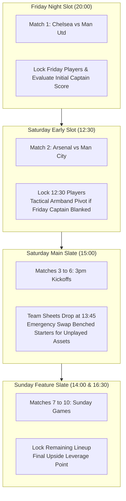

# Brainstorm: FPL Challenge Quantitative Optimization Engine
## Dynamic-Constraint Modeling, Single-Period Solvers & Rolling Deadline Execution

**Status**: PROPOSED / BRAINSTORM  
**Target URL**: `https://fplchallenge.premierleague.com/`  
**Target Subsystems**: `clients/fpl_challenge_client.py`, `analytics/challenge/`, `analytics/profile_contracts.py`, `analytics/optimizer.py`, `automation/cpn/`, `ui/tabs/tab_fpl_challenge.py`, `app.py`  
**Related Rules**:
- [`.agents/rules/moneyball_strategy.md`](../../.agents/rules/moneyball_strategy.md) (Unconstrained Solvers, Stochastic Distributions & Monte Carlo Simulation)
- [`.agents/rules/python_standards.md`](../../.agents/rules/python_standards.md) (Layered Architecture, Frozen Dataclasses, Vectorization, Strict Types)

---

## Executive Summary

While classic Fantasy Premier League is formulated as an infinite/38-gameweek discounted Markov Decision Process ($\gamma \approx 0.85$–$0.95$) with persistent squad equity, price volatility, and transfer penalties ($-4$ hits), **FPL Challenge** (`https://fplchallenge.premierleague.com/`) represents a fundamentally distinct mathematical discipline:

1. **Single-Period Dynamic Constraint Optimization**: Each Gameweek operates as a completely independent, zero-carryover tournament with no future transfer penalties or long-term budget commitments.
2. **Weekly Constraint Shifts (`events.overrides`)**: Game rules mutate weekly:
   * **Variable Squad Size**: Outfield 6-a-side ($N=6$, no goalkeepers) vs standard 11-a-side ($N=11$).
   * **Dynamic Club Quotas**: Strict 1-player-per-club limits ($C=1$) vs standard 3 or 5 ($C=3, 5$).
   * **Budget Elasticity**: Unlimited budget ($\mathcal{B} = £999.9\text{M}$) vs extreme caps ($\mathcal{B} = £80.0\text{M}$).
   * **Scoring Multipliers**: Dynamic rewards for events such as long-range goals, defensive contributions, positional clean sheets, and underdog upsets.
3. **Rolling Match-by-Match Deadlines**: Lineup locks occur at the kickoff of each individual match rather than a single gameweek-wide deadline 90 minutes before match 1. This enables real-time exploitation of confirmed starting lineups throughout the weekend.

This blueprint specifies the quantitative architecture, data client, mathematical solver, and Streamlit UI modules required to incorporate FPL Challenge into **Rubies Rangers**.

---

## 1. Reverse-Engineered FPL Challenge API Specification

The official FPL Challenge application runs on dedicated backend infrastructure separated from classic FPL, using a distinct domain host:

* **Base URL**: `https://fplchallenge.premierleague.com/api`
* **Network Inspection & Endpoint Topology**:

| Endpoint | Method | Payload / Response | Purpose |
| :--- | :---: | :--- | :--- |
| `/bootstrap-static/` | `GET` | JSON (`events`, `game_config`, `elements`, `teams`) | Weekly rules, scoring overrides, squad size, price caps, player base |
| `/fixtures/?event={gw}` | `GET` | JSON list of 10 fixtures | Match schedule, kickoff timestamps, live status, team codes |
| `/event/{gw}/live/` | `GET` | JSON (`elements`: stats, points) | Real-time live points under challenge-specific scoring |
| `/entry/{entry_id}/` | `GET` | JSON (`id`, `summary_overall_points`, `rank`) | Manager metadata, overall points, percentile rank |
| `/entry/{entry_id}/event/{gw}/picks/` | `GET` | JSON (`picks`: `element`, `position`, `multiplier`) | Active lineup, captain multiplier ($2\times$), bench orders |

### Live API Payload Analysis (Inspected from `bootstrap-static`):

```json
{
  "events": [
    {
      "id": 4,
      "name": "Gameweek 4",
      "deadline_time": "2026-09-14T19:00:00Z",
      "overrides": {
        "rules": {
          "squad_squadplay": 6,
          "squad_squadsize": 6,
          "squad_total_spend": 9999,
          "squad_team_limit": 3
        },
        "scoring": {
          "outside_box_goals": 2,
          "clean_sheets": {"MID": 2}
        },
        "element_types": [
          {"id": 2, "singular_name_short": "DEF", "squad_min_select": 1, "squad_max_select": 3},
          {"id": 3, "singular_name_short": "MID", "squad_min_select": 1, "squad_max_select": 3},
          {"id": 4, "singular_name_short": "FWD", "squad_min_select": 1, "squad_max_select": 3}
        ]
      }
    }
  ]
}
```

---

## 2. The Two-Stage "Screen & Simulate" Engine for FPL Challenge

In classic FPL, Rubies Rangers uses a Two-Stage solver to reconcile combinatorial feasibility with injury and substitution volatility. In **FPL Challenge**, the Two-Stage paradigm is **even more essential and mathematically decisive**:

```text
┌─────────────────────────────────────────────────────────────────────────────────────────────┐
│                          WHY A SINGLE-STAGE SOLVER FAILS IN FPL CHALLENGE                   │
├─────────────────────────────────────────────────────────────────────────────────────────────┤
│ 1. PURE MILP ALONE (THE "EXPECTED MEAN" TRAP):                                              │
│    • MILP maximizes the deterministic scalar average: Maximize E[Points].                   │
│    • In a 200,000-manager weekly sprint tournament, the team with the highest average (mean)│
│      almost NEVER wins first place! Tournaments are won in the extreme right tail (P95/P99).│
│    • MILP is completely blind to covariance, explosive variance, and differential leverage. │
├─────────────────────────────────────────────────────────────────────────────────────────────┤
│ 2. PURE MONTE CARLO ALONE (THE COMBINATORIAL BOTTLENECK):                                   │
│    • In FPL Challenge, rules mutate weekly (e.g. 6-a-side, max 1 per club, 1-3 DEF/MID/FWD). │
│    • Evaluating 650+ players across billions of valid combinations via Monte Carlo is       │
│      computationally intractable without mathematical screening.                            │
└─────────────────────────────────────────────────────────────────────────────────────────────┘
```

Therefore, FPL Challenge must deploy an adapted **Two-Stage "Screen & Simulate" Architecture**:
* **Stage 1 (MILP Multi-Objective Pareto Generator)**: Formulates the weekly physical constraints (squad size $N$, club limits $C$, budget $\mathcal{B}$, positional limits) and solves across 5 divergent tactical vectors to generate a candidate pool of distinct optimal plans in $<25\text{ms}$.
* **Stage 2 (Monte Carlo Tournament & Tail-Risk Engine)**: Runs 10,000 joint stochastic draws on each candidate to evaluate median ($P_{50}$), upside ceiling ($P_{90}$), tournament-winning potential ($P_{99}$), and rolling in-play substitution options.

---

### A. Stage 1: Parameterized Integer Linear Programming (MILP Screening)

Let $\mathcal{P}$ denote the candidate player universe.
* $x_i \in \{0, 1\}$: Binary selection variable for player $i \in \mathcal{P}$.
* $c_i \in \{0, 1\}$: Binary captaincy variable ($c_i \le x_i$, exactly one captain).

#### Dynamic Constraints (Parsed from `events.overrides`):
1. **Squad Size Equality**:
   $$\sum_{i \in \mathcal{P}} x_i = N_{\text{size}} \quad (N_{\text{size}} \in \{5, 6, 11\})$$
2. **Dynamic Positional Bounds**:
   For each position $k \in \{\text{GKP}, \text{DEF}, \text{MID}, \text{FWD}\}$:
   $$L_k \le \sum_{i \in \mathcal{P}_k} x_i \le U_k$$
   *(e.g. For 6-a-side: $\sum x_{\text{GKP}} = 0$, $1 \le \sum x_{\text{DEF}} \le 3$, $1 \le \sum x_{\text{MID}} \le 3$, $1 \le \sum x_{\text{FWD}} \le 3$)*.
3. **Dynamic Club Quota**:
   For each Premier League club $j \in \{1, \dots, 20\}$:
   $$\sum_{i \in \mathcal{P}_{\text{club}=j}} x_i \le C_{\text{limit}} \quad (C_{\text{limit}} \in \{1, 2, 3, 5\})$$
   *(When $C=1$, every selected player must come from a completely different club)*.
4. **Budget Feasibility**:
   $$\sum_{i \in \mathcal{P}} \text{Price}_i \cdot x_i \le \mathcal{B}_{\text{spend}} \quad (\mathcal{B} = 999.9\text{ for unlimited})$$
5. **Captaincy Selection**:
   $$\sum_{i \in \mathcal{P}} c_i = 1, \quad c_i \le x_i \quad \forall i \in \mathcal{P}$$

#### Stage 1 Pareto Candidate Objectives:
To avoid converging on a single dogmatic lineup, Stage 1 solves for 5 distinct candidate rosters:
* **Candidate 1: Baseline Expected Return ($\mathbf{x}_{\text{Base}}$)**:
  $$\max \sum_{i} \tilde{\mu}_i \cdot (x_i + c_i)$$
* **Candidate 2: Challenge Rule Exploit ($\mathbf{x}_{\text{Exploit}}$)**:
  Maximizes challenge-specific multipliers (e.g., outside-box xG, defensive contribution index, or clean sheet odds).
* **Candidate 3: GPP Differential Leverage ($\mathbf{x}_{\text{Diff}}$)**:
  $$\max \sum_{i} \left[ \tilde{\mu}_i \cdot (1 - \text{Ownership}_i)^{\alpha} \right] \cdot (x_i + c_i)$$
  Penalizes template chalk to create massive rank-climbing leverage in large-field tournaments.
* **Candidate 4: High-Implied Team Goal Stack ($\mathbf{x}_{\text{Stack}}$)**:
  When $C > 1$, concentrates capital on teams with bookmaker-implied totals $> 2.5$ goals.
* **Candidate 5: Maximum Variance / Boom-or-Bust ($\mathbf{x}_{\text{Boom}}$)**:
  $$\max \sum_{i} \left( \tilde{\mu}_i + 1.2 \cdot \sigma_i \right) \cdot (x_i + c_i)$$

---

### B. Stage 2: Stochastic Monte Carlo Tournament Simulation

Once the 5 candidate lineups are generated by MILP, Stage 2 conducts 10,000 Monte Carlo gameweek draws per plan:

```text
[ STAGE 1: MILP SCREENING ]
  ├── Plan 1: Max xP Mean ───────────┐
  ├── Plan 2: Challenge Exploit ─────┤
  ├── Plan 3: GPP Differential ──────┼───> [ STAGE 2: MONTE CARLO TOURNAMENT ]
  ├── Plan 4: Team Goal Stack ───────┤     • 10,000 Draws with Minutes Jitter
  └── Plan 5: Maximum Variance ──────┘     • Player Covariance Matrix Σ
                                           • Evaluates: P10, P50, P90, P99, P(Win)
```

#### Key Simulation Metrics:
1. **Right-Tail Ceiling ($P_{90}, P_{99}$)**:
   In FPL Challenge weekly tournaments, the plan with a median ($P_{50}$) of 42 but a $P_{99}$ of 88 is vastly superior to a plan with a median of 46 but a $P_{99}$ of 68!
2. **Rolling In-Play Flexibility Score**:
   Measures the temporal spread of kickoffs:
   $$\text{Flexibility} = \sum_{i \in \text{Lineup}} \mathbb{I}(\text{Kickoff}_i \ge \text{Saturday 17:30})$$
   Plans with late-slate assets have a valuable "real option" to adjust captaincy or replace benched starters in real-time.
3. **Adversarial Win Probability**:
   Simulates the competitor field distribution $\mathcal{F}_{\text{field}}$ to compute:
   $$P(\text{Plan}_k > \text{Field 99th Percentile})$$
   The plan that maximizes this win probability is selected as the recommended tournament portfolio.

---

## 3. Rolling Match-by-Match Execution & Timed Petri Net Integration

A key strategic advantage in FPL Challenge is that **lineups are not frozen at Gameweek kickoff**. Instead, players only lock when their specific fixture kicks off.



### Strategic Implications:
1. **Late-Busting / Lineup Insurance**: If a planned Saturday 15:00 starter is benched in official team sheets (announced at 13:45), the manager has 75 minutes to swap him out for an unplayed player from Saturday 15:00, Saturday 17:30, or Sunday.
2. **Captaincy Switching**: If the Friday captain fails to return (e.g. 2 points), the captain armband can be moved to a Saturday or Sunday asset who has not yet played.
3. **Kurt Jensen TCPN Adaptation**:
   The autonomous CPN pipeline (`automation/cpn/`) can be extended with a dynamic timer transition $T_{\text{RollingMatchLock}}$:
   $$\text{Guard}(t) = (t = \text{Kickoff}_f - \Delta t_{\text{leak}})$$
   Whenever official Premier League lineups drop at $D-75\text{m}$, the CPN checks starting XI status of unlocked players and fires substitutions automatically.

---

## 4. Software Architecture & Implementation Plan

```text
rubies_rangers/
├── clients/
│   ├── fpl_client.py                 # Classic FPL API Client (fantasy.premierleague.com)
│   └── fpl_challenge_client.py       # [NEW] FPL Challenge Dedicated Client (fplchallenge.premierleague.com)
├── analytics/
│   ├── profile_contracts.py          # Extended with ProfileType.CHALLENGE
│   └── challenge/
│       ├── __init__.py
│       ├── contracts.py              # ChallengeRuleSet, ChallengeGameweek, ChallengeLineup
│       ├── rule_extractor.py         # Parses overrides from bootstrap-static
│       ├── scoring_adapter.py        # Modulates baseline xP with event multipliers
│       └── challenge_optimizer.py    # Unconstrained ILP solver with dynamic bounds
├── tests/
│   ├── test_fpl_challenge_client.py  # Unit tests for challenge API client & cache
│   └── test_challenge_optimizer.py   # Test suite for 6-a-side, 1-per-club, and scoring weights
└── ui/
    └── tabs/
        └── tab_fpl_challenge.py      # [NEW] Dedicated Streamlit Challenge Studio Tab
```

### A. Data Contracts (`analytics/challenge/contracts.py`)
```python
from dataclasses import dataclass, field
from typing import Dict, List, Optional

@dataclass(frozen=True)
class ChallengeRuleSet:
    """Dynamic constraint rules for a specific Challenge Gameweek."""
    gameweek: int
    squad_size: int = 6                  # e.g., 6 or 11
    max_per_team: int = 1                # e.g., 1 (one player per club), 3, or 5
    budget_cap: float = 999.9            # e.g., 999.9 (unlimited) or 80.0
    allowed_positions: Dict[str, tuple[int, int]] = field(default_factory=dict)
    # e.g. {"DEF": (1, 3), "MID": (1, 3), "FWD": (1, 3)}
    scoring_modifiers: Dict[str, float] = field(default_factory=dict)
    # e.g. {"outside_box_goals": 2.0, "clean_sheets_mid": 2.0}
    rolling_deadlines: bool = True

@dataclass(frozen=True)
class ChallengeOptimalSquad:
    """Optimal solution for the specific Challenge Gameweek."""
    gameweek: int
    players: List[str]
    captain: str
    total_expected_points: float
    total_cost: float
    clubs_represented: int
```

### B. Challenge Client (`clients/fpl_challenge_client.py`)
Encapsulates all communication with `https://fplchallenge.premierleague.com/api`:
- In-memory and disk TTL cache (`.fpl_challenge_cache.json`).
- `get_challenge_bootstrap() -> dict`
- `get_challenge_event_rules(gameweek: int) -> ChallengeRuleSet`
- `get_challenge_live_points(gameweek: int) -> dict`
- `get_challenge_entry_picks(entry_id: int, gameweek: int) -> dict`

### C. Challenge Optimizer (`analytics/challenge/challenge_optimizer.py`)
Implements parameterized PuLP / scipy integer programming:
- Formulates variable squad size ($N \in \{5, 6, 11\}$).
- Enforces dynamic club constraints ($\le C$).
- Formulates dynamic positional limits without goalkeepers when $N=6$.
- Incorporates covariance matrix for ceiling vs. floor portfolio balance.

---

## 5. UI Integration: Streamlit Challenge Studio

The new studio will be exposed as a dedicated tab in `app.py`:
`🎯 FPL Challenge Studio & Dynamic Rule Optimizer`

### Visual Components:
1. **Gameweek Challenge Banner**:
   - Title of current week's challenge (e.g. *"Gameweek 4: 6-a-Side, Unlimited Budget, Max 3 Per Club"* or *"Gameweek 5: One Player Per Team Challenge"*).
   - High-contrast alert cards summarizing active constraints:
     - 🏟️ **Squad Size**: 6 Players (Outfield Only: 1-3 DEF, 1-3 MID, 1-3 FWD)
     - 💰 **Budget**: Unlimited (£999.9M)
     - 🚫 **Club Limit**: Max 1 Player Per Club
     - ⚡ **Scoring Boosts**: None / Active Multipliers
2. **Interactive 1-Click Solver**:
   - Slider for risk tolerance ($\lambda_{\text{risk}}$).
   - Checkbox to lock specific favorite players or exclude injured assets.
   - Button: `🚀 Solve Optimal Challenge Squad`.
3. **Pitch Visualizer & Formation Layout**:
   - Renders 6-a-side pitch graphic (e.g. 1-3-2, 2-2-2, 1-2-3).
   - Captaincy indicator badge ($2\times$) and expected points contribution.
4. **Rolling Fixture Countdown Matrix**:
   - Table showing the 10 Premier League matches grouped by day and kickoff time.
   - Real-time badges displaying lock status (*UNLOCKED / LOCKED*).
   - Live lineup alert status (e.g. *"Chelsea lineup confirmed (18:45)"*).

---

## 6. Verification & Validation Strategy

1. **Rule Invariant Testing**:
   - Verify that when $C=1$, the solver strictly rejects any squad containing two players from the same club.
   - Verify that when Goalkeepers are excluded ($N=6$), zero GKP assets are selected.
   - Verify that when budget is £80.0M, squad sum $\le 80.0$.
2. **Scoring Modifiers Accuracy**:
   - Backtest against historical Gameweeks where special bonuses were active (e.g., outside-the-box goals) to ensure point projections correctly weight long-range shooters (Eze, Szoboszlai, Foden).
3. **API Decoupling**:
   - Ensure classic FPL client (`clients/fpl_client.py`) and Challenge client (`clients/fpl_challenge_client.py`) remain strictly independent with zero shared mutable state.
4. **UI Performance**:
   - Streamlit load time under 500ms using `@st.cache_data`.

---

## 7. Phased Implementation Roadmap

| Phase | Milestone | Deliverables | Status |
| :---: | :--- | :--- | :---: |
| **Phase 1** | **Data Client & Rule Extractor** | `clients/fpl_challenge_client.py`, `analytics/challenge/rule_extractor.py`, API unit tests | Proposed |
| **Phase 2** | **Parameterized ILP Solver** | `analytics/challenge/challenge_optimizer.py`, dynamic bounds formulation, 6-a-side logic | Proposed |
| **Phase 3** | **Streamlit Challenge Studio** | `ui/tabs/tab_fpl_challenge.py`, pitch visualization, active rule banner | Proposed |
| **Phase 4** | **Rolling Deadline TCPN Pipeline** | Adapting Jensen CPN for match-by-match rolling lock automation | Proposed |

---

## Conclusion

Incorporating **FPL Challenge** allows Rubies Rangers to leverage its core mathematical strengths—integer linear programming, expected threat modeling, and stochastic Tail Risk metrics—on a weekly sprint game tailored for quantitative edge. Because FPL Challenge removes long-term compounding penalties and introduces novel weekly constraints, it represents the ideal testbed for unconstrained optimization.
