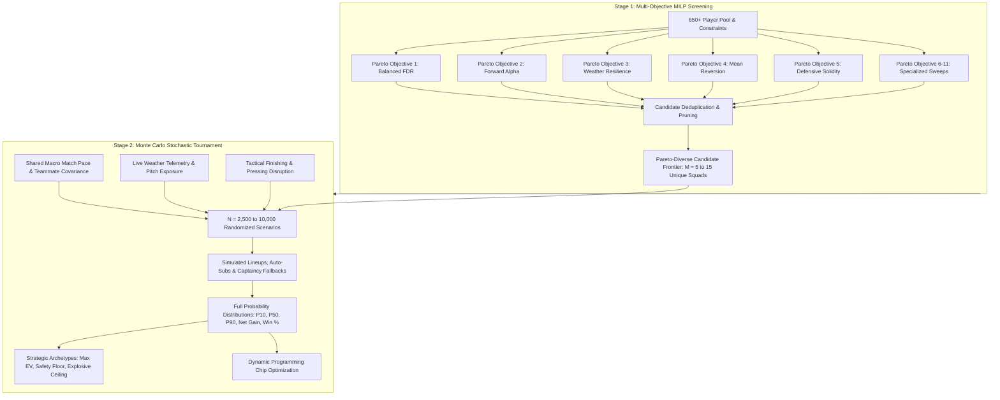

# Two-Stage Optimization Architecture: Measure Inclusion & Exclusion Specification

**Rubies Rangers — Advanced Quantitative Optimization Engine**  
*Document Status:* **IMPLEMENTED & CODIFIED**  
*Author:* Antigravity Quant Team  
*Date:* September 2026  

---

## 1. Executive Summary & Theoretical Foundations

In Fantasy Premier League (FPL) optimization, selecting the optimal 15-player squad (or making $K$ transfer substitutions) is a **combinatorial, stochastic, non-linear discrete optimization problem**. 

The legal search space for a 15-player squad chosen from a sanitized pool of $N \approx 500$ viable Premier League players under official budget (£100.0m), club quotas ($\le 3$ per club), and positional quotas (2 GKP, 5 DEF, 5 MID, 3 FWD) exceeds:
$$\binom{500}{15} \approx 2.4 \times 10^{26} \text{ unconstrained combinations}$$
Even after bounding by positional quotas and budget, the feasible set contains $\approx 10^{14}$ legal permutations.

### The Computational Dilemma: MILP vs. Monte Carlo

| Optimization Approach | Strengths | Fundamental Failure Mode in FPL |
|:---|:---|:---|
| **Pure Mixed-Integer Linear Programming (MILP)** | Solves the $10^{14}$ combinatorial space in $<0.05\text{ seconds}$ via Branch-and-Cut simplex algorithms. | **Blind to stochastic covariance and higher-order moments.** Requires a single linear additive scalar $\sum c_i x_i$. Completely ignores teammate clean sheet clustering, discrete Poisson goal probabilities, bench auto-substitutions, and downside tail risk ($P_{10}$). |
| **Pure Stochastic Monte Carlo Simulation** | Captures the true joint probability distribution $f(S)$, fat-tailed Poisson hauls, auto-substitutions, captaincy fallback, and tail percentiles ($P_{10}, P_{50}, P_{90}$). | **Computationally intractable across the full search space.** Simulating 10,000 parallel match outcomes takes $\approx 50\text{ ms}$ per squad. Simulating all $10^{14}$ squads would require $\approx 158,000\text{ years}$ of compute time. |

### The Two-Stage "Screen & Simulate" Solution

Rubies Rangers resolves this dilemma through a **Two-Stage Hierarchical Architecture**:



1. **Stage 1 (Combinatorial Screening via Multi-Objective MILP)**:
   Mixed-Integer Linear Programming scans the entire player pool, solving multiple distinct Pareto-efficient objective weight vectors (e.g. `balanced`, `forward_alpha`, `weather_resilience`, `mean_reversion`, `defensive_solidity`). This prunes the $10^{14}$ combinatorial space down to $M \approx 5\text{--}15$ mathematically diverse candidate squads in $<200\text{ ms}$.
2. **Stage 2 (Stochastic Tournament via Monte Carlo Simulation)**:
   The candidate squads enter a rigorous stochastic tournament. Each candidate squad is stress-tested across $N = 2,500\text{ to }10,000$ parallel match scenarios under joint teammate covariance, discrete Poisson goal arrivals, minutes volatility, weather dampening, and vectorized bench auto-substitutions.

---

## 2. Mathematical Formulations

### Stage 1: Multi-Objective MILP Problem Formulation

For an objective vector $k \in K$, Stage 1 solves:
$$\max_{\mathbf{x}} \quad \mathbf{c}^{(k)T} \mathbf{x}$$
Subject to:
$$\begin{aligned}
\sum_{i=1}^N \text{cost}_i \cdot x_i &\le B_{\text{squad}} + B_{\text{bank}} && \text{(Budget Constraint)} \\
\sum_{i \in \text{club}_j} x_i &\le 3 \quad \forall j \in \{1, \dots, 20\} && \text{(Club Quota Constraint)} \\
\sum_{i \in \text{pos}_p} x_i &= Q_p \quad \forall p \in \{\text{GKP: 2, DEF: 5, MID: 5, FWD: 3}\} && \text{(Position Quotas)} \\
\sum_{i \in \text{CurrentSquad}} x_i &\ge 15 - K_{\text{transfers}} && \text{(Transfer Count Bound)} \\
x_i &\in \{0, 1\} \quad \forall i \in \{1, \dots, N\} && \text{(Integrality Constraint)}
\end{aligned}$$

Where:
* $\mathbf{x} \in \{0, 1\}^N$ is the binary squad selection vector.
* $\mathbf{c}^{(k)}$ is the scalar objective coefficient vector for candidate sweep $k$.
* Unavailable players (`status in ['u', 'i', 's']` or `chance_of_playing == 0`) have $x_i = 0$ enforced.

### Stage 2: Stochastic Monte Carlo Simulation Formulation

For each candidate squad $\mathbf{x}^{(m)}$ and each simulation trial $t \in \{1, \dots, N\}$:
1. **Macro Match State Generation**:
   A shared latent fixture pace $\mu_{\text{pace}} \sim \mathcal{N}(1.0, \sigma_{\text{pace}})$ and team goals conceded arrival $G_{\text{conceded}} \sim \text{Poisson}(\lambda_{\text{conceded}} \cdot \mu_{\text{pace}} \cdot \Phi_{\text{weather}})$ are generated per club.
2. **Player Minutes & Availability Sampling**:
   $$A_{i, t} \sim \text{Bernoulli}(p_{\text{fit}, i}), \quad M_{i, t} = A_{i, t} \cdot \left[ S_{i, t} \cdot \mathcal{N}(\mu_{\text{mins}, i}, \sigma_{\text{mins}, i}) + (1 - S_{i, t}) \cdot \mathcal{U}(10, 30) \right]$$
3. **Attacking Event Generation (Poisson)**:
   $$\lambda_{G, i, t} = \left( \text{NPxG\_90}_i \times \frac{M_{i, t}}{90} \times \frac{\text{TeamXG}}{1.35} \times \mu_{\text{pace}} + \text{PenBonus} \right) \cdot \text{FormMult}_i \cdot \Phi_{\text{weather}} \cdot \left[1.0 + \kappa \cdot \Delta_{\text{finishing}, i}\right]$$
   $$G_{i, t} \sim \text{Poisson}(\lambda_{G, i, t})$$
4. **Defensive Clean Sheet Sampling (Coupled Arrival)**:
   $$G_{\text{on\_pitch}, i, t} \sim \text{Binomial}\left( G_{\text{conceded}, t}, \frac{M_{i, t}}{90} \right)$$
   $$CS_{i, t} = \mathbb{I}(M_{i, t} \ge 60 \land G_{\text{on\_pitch}, i, t} == 0)$$
5. **Vectorized Bench Auto-Substitution**:
   If starter $j$ plays $M_{j, t} = 0$, bench player $k$ is subbed in if legal formation boundaries ($\text{DEF} \ge 3, \text{MID} \ge 2, \text{FWD} \ge 1$) hold.
6. **Candidate Distribution Ranks**:
   $$\text{Mean Score} = \frac{1}{N}\sum_{t=1}^N S_t, \quad \text{Floor } P_{10} = \text{Quantile}_{0.10}(S), \quad \text{Ceiling } P_{90} = \text{Quantile}_{0.90}(S)$$

---

## 3. Master Measure Inclusion & Exclusion Matrix

The table below catalogs **every quantitative and tactical measure in the Rubies Rangers platform** across 7 architectural domains. For each measure, its mathematical role, inclusion status, and rigorous first-principles rationale are detailed.

| # | Measure Name | Formulation / Source | Included in Stage 1? | Stage 1 Mathematical Role & Justification | Included in Stage 2? | Stage 2 Mathematical Role & Justification |
|:---:|:---|:---|:---:|:---|:---:|:---|
| **1** | **Player Cost (`now_cost`)** | Official FPL price (£m) | **YES** | **Linear Knapsack Constraint:** $\sum \text{cost}_i x_i \le B$. Essential for defining budget boundary. | **YES** | **Post-Evaluation Bank Tracking:** Computes remaining bank balance and transfer differential. |
| **2** | **Position Quotas (`position_name`)** | Official FPL positions (GKP, DEF, MID, FWD) | **YES** | **Linear Equality Constraints:** 2 GKP, 5 DEF, 5 MID, 3 FWD squad composition. | **YES** | **Lineup Solver & Auto-Subs:** Enforces 8 legal starting XI formations ($\ge 3$ DEF, $\ge 2$ MID, $\ge 1$ FWD). |
| **3** | **Club Limits (`club_name`)** | Max 3 players per Premier League club | **YES** | **Linear Upper Bound:** $\sum_{i \in \text{club}_j} x_i \le 3$. Crucial pruning constraint. | **PARTIAL** | Preserved implicitly because Stage 2 only evaluates legal Stage 1 candidates. |
| **4** | **Availability Status (`status`, `cop`)** | FPL status flags ('a', 'd', 'i', 's', 'u') and % chance | **YES** | **Hard Binary Pruning:** $x_i = 0$ for 'u', 'i', 's' or $\text{cop} = 0$. Eliminates departed/injured players. | **YES** | **Probabilistic Sampling:** Bernoulli trial $A_i \sim \text{Bernoulli}(p_{\text{fit}})$ for yellow-flagged assets. |
| **5** | **Departure News Keywords** | FPL news regex ("loan", "transferred", "acl") | **YES** | **Pre-Filter Exclusion:** Strips departing players before MILP constraint matrix construction. | **YES** | Inherited from clean player pool. |
| **6** | **FDR Moneyball Score (`fdr_moneyball_score`)** | Base Moneyball score modulated by fixture difficulty | **YES** | **Primary Objective Vector (`balanced`):** Baseline EV screening across full season fixture schedules. | **NO (Replaced)** | **Excluded:** Replaced by discrete simulation of actual opponent match odds and Poisson arrivals. |
| **7** | **Forward Moneyball Score (`forward_moneyball_score`)** | FDR Moneyball score modulated by Z-scores of forward metrics | **YES** | **Primary Objective Vector (`forward_alpha`):** Screens for high-conviction attacking catalysts. | **NO (Replaced)** | **Excluded:** Forward metrics are propagated directly at the parameter level (finishing delta, disruption). |
| **8** | **Weather Moneyball Score (`weather_moneyball_score`)** | Base score scaled by $\Phi_{\text{weather}} \times \Omega_{\text{season}}$ | **YES** | **Primary Objective Vector (`weather_resilience`):** Screens squads insulated against coastal gale/fatigue. | **NO (Replaced)** | **Excluded:** Replaced by direct pitch-level dampening of Poisson $\lambda$ and starter minutes in simulation. |
| **9** | **Mean Reversion Score (`mean_reversion_score`)** | $1.25 \cdot \text{BCM} + 2.0 \cdot (xG - G)_+$ | **YES** | **Primary Objective Vector (`mean_reversion`):** Targets elite assets suffering bad luck due for positive reversion. | **YES** | **Arrival Rate Uplift:** Slightly elevates scoring rate for under-rewarded high-volume shot creators. |
| **10** | **Defensive Contribution (`def_contrib_90`)** | (Tackles + Int + Clear + Blocks + CS) / 90 | **YES** | **Primary Objective Vector (`defensive_solidity`):** Generates maximum-floor backlines and goalkeepers. | **YES** | **Defensive Floor Bonus:** Bernoulli probability of $+1$ defensive action bonus point for defenders. |
| **11** | **Expected Points (`xp` / `linear_xp`)** | Bookmaker odds-based linear expected points | **YES** | **Primary Objective Vector (`odds_implied_xp`):** Screens for maximum consensus betting market return. | **NO (Replaced)** | **Excluded:** Single-point linear xP is replaced by full Monte Carlo point distributions. |
| **12** | **Points Per Million (`ppm`)** | $\text{total\_points} / \text{cost}$ | **YES** | **Primary Objective Vector (`cost_efficiency`):** Generates budget-releasing squads with high capital efficiency. | **NO** | **Excluded:** PPM is a static cost ratio; Stage 2 evaluates absolute net utility and Sharpe ratio. |
| **13** | **Outside-Box xG (`outside_box_xg`)** | Shots from $X < 0.82$, outside-the-box shot volume | **YES** | **Primary Objective Vector (`low_block_threat`):** Screens long-range snipers for low blocks & FPL Challenge. | **YES** | Modulates open-play goal conversion and FPL Challenge bonus points. |
| **14** | **Expected Goal Involvements (`xgi_per_90`)** | FPL $xGI / 90$ | **YES** | **Primary Objective Vector (`high_attack`):** Pure attacking output knapsack sweep. | **YES** | Serves as fallback attacking rate when Understat data is absent. |
| **15** | **Set-Piece Moneyball Score (`setpiece_moneyball_score`)** | FDR score + penalty, FK, and corner bonuses | **YES** | **Primary Objective Vector (`setpiece_focus`):** Screens dead-ball duty holders. | **YES** | Direct penalty bonus ($+0.14\ xG$) and dead-ball assist bonus ($+0.07\ xA$) in match arrivals. |
| **16** | **Recent Form (`form`)** | Rolling 30-day exponentially-weighted points | **YES** | **Primary Objective Vector (`momentum`):** Screens hot-streak players. | **YES** | Form factor scales Poisson goal and assist arrival parameters by $[0.75, 1.30]$. |
| **17** | **Total Points (`total_points`)** | Cumulative historical points | **YES** | **Optional Sweep (`points`):** Historical performance sweep. | **NO** | **Excluded:** Sunk historical points have zero predictive alpha for future gameweeks. |
| **18** | **Non-Penalty xG per 90 (`NPxG_90`)** | Understat open-play goal threat per 90 | **PARTIAL** | Incorporated within `base_exp` formula in Stage 1. | **YES** | Primary baseline arrival parameter $\lambda_{G} = \text{NPxG\_90} \times (M / 90) \times (\text{TeamXG} / 1.35)$. |
| **19** | **Expected Assists per 90 (`xA_90`)** | Understat shot creation per 90 | **PARTIAL** | Incorporated within `base_exp` formula in Stage 1. | **YES** | Primary baseline assist parameter $\lambda_{A} = \text{xA\_90} \times (M / 90) \times (\text{TeamXG} / 1.35)$. |
| **20** | **Finishing Skill Delta ($G - xG$)** | Actual goals minus $xG$ ($\Delta_{\text{finishing}}$) | **PARTIAL** | Modulates `forward_moneyball_score` via Z-score in Stage 1. | **YES** | Modulates Poisson arrival rate $\lambda_G \leftarrow \lambda_G \cdot (1.0 + \kappa \cdot \Delta_{\text{finishing}})$. |
| **21** | **Box Touch Ratio (`box_touch_ratio`)** | Box shots / Total shots % | **PARTIAL** | Modulates `forward_moneyball_score` in Stage 1. | **PARTIAL** | Correlated with $NPxG$ and finishing conversion in simulation. |
| **22** | **Talisman Share ($\% xGI_{\text{Team}}$)** | Player $xGI$ / Club total $xGI$ % | **PARTIAL** | Primary driver of `forward_moneyball_score` in Stage 1. | **YES** | Scales player goal involvement in match state when team scores. |
| **23** | **Defensive Disruption (`def_disruption_90`)** | (Tackles + Recoveries) / 90 for FWD/MID | **PARTIAL** | Modulates `forward_moneyball_score` in Stage 1. | **YES** | Injects baseline bonus points into BPS formula, tipping 3 BPS to pressing attackers. |
| **24** | **Bookmaker Team xG / xGC** | Betting market implied match goal expectations | **PARTIAL** | Multiplies `base_exp` via FDR proxy in Stage 1. | **YES** | Directly governs team Poisson scoring and conceding arrival intensities. |
| **25** | **Clean Sheet Probability ($P(CS)$)** | $e^{-\lambda_{\text{conceded}}}$ from bookmaker odds | **PARTIAL** | Multiplies defensive scoring in Stage 1. | **YES** | Drives Bernoulli/Poisson clean sheet distribution for GKP and DEF. |
| **26** | **Pitch Wind Shear (`effective_wind`)** | Wind speed $\times$ stadium exposure factor | **PARTIAL** | Injected into `weather_moneyball_score` in Stage 1. | **YES** | Directly dampens attacking arrival intensities ($\lambda \cdot \Phi$) and preserves clean sheets. |
| **27** | **Precipitation (`precip_mm`)** | Rainfall intensity (mm/h) | **PARTIAL** | Injected into `weather_moneyball_score` in Stage 1. | **YES** | Turf slicking dampener reducing shot conversion in Stage 2. |
| **28** | **Sub-Zero Cold Penalty** | Freezing temperature soft-tissue penalty | **PARTIAL** | Injected into `weather_moneyball_score` in Stage 1. | **YES** | Triggers early substitution minutes decay in Stage 2. |
| **29** | **Turnaround Rest Days** | Calendar congestion rest days ($\le 48\text{h}, \le 72\text{h}$) | **PARTIAL** | Congestion multiplier $\Omega_{\text{season}}$ scales Stage 1 score. | **YES** | Decays start probability $p_{\text{start}}$ and expected minutes $M_i$ in simulation. |
| **30** | **Veteran Age Scaling** | Multiplies congestion decay by $1.5\text{x}$ if age $\ge 31$ | **PARTIAL** | Modulates $\Omega_{\text{season}}$ in Stage 1. | **YES** | Scales minutes variance and substitution probability in Stage 2. |
| **31** | **Venue Multiplier ($V_{\text{venue}}$)** | Home/Away scoring and concession splits | **YES** | Directly scales Stage 1 objective coefficients. | **YES** | Scales match $xG$ and clean sheet probability in Stage 2. |
| **32** | **Fixture Swing ($\Delta_{\text{swing}}$)** | Near-term vs later schedule transition delta | **PARTIAL** | Incorporated in `fdr_moneyball_score` schedule horizon. | **NO** | **Excluded:** Stage 2 simulates single-gameweek outcomes; multi-gameweek swings belong to Stage 1 & DP solver. |
| **33** | **Macro Match Pace Jitter** | Latent fixture pace $\mu_{\text{pace}} \sim \mathcal{N}(1, \sigma)$ | **NO** | **Excluded:** Cannot be represented linearly in MILP without violating deterministic independence. | **YES** | Covariance mechanism linking match pace across all 22 players on the pitch. |
| **34** | **Teammate Clean Sheet Coupling** | Simultaneous 0-conceded binary state | **NO** | **Excluded:** MILP cannot enforce non-linear stochastic covariance across multiple binary variables. | **YES** | Synchronizes clean sheet points across goalkeeper and all starting defenders. |
| **35** | **Discrete Poisson GC on Pitch** | $G_{\text{on\_pitch}} \sim \text{Binomial}(G_{\text{team}}, M/90)$ | **NO** | **Excluded:** Non-linear conditional arrival process incompatible with MILP linear objective. | **YES** | Exactly models goals conceded during the player's specific on-pitch minutes. |
| **36** | **Goalkeeper Save Expectations** | $1.3 \times \lambda_{\text{conceded}} \times (M/90)$ | **PARTIAL** | Approximated via `ppg` and `saves_weight` in Stage 1. | **YES** | Poisson arrival $\text{Saves} \sim \text{Poisson}(\lambda_{\text{saves}})$, awarded $+1\text{ pt}$ per 3 saves. |
| **37** | **Disciplinary Cards (Yellow/Red)** | Historical card accumulation rates | **NO** | **Excluded:** Minor negative delta ($\approx -0.15\text{ pts}$) that needlessly distorts linear knapsack. | **YES** | Bernoulli trials modeling $-1\text{ pt}$ yellow and $-3\text{ pt}$ red cards with clean sheet forfeiture. |
| **38** | **Bench Auto-Substitutions** | Tactical replacement if starter plays 0 mins | **NO** | **Excluded:** Incomputable in Stage 1 without quadratic combinatorial formulation of bench order. | **YES** | Full 3-slot outfield bench scan obeying 8 legal formation constraints. |
| **39** | **Captaincy Doubling ($2\text{x}$)** | Selecting highest-return starter with fallback | **NO** | **Excluded:** MILP would require additional binary decision variables and non-linear multiplication. | **YES** | Dynamically doubles captain's points and triggers automatic vice-captain fallback if captain is scratched. |
| **40** | **Shane's Domain Intel Desk** | Ephemeral qualitative human overrides & TTL decay | **YES** | **Pre-MILP Exclusions & Multipliers:** Sets $x_i = 0$ for sanctions/injuries and scales score coefficients. | **YES** | **Pre-Simulation Modulations:** Modulates starting minutes, cameo bounds, and eye-test multipliers. |
| **41** | **Transfer Hit Deductions ($-4$)** | Penalty for transfers beyond free transfer limit | **NO** | **Excluded:** Stage 1 optimizes for fixed $K$ transfers; hit cost is identical across all candidates. | **YES** | Deducts $\max(0, K - \text{FT}) \times 4$ from simulated distributions to compute net gain. |
| **42** | **Dynamic Programming Chip Values** | Bellman backward induction value $V_t(s)$ | **NO** | **Excluded:** Solved at orchestration level after Stage 1 and Stage 2 complete. | **YES** | Compares candidate squad EV against chip deployment thresholds across 38 rolling gameweeks. |

---

## 4. Deep-Dive Rationale: Why Certain Measures Are Excluded from Stage 1

### A. Non-Linear Stochastic Covariance (Teammate Clean Sheet Coupling & Opponent Match Jitter)
* **Why Excluded from Stage 1:** MILP requires the objective function to be strictly linear:
  $$f(\mathbf{x}) = \sum_{i=1}^N c_i x_i$$
  Modeling teammate clean sheet coupling requires product terms $x_i x_j$ (Quadratic Programming / MIQP) or full joint covariance matrices $\mathbf{x}^T \mathbf{\Sigma} \mathbf{x}$. In a 650-player pool, MIQP solvers are orders of magnitude slower and often fail to converge to global optimality under budget knapsack constraints.
* **How Stage 2 Solves It:** Stage 2 natively simulates the discrete Poisson goal concession arrival vector $G_{\text{conceded}}$, so when Arsenal concedes a 92nd-minute goal, Saliba, Gabriel, and Raya simultaneously lose their clean sheets across that trial.

### B. Bench Auto-Substitution Mechanics & Captaincy Doubling
* **Why Excluded from Stage 1:** To evaluate the expected points of a bench in Stage 1, the solver would need to evaluate the conditional probability that Starter $A$ misses the match, Starter $B$ plays, Bench 1 enters if formation legal, else Bench 2 enters. This creates a recursive branching tree that cannot be represented without exponential binary indicator variables.
* **How Stage 2 Solves It:** Stage 2 simulates each player's discrete minutes first ($M_{i, t}$), then evaluates the 15-man roster top-to-bottom in vector space, resolving auto-subs and captaincy fallbacks instantly.

### C. Transfer Hit Penalties ($-4$ Points)
* **Why Excluded from Stage 1:** When Stage 1 runs an optimization for $K=1$ or $K=2$ transfers, the hit penalty is a **constant scalar offset** (e.g. $-4\text{ pts}$ for transfer 2 when $\text{FT}=1$). Since subtracting a constant does not change the argmax ranking ($\arg\max f(x) - C = \arg\max f(x)$), subtracting the hit in Stage 1 is mathematically redundant.
* **How Stage 2 Solves It:** Stage 2 deducts the hit penalty from the total simulated points distribution to compute the true **Net Mean Gain** and **Win Probability vs Current Squad** ($P(\Delta \text{Net} > 0)$).

---

## 5. Deep-Dive Rationale: Why Certain Measures Are Excluded from Stage 2

### A. Linear Expected Points ($xP$) and Heuristic Moneyball Scores
* **Why Excluded from Stage 2:** Single-point metrics (e.g. $xP = 5.2$) collapse the entire probability density function into a single expected value. In Stage 2, feeding a static $xP$ into Monte Carlo would defeat the entire purpose of stochastic modeling.
* **What Stage 2 Uses Instead:** Stage 2 draws from first-principles distributions:
  $$M \sim \text{Starts/Cameo Gauss-Uniform}, \quad G \sim \text{Poisson}(\lambda_G), \quad A \sim \text{Poisson}(\lambda_A), \quad CS \sim \text{Coupled Bernoulli}$$

### B. Fixture Swing Deltas ($\Delta_{\text{swing}}$) and Multi-Week Horizon Schedules
* **Why Excluded from Stage 2:** Stage 2 simulates the **upcoming matchday**. Long-term schedule transitions (e.g. Gameweek 5 to 9 swings) do not affect whether Alexander Isak scores in Gameweek 4.
* **Where It Belongs:** Multi-gameweek fixture swings belong in Stage 1 (to ensure candidates have runway) and in the **Dynamic Programming Chip Strategy** (to identify double gameweeks and fixture pile-ups).

---

## 6. Configurable Pareto Objectives Architecture

To prevent hardcoded tactical assumptions, the platform codifies all Pareto objective dimensions into [`config.yaml`](config.yaml):

```yaml
two_stage_optimizer:
  default_sims: 2500
  risk_profile: "balanced"
  pareto_objectives:
    - label: "balanced"
      metric: "fdr_moneyball"
      enabled: true
      tier: "core"
      description: "Fixture Difficulty Rating & venue-adjusted base Moneyball efficiency"
    - label: "forward_alpha"
      metric: "forward_moneyball"
      enabled: true
      tier: "core"
      description: "High-alpha tactical metrics: Talisman Share, Finishing Skill & Pressing Disruption"
    - label: "weather_resilience"
      metric: "weather_moneyball"
      enabled: true
      tier: "core"
      description: "Pitch-level wind shear, precipitation dampening & turnaround rest fatigue"
    - label: "mean_reversion"
      metric: "mean_reversion_score"
      enabled: true
      tier: "core"
      description: "Big Chances Missed (BCM) and (xG - G)+ buy-low mean-reversion breakout"
    - label: "high_attack"
      metric: "xgi"
      enabled: true
      tier: "core"
      description: "Pure underlying expected goal involvements per 90 (shot creation + threat)"
    - label: "defensive_solidity"
      metric: "defensive_contribution_per_90"
      enabled: false
      tier: "contextual"
      description: "High floor defensive actions (tackles, recoveries, clearances) & clean sheet security"
    - label: "odds_implied_xp"
      metric: "xp"
      enabled: false
      tier: "contextual"
      description: "Consensus liquid betting market implied clean sheet and anytime goal probabilities"
    - label: "cost_efficiency"
      metric: "ppm"
      enabled: false
      tier: "contextual"
      description: "Points Per Million (PPM) & budget surplus generation for future flexibility"
    - label: "low_block_threat"
      metric: "outside_box_xg"
      enabled: false
      tier: "contextual"
      description: "Perimeter snipers breaking compact low blocks & FPL Challenge outside-box bonus"
    - label: "setpiece_focus"
      metric: "setpiece_moneyball"
      enabled: false
      tier: "contextual"
      description: "Penalties, direct free kicks & corner duties for high dead-ball floor"
    - label: "momentum"
      metric: "form"
      enabled: false
      tier: "contextual"
      description: "Short-term 30-day streak tracking"
```

### Persistence & Runtime Ingestion
* The active configuration is accessed through `config_manager.get_pareto_objectives()`.
* The Streamlit UI in `tab_two_stage.py` provides interactive checkboxes and a **"💾 Save Configuration"** button, persisting any toggled objectives to `config.yaml` with automatic cache invalidation.
* `MILPCandidateGenerator` pulls enabled objectives dynamically, adapting Stage 1 sweeps without requiring code edits or tuner re-training.

---

## 7. Verification & Empirical Sanity Checks

The Two-Stage Optimization pipeline is validated via automated unit and regression tests in [`tests/test_two_stage_optimizer.py`](tests/test_two_stage_optimizer.py):
1. **Pareto Coverage:** Verifies that all enabled objectives generate valid, legal 15-man candidate squads.
2. **Deduplication Invariant:** Guarantees that identical squad compositions across different objective sweeps are merged into a single candidate with multi-objective attribution.
3. **Simulation Convergence:** Verifies that $N \ge 2,500$ Monte Carlo draws produce smooth probability distributions and valid $P_{10} \le P_{50} \le P_{90}$ percentiles.
4. **Archetype Ranks:** Validates that `winner_balanced` maximizes $\mathbb{E}[S]$, `winner_safe_floor` maximizes $P_{10}$, and `winner_explosive_ceiling` maximizes $P_{90}$.
