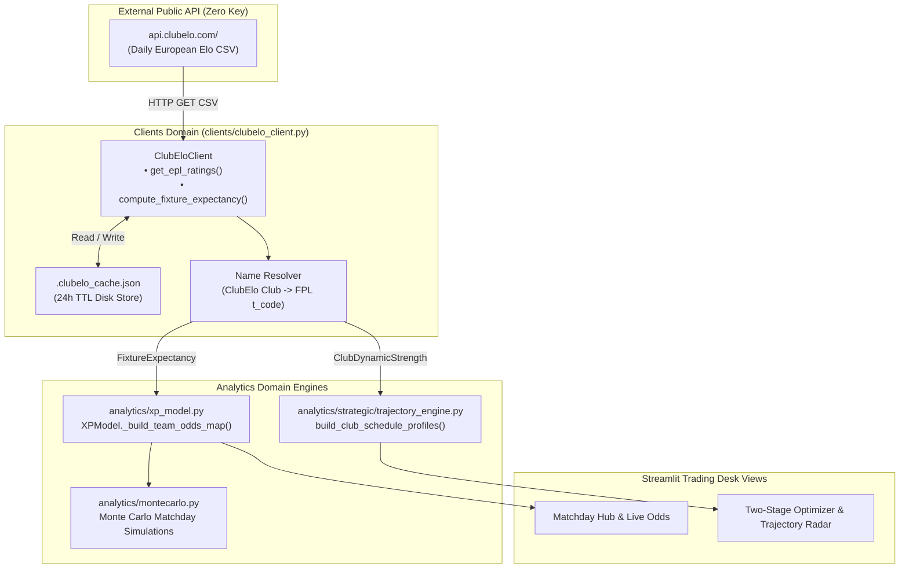

# Design [#019]: ClubElo API Dynamic Team Ratings & Bivariate Poisson Goals Engine

## 0. Frontloader (CPN Lifecycle Context)
> **Metadata for Downstream Skills & Audits**
> - **Origin Place**: `P_ISSUE_READY`
> - **Current Transition**: `T_DESIGN`
> - **Next Place**: `P_DESIGN_READY`
> - **CPN Lineage**: Issue [#019] -> Design [des_019] -> Tasks [tsk_019] -> Playbook [plb_019]
> - **Execution Track**: Track B (Fast-Track 4-Stage)
> - **Origin Issue**: [`docs/issues/iss_019_clubelo_dynamic_team_ratings.md`](file:///c:/Users/cw171001/OneDrive%20-%20Teradata/Documents/GitHub/rubies_rangers/docs/issues/iss_019_clubelo_dynamic_team_ratings.md)
> - **Downstream Consumers**: `tsk_019`, `plb_019`, `analytics/xp_model.py`, `analytics/strategic/trajectory_engine.py`
> - **URN**: `urn:air:clydewatts1:rubies_rangers:docs:des_019_clubelo_dynamic_team_ratings`

---

## 1. Purpose & Scope

### 1.1 Purpose
Currently, Rubies Rangers computes match outcome probabilities and clean sheet likelihoods from two brittle sources:
1. **Gameweek 4**: Statically hardcoded in `config.yaml` (`gw4_match_odds`), requiring manual editing every gameweek.
2. **Future Gameweeks (GW5–38)**: Falls back to official FPL API team strength attributes (`1000–1400` scale), which are slow-moving, subjective, and insensitive to recent tactical evolutions or home/away disparity.

This design introduces an automated, objective, and zero-cost rating engine powered by the **ClubElo API** (`http://api.clubelo.com/`). ClubElo provides daily-updated Elo ratings for all European football clubs based strictly on match outcomes, goal margins, and opponent quality. By mapping Elo rating differentials directly to calibrated bivariate Poisson goal arrival rates, Rubies Rangers eliminates hardcoded odds and powers all 38 gameweeks with continuous, mathematically sound team strength metrics.

### 1.2 In Scope
- **`clients/clubelo_client.py`**: A robust client fetching and parsing ClubElo daily English Premier League ratings with local 24-hour JSON disk caching.
- **Name Resolution Engine**: Unaccented, alias-resilient mapping from ClubElo club names (e.g., `Man City`, `Spurs`, `Nott'm Forest`) to standard FPL 3-letter club codes (`MCI`, `TOT`, `NFO`).
- **Mathematical Poisson Formulations**: Calibrated log-linear mapping from $\Delta \text{Elo}$ to home and away expected goals $(\lambda_{\text{home}}, \lambda_{\text{away}})$, Clean Sheet probability $P(\text{CS})$, and fair decimal odds.
- **Integration with `analytics/xp_model.py`**: Dynamic replacement for `GW4_MATCH_ODDS` across all gameweeks.
- **Integration with `analytics/strategic/trajectory_engine.py`**: Dynamic attack and defense ratings replacing static FPL FDR.
- **Defensive Fallback Guards**: Offline fallback to FPL API attributes if network or parsing fails.

### 1.3 Out of Scope
- Direct bookmaker betting order placement (execution remains on official FPL).
- Non-English league simulation (only English Premier League clubs are indexed).
- Intra-match in-play live odds (ClubElo updates daily post-match, which is optimal for pre-deadline planning).

---

## 2. Mathematical & Quantitative Formalism

### 2.1 The Elo Rating System in Association Football
ClubElo evaluates team strength using an Elo rating system calibrated over 70+ years of European football results:
$$R_{\text{new}} = R_{\text{old}} + K \cdot (W - W_e)$$
where $W$ is the actual match result ($1$ for win, $0.5$ for draw, $0$ for loss), and $W_e$ is the expected outcome:
$$W_e = \frac{1}{10^{-\Delta R / 400} + 1}$$

### 2.2 Effective Rating Difference with Home Ground Advantage
In the English Premier League, home advantage imparts an empirical boost of approximately $+65$ to $+80$ Elo points. Let $H_a = 75.0$ represent the home advantage parameter. For a fixture between Home Team $H$ and Away Team $A$:
$$\Delta \text{Elo}_H = \text{Elo}_H + H_a - \text{Elo}_A$$
$$\Delta \text{Elo}_A = -\Delta \text{Elo}_H = \text{Elo}_A - (\text{Elo}_H + H_a)$$

### 2.3 Log-Linear Bivariate Poisson Goal Expectancy
Football goals follow Poisson arrival processes. Let $\mu_0 = 1.36$ represent the baseline expected goals per team per match in the Premier League (league total $\sim 2.72$ goals/game).

We model expected goals scored by team $i$ against team $j$ as:
$$\lambda_H = \mu_0 \cdot \exp\left(\beta \cdot \Delta \text{Elo}_H\right)$$
$$\lambda_A = \mu_0 \cdot \exp\left(-\beta \cdot \Delta \text{Elo}_H\right) = \mu_0 \cdot \exp\left(\beta \cdot \Delta \text{Elo}_A\right)$$

#### Parameter Calibration:
Across historical Premier League fixtures, a $100$-point Elo difference corresponds to an offensive output multiplier of approximately $1.26\times$:
$$\beta = \frac{\ln(1.26)}{100} \approx 0.00231$$

To prevent extreme runaway values in blowout projections (e.g., Man City vs newly promoted club with $\Delta \text{Elo} > 450$), we apply safety clipping bounds:
$$\lambda_H \in [\lambda_{\min}, \lambda_{\max}] = [0.40, 3.85]$$
$$\lambda_A \in [\lambda_{\min}, \lambda_{\max}] = [0.35, 3.50]$$

### 2.4 Clean Sheet Probability & Decimal Odds
Assuming Poisson arrival of opponent goals $G_j \sim \text{Poisson}(\lambda_j)$, the probability of keeping a clean sheet ($G_j = 0$) is:
$$P(\text{CS}_H) = P(G_A = 0) = \exp(-\lambda_A)$$
$$P(\text{CS}_A) = P(G_H = 0) = \exp(-\lambda_H)$$

The fair decimal clean sheet odds (vig-free) are:
$$\text{Odds}_{\text{CS}} = \frac{1.0}{\max(0.01, P(\text{CS}))}$$

---

## 3. Component Architecture & Topology



---

## 4. Data Contracts & Interfaces

### 4.1 Dataclass Contracts (`clients/clubelo_client.py`)

```python
from __future__ import annotations
from dataclasses import dataclass
from typing import Dict, Optional, List, Tuple
import datetime

@dataclass(frozen=True)
class ClubEloRecord:
    """Raw snapshot of a club's rating from ClubElo."""
    club_name: str
    fpl_code: str          # 3-letter code, e.g. "MCI", "ARS"
    country: str
    level: int             # 1 for Premier League
    elo: float
    rank: int
    as_of_date: str        # ISO-8601 YYYY-MM-DD

@dataclass(frozen=True)
class FixtureExpectancy:
    """Calibrated Poisson goal and clean sheet expectancy for a specific fixture."""
    home_team: str         # 3-letter code
    away_team: str         # 3-letter code
    home_elo: float
    away_elo: float
    delta_elo_home: float  # home_elo + H_a - away_elo
    exp_goals_home: float  # lambda_home
    exp_goals_away: float  # lambda_away
    clean_sheet_prob_home: float  # exp(-lambda_away)
    clean_sheet_prob_away: float  # exp(-lambda_home)
    clean_sheet_odds_home: float  # 1 / P(CS_H)
    clean_sheet_odds_away: float  # 1 / P(CS_A)
    fixture_str_home: str  # e.g. "NFO (H)"
    fixture_str_away: str  # e.g. "AVL (A)"
```

### 4.2 ClubEloClient Interface Specification

```python
class ClubEloClient:
    """
    Robust HTTP client and Poisson calculation engine for ClubElo data.
    Implements local disk caching and graceful offline degradation.
    """
    DEFAULT_HOME_ADVANTAGE: float = 75.0
    DEFAULT_BASE_GOALS: float = 1.36
    DEFAULT_BETA: float = 0.00231
    CACHE_TTL_HOURS: int = 24

    def __init__(
        self,
        cache_file: Optional[str] = None,
        cache_ttl_hours: int = CACHE_TTL_HOURS,
        home_advantage: float = DEFAULT_HOME_ADVANTAGE,
        base_goals: float = DEFAULT_BASE_GOALS,
        beta: float = DEFAULT_BETA
    ) -> None:
        ...

    def get_epl_ratings(self, date_str: Optional[str] = None, force_refresh: bool = False) -> Dict[str, ClubEloRecord]:
        """
        Fetches current Premier League Elo ratings mapped by 3-letter FPL club code.
        Reads from local cache if fresh; otherwise queries api.clubelo.com.
        """
        ...

    def compute_fixture_expectancy(
        self,
        home_team: str,
        away_team: str,
        ratings: Optional[Dict[str, ClubEloRecord]] = None
    ) -> FixtureExpectancy:
        """
        Computes calibrated Poisson lambda goals and clean sheet probabilities
        given two FPL 3-letter team codes.
        """
        ...

    def build_team_odds_map(
        self,
        fixtures: List[Dict[str, Any]],
        ratings: Optional[Dict[str, ClubEloRecord]] = None
    ) -> Dict[str, Dict[str, Any]]:
        """
        Constructs the standard team_odds dictionary consumed by XPModel and MatchdayHub:
        team_odds[club_code] = {
            'team': club_code,
            'opponent': opp_code,
            'is_home': bool,
            'exp_goals_scored': float,
            'exp_goals_conceded': float,
            'clean_sheet_prob': float,
            'clean_sheet_odds': float,
            'fixture_str': str
        }
        """
        ...
```

### 4.3 FPL Club Alias Resolution Mapping
```python
CLUBELO_TO_FPL: Dict[str, str] = {
    "Man City": "MCI",
    "Liverpool": "LIV",
    "Arsenal": "ARS",
    "Aston Villa": "AVL",
    "Chelsea": "CHE",
    "Newcastle": "NEW",
    "Tottenham": "TOT",
    "Spurs": "TOT",
    "Brighton": "BHA",
    "Bournemouth": "BOU",
    "Fulham": "FUL",
    "Brentford": "BRE",
    "Crystal Palace": "CRY",
    "West Ham": "WHU",
    "Man United": "MUN",
    "Everton": "EVE",
    "Wolves": "WOL",
    "Nott'm Forest": "NFO",
    "Nottingham": "NFO",
    "Leicester": "LEI",
    "Ipswich": "IPS",
    "Southampton": "SOU",
    "Leeds": "LEE",
    "Burnley": "BUR",
    "Sheffield United": "SHU",
    "Luton": "LUT",
    "Coventry": "COV",
    "Hull": "HUL",
    "Sunderland": "SUN",
}
```

---

## 5. Integration Points in Existing Engines

### 5.1 `analytics/xp_model.py`
In `XPModel._build_team_odds_map()`:
1. Initialize `ClubEloClient`.
2. Fetch current gameweek fixtures from `FPLClient`.
3. If ClubElo data is available, populate `self.team_odds` using `build_team_odds_map(fixtures)`.
4. If ClubElo network call fails and cache is empty, fall back seamlessly to existing static/heuristic routine without crashing.

### 5.2 `analytics/strategic/trajectory_engine.py`
In `build_club_schedule_profiles()`:
1. Obtain all 20 club Elo ratings $R_c$.
2. Compute normalized offensive capability $\alpha_c = R_c / \bar{R}_{\text{league}}$ and defensive concession $\delta_c = \bar{R}_{\text{league}} / R_c$.
3. Replace the static FPL API `strength_attack_*` and `strength_defence_*` heuristics with continuous Elo ratings for all $H$ gameweeks in the planning horizon.

---

## 6. Failure & Adversarial Modes

| Failure Mode | Root Cause | Systemic Consequence | Detection & Mitigation Strategy |
| :--- | :--- | :--- | :--- |
| **ClubElo API 500 / Network Down** | Public server outage or DNS failure | Model cannot fetch latest ratings | **24h Cache + Graceful Fallback**: If network fails, serve stale disk cache. If no cache exists, fall back to FPL API `strength_*` baseline with structured warning log. |
| **Club Name Mismatch (Promoted Club)** | ClubElo uses different spelling (e.g. `Forest` vs `Nott'm Forest`) | Key lookup error returns `None` | **Normalized Fuzzy Aliases**: Strips punctuation, accents, and lowercases string before checking `CLUBELO_TO_FPL`. Unmapped clubs default to median league rating ($1600.0$). |
| **Extreme Blowout Overestimation** | Top club ($1980$ Elo) vs bottom club ($1500$ Elo) produces $\lambda > 5.0$ | Distorts captaincy solver toward runaway Poisson values | **Safety Clamping**: Enforces physical boundaries $\lambda \in [0.40, 3.85]$ and $P(\text{CS}) \in [0.03, 0.68]$. |
| **Cache Stampede / Concurrency** | Multiple solvers or Streamlit sessions query client simultaneously | Redundant file reads/writes | **Atomic Write & Single Read**: Reads file once into memory cache; updates `.clubelo_cache.json` using atomic temporary file rename. |

---

## 7. Verification & Testing Strategy

1. **Unit Testing (`tests/test_clubelo_client.py`)**:
   - Test CSV parser against mocked ClubElo response.
   - Verify all 20 active Premier League clubs resolve to valid 3-letter FPL codes.
   - Verify mathematical symmetry: $\lambda_H(\Delta \text{Elo}) \cdot \lambda_A(\Delta \text{Elo}) \approx \mu_0^2$.
   - Verify Clean Sheet probabilities adhere to $P(\text{CS}) = \exp(-\lambda_{\text{opp}})$.
   - Verify disk cache expiration and offline fallback behavior.

2. **Integration Testing (`tests/test_xp_model_clubelo.py`)**:
   - Verify `XPModel` builds dynamic `team_odds` for Gameweek 4, Gameweek 5, etc., without relying on hardcoded `GW4_MATCH_ODDS`.
   - Verify `TrajectoryEngine` multi-horizon expectation matrix produces coherent trajectories across an 8-gameweek horizon.

3. **Performance & Standards Compliance**:
   - Zero `.iterrows()` or manual loops over player datasets.
   - Compliant with PEP 8 and `.agents/rules/python_standards.md`.
