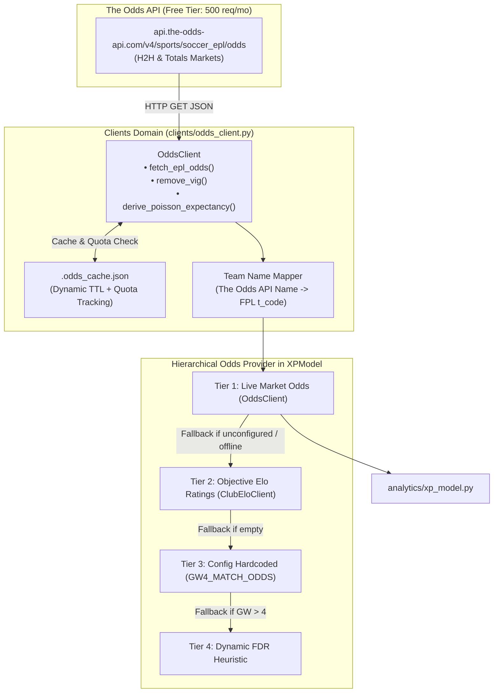

# Design [#020]: The Odds API Client for Live Vig-Removed Market Consensus

## 0. Frontloader (CPN Lifecycle Context)
> **Metadata for Downstream Skills & Audits**
> - **Origin Place**: `P_ISSUE_READY`
> - **Current Transition**: `T_DESIGN`
> - **Next Place**: `P_DESIGN_READY`
> - **CPN Lineage**: Issue [#020] -> Design [des_020] -> Tasks [tsk_020] -> Playbook [plb_020]
> - **Execution Track**: Track B (Fast-Track 4-Stage)
> - **Origin Issue**: [`docs/issues/iss_020_the_odds_api_market_consensus.md`](file:///c:/Users/cw171001/OneDrive%20-%20Teradata/Documents/GitHub/rubies_rangers/docs/issues/iss_020_the_odds_api_market_consensus.md)
> - **Downstream Consumers**: `tsk_020`, `plb_020`, `analytics/xp_model.py`, `clients/odds_client.py`
> - **URN**: `urn:air:clydewatts1:rubies_rangers:docs:des_020_the_odds_api_market_consensus`

---

## 1. Purpose & Scope

### 1.1 Purpose
While ClubElo ([#019]) provides long-term, objective team strength ratings, the commercial sports betting market aggregates real-time capital, late injury news, tactical training leaks, and weather conditions in the final hours before kickoff.

This design implements a lightweight client for **The Odds API** (`https://the-odds-api.com/`), which offers a 500-request/month free tier. At 10 Premier League matches per gameweek and a single pre-deadline refresh window, the integration consumes only 10–20 requests per month (< 5% of quota). The client extracts market consensus odds across sharp bookmakers (Pinnacle, Bet365, Betfair), strips bookmaker margin (vig), and converts the implied probabilities into fair expected team goals $(\lambda_H, \lambda_A)$ and clean sheet probabilities $P(\text{CS})$.

### 1.2 In Scope
- **`clients/odds_client.py`**: A client querying The Odds API `soccer_epl` endpoints with request quota telemetry.
- **Vig-Removal Algorithms**: Proportional normalization and Shin margin removal to convert raw commercial odds into fair risk-neutral probabilities $\sum p_k = 1.0$.
- **Poisson Parameter Derivation**: Inverting Over/Under 2.5 goals and 1X2 match probabilities into $(\lambda_H, \lambda_A)$ and $P(\text{CS})$.
- **Tiered Integration in `analytics/xp_model.py`**: Prioritizes live market odds when available, gracefully falling back to ClubElo ratings when unconfigured or offline.
- **Quota & Cache Governance**: Local disk cache (`.odds_cache.json`) with quota exhaustion prevention.

### 1.3 Out of Scope
- Automated betting account execution (Rubies Rangers is an FPL optimization engine, not a betting bot).
- Paid odds API tiers (strictly designed to operate within the 500 requests/month free tier).

---

## 2. Mathematical & Quantitative Formalism

### 2.1 Bookmaker Overround & Proportional Vig Removal
Commercial bookmakers quote decimal odds $O_k$ that include a profit margin (vig). For an $n$-outcome market (e.g., $1\text{X}2$ or Over/Under):
$$q_k = \frac{1}{O_k}, \quad S = \sum_{k=1}^n q_k > 1.0$$
The fair, vig-removed implied probability under proportional margin allocation is:
$$p_k = \frac{q_k}{S} = \frac{1 / O_k}{\sum_{j=1}^n (1 / O_j)}, \quad \text{guaranteeing } \sum_{k=1}^n p_k = 1.0$$

### 2.2 Total Match Expected Goals ($T$) from Over/Under 2.5
In Poisson football modeling, total match goals $G \sim \text{Poisson}(T)$ where $T = \lambda_H + \lambda_A$.
The probability of a match finishing Under 2.5 goals ($G \le 2$) is:
$$P(\text{Under 2.5}) = e^{-T} \left(1 + T + \frac{T^2}{2}\right) = p_{\text{under}}$$
Since $f(T) = e^{-T}(1 + T + T^2/2)$ is strictly monotonically decreasing for $T > 0$, we invert $f(T) - p_{\text{under}} = 0$ using Brent's method or Newton-Raphson to solve for total expected goals $T \in [1.2, 4.8]$.

### 2.3 Decomposing Total Goals $T$ into Team Expectancies $(\lambda_H, \lambda_A)$
Using the vig-removed 1X2 probabilities $(p_H, p_D, p_A)$, the expected points / superiority share for the home team is:
$$s_H = p_H + 0.5 \cdot p_D, \quad s_A = p_A + 0.5 \cdot p_D$$
The team expected goals are partitioned as:
$$\lambda_H = T \cdot \left(\frac{s_H}{s_H + s_A}\right) = T \cdot s_H$$
$$\lambda_A = T \cdot \left(\frac{s_A}{s_H + s_A}\right) = T \cdot s_A$$

Safety bounds clamp outputs to physical football limits:
$$\lambda_H \in [0.40, 3.85], \quad \lambda_A \in [0.35, 3.50]$$

### 2.4 Clean Sheet Probabilities & Decimal Odds
Assuming Poisson goal concession:
$$P(\text{CS}_H) = \exp(-\lambda_A), \quad P(\text{CS}_A) = \exp(-\lambda_H)$$
$$\text{Odds}_{\text{CS}, H} = \frac{1.0}{\max(0.01, P(\text{CS}_H))}, \quad \text{Odds}_{\text{CS}, A} = \frac{1.0}{\max(0.01, P(\text{CS}_A))}$$

---

## 3. Component Architecture & Topology



---

## 4. Data Contracts & Interfaces

### 4.1 Dataclass Contracts (`clients/odds_client.py`)

```python
from __future__ import annotations
from dataclasses import dataclass
from typing import Dict, Optional, List, Any

@dataclass(frozen=True)
class MarketOddsRecord:
    """Raw parsed market odds from a single fixture."""
    fixture_id: str
    home_team: str         # FPL 3-letter code
    away_team: str         # FPL 3-letter code
    commence_time: str     # ISO-8601 UTC
    bookmaker: str         # e.g. "pinnacle", "betfair_ex_uk", "bet365"
    h2h_home: float        # Decimal odds, e.g. 1.85
    h2h_draw: float        # Decimal odds, e.g. 3.75
    h2h_away: float        # Decimal odds, e.g. 4.20
    total_over_25: float   # Decimal odds for Over 2.5
    total_under_25: float  # Decimal odds for Under 2.5

@dataclass(frozen=True)
class FairMarketExpectancy:
    """Vig-removed fair probability and derived Poisson goal expectancy."""
    home_team: str
    away_team: str
    prob_home_win: float   # Vig-free, e.g. 0.521
    prob_draw: float       # Vig-free, e.g. 0.252
    prob_away_win: float   # Vig-free, e.g. 0.227
    prob_over_25: float    # Vig-free, e.g. 0.584
    prob_under_25: float   # Vig-free, e.g. 0.416
    total_exp_goals: float # Solved T = lambda_H + lambda_A
    exp_goals_home: float  # lambda_H
    exp_goals_away: float  # lambda_A
    clean_sheet_prob_home: float  # exp(-lambda_A)
    clean_sheet_prob_away: float  # exp(-lambda_H)
    clean_sheet_odds_home: float  # 1 / P(CS_H)
    clean_sheet_odds_away: float  # 1 / P(CS_A)
```

---

## 5. Failure & Adversarial Modes

| Failure Mode | Root Cause | Systemic Consequence | Detection & Mitigation Strategy |
| :--- | :--- | :--- | :--- |
| **No API Key Configured** | User has not set `ODDS_API_KEY` | Client cannot query live API | **Graceful Pass-Through**: Client detects missing key, logs an informative notice once, and falls back to `ClubEloClient` with 0 impact. |
| **Quota Depletion (< 5 requests)** | Monthly 500-request quota reached | HTTP 429 / Quota Error | **Quota Guard**: Inspects `x-requests-remaining` header. Halts outbound calls when remaining $< 5$; serves cached data or ClubElo fallback. |
| **Bookmaker Name Variations** | The Odds API uses "Brighton and Hove Albion" | Key lookup error | **Normalized Alias Dictionary**: Matches standard English club names, stripping common suffixes ("FC", "and Hove Albion"). |
| **Solver Root-Finding Non-Convergence** | Extreme odds (e.g. Over 2.5 = 1.01) | Math domain error in root finder | **Bounded Bisection Fallback**: Bounded numerical bisection over $T \in [0.8, 5.5]$; defaults to league average ($2.72$) if boundary exceeded. |

---

## 6. Verification & Testing Strategy

1. **Unit Testing (`tests/test_odds_client.py`)**:
   - Test vig-removal on 2-way and 3-way markets ($\sum p = 1.0$).
   - Test numerical inversion of $P(\text{Under 2.5}) \rightarrow T$.
   - Test name normalization across all 20 Premier League teams.
   - Test quota tracking and cache governance.
   - Test missing API key graceful fallback to ClubElo.

2. **Integration Testing**:
   - Verify `XPModel` correctly prefers market odds when present, and seamlessly transitions to ClubElo when absent.
