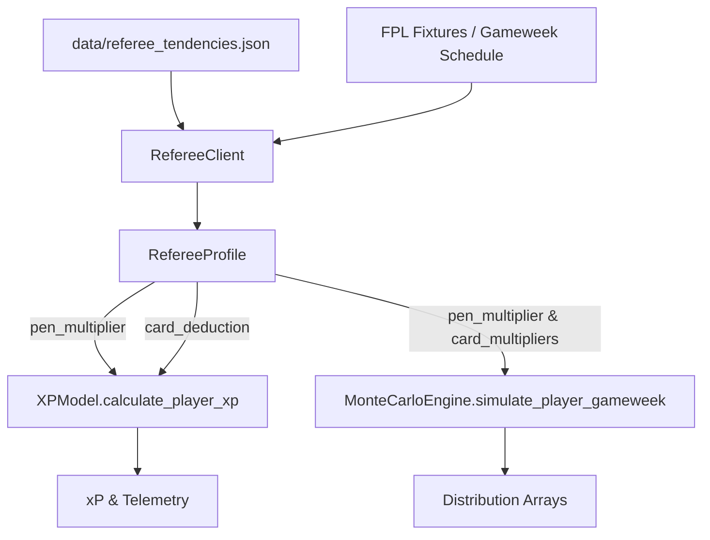

# Design [#024]: Premier League Referee Historical Analytics & Penalty Tendency Modeling

## 0. Frontloader (CPN Lifecycle Context)
> **Metadata for Downstream Skills & Audits**
> - **Origin Place**: `P_ISSUE_READY`
> - **Current Transition**: `T_DESIGN`
> - **Next Place**: `P_DESIGN_READY`
> - **CPN Lineage**: Issue [#024] -> Design [des_024] -> Tasks [tsk_024] -> Playbook [plb_024]
> - **Execution Track**: Track B (Fast-Track 4-Stage)
> - **Origin Issue**: [`docs/issues/iss_024_referee_penalty_variance_modeling.md`](file:///c:/Users/cw171001/OneDrive%20-%20Teradata/Documents/GitHub/rubies_rangers/docs/issues/iss_024_referee_penalty_variance_modeling.md)
> - **Downstream Consumers**: `tsk_024`, `plb_024`, `clients/referee_client.py`, `analytics/xp_model.py`, `analytics/montecarlo.py`
> - **URN**: `urn:air:clydewatts1:rubies_rangers:docs:des_024_referee_penalty_variance_modeling`

---

## 1. Purpose & Scope

### 1.1 Purpose
In official FPL scoring, penalties represent the single highest expected-value event for attacking assets: designated penalty takers receive $4$ points (FWD) or $5$ points (MID) per penalty scored with a historical conversion probability exceeding $79\%$. Currently, `XPModel` and `MonteCarloEngine` treat match penalty probability as a static, homogenous constant ($P_{\text{award}} = 0.18$).

In reality, Premier League referee variance is substantial across Select Group 1 officials:
- **High-whistle referees** (e.g. Robert Jones at $0.38$, Anthony Taylor at $0.36$) award penalties at nearly double the league baseline.
- **Conservative referees** (e.g. Paul Tierney at $0.15$, Andrew Madley at $0.16$) maintain strict thresholds for spot kicks.
- **Card-heavy referees** (e.g. Peter Bankes at $4.70$ yellows/match, Robert Jones at $4.60$ yellows/match) significantly elevate yellow card risk ($-1$ FPL pt, $-3$ BPS) and red card tail risk ($-3$ FPL pts, clean sheet invalidation).

This system introduces objective referee appointment tracking, historical propensity metrics, and dynamic scalar modulations in both expected points (`XPModel`) and stochastic match distributions (`MonteCarloEngine`).

### 1.2 In Scope
- **`data/referee_tendencies.json`**: Curated historical statistical profiles for active Premier League Select Group 1 referees.
- **`clients/referee_client.py`**: High-performance client parsing fixture appointments, providing referee profiles, penalty multipliers, and disciplinary factors.
- **`analytics/xp_model.py` Integration**: Dynamic adjustment of penalty taker expected goals ($xG$) and outfield card deductions.
- **`analytics/montecarlo.py` Integration**: Dynamic adjustment of penalty bonus xG, yellow card probability, and red card hazard rates.
- **Defensive Fallback Mechanics**: Seamless fallback to league baseline averages ($0.20$ penalties/match, $3.95$ yellows/match) when an official is unassigned or newly promoted.

### 1.3 Out of Scope
- Real-time in-match VAR review event streaming.
- Scraping third-party betting referee props requiring paid API keys.

---

## 2. Mathematical & Quantitative Formalisms

### 2.1 Referee Penalty Multiplier ($\mu_{\text{pen}}$)
Let $\rho_R$ be the historical penalty award rate per match for referee $R$, and $\bar{\rho}_{\text{league}} = 0.20$ be the league average penalty award rate per match. The penalty multiplier is formulated as:

$$\mu_{\text{pen}, R} = \text{clip}\left( \frac{\rho_R}{\bar{\rho}_{\text{league}}}, 0.65, 1.85 \right)$$

For a designated penalty taker $i$ with order 1 ($O_i = 1$):
$$\text{pen\_award}_{\text{eff}} = P_{\text{award, base}} \cdot \mu_{\text{pen}, R}$$
$$\text{pen\_bonus\_xg}_i = \text{pen\_conv} \cdot \text{pen\_award}_{\text{eff}}$$

Where:
- $P_{\text{award, base}} = 0.18$
- $\text{pen\_conv} = 0.79$

### 2.2 Disciplinary Card Multipliers ($\mu_{\text{YC}}, \mu_{\text{RC}}$)
Let $Y_R$ and $K_R$ be the historical yellow cards and red cards per match for referee $R$, with league benchmarks $\bar{Y} = 3.95$ and $\bar{K} = 0.11$.

$$\mu_{\text{YC}, R} = \text{clip}\left( \frac{Y_R}{\bar{Y}}, 0.75, 1.35 \right)$$
$$\mu_{\text{RC}, R} = \text{clip}\left( \frac{K_R}{\bar{K}}, 0.60, 1.60 \right)$$

### 2.3 Expected Outfield Card Point Deduction in `XPModel`
Each individual starter is exposed to roughly $1/22$ of the match yellow cards. The expected points penalty is:
$$\mathbb{E}[\Delta_{\text{cards}}] = -1.0 \cdot \left( \frac{Y_R}{22.0} \right) \cdot \left(\frac{\text{mins}}{90}\right) - 3.0 \cdot \left( \frac{K_R}{22.0} \right) \cdot \left(\frac{\text{mins}}{90}\right)$$

This deduction is applied to outfield players, while the inflated yellow card risk directly reduces expected Bonus Point System (BPS) tallies.

---

## 3. Component Architecture & Data Contracts

### 3.1 Data Contracts (`clients/referee_client.py`)

```python
@dataclass(frozen=True)
class RefereeProfile:
    """Historical disciplinary and penalty profile for a match referee."""
    name: str
    matches_refereed: int
    penalties_per_match: float
    yellows_per_match: float
    reds_per_match: float
    fouls_per_tackle: float
    penalty_multiplier: float
    yellow_multiplier: float
    red_multiplier: float
    card_risk_tier: str         # "LOW", "MODERATE", "ELEVATED", "EXTREME"
```

### 3.2 Component Interaction Flow


---

## 4. Verification & Testing Strategy
1. **Multipliers & Boundaries**:
   - High-whistle referee (Robert Jones, $0.38$) produces $\mu_{\text{pen}} \approx 1.85$ (or near top clamp).
   - Strict referee (Paul Tierney, $0.15$) produces $\mu_{\text{pen}} \approx 0.75$.
   - Baseline fallback produces exactly $\mu_{\text{pen}} = 1.00$ and $\mu_{\text{YC}} = 1.00$.
2. **XPModel Integration**:
   - Penalty taker (Haaland) receives higher xP when refereed by a high-penalty official vs a conservative official.
3. **Monte Carlo Integration**:
   - Disciplinary card probability adjusts proportionally with referee card multipliers.
