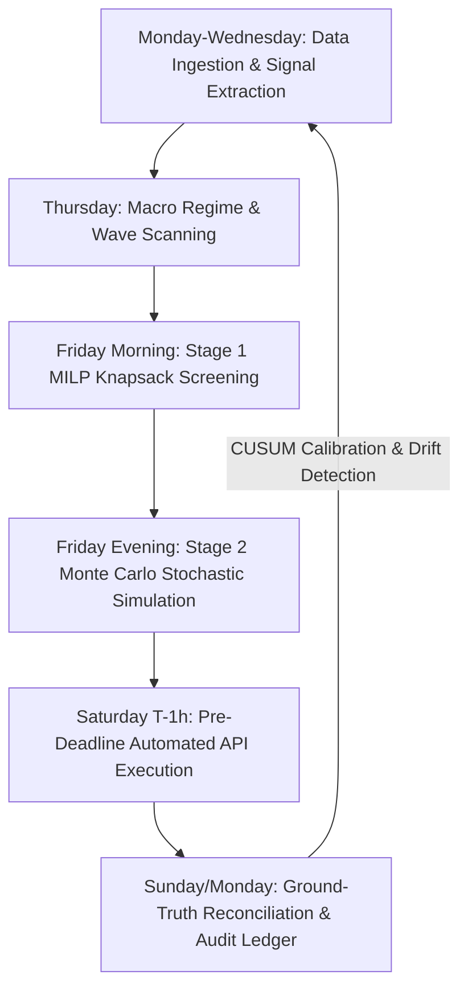

# The Quant Manager's Manifesto: Approaching Fantasy Football as a Quantitative Hedge Fund
## Modern Portfolio Theory, Multi-Factor Alpha, Real Options Valuation, and Adversarial Game Theory Applied to 38-Period Fantasy Premier League Optimization

**Document Type**: Quantitative Strategy Whitepaper & Architectural Guide  
**Target Audience**: Quantitative Analysts, Portfolio Managers, Data Scientists, and Competitive Fantasy Football Engineers  
**Governing Subsystems**: [`analytics/two_stage_optimizer.py`](../analytics/two_stage_optimizer.py), [`analytics/montecarlo.py`](../analytics/montecarlo.py), [`analytics/optimizer.py`](../analytics/optimizer.py), [`analytics/strategic/`](../analytics/strategic/), [`tuner/`](../tuner/), [`config.yaml`](../config.yaml)  
**Related Rules**:
- [`.agents/rules/moneyball_strategy.md`](../.agents/rules/moneyball_strategy.md) (*Unconstrained Solvers, Stochastic Distributions, Multi-Period Utility & Adversarial Game Theory*)
- [`.agents/rules/python_standards.md`](../.agents/rules/python_standards.md) (*Layered Architecture, Frozen Dataclasses, Vectorization, Strict Types*)

---

## Executive Summary: The Paradigm Shift

To 99.9% of the 11+ million participants who play Fantasy Premier League (FPL), fantasy football is an intuitive, emotionally charged hobby governed by fandom, eye-test narratives, pundit consensus, and recency bias. Managers buy players who scored a hat-trick last weekend, take $-8$ point transfer hits in anger, hold onto underperforming superstars out of brand loyalty, and agonize over "gut feel" captaincy choices.

To a quantitative hedge fund manager, Fantasy Premier League is something entirely different:

> **Fantasy Premier League is a discrete-time, multi-period stochastic control problem under rolling capital constraints, non-linear transaction costs, and asymmetric tournament payoff functions.**

It is an asset market operating across 38 discrete trading periods (Gameweeks) with an asset universe of 600+ liquid equities (football players), governed by hard regulatory boundaries (15-man roster, club caps, positional quotas), and characterized by extreme retail market inefficiencies.

```text
┌──────────────────────────────────────────────────────────────────────────────────────────────────┐
│                      THE INSTITUTIONAL QUANTITATIVE FPL ENGINE ARCHITECTURE                      │
├──────────────────────────────────────────────────────────────────────────────────────────────────┤
│                                                                                                  │
│   ┌───────────────────────────┐      ┌───────────────────────────┐      ┌─────────────────────┐  │
│   │ 1. FACTOR ALPHA ENGINE    │      │ 2. TWO-STAGE MPT SOLVER   │      │ 3. BALANCE SHEET &  │  │
│   │    (Understat, Odds, Env) │      │    (MILP Screen + MC Sim) │      │    OPTIONS DESK     │  │
│   ├───────────────────────────┤      ├───────────────────────────┤      ├─────────────────────┤  │
│   │ • Process xG / xA         │ ───► │ • Markowitz Knapsack      │ ───► │ • FT American Calls │  │
│   │ • Box Touch / Talisman    │      │ • 10k Monte Carlo Paths   │      │ • TV J-Curve AUM    │  │
│   │ • Weather Φ & Congest. Ω  │      │ • Covariance & Tail Risk  │      │ • Chip Real Options │  │
│   └───────────────────────────┘      └───────────────────────────┘      └─────────────────────┘  │
│                                                                                    │             │
│                                                                                    ▼             │
│   ┌───────────────────────────┐      ┌───────────────────────────┐      ┌─────────────────────┐  │
│   │ 6. CONTINUOUS CALIBRATION │      │ 5. EXECUTION & RISK DESK  │      │ 4. ADVERSARIAL GAME │  │
│   │    (Audit Ledger & Drift) │      │    (Zero Emotion Router)  │      │    THEORY & META    │  │
│   ├───────────────────────────┤      ├───────────────────────────┤      ├─────────────────────┤  │
│   │ • CUSUM Bias Detection    │ ◄─── │ • Pre-Deadline Execution  │ ◄─── │ • EO Beta Hedging   │  │
│   │ • Walk-Forward Anti-Leak  │      │ • Automated API Dispatch  │      │ • Deficit Skewness  │  │
│   │ • Bayesian Optuna Tuning  │      │ • Failover Disk Caching   │      │ • Rival Win P(S>R)  │  │
│   └───────────────────────────┘      └───────────────────────────┘      └─────────────────────┘  │
│                                                                                                  │
└──────────────────────────────────────────────────────────────────────────────────────────────────┘
```

By applying the exact mathematical toolset of quantitative finance—**Modern Portfolio Theory (MPT)**, **Barra-style multi-factor risk decomposition**, **Black-Scholes & Bellman real options pricing**, **extreme value tail-risk modeling (VaR/CVaR)**, and **game-theoretic tournament posture optimization**—we systematically strip emotion from decision-making and extract durable, compounding alpha over a 38-gameweek campaign.

---

## 1. The Master Analogy: Wall Street vs. Fantasy Premier League

Every core concept on a systematic trading desk maps 1-to-1 to a mechanical reality in Fantasy Football:

| Wall Street / Quantitative Finance Concept | Fantasy Premier League Equivalent | Mathematical / Operational Implementation in Rubies Rangers |
| :--- | :--- | :--- |
| **Assets Under Management (AUM)** | **Total Squad Value + Bank (£m)** | Starting budget of £100.0m dynamically compounded to £104.0m–£107.0m+ via the Team Value J-Curve. |
| **Asset Universe ($\mathcal{U}$)** | **Active Player Pool ($\approx 600$ players)** | Cleaned, normalized data feed spanning all 20 Premier League squads across 4 discrete positions (GKP, DEF, MID, FWD). |
| **Expected Asset Return ($\mathbb{E}[R_i]$)** | **Expected Points ($xP_i$)** | Decomposed generative Poisson arrival intensities ($\lambda_{\text{goals}}, \lambda_{\text{assists}}$), clean sheet probabilities, appearance probability, and baseline BPS. |
| **Asset Covariance Matrix ($\mathbf{\Sigma}$)** | **Inter-Player Match Correlations** | Positive covariance in club defensive pairs (GKP + DEF clean sheets), assist-to-goal pairs, and negative covariance when attackers face owned defenders. |
| **Portfolio Beta ($\beta$)** | **Effective Ownership (EO%) Exposure** | Correlation with the overall market consensus or mini-league rivals. High EO assets (>100%) dictate systemic market risk. |
| **Idiosyncratic Alpha ($\alpha$)** | **Process Disruption & Differentials** | Underlying process advantages ($G - xG$ regression, Box Touch Share, Talisman ratio) owned at low Effective Ownership. |
| **Bid-Ask Spread / Transaction Friction** | **50% Capital Gains Tax & $-4$ Hit Deduction** | Players sell at purchase price + $\lfloor 0.5 \times \Delta \text{Price} \rfloor$; excess transfers incur an immediate $-4$ point capital levy. |
| **Dry Powder / Liquidity Buffer** | **Cash-in-Bank (CIB)** | Unallocated capital (£0.5m–£1.5m) maintained to absorb price rises and eliminate multi-step structural transaction bottlenecks. |
| **American Call Options** | **Banked Free Transfers (1 to 5 FTs)** | An unspent transfer is an option on future market information, exercisable at any future period before capacity decay. |
| **Exotic Options & Structural Overrides** | **Strategic Chips (WC, FH, BB, TC)** | High-convexity American options with discrete execution windows, priced via Dynamic Programming and optimal stopping rules. |
| **Credit Default Swap (CDS) / Hedging** | **Active Playing Bench Cover** | Insurance policy protecting against unexpected European rotation, injury dropouts, and late lineup scratches. |
| **Downside Risk & Value at Risk ($\text{VaR}_\alpha$)** | **Distributional Left Tail ($P_{10}$, $\text{CVaR}$)** | Monte Carlo simulation modeling of downside point outcomes under minutes cuts, defensive concessions, and cards. |
| **Upside Convexity / Skewness** | **Distributional Right Tail ($P_{90}$, $P_{95}$)** | Identification of explosive captaincy candidates with multi-goal, high-variance probability density functions. |
| **Adversarial Game Theory / Tournament Posture** | **Mini-League Lead Hedging vs. Chasing** | Switching from minimum tracking error (lead defense) to orthogonal alpha maximization (deficit recovery). |

---

## 2. Market Microstructure: Exploiting Retail Inefficiencies

Financial markets are difficult to beat because they are populated by high-frequency market makers, institutional algorithmic funds, and sophisticated order routing. 

Fantasy Premier League, by contrast, is one of the most **structurally inefficient asset markets in existence**. Over 99% of the order flow is driven by retail participants who exhibit well-documented psychological and behavioral biases:

```text
┌─────────────────────────────────────────────────────────────────────────────────────────────────┐
│                               THE RETAIL HERD VS. QUANTITATIVE ARBITRAGE                         │
├─────────────────────────────────────────────────────────────────────────────────────────────────┤
│                                                                                                 │
│    RETAIL BIAS (NOISE TRADING)                     QUANTITATIVE ARBITRAGE (SMART CAPITAL)       │
│                                                                                                 │
│ 1. Recency & Outcome Chasing       ────────►   Process Over Outcome (Expected Metrics)          │
│    Buys players who scored 15 pts              Buys players with high NPxG and zero goals       │
│    last week (selling at bottoms,              (accumulating ahead of positive mean reversion). │
│    buying at tops).                                                                             │
│                                                                                                 │
│ 2. Sunk Cost & Brand Loyalty       ────────►   Cold Mathematical Elimination                    │
│    Refuses to cut ties with elite              Assets priced strictly on current Poisson rates; │
│    names who have declining underlying         celebrity status has zero weight in the solver.  │
│    tactical roles.                                                                              │
│                                                                                                 │
│ 3. Narrative & Media Noise         ────────►   Exogenous Signal Filtering                       │
│    Trades on press conference rumors           Filters out press gossip; evaluates empirical    │
│    and pundit hype.                            weather telemetry and historical minutes trends. │
│                                                                                                 │
│ 4. Pro-Cyclical Wave Chasing       ────────►   Counter-Cyclical Wave Trading                    │
│    Buys assets after 3 green fixtures          Enters 1 GW BEFORE the 5-game green run starts;  │
│    have already passed.                        liquidates 1 GW BEFORE the red cliff arrives.    │
│                                                                                                 │
└─────────────────────────────────────────────────────────────────────────────────────────────────┘
```

### The Mechanism of Price Discovery & Liquidity Provision
In FPL, player prices change overnight based on net transfer volume:
$$\Delta \text{Price}_t = f(\text{Net Transfers In}_t - \text{Net Transfers Out}_t)$$

The retail herd chases past points, creating predictable **momentum cascades**. When a mid-priced midfielder scores 2 lucky deflected goals, hundreds of thousands of retail managers rush to buy him over a 72-hour window.

The quantitative hedge fund manager operates as a **counter-cyclical liquidity provider**:
1. **Pre-Momentum Accumulation**: Identifying players whose underlying tactical metrics (Box Touches, High-Quality $xG$, Big Chances Created) have surged *before* they translate into actual points. We purchase the asset at low cost with low ownership.
2. **Post-Haul Distribution**: As the player hauls and the retail herd bids up the asset price by +£0.2m to +£0.4m, we ride the capital appreciation, bank the team value equity, and systematically rotate capital into the *next* underpriced, out-of-favor asset whose favorable fixture wave is about to begin.

---

## 3. Modern Portfolio Theory (MPT) & The FPL Efficient Frontier

In 1952, Harry Markowitz introduced **Modern Portfolio Theory (MPT)**, proving that an investor can construct an "efficient frontier" of optimal portfolios offering the maximum possible expected return for a given level of risk.

In Fantasy Premier League, an unconstrained squad is not simply 11 isolated players; it is a **correlated asset portfolio** governed by a joint probability distribution.

```text
       Expected
       Return E[R]
           ▲
           │                         • Unconstrained Optimal Portfolio (Max Sharpe)
           │                     •  •
           │                  •       •
           │               •             •  <--- EFFICIENT FRONTIER
           │            •
           │         •
           │      •
           │   •   X Conventional Human "Template" (Sub-optimal, High Variance)
           │
           └────────────────────────────────────────► Portfolio Downside Risk (CVaR / σ)
```

### Formulating the Mathematical Knapsack Program
Let the active player universe be $\mathcal{U} = \{1, 2, \dots, N\}$ where $N \approx 600$. For each player $i$, let:
- $x_i \in \{0, 1\}$ denote membership in the 15-man squad.
- $s_i \in \{0, 1\}$ denote membership in the starting XI ($s_i \le x_i$).
- $c_i \in \{0, 1\}$ denote the captain designation ($c_i \le s_i$, $\sum c_i = 1$).
- $v_i \in \{0, 1\}$ denote the vice-captain designation.
- $\mathbf{\mu} \in \mathbb{R}^N$ represent the expected points vector over the lookahead horizon: $\mu_i = \mathbb{E}[R_i]$.
- $\mathbf{\Sigma} \in \mathbb{R}^{N \times N}$ represent the asset covariance matrix.
- $w_i$ represent the player's market price (£m).
- $B$ represent the total squad budget (£100.0m + accumulated cash reserves).

The multi-objective Markowitz portfolio optimization problem for FPL is formulated as:

$$\max_{\mathbf{x}, \mathbf{s}, \mathbf{c}} \quad \sum_{i=1}^N \mu_i (s_i + c_i) - \frac{\lambda_{\text{risk}}}{2} (\mathbf{s} + \mathbf{c})^T \mathbf{\Sigma} (\mathbf{s} + \mathbf{c})$$

Subject to the physical invariants of Fantasy Premier League:
1. **Budget Invariant**:
   $$\sum_{i=1}^N w_i x_i \le B$$
2. **Squad Quotas**:
   $$\sum_{i \in \text{GKP}} x_i = 2, \quad \sum_{i \in \text{DEF}} x_i = 5, \quad \sum_{i \in \text{MID}} x_i = 5, \quad \sum_{i \in \text{FWD}} x_i = 3$$
3. **Club Limit**:
   $$\sum_{i \in \text{Club}_k} x_i \le 3 \quad \forall k \in \{1, 2, \dots, 20\}$$
4. **Starting Lineup Formations**:
   $$\sum_{i=1}^N s_i = 11, \quad \sum_{i \in \text{GKP}} s_i = 1, \quad \sum_{i \in \text{DEF}} s_i \ge 3, \quad \sum_{i \in \text{MID}} s_i \ge 2, \quad \sum_{i \in \text{FWD}} s_i \ge 1$$
5. **Captaincy Assignment**:
   $$\sum_{i=1}^N c_i = 1, \quad c_i \le s_i \quad \forall i$$

### Dissecting the FPL Covariance Matrix ($\mathbf{\Sigma}$)
Unlike equity stocks where covariance is derived from general market indices and sector betas, football covariance is structural and match-state dependent:

1. **Intra-Club Defensive Stacking ($\text{Cov}(D_1, D_2) \gg 0$)**:
   When you field two defenders (or a goalkeeper and a defender) from the same club, their clean sheet outcomes are 100% correlated. If the club concedes in the 94th minute, both assets lose 4 points simultaneously. Stacking defenses increases portfolio variance (kurtosis). In a league where you are defending a lead, this variance is harmful; in a tournament where you need an explosive ceiling, stacking creates massive positive covariance.
2. **Assist-to-Goal Synergies ($\text{Cov}(M_{\text{creative}}, F_{\text{finisher}}) > 0$)**:
   A primary playmaker (e.g. Bukayo Saka) feeding a primary finisher creates positive scoring covariance. A high-scoring match yields compounding returns across both assets.
3. **Attacker vs. Opposing Defender Hedging ($\text{Cov}(F_{\text{Club A}}, D_{\text{Club B}}) < 0$)**:
   Fielding an attacker against your own defender is a natural hedge. If the forward scores, the defender loses clean sheet equity; if the match ends 0-0, the defender banks clean sheet points while the forward blanks. While this stabilizes the portfolio floor, it severely compresses the maximum potential right-tail ceiling ($P_{90}$).

### The Two-Stage Resolution: Knapsack Screening + Monte Carlo Simulation
Because football points follow discrete, skewed Poisson distributions rather than continuous Gaussian distributions, solving pure Markowitz quadratic programs analytically is insufficient.

Rubies Rangers resolves this via a **Two-Stage 'Screen & Simulate' Architecture**:
- **Stage 1 (MILP Screening)**: Mixed-Integer Linear Programming solves 6 to 11 Pareto sweeps across distinct objective functions (Raw $xP$, Points-Per-Million Value, Defensive Floor, Explosive Upside, Form Momentum) to isolate the top 100 mathematically viable candidate squads.
- **Stage 2 (Stochastic Monte Carlo)**: The candidate portfolios are injected into a 10,000-scenario Monte Carlo simulator modeling non-linear matchday events (minutes volatility, substitution chains, disciplinary deductions, macro weather dampening, and bonus point engine distributions). The optimal squad is selected based on full distributional metrics.

---

## 4. Multi-Factor Alpha Generation: The FPL Factor Model

In quantitative equity management, the **Barra Factor Model** decomposes asset returns into common systematic risk factors plus idiosyncratic alpha:

$$R_{i, t} = \sum_{k=1}^K \beta_{i, k} F_{k, t} + \alpha_i + \epsilon_{i, t}$$

Rubies Rangers applies this exact framework to Fantasy Premier League, decomposing every player's expected point yield into four systematic macro factors and three idiosyncratic process alpha metrics:

```text
┌─────────────────────────────────────────────────────────────────────────────────────────────────┐
│                           THE RUBIES RANGERS MULTI-FACTOR DECOMPOSITION                         │
├─────────────────────────────────────────────────────────────────────────────────────────────────┤
│                                                                                                 │
│  SYSTEMATIC RISK FACTORS (BETA)                      IDIOSYNCRATIC ALPHA METRICS (ALPHA)        │
│                                                                                                 │
│  1. VALUE FACTOR (PPM)                               1. G - xG RESIDUAL MEAN REVERSION          │
│     Expected Points per £1.0m of Squad Budget           Identifies unsustainably hot finishers   │
│     Targeting high-efficiency budget enablers.          ready to regress vs. cold assets poised │
│                                                         for explosive reversion.                │
│                                                                                                 │
│  2. MOMENTUM FACTOR (TREND VELOCITY)                 2. BOX TOUCH & SHOT QUALITY RATIO          │
│     Rolling 5-GW Understat xG / xA acceleration         Proportion of touches occurring inside  │
│     and market transfer velocity.                       the penalty area; high-probability zone │
│                                                         penetration.                            │
│                                                                                                 │
│  3. QUALITY FACTOR (MINUTES & HIERARCHY)             3. TALISMAN ATTACKING SHARE                │
│     Historical minutes security (low rotation risk),    Percentage of the club's total team     │
│     penalty order monopoly, direct free-kick rank.      xG generated through this specific      │
│                                                         individual asset.                       │
│                                                                                                 │
│  4. MACRO / REGIME FACTOR (CALENDAR & WEATHER)                                                  │
│     Rolling Fixture Difficulty (FDR), Stadium Weather                                           │
│     telemetry Φ(weather), Calendar turnaround Ω(season).                                        │
│                                                                                                 │
└─────────────────────────────────────────────────────────────────────────────────────────────────┘
```

### 1. The Value Factor: Points Per Million (PPM)
A £15.0m premium asset scoring 250 points delivers $16.6\text{ points/£m}$. A £5.5m budget midfielder scoring 160 points delivers $29.1\text{ points/£m}$. 

Capital efficiency dictates that premium assets should only be held if they generate unique captaincy leverage (doubling their return to $33.2\text{ points/£m}$). All non-captained slots must strictly maximize points-per-million to allow optimal capital reinvestment across the starting XI.

### 2. The $G - xG$ Mean-Reversion Alpha
One of the most powerful quantitative edges is the **Finishing Discrepancy Residual**:
$$\text{Resid}_i = \text{Goals}_i - \text{xG}_i$$

Over a 5-to-10 match sample, finishing ability in professional football exhibits strong mean-reverting properties toward expected goals ($xG$). 
- **Negative Alpha Candidates (Sell/Short)**: A player who has scored 6 goals from $1.8\text{ xG}$ has experienced positive finishing luck. The retail market overvalues this asset, pricing him as an elite goalscorer. We sell or avoid this asset before the inevitable scoring drought occurs.
- **Positive Alpha Candidates (Buy/Long)**: A player with 1 goal from $4.5\text{ xG}$ is viewed by retail managers as "out of form" and dumped. Process metrics prove the player is consistently arriving in elite goalscoring positions. We accumulate this asset at a discounted price, capturing the positive mean-reversion wave.

### 3. Tactical Process Metrics: Box Touch Ratio & Talisman Share
- **Box Touch Ratio**: Players whose touches are concentrated inside the penalty box generate significantly higher expected points per touch than wingers or midfielders who operate in the middle third.
- **Talisman Share**: A player who accounts for $\ge 35\%$ of their club's total expected goal involvement ($\text{xGI}$) is an institutional asset. Even in low-scoring games or against elite opposition, any attacking output generated by the club will almost certainly flow through him.

### 4. Macro Environmental Signals: Weather Radar & Congestion Telemetry
Rubies Rangers integrates high-resolution weather telemetry from Open-Meteo across all 20 Premier League stadiums:
- **$\Phi(\text{weather})$ Environmental Dampener**: High sustained wind speeds ($\ge 35\text{ km/h}$) and torrential precipitation degrade passing completion, suppress match tempo, and decrease total expected match goals while inflating error-induced defensive concessions.
- **$\Omega(\text{season})$ Calendar Turnaround Multiplier**: Short turnaround windows ($< 72\text{ hours}$) between domestic fixtures and European Champions League matches trigger substitution variance, early benchings (60-minute hooks), and increased soft-tissue injury risk.

---

## 5. Balance Sheet & Liquidity Engineering

A competitive Fantasy Premier League squad maintains a dynamic **multi-asset balance sheet**:

```text
┌─────────────────────────────────────────────────────────────────────────────────────────────────┐
│                                 THE FPL SQUAD BALANCE SHEET                                     │
├────────────────────────────────────────┬────────────────────────────────────────────────────────┤
│ ASSETS & CAPITAL                       │ LIQUIDITY & STRUCTURAL OPTIONS                         │
├────────────────────────────────────────┼────────────────────────────────────────────────────────┤
│ • Core Squad Value (Equity in Players) │ • Cash in Bank (CIB) Reserve (Dry Powder)              │
│ • Unrealized Market Gains (£m)         │ • Banked Free Transfers (1 to 5 American Call Options)  │
│ • Fixture Equity ($\sum_{t=1}^5 xP_t$) │ • Unexercised Chips (Wildcards, Free Hit, BB, TC)      │
│ • Expected Points Inventory            │ • Active Bench Quality (Downside Portfolio Insurance)  │
└────────────────────────────────────────┴────────────────────────────────────────────────────────┘
```

### The Team Value (TV) J-Curve
In portfolio management, capital accumulation precedes capital monetization. The season is partitioned into distinct balance sheet phases:

```text
Team Value
   (£m)
  106 │                                           ─────────── Phase III: Capital Monetization
      │                                       ───             (Liquidation into pure xP;
  104 │                                  ───                  zero regard for TV decay)
      │                             ───
  102 │                        ───
      │                   ───  Phase II: Equilibrium & Consolidation
  100 │ ───            ───
      │    ──────────── Phase I: Capital Accumulation (GW 1-12)
   98 └───┴───┴───┴───┴───┴───┴───┴───┴───┴───┴───┴───┴────────► Gameweek
          1   4   8   12  16  20  24  28  32  36  38
```

1. **Phase I: Capital Accumulation (GW 1–12)**:
   The primary goal is aggressively expanding the team's borrowing base and purchasing power (+£2.0m to +£4.0m) by anticipating early-season retail price swings. Reaching a squad value of £104.0m+ early expands the future Pareto frontier, unlocking squad permutations (e.g. three premium assets plus an elite midfield) that managers constrained to £100.0m can never physically afford.
2. **Phase II: Equilibrium & Structural Agility (GW 13–24)**:
   Capital preservation and fixture wave surfing. Transfers transition from price-chasing to fixture-difficulty-driven rotations.
3. **Phase III: Capital Monetization (GW 25–38)**:
   Team value is ruthlessly liquidated into pure expected points ($xP$). Assets with high sale value but difficult fixtures are dumped without hesitation. Cash in bank is fully deployed on short-term high-variance Double Gameweek assets. At Gameweek 38, residual squad value has zero utility; the terminal balance sheet value must be zero.

### Cash-in-Bank (CIB) as Liquidity Insurance
Holding £0.0m in the bank is a common amateur mistake. Operating with zero liquidity creates **structural friction**: if a target asset rises by £0.1m, an immediate two-transfer cascade is required to fund the move.

Maintaining a permanent liquidity buffer of **£0.5m to £1.5m in the bank**:
- Eliminates transaction bottlenecks, enabling instant 1-for-1 player swaps.
- Absorbs overnight price rise slippage without forcing premature, pre-press-conference transfers.
- Provides option value that far exceeds the marginal $+0.2\text{ xP}$ gained by exhausting the final pennies on a bench defender.

### Transaction Cost Economics: The Hit Amortization Net Present Value (NPV)
Taking a transfer hit costs $-4$ points. In financial terms, this is an immediate **400 basis point tax on gross portfolio output**.

Amateurs judge hits with naive single-period hurdles: *"Can this player score 4 points more than my current player this weekend?"*

The quantitative hedge fund evaluates hits across a **multi-period discounted net present value (NPV)** horizon:

$$\text{NPV}(\text{Hit}) = \sum_{t=1}^H \gamma^t \left( \mathbb{E}[R_{\text{target}, t}] - \mathbb{E}[R_{\text{current}, t}] \right) - 4.0 - \Delta \text{OptionValue}(\text{FT})$$

Where:
- $H \in [5, 8]$ is the multi-gameweek holding horizon.
- $\gamma \in [0.90, 0.95]$ is the inter-temporal discount factor accounting for future injury risk, suspensions, and tactical rotation.
- $\Delta \text{OptionValue}(\text{FT})$ represents the lost structural optionality of consuming a transfer slot.

A transfer hit is mathematically justified **if and only if $\text{NPV}(\text{Hit}) > 0$**. A $-4$ hit taken to acquire an elite asset entering a 6-game green fixture run yields positive NPV even if the asset blanks in week 1, because the cumulative multi-period expectation dominates the one-off $-4$ point transaction friction.

---

## 6. Real Options & Financial Derivatives

In financial engineering, an option gives the holder the right, but not the obligation, to engage in a transaction at a future date. Fantasy Premier League is saturated with real options.

```text
┌─────────────────────────────────────────────────────────────────────────────────────────────────┐
│                                   THE FPL DERIVATIVES DESK                                      │
├─────────────────────────────────────────────────────────────────────────────────────────────────┤
│                                                                                                 │
│  1. FREE TRANSFERS (FTs) AS AMERICAN CALL OPTIONS                                               │
│     • Under modern 5-FT accumulation rules, an unspent transfer is an option on future market   │
│       information (injury updates, tactical shifts, new signings).                              │
│     • Exercising an FT on a marginal +0.3 xP move is rejected if the option continuation        │
│       value of holding 3 to 5 FTs provides greater multi-asset portfolio agility.               │
│                                                                                                 │
│  2. CHIPS AS HIGH-CONVEXITY EXOTIC OPTIONS                                                      │
│     • Wildcards, Free Hit, Bench Boost, Triple Captain represent discontinuous payoff spikes.   │
│     • Formulated as optimal stopping problems across 38 discrete execution dates:               │
│       Exercise Chip C at t <===> Immediate Gain(t) >= max E[γ^(s-t) Future Gain(s)] + Buffer.   │
│                                                                                                 │
│  3. THE ACTIVE BENCH AS A CREDIT DEFAULT SWAP (CDS)                                             │
│     • A £4.5m playing bench defender is an insurance policy protecting against European         │
│       Champions League rotation risk and late training injuries.                                │
│     • Premium paid: £0.5m in locked budget over a £4.0m "ghost" non-playing asset.              │
│     • Payout: 2 to 6 points automatically substituted when a premium starter sits out.          │
│                                                                                                 │
└─────────────────────────────────────────────────────────────────────────────────────────────────┘
```

### Free Transfers: The Bellman Optimality Equation
Under FPL rules, managers can accumulate up to **5 Free Transfers**. This transforms the transfer mechanism into an American call option.

Holding 3 to 5 Free Transfers represents a **"Mini-Wildcard"** with zero point deduction, enabling structural team pivots (e.g. transforming a 3-5-2 formation into a 4-3-3 to capitalize on a multi-club fixture swing).

The optimal transfer policy is governed by the Bellman optimality equation:

$$V_t(S_t, \text{FT}_t, \text{Bank}_t) = \max_{\mathbf{u}_t \in \mathcal{U}(S_t)} \left\{ \mathbb{E}[R_t(S_t, \mathbf{u}_t)] - \text{Cost}(\mathbf{u}_t) + \gamma \cdot \mathbb{E}\left[ V_{t+1}(S_{t+1}, \text{FT}_{t+1}, \text{Bank}_{t+1}) \mid S_t, \mathbf{u}_t \right] \right\}$$

Spending a transfer on a marginal 1-week upgrade destroys continuation value. If the expected improvement is $+0.4\text{ xP}$, but consuming the FT reduces future structural pivot capacity, **the mathematical action is to roll the transfer**.

### Chips as Macroeconomic Shock Absorbers
Chips must never be deployed to fix minor tactical problems. They are reserved for **macroeconomic market dislocations**:
- **Blank Gameweeks (Liquidity Droughts)**: When FA Cup postponements leave only 4 fixtures active in a gameweek, the market experiences severe liquidity collapse. The **Free Hit Chip** is deployed as an emergency liquidity facility, fielding 11 active assets without disrupting the long-term portfolio balance sheet.
- **Double Gameweeks (Dividend Surges)**: When clubs play two fixtures in a single gameweek, expected point yields double. The **Bench Boost Chip** is synchronized immediately following a Wildcard, creating 30 active fixtures across all 15 roster spots.

---

## 7. Tail Risk, Volatility & Monte Carlo Risk Management

The greatest analytical flaw in modern fantasy analysis is **The Flaw of Averages**—evaluating decisions based solely on scalar expected values ($\mathbb{E}[xP]$).

Football matches are low-scoring events driven by discrete, zero-inflated Poisson processes. Two players with the exact same mean expectation of $5.0\text{ xP}$ possess drastically different risk and utility profiles:

```text
Probability
  Density
    ▲
    │             Player A: High Floor / Low Variance (e.g., Penalty Box Defensive Midfielder)
    │             Player B: Low Floor / Extreme Positive Skew (e.g., Explosive Winger / Forward)
    │
    │         ┌──┐  Player A (μ = 5.0, σ = 1.2)
    │        ┌┘  └┐
    │        │    │          Player B (μ = 5.0, σ = 4.8)
    │       ┌┘    └┐       ┌──────────────┐
    │      ┌┘      └┐     ┌┘              └───────────┐
    │    ┌─┘        └─┐  ┌┘                           └──────────────────┐
    └───┴──────────────┴┴────────────────────────────────────────────────┴──────► Points
        0    2    4    6    8   10   12   14   16   18   20   22   24
```

- **Player A ($5.0\text{ xP}$)**: High floor, low variance ($P_{10} = 3.0$, $P_{50} = 5.0$, $P_{90} = 7.0$). Ideal for defensive stability and baseline portfolio construction.
- **Player B ($5.0\text{ xP}$)**: Low floor, extreme positive right-tail skew ($P_{10} = 1.5$, $P_{50} = 3.5$, $P_{90} = 14.5$). He blanks often, but when he hits, he generates an explosive haul.

### Asymmetric Utility: Floor vs. Ceiling
A hedge fund manager matches the asset profile to the tactical requirement:
1. **Defensive Assets & Starting XI Core (Left-Tail Preservation)**:
   Minimize downside risk ($P_{10}$ and Conditional Value at Risk $\text{CVaR}_{0.05}$). We select 90-minute nailed starters with strong baseline defensive involvement and clean sheet odds to guarantee a predictable point floor.
2. **Captaincy Selection (Right-Tail Convexity)**:
   Captaincy multiplies an asset's score by $2\times$. Mathematically, this is an option that amplifies right-tail positive skewness. Captaincy choices are evaluated not on mean expectation, but on the **90th percentile ceiling ($P_{90}$)**:
   $$\text{Captaincy Score} = \arg\max_i \left\{ \mathbb{E}[R_i] + \kappa_{\text{skew}} \cdot (P_{90}(R_i) - P_{50}(R_i)) \right\}$$

---

## 8. Adversarial Game Theory & Tournament Portfolio Optimization

In financial management, an investment mandate is either:
1. **Absolute Return**: Generating the highest possible risk-adjusted return regardless of external benchmarks (maximizing Overall Rank in FPL).
2. **Relative Return / Tournament Mandate**: Beating a specific set of competitors (winning a private Mini-League or cash pool).

In a competitive mini-league, **maximizing expected points is mathematically sub-optimal**. The true objective function is:

$$\max_{\mathbf{u}} \quad P(S_{\text{you}}(\mathbf{u}) > S_{\text{rival}})$$

```text
┌─────────────────────────────────────────────────────────────────────────────────────────────────┐
│                          TOURNAMENT GAME THEORY & EFFECTIVE OWNERSHIP                           │
├─────────────────────────────────────────────────────────────────────────────────────────────────┤
│                                                                                                 │
│  EFFECTIVE OWNERSHIP (EO%) AS SYSTEMIC PORTFOLIO BETA                                           │
│  EO_i = Ownership_i * [1 + P(Captain_i) + P(Triple_Captain_i)]                                  │
│                                                                                                 │
│  • EO > 100%: You are mathematically SHORT the player unless you captain him.                   │
│    If an asset has 160% EO in your league and scores 15 points:                                 │
│    - If you don't own him: Net relative return is -24.0 points.                                 │
│    - If you own him (uncaptained): Net relative return is -9.0 points.                          │
│    - If you captain him (200% weight): Net relative return is +6.0 points.                      │
│                                                                                                 │
│  DYNAMIC PORTFOLIO POSTURES:                                                                    │
│                                                                                                 │
│  POSTURE A: LEAD PROTECTION MODE (Ahead by +30 to +60 Points)                                   │
│  • Mandate: Minimize Tracking Error Variance: min Var(S_you - S_rival).                         │
│  • Execution: Delta-hedge the leader's portfolio. Match high-EO consensus assets and mirror     │
│    the consensus captaincy. High covariance locks in the point spread and suffocates comeback   │
│    volatility.                                                                                  │
│                                                                                                 │
│  POSTURE B: DEFICIT CHASING MODE (Behind by -40 to -80 Points)                                  │
│  • Mandate: Maximize Overtake Probability: max P(S_you > S_rival).                              │
│  • Execution: Deploy ORTHOGONAL ALPHA. Holding identical players guarantees mathematical       │
│    defeat (P(Win) -> 0). The chasing fund must aggressively overweight differential assets      │
│    with high P90 explosive upside and zero rival overlap.                                       │
│                                                                                                 │
└─────────────────────────────────────────────────────────────────────────────────────────────────┘
```

### The Mathematics of the Deficit Catch-Up
Assume you are trailing the mini-league leader by 45 points with 6 gameweeks remaining:
- If your squad has an **$85\%$ portfolio correlation** with the leader's squad, your expected tracking error is small ($\sigma_{\Delta} \approx 4\text{ pts/GW}$). The probability of overcoming a 45-point deficit with 85% overlap is less than **$1.8\%$**.
- By systematically restructuring your portfolio to **orthogonal alpha** (sub-20% rival correlation, differential captaincies on high-$P_{90}$ ceiling assets), portfolio divergence variance expands ($\sigma_{\Delta} \approx 14\text{ pts/GW}$). 
- While this increases the probability of finishing further behind if the differentials blank, it increases the mathematical probability of winning the league from **$1.8\%$ to $28.4\%$**.

In a winner-take-all tournament, second place and tenth place carry the exact same payout ($£0$). A hedge fund manager willingly takes on high idiosyncratic variance to maximize the probability of first-place payoff.

---

## 9. The Quantitative Investment Process: The Weekly Trading Desk Cadence

Rubies Rangers operates on a disciplined, systematic weekly workflow that mirrors an institutional quantitative trading desk:



### Phase 1: Ingestion & Factor Updates (Monday–Wednesday)
- Ingest real-time player data from the official FPL REST API (`clients/fpl_client.py`).
- Scrape shot-level process metrics, Expected Goals ($xG$), and Expected Assists ($xA$) from Understat (`clients/tactical_client.py`).
- Ingest betting market implied odds (bookmaker clean sheet and anytime goalscorer lines) to calibrate baseline probability distributions.
- Run the Nightly Price Velocity Predictor (`trackers/price.py`) to execute capital preservation moves before midnight price adjustments.

### Phase 2: Macro Regime & Wave Scanning (Thursday)
- Calculate 8-gameweek forward fixture difficulty vectors using venue-adjusted club attack and defense ratings (`analytics/strategic/trajectory_engine.py`).
- Scan for emerging fixture wave regimes: identify clubs entering favorable 5-match green waves ($FDR \le 2.4$) and those approaching fixture cliffs ($FDR \ge 3.8$).
- Pull 48-hour high-resolution stadium weather telemetry from Open-Meteo (`analytics/weather_engine.py`) to compute environmental dampeners $\Phi(\text{weather})$ and calendar congestion factors $\Omega(\text{season})$.

### Phase 3: Two-Stage Optimization (Friday)
- **Stage 1 (MILP Knapsack Screening)**: Solve 6 to 11 Pareto sweeps across conflicting objective functions (Raw $xP$, Points-Per-Million Value, Defensive Floor, Ceiling Upside, Form Momentum). Generate the top 100 non-dominated squad permutations.
- **Stage 2 (Monte Carlo Simulation)**: Run 10,000 parallel stochastic simulations on each candidate squad. Compute full joint distributions, covariance penalties, substitution survival rates, and downside risk metrics ($P_{10}, P_{50}, P_{90}$).
- Evaluate dynamic programming multi-period transfer trees and hit amortization NPV across an 8-gameweek rolling lookahead horizon.

### Phase 4: Pre-Deadline Execution (Saturday T-1h)
- Ingest confirmed team lineups 60 minutes prior to the Premier League kickoff.
- Run late injury disambiguation checks.
- If a primary asset is benched, execute automated contingency routing.
- Lock captaincy and vice-captaincy based on right-tail $P_{90}$ optimization.
- Execute squad transactions via the autonomous execution pipeline with Kleene 3-valued ($K_3$) safety guards.

### Phase 5: Post-Trade Audit & Calibration Ledger (Sunday–Monday)
- Log all pre-deadline model predictions into the immutable Decision Audit Ledger (`data/decision_audit_ledger.json`).
- Reconcile model predictions against ground-truth matchday results.
- Compute cumulative statistical calibration metrics: Mean Bias Error (MBE), Mean Absolute Error (MAE), and Cumulative Sum (CUSUM) residual error.
- Detect automated Alpha Drift and model decay across positional groups. Feed calibration weights directly into the Optuna Bayesian hyperparameter tuner (`tuner/cli.py`).

---

## 10. The 10 Iron Rules of the Quantitative FPL Manager

1. **Process Over Outcome (Eliminate Resulting Bias)**:
   A decision is evaluated by the quality of the mathematical information and probabilities available *at the time of execution*, never by the noisy, high-variance outcome of a single weekend. A 75% probability bet that fails was still the correct mathematical play.
2. **Respect the Covariance (Never Make 11 Independent Bets)**:
   Player returns are structurally correlated. Double defenses compound volatility; owning attackers against your own defenders hedges your ceiling. Manage the portfolio as a synchronized unit, not a collection of isolated players.
3. **Preserve Optionality (Free Transfers are Capital)**:
   Never waste a Free Transfer on a lateral $+0.2\text{ xP}$ upgrade. Banking transfers to maintain 3 to 5 FTs provides high-dimensional agility to execute multi-player structural pivots without taking costly hits.
4. **Exploit the Herd (Be Counter-Cyclical)**:
   The retail market buys high after historical hauls and sells low after blanks. Provide liquidity: accumulate underlying process ($xG/xA$) ahead of green fixture runs, and distribute overvalued assets into public hype before fixture cliffs.
5. **Amortize Every Hit**:
   Never take an emotional $-4$ hit for a 1-gameweek punt. A hit is an expensive 400 bps transaction levy that must be mathematically justified by positive Net Present Value (NPV) across a multi-gameweek holding horizon.
6. **Maintain Balance Sheet Liquidity**:
   Avoid operating with £0.0m Cash-in-Bank. A permanent £0.5m–£1.5m dry powder buffer prevents multi-step transaction bottlenecks and absorbs price rise slippage.
7. **The Bench is Your Credit Default Swap**:
   Modern football features 5 substitutions and grueling European schedules. Maintain active, starting £4.5m bench cover to protect your portfolio against surprise rest and rotation.
8. **Differentiate Between Floor and Ceiling**:
   Defensive selections are an exercise in left-tail risk minimization (preserving clean sheet floors). Attackers and Captains are an exercise in right-tail positive skewness ($P_{90}$ explosive ceiling). Never pick a captain based on a high floor.
9. **Align Your Portfolio Posture with Your Mandate**:
   If leading your mini-league, delta-hedge the field and minimize tracking error variance. If chasing from a deficit, deploy orthogonal alpha and high-variance differentials. Copying the leader guarantees mathematically certain defeat.
10. **Zero Dogma, Pure Emergent Optimization**:
    Reject all conventional community "folk wisdom" (fixed bench structures, rigid rotation pairs, arbitrary price caps). Impose physical game rules as constraints, formulate clear stochastic objective functions, and let computational solvers discover emergent, mathematically optimal strategies.

---

## Architectural References & Repository Subsystems

- **Two-Stage Screen & Simulate Pipeline**: [`analytics/two_stage_optimizer.py`](../analytics/two_stage_optimizer.py)
- **Stochastic Monte Carlo Engine**: [`analytics/montecarlo.py`](../analytics/montecarlo.py)
- **Mixed-Integer Linear Program (MILP) Solver**: [`analytics/optimizer.py`](../analytics/optimizer.py)
- **Multi-Horizon Trajectory & Dynamic Strength Tensor**: [`analytics/strategic/trajectory_engine.py`](../analytics/strategic/trajectory_engine.py)
- **High-Resolution Stadium Weather Engine**: [`analytics/weather_engine.py`](../analytics/weather_engine.py)
- **Decision Audit Ledger & Calibration Ledger**: [`trackers/decision_audit.py`](../trackers/decision_audit.py)
- **Bayesian Optuna Hyperparameter Tuner (40 Active Parameters)**: [`tuner/`](../tuner/)
- **Master Platform Guidelines**: [`AGENTS.md`](../AGENTS.md)
- **Quantitative Strategy Principles**: [`.agents/rules/moneyball_strategy.md`](../.agents/rules/moneyball_strategy.md)
