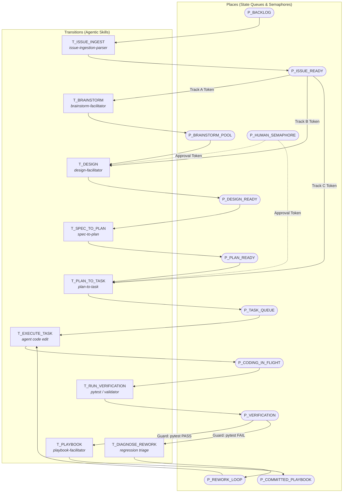

# The Agentic Coloured Petri Net (CPN) Lifecycle & Lineage Trace
## Formal Bipartite Discrete-Event Execution for Autonomous Agentic Engineering

**Target Audience:** Quantitative Engineers, Autonomous System Architects & Agentic Pair Programmers  
**Target Subsystems:** `.agents/skills/`, `.agents/rules/`, `docs/`, `scripts/ard_builder.py`, `scripts/ard_search.py`  
**Related Rules:**
- [`.agents/rules/python_standards.md`](../.agents/rules/python_standards.md) (Layered Architecture, Type Annotations, Defensive Engineering)
- [`.agents/rules/moneyball_strategy.md`](../.agents/rules/moneyball_strategy.md) (Unconstrained Solvers, Stochastic Modeling, First-Principles Alpha)
- [`.agents/rules/ui_ux_standards.md`](../.agents/rules/ui_ux_standards.md) (Quant Trading Desk 4-Zone Anatomy)

> 👔 **Looking for a non-mathematical manager's guide?**  
> If you are a technical project manager, engineering lead, or want to understand the 6 assembly line stations, practical governance, and pros/cons without formal set theory, read [**The Non-Mathematician's Guide to the Spec-Driven Agentic Lifecycle**](spec_driven_agentic_lifecycle_dummies_guide.md).

---

## 0. Executive Summary: The CPN Engine vs. The DAG Trace

A persistent misconception in AI-assisted coding is treating software development as a simple Directed Acyclic Graph (DAG) or linear waterfall. While the **artifacts left on disk** (`iss_`, `des_`, `plb_`) form an immutable, acyclic provenance graph, the **actual runtime execution is inherently cyclic, stateful, and concurrent**:
- A unit test fails $\rightarrow$ code must loop back for rework.
- Multiple micro-tasks run in parallel $\rightarrow$ fork-join synchronization barriers.
- A human architect reviews a plan $\rightarrow$ token semaphore waiting for approval.

In **Rubies Rangers**, the engineering lifecycle is formally modeled as an **Agentic Coloured Petri Net (CPN)**:
$$\mathcal{N}_{\text{agentic}} = (P, T, A, \Sigma, G, E, M_0)$$

```text
┌─────────────────────────────────────────────────────────────────────────────┐
│                      THE DUALITY OF AGENTIC ENGINEERING                     │
├─────────────────────────────────────────────────────────────────────────────┤
│ 1. Dynamic Execution Engine (Coloured Petri Net):                           │
│    • Stateful discrete-event network with marking M_t                       │
│    • Handles cyclic rework loops, multi-track token routing, and guards     │
│    • Agent skills fire as autonomous asynchronous transitions (T_i)         │
├─────────────────────────────────────────────────────────────────────────────┤
│ 2. Static Knowledge Trace (Directed Acyclic Graph):                         │
│    • Immutable disk artifacts in docs/ with YAML frontmatter lineage        │
│    • Auditable, zero-crawl ARD discovery across git history                 │
│    • Every line of production code links back to its genesis Issue          │
└─────────────────────────────────────────────────────────────────────────────┘
```

---

## 1. Formal Petri Net Specification

The Agentic CPN is defined as a 7-tuple:
$$\mathcal{N} = (P, T, A, \Sigma, G, E, M_0)$$



---

## 2. Net Elements: Places, Transitions, Tokens & Guards

### A. Places ($P$) — Queues & Semaphores
Places act as strongly typed holding buffers. Tokens reside in places until a transition's input guard is satisfied:

| Place Name | Color Type | Operational Meaning |
| :--- | :---: | :--- |
| **`P_BACKLOG`** | `IdeaToken` | Raw human concepts, bugs, or algorithmic feature requests awaiting triage. |
| **`P_ISSUE_READY`** | `IssueToken` | Formally structured issues with sequential ID, URN, and binary acceptance criteria. |
| **`P_BRAINSTORM_POOL`** | `BrainstormToken` | Competing options and trade-off analyses awaiting architectural selection. |
| **`P_DESIGN_READY`** | `DesignToken` | Spec-grade contracts, formal math, and typed dataclass specifications. |
| **`P_PLAN_READY`** | `PlanToken` | Delivery schedules with invariant matrices and diff budgets awaiting user approval. |
| **`P_TASK_QUEUE`** | `TaskToken` | FIFO queue of decomposed micro-tasks (<80 lines of code change). |
| **`P_CODING_IN_FLIGHT`**| `CodeDiffToken` | Atomic code edits currently applied in working directory. |
| **`P_VERIFICATION`** | `VerdictToken` | Code changes awaiting automated test suite evaluation. |
| **`P_REWORK_LOOP`** | `DiagnosticToken` | Failed test diagnostics routed back for targeted agent code repair. |
| **`P_COMMITTED_PLAYBOOK`**| `PlaybookToken` | Operational reality documented, ARD re-indexed, and git commit finalized. |
| **`P_HUMAN_SEMAPHORE`** | `ApprovalToken` | Resource place holding human authorization tokens enforcing critical stage gates. |

---

### B. Transitions ($T$) — The Agentic Skills Suite
Every transition in the CPN is powered by an autonomous agent skill located in [`.agents/skills/`](file:///c:/Users/cw171001/OneDrive%20-%20Teradata/Documents/GitHub/rubies_rangers/.agents/skills):

| Transition | Skill Name | Input Places | Output Places | Firing Responsibility |
| :--- | :--- | :--- | :--- | :--- |
| **$T_{\text{INGEST}}$** | `issue-ingestion-parser` | `P_BACKLOG` | `P_ISSUE_READY` | Parses prompt, assigns 3-digit ID, writes `iss_<ID>_<slug>.md`. |
| **$T_{\text{BRAINSTORM}}$** | `brainstorm-facilitator` | `P_ISSUE_READY` | `P_BRAINSTORM_POOL` | Explores 2-3 competing options, writes `brn_<ID>_<slug>.md`. |
| **$T_{\text{DESIGN}}$** | `design-facilitator` | `P_BRAINSTORM_POOL`, `P_HUMAN_SEMAPHORE` | `P_DESIGN_READY` | Formalizes chosen option into spec-grade `des_<ID>_<slug>.md`. |
| **$T_{\text{SPEC\_TO\_PLAN}}$** | `spec-to-plan` | `P_DESIGN_READY` | `P_PLAN_READY` | Establishes diff budgets & invariants in `pln_<ID>_<slug>.md`. |
| **$T_{\text{PLAN\_TO\_TASK}}$**| `plan-to-task` | `P_PLAN_READY`, `P_HUMAN_SEMAPHORE` | `P_TASK_QUEUE` | Decomposes plan into micro-tasks in `tsk_<ID>_<slug>.md`. |
| **$T_{\text{EXECUTE\_TASK}}$** | *Agent Coding Tools* | `P_TASK_QUEUE` or `P_REWORK_LOOP` | `P_CODING_IN_FLIGHT` | Applies atomic file modifications using `replace_file_content`. |
| **$T_{\text{VERIFY}}$** | `test-generation-python` | `P_CODING_IN_FLIGHT` | `P_VERIFICATION` | Executes `pytest`, property tests, and OKF validators. |
| **$T_{\text{DIAGNOSE}}$** | *Agent Triage* | `P_VERIFICATION` | `P_REWORK_LOOP` | Extracts failure traceback and formulates targeted fix chunk. |
| **$T_{\text{PLAYBOOK}}$** | `playbook-facilitator` | `P_VERIFICATION` | `P_COMMITTED_PLAYBOOK` | Synthesizes committed code into `plb_<ID>_<slug>.md` & builds ARD. |

---

### C. Color Sets ($\Sigma$) — Strongly Typed Tokens
Tokens carry rich data structures that dictate net behavior and conditional routing:

```text
color TrackColor = enum { TRACK_A, TRACK_B, TRACK_C };

color IssueToken = record {
    id: int,
    slug: string,
    track: TrackColor,
    priority: string,
    acceptance_criteria: list[string]
};

color TaskToken = record {
    issue_id: int,
    task_index: int,
    target_file: string,
    verification_cmd: string
};

color VerdictToken = record {
    task_token: TaskToken,
    passed: bool,
    exit_code: int,
    stdout: string,
    retry_count: int
};

color ApprovalToken = record {
    stage: string,
    approver: string,
    timestamp_utc: string
};
```

---

### D. Guards ($G$) & Cyclic Rework

A transition fires if and only if all input tokens satisfy its guard predicate. This allows the CPN to model what a DAG cannot: **runtime branching, human governance, and self-healing loops**:

1. **The Human Authorization Guard:**
   $$G(T_{\text{DESIGN}}) = \left[\text{token}_{\text{human}}.\text{stage} == \text{"BRAINSTORM\_SELECT"}\right]$$
   $$G(T_{\text{PLAN\_TO\_TASK}}) = \left[\text{token}_{\text{human}}.\text{stage} == \text{"PLAN\_APPROVED"}\right]$$
   Guarantees that agents cannot prematurely write specs or touch code until the human architect deposits an approval token.

2. **The Verification Guard (Forward Progression):**
   $$G(T_{\text{PLAYBOOK}}) = \left[\text{token}_{\text{verdict}}.\text{passed} == \text{True} \land \text{token}_{\text{verdict}}.\text{exit\_code} == 0\right]$$

3. **The Cyclic Rework Guard (Self-Healing Loop):**
   $$G(T_{\text{DIAGNOSE}}) = \left[\text{token}_{\text{verdict}}.\text{passed} == \text{False} \land \text{token}_{\text{verdict}}.\text{retry\_count} < 3\right]$$
   When a unit test fails, the token is not lost; it routes to $P_{\text{REWORK\_LOOP}}$, where the agent refines the code diff and resubmits to $P_{\text{CODING\_IN\_FLIGHT}}$.

---

## 3. Dynamic Multi-Track Routing via Colored Tokens

The net topology is unified; execution speed is controlled by the **`TrackColor`** embedded in the `IssueToken`:

```text
Track A (Deep Architecture):
  P_BACKLOG ──> T_INGEST ──> P_ISSUE ──> T_BRN ──> P_BRN ──> T_DES ──> P_DES ──> T_PLN ──> P_PLAN ──> T_TSK ──> P_TASKS ...

Track B (Fast-Track Feature - Skips Brainstorming):
  P_BACKLOG ──> T_INGEST ──> P_ISSUE ───────────────> T_DES ──> P_DES ─────────────> T_TSK ──> P_TASKS ...

Track C (Express Hotfix - Direct to Task Queue):
  P_BACKLOG ──> T_INGEST ──> P_ISSUE ──────────────────────────────────────────────> T_TSK ──> P_TASKS ...
```

- **Track A (6 Stages)**: Evaluates competing options when mathematical/architectural uncertainty is high.
- **Track B (4 Stages)**: For well-understood features with an obvious singular path (e.g., adding an API endpoint or UI tab). Chained directly via the composite `design-to-task` skill.
- **Track C (2 Stages)**: For urgent bug fixes with an immediate reproducing pytest assertion.

---

## 4. The Artifact Layer: Immutable Provenance Lineage

While the CPN operates dynamically, every transition leaves a permanent, static footprint on disk in `docs/`:

```text
docs/
├── issues/          # Stage 1: iss_<ID>_<slug>.md (Output of T_INGEST)
├── brainstorm/      # Stage 2: brn_<ID>_<slug>.md (Output of T_BRAINSTORM)
├── design/          # Stage 3: des_<ID>_<slug>.md (Output of T_DESIGN)
├── plans/           # Stage 4: pln_<ID>_<slug>.md (Output of T_SPEC_TO_PLAN)
├── tasks/           # Stage 5: tsk_<ID>_<slug>.md (Output of T_PLAN_TO_TASK)
├── playbooks/       # Stage 6: plb_<ID>_<slug>.md (Output of T_PLAYBOOK)
└── ard.json         # Federated ARD Catalog Manifest
```

### Frontloader Lineage Metadata
Every markdown document embeds a standardized Frontloader block tracking its position in the CPN lifecycle:

```markdown
## 0. Frontloader (CPN Lifecycle Context)
> **Metadata for Downstream Skills & Audits**
> - **Origin Place**: `P_DESIGN_READY`
> - **Current Transition**: `T_SPEC_TO_PLAN`
> - **Next Place**: `P_PLAN_READY`
> - **CPN Lineage**: Issue [#015] -> Design [des_015] -> Plan [pln_015] -> Tasks [tsk_015]
> - **Execution Track**: Track B (Fast-Track 4-Stage)
> - **Priority**: P0-Critical
> - **URN**: urn:air:clydewatts1:rubies_rangers:docs:pln_015_challenge_cpn
```

---

## 5. Agentic Resource Discovery (ARD): Sub-Millisecond Zero-Crawl

The repository catalog is compiled by `scripts/ard_builder.py` into federated JSON manifests (`ard.json` and `docs/ard.json`), enabling agents to perform sub-millisecond queries with zero directory crawling:

```bash
# Query the CPN lifecycle and issues instantaneously
python scripts/ard_search.py "cpn"
python scripts/ard_search.py "challenge"
```

**Output:**
```text
[Issue] docs/issues/iss_015_challenge_cpn_autonomous_runner.md
  Title: [#015] Autonomous Challenge Coloured Petri Net (CPN) Pipeline & Standalone Runner
  Description: Autonomous Challenge CPN architecture with modular picker service, model validator, Saga retry loop, and zero-FastAPI CLI runner.
  Tags: [issue, challenge, cpn, saga, automation, runner]

[Architecture] docs/spec_driven_agentic_lifecycle.md
  Title: The Agentic Coloured Petri Net (CPN) Lifecycle & Lineage Trace
  Description: Comprehensive mathematical and operational treatise formulating the software development lifecycle as an Agentic Coloured Petri Net (CPN)...
  Tags: [architecture, process, tooling, registry, discovery, python, cpn]
```

---

## 6. Summary: DAG vs. CPN Comparison

| Engineering Attribute | Static DAG View | Agentic CPN Model |
| :--- | :--- | :--- |
| **Model Classification** | Static, Acyclic Graph ($\mathcal{G} = (V, E)$) | Bipartite Dynamic System ($\mathcal{N} = (P, T, A, \Sigma, G, E, M_0)$) |
| **Representation of Time** | Past tense (What was built) | Present tense (What is currently firing or waiting) |
| **Unit Test Failures** | Cannot be modeled without violating acyclic rules | **Native.** Transition routes token to $P_{\text{REWORK\_LOOP}}$ |
| **Human Governance** | Ambiguous external observer | **Formal Semaphore Place ($P_{\text{HUMAN}}$)** holding approval tokens |
| **Parallel Tasks** | Static tree branches | **Dynamic Fork-Join** with synchronized barrier places |
| **Complexity Tracks** | 3 disconnected flowchart diagrams | **Single Net Topology** routed by `TrackColor` token data |
| **Liveness Guarantees** | None | **Provable $L_1$-Liveness** and formal deadlock prevention |
