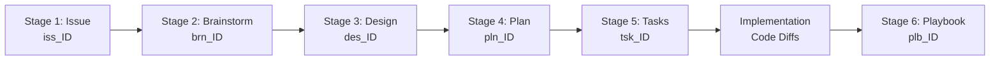

# The Spec-Driven Agentic Lifecycle: 6-Stage Engineering Provenance DAG
## Deterministic, Document-Driven Agentic Engineering for High-Stakes Quantitative Platforms

**Target Audience:** Quantitative Engineers, Autonomous System Architects & Agentic Pair Programmers  
**Target Subsystems:** `.agents/skills/`, `.agents/rules/`, `docs/`, `scripts/ard_builder.py`, `scripts/ard_search.py`  
**Related Rules:**
- [`.agents/rules/python_standards.md`](../.agents/rules/python_standards.md) (Layered Architecture, Type Annotations, Defensive Engineering)
- [`.agents/rules/moneyball_strategy.md`](../.agents/rules/moneyball_strategy.md) (Unconstrained Solvers, Stochastic Modeling, First-Principles Alpha)
- [`.agents/rules/ui_ux_standards.md`](../.agents/rules/ui_ux_standards.md) (Quant Trading Desk 4-Zone Anatomy)

---

## Executive Summary & Core Philosophy

Large Language Models (LLMs) and autonomous coding agents exhibit a well-documented failure mode known as the **Context Drift / Hallucination Horizon**: when tasked with leaping directly from an ambiguous human goal to multi-file production code, error rates compound exponentially. Conventional prompt-and-pray development results in leaky abstractions, circular imports, premature in-flight refactoring, and untracked technical debt.

To achieve institutional durability in **Rubies Rangers**, software development is structured as a **Progressive Formalization Pipeline** governed by an immutable **6-Stage Provenance Directed Acyclic Graph (DAG)**.

```text
  HIGH ENTROPY (Ambiguous Human Intent)
         │
  [Stage 1: Issue (iss_)]       ─── Problem Genesis & Binary Acceptance Criteria
         │
  [Stage 2: Brainstorm (brn_)]  ─── Divergent Exploration (2-3 Competing Trade-offs)
         │
  [Stage 3: Design (des_)]      ─── Convergent Spec (Formal Math, Contracts & Mermaid)
         │
  [Stage 4: Plan (pln_)]        ─── Lead Architect Scoping & Invariant Budgets
         │
  [Stage 5: Tasks (tsk_)]       ─── Micro-Task Execution Harness (<80 lines diff)
         │
  [Stage 6: Playbook (plb_)]    ─── Operational Reality, Runbooks & Spec Deviations
         ▼
  ZERO ENTROPY (Verified Runtime System)
```

The core insight of this lifecycle is **progressive entropy reduction**: each phase performs exactly one narrow, high-fidelity transformation. The human developer acts as the **Lead Architect / Fund Principal** who enforces stage gates, approves trade-offs, and signs off on plans, while autonomous agent skills handle formalization, contract drafting, and micro-task execution.

---

## 1. The 6-Stage Engineering Provenance DAG

Every initiative in the repository traces a strict, bidirectional lineage anchored by a sequential, 3-digit tracking ID (`<ID>`, e.g., `#015`):



### Stage 1: Issue (`docs/issues/iss_<ID>_<slug>.md`)
- **Role:** *The Product Sponsor & Boundary Setter*
- **Activated Skill:** `issue-ingestion-parser`
- **Purpose:** Ingests raw ideas, algorithmic proposals, bug reports, or feature requests. Formulates the problem statement, primary objectives, and strictly testable, binary (pass/fail) acceptance criteria.
- **Rules:** Absolute root of the DAG. Its frontmatter `sources:` array is empty (`[]`). Allocates a sequential ID concurrency-safely via `docs/issues/last_issue_number.md`.

### Stage 2: Brainstorm (`docs/brainstorm/brn_<ID>_<slug>.md`)
- **Role:** *The Research Lab & Divergent Explorer*
- **Activated Skills:** `brainstorm-facilitator` (single-shot) or `brainstorm-ideate-loop` (interactive Socratic sparring)
- **Purpose:** Explores 2 to 3 competing mathematical or architectural approaches (e.g., Safe Bet vs. Wildcard vs. Minimalist). Explicitly evaluates failure modes, latency impacts, and trade-offs before any code or technical spec is written.
- **Stage Gate:** **HARD STOP**. The human must explicitly select the winning design direction before advancing.

### Stage 3: Design (`docs/design/des_<ID>_<slug>.md`)
- **Role:** *The Principal Systems Architect*
- **Activated Skill:** `design-facilitator`
- **Purpose:** Converts the chosen brainstorm option into a spec-grade technical contract. Specifies:
  - Exact mathematical formalisms (objective functions, constraints, probability distributions).
  - Strongly typed `@dataclass` or Pydantic contracts with runtime assertions.
  - Mermaid state machine and sequence diagrams.
  - Systematic failure-mode audits and degradation contingency plans.

### Stage 4: Implementation Plan (`docs/plans/pln_<ID>_<slug>.md`)
- **Role:** *The Tech Lead & Delivery Manager*
- **Activated Skill:** `spec-to-plan`
- **Purpose:** Decomposes the technical design into an incremental, risk-ordered delivery schedule:
  - Invariant preservation matrices.
  - File diff specifications (New, Modify, Delete).
  - Complexity budgets and rollback triggers.
- **Stage Gate:** **HARD STOP**. Requires explicit user review and approval via the `implementation_plan.md` artifact.

### Stage 5: Task Harness (`docs/tasks/tsk_<ID>_<slug>.md`)
- **Role:** *The Deterministic Execution Engine*
- **Activated Skills:** `plan-to-task` or `design-to-task` (composite)
- **Purpose:** Translates the implementation plan into machine-executable micro-tasks:
  - Micro-batches limited to <80 lines of code change per task.
  - Exact file targets and line anchor references.
  - Binary pass/fail verification commands (`pytest tests/test_... -v`).
  - Strict completion checklists `[ ]` $\rightarrow$ `[x]`.

### Stage 6: Operational Playbook (`docs/playbooks/plb_<ID>_<slug>.md`)
- **Role:** *Site Reliability Engineering (SRE) & Operational Reality*
- **Activated Skill:** `playbook-facilitator`
- **Purpose:** Bridges theory to reality after code is committed. Documenting:
  - Runtime commands and CLI flags.
  - Live configuration profiles in `config.yaml`.
  - Spec deviations and runtime trade-offs discovered during coding.
  - Diagnostic failure recovery runbooks and troubleshooting procedures.

---

## 2. Adaptive Complexity: 3 Execution Tracks

Not every engineering task warrants a full 6-stage lifecycle. Work is categorized into one of three execution tracks based on epistemic uncertainty and risk:

| Track | Name | Stages Traversed | When to Use |
| :---: | :--- | :--- | :--- |
| **Track A** | **Deep Architecture** | **6 Stages**<br>`Issue → Brainstorm → Design → Plan → Tasks → Playbook` | Novel quantitative models, stochastic solvers, CPN automation, multi-period optimization, major refactors. |
| **Track B** | **Fast-Track Feature** | **4 Stages**<br>`Issue → Design → Tasks → Playbook` | Well-understood feature extensions, new UI tabs, API client endpoints, or direct integrations where the design direction is unambiguous. Skips divergent brainstorming. |
| **Track C** | **Express Hotfix** | **2 Stages**<br>`Issue → Implementation → Pytest Verification` | Urgent bug fixes, broken imports, syntax errors, or schema regressions with an immediate reproducing test case. |

---

## 3. Agentic Resource Discovery (ARD) & Zero-Crawl Intelligence

To eliminate expensive filesystem crawls and token-heavy directory searches, the repository implements **Agentic Resource Discovery (ARD)**.

### Federated Catalog Architecture
ARD operates through federated JSON manifests (`ard.json` and `docs/ard.json`) built by `scripts/ard_builder.py`. It partitions repository assets into specialized tiers:

```text
rubies_rangers/
├── ard.yaml               # Master ARD Schema & Tier Registry
├── ard.json               # Master Manifest (All Tiers)
├── scripts/
│   ├── ard_builder.py     # Manifest compiler & indexer
│   └── ard_search.py      # Sub-millisecond zero-crawl search CLI
└── docs/
    └── ard.json           # Documentation Tier Manifest
```

### Zero-Crawl Search CLI
Agents and human developers query the manifest instantaneously using `scripts/ard_search.py`:

```bash
# Query all resources matching 'challenge'
python scripts/ard_search.py "challenge"

# Query resources matching 'transfer'
python scripts/ard_search.py "transfer"
```

**Representative Output:**
```text
[Brainstorm] docs/brainstorm/fpl_challenge_optimization_engine.md
  Title: [#004] FPL Challenge Quantitative Optimization Engine
  Lineage: docs/issues/iss_004_fpl_challenge_optimization_engine.md
  Description: Mathematical formulation and candidate screening for dynamic weekly FPL Challenge tournament formats.
  Tags: [brainstorm, challenge, optimization, milp, knapsack]

[Issue] docs/issues/iss_004_fpl_challenge_optimization_engine.md
  Title: [#004] FPL Challenge Quantitative Optimization Engine
  Description: Mathematical formulation and candidate screening for dynamic weekly FPL Challenge tournament formats.
  Tags: [issue, challenge, optimization, milp, knapsack]
```

---

## 4. Open Knowledge Format (OKF) & Code-as-Knowledge

Every document and source module in Rubies Rangers adheres to the **Open Knowledge Format (OKF)**, embedding structured metadata directly into file headers.

### Document Frontmatter (Markdown)
Every file in `docs/` begins with an OKF YAML header:

```yaml
---
type: Issue | Brainstorm | Design | Plan | TaskHarness | Playbook | Architecture
title: "[#015] Autonomous Challenge Coloured Petri Net (CPN) Pipeline"
description: "Autonomous Challenge CPN architecture with modular picker service, model validator, and Saga retry loop."
tags: [issue, challenge, cpn, saga, automation, runner]
status: Active | Closed | Draft | Legacy
sources: ["docs/issues/iss_015_challenge_cpn_autonomous_runner.md"]
generated:
  at: "2026-09-17T05:25:00Z"
  by: "agent:issue-ingestion-parser"
---
```

### Code-as-Knowledge Frontmatter (Python Docstrings)
Python modules embed OKF frontmatter inside their module-level docstrings, linking running code directly to its originating design specification:

```python
"""
---
type: Implementation
title: "Autonomous Challenge CPN Runner"
description: "Standalone CLI entrypoint for orchestrating autonomous Challenge CPN execution without FastAPI dependencies."
tags: [automation, challenge, runner, cli]
status: Active
sources: ["docs/design/des_015_challenge_cpn_autonomous_runner.md"]
generated:
  at: "2026-09-17T05:25:00Z"
  by: "agent:antigravity"
---
"""
from __future__ import annotations
...
```

### Validation Tooling
Compliance is audited via the automated OKF validator:
```bash
python .agents/skills/code-frontmatter-generator/scripts/validate_code_okf.py --dir docs
```

---

## 5. Summary of Active Agentic Skills

The lifecycle is automated by 14 specialized skills located in [`.agents/skills/`](file:///c:/Users/cw171001/OneDrive%20-%20Teradata/Documents/GitHub/rubies_rangers/.agents/skills):

| Skill Name | Lifecycle Stage | Primary Responsibility |
| :--- | :---: | :--- |
| **`issue-ingestion-parser`** | **Stage 1** | Parses human prompts into `iss_<ID>_<slug>.md`, allocates sequential IDs, sets binary acceptance criteria. |
| **`brainstorm-facilitator`** | **Stage 2** | Generates single-shot `brn_<ID>_<slug>.md` with 2-3 competing options and trade-off matrices. |
| **`brainstorm-ideate-loop`** | **Stage 2** | Socratic sparring partner probing wildcards and failure modes before drafting brainstorms. |
| **`design-facilitator`** | **Stage 3** | Converts brainstorms into `des_<ID>_<slug>.md` with mathematical formalisms, Mermaid diagrams, and typed contracts. |
| **`spec-to-plan`** | **Stage 4** | Compiles designs into `pln_<ID>_<slug>.md` defining invariants, diff budgets, and dependency ordering. |
| **`plan-to-task`** | **Stage 5** | Compiles plans into `tsk_<ID>_<slug>.md` with atomic micro-tasks (<80 LOC) and binary verification gates. |
| **`design-to-task`** | **Stage 4-5** | Composite pipeline chaining `spec-to-plan` + `plan-to-task` into a single fast-track invocation. |
| **`playbook-facilitator`** | **Stage 6** | Synthesizes committed code and designs into `plb_<ID>_<slug>.md` operational reality runbooks. |
| **`doc-frontmatter-generator`** | **Governance** | Generates and audits OKF frontmatter across all markdown files. |
| **`code-frontmatter-generator`** | **Governance** | Embeds and validates OKF frontmatter in Python module docstrings (`validate_code_okf.py`). |
| **`review-audit-architecture`** | **Quality** | Audits domain layering (`ui/` $\rightarrow$ `automation/` $\rightarrow$ `analytics/` $\rightarrow$ `clients/`) and flags circular imports. |
| **`review-audit-vectorization`** | **Quality** | Audits NumPy/pandas code against slow `.iterrows()` loops and memory churn. |
| **`test-design`** | **Testing** | Architects test plans, boundary condition matrices, and synthetic fixtures. |
| **`test-generation-python`** | **Testing** | Generates high-performance `pytest` test suites, property tests, and async CPN fixtures. |

---

## 6. CLI Command Cheat Sheet

```bash
# 1. Search the repository with zero crawl (sub-millisecond)
python scripts/ard_search.py "<query>"

# 2. Re-index all ARD manifests after adding documents or modules
python scripts/ard_builder.py

# 3. Validate OKF frontmatter across documentation
python .agents/skills/code-frontmatter-generator/scripts/validate_code_okf.py --dir docs

# 4. Validate OKF frontmatter across Python codebase
python .agents/skills/code-frontmatter-generator/scripts/validate_code_okf.py --root .

# 5. Run full platform regression test suite
python -m pytest tests/ -v
```
