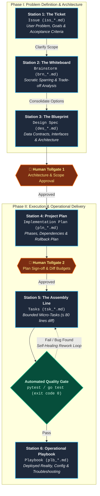

# 👔 The Non-Mathematician's Guide to the Spec-Driven Agentic Lifecycle
## How We Build Software with AI: A Practical Guide for Project Managers, Leads, and Non-Coders

> 💡 **Looking for the formal mathematical paper?**  
> If you need the formal set theory, 7-tuple Petri Net formulas ($\mathcal{N} = (P, T, A, \Sigma, G, E, M_0)$), and algebraic proofs, read the technical whitepaper: [**The Agentic Coloured Petri Net (CPN) Lifecycle & Lineage Trace**](spec_driven_agentic_lifecycle.md).  
> If you want to understand **how the process works, how to manage it, and its pros and cons**, you are in the right place!

---

## 1. Executive Summary: The AI Dilemma

### The Problem with Naive AI Coding
AI models (like ChatGPT, Claude, and GitHub Copilot) are essentially **hyperactive, brilliant junior developers**:
- They can generate 500 lines of code in 10 seconds.
- But if you let them write code immediately from a 1-sentence prompt, they **hallucinate**, break existing systems, make wild architectural assumptions, and suffer from **"context amnesia"** (forgetting what was decided 20 minutes ago).
- When a bug appears, they enter a **"mega-diff death spiral"**: rewriting hundreds of lines, breaking 4 other files, and burning hours of engineering time.

### The Solution: An Automated, Gated Assembly Line
Instead of letting the AI write code whenever it wants, our lifecycle treats software engineering as an **industrial manufacturing assembly line** with:
1. **Clear Stations** (6 progressive phases from raw idea to deployment).
2. **Human Tollgates** (the AI stops and waits for manager/lead approval before doing expensive work).
3. **Strict Bounded Work** (the AI is strictly forbidden from writing more than 80 lines of code per task).
4. **Self-Healing Quality Checks** (every piece of code is automatically tested before moving to the next station).

---

## 2. The 6 Assembly Line Stations (How Work Gets Done)

Every feature, solver, or refactor moves through 6 structured stations:



### Station 1: The Ticket (`Issue` — `docs/issues/iss_*.md`)
- **What it is**: The raw problem statement or feature request.
- **What happens**: The AI extracts the *business context*, *measurable goals*, and *acceptance criteria*. It assigns a unique sequential ID (e.g. `#018`).
- **Why it matters**: Ensures everyone agrees on the problem before anyone talks about code.

### Station 2: The Whiteboard (`Brainstorm` — `docs/brainstorm/brn_*.md`)
- **What it is**: Exploratory sparring and trade-off analysis.
- **What happens**: Instead of jumping to the easiest solution, the AI and human evaluate 2–3 competing approaches (e.g., *"Safe Bet vs. High-Performance Wildcard"*), analyzing compute cost, speed, and architectural risk.
- **Why it matters**: Catches flawed technical assumptions when they cost $0 to fix.

### Station 3: The Blueprint (`Design Spec` — `docs/design/des_*.md`)
- **What it is**: The detailed engineering specification.
- **What happens**: Defines exact data shapes, inputs, outputs, database tables, and system flowcharts.
- **🛑 Human Tollgate #1**: The AI **must stop**. A human engineer or manager must review and approve the blueprint before any implementation planning begins.

### Station 4: The Project Plan (`Implementation Plan` — `docs/plans/pln_*.md`)
- **What it is**: The project schedule, phases, and safety net.
- **What happens**: The blueprint is broken into chronological phases with explicit risk mitigations and a rollback plan if something goes wrong.
- **🛑 Human Tollgate #2**: The human approves the scope, timeline, and boundary invariants.

### Station 5: The Bounded Assembly Line (`Tasks` — `docs/tasks/tsk_*.md`)
- **What it is**: The actual hands-on coding and verification.
- **The Golden Rule**: **$\le 80$ lines of code diff per task.**
- **Automated Quality Gate**: The AI cannot touch the next task until the current task passes an automated test (e.g. `pytest` or `go test` exits code `0`). If a test fails, the AI enters a localized **Self-Healing Loop**, fixing only those specific 80 lines without breaking the rest of the project.

### Station 6: The User Manual (`Playbook` — `docs/playbooks/plb_*.md`)
- **What it is**: The operational reality guide.
- **What happens**: Because software in production often differs slightly from initial blueprints, this document records what was *actually* built, how to configure it in `config.yaml`, which buttons to click in the UI, and a troubleshooting table for common errors.
- **Why it matters**: Eliminates the "developer built it and left no documentation" problem.

---

## 3. The "Coloured Petri Net" in Plain English (The Airport Baggage Metaphor)

In technical papers, we call this a **Coloured Petri Net (CPN)**. If you are not a computer scientist, think of it as an **Airport Baggage Sorting Facility**:

| Formal Concept | Airport Baggage Metaphor | What It Does in Our Workflow |
| :--- | :--- | :--- |
| **Places ($P$)** | Storage holding bins / luggage carousels | Buffer folders where work waits (e.g. `P_ISSUE_READY`, `P_TASK_QUEUE`). |
| **Transitions ($T$)** | Sorting machines / airport handlers | The specialized AI agents that take a ticket, do the work, and put it in the next bin. |
| **Tokens** | Individual suitcases with routing tags | The actual feature tickets and code packages traveling through the system. |
| **Colors (Tracks)** | Priority tags (First Class vs. Carry-on) | **3 Execution Lanes** depending on urgency and complexity (see below). |
| **Guards / Semaphores** | Passport control / Customs inspection | The checkpoint where a human or an automated test must stamp approval before the bag moves. |
| **Feedback Cycles** | Conveyor belt reroute for oversized bags | The self-healing loop that sends failing code back to be repaired before proceeding. |

```mermaid
flowchart TD
    Bag["🧳 <b>Feature Ticket / Work Package</b><br/><i>(Colored Token: Track A, B, or C)</i>"]
    
    subgraph Airport ["The Automated Baggage Sorting Network"]
        CheckIn["<b>Luggage Drop / Ingestion</b><br/><code>P_ISSUE_READY</code>"]
        Sort1["<b>Sorting & Planning Hub</b><br/><code>P_BRAINSTORM_POOL & P_DESIGN_READY</code>"]
        Passport{{"🛑 <b>Passport & Customs Control</b><br/><i>Human Review Semaphore</i>"}}
        Assembly["<b>Baggage Loading Belt</b><br/><code>P_TASK_QUEUE</code><br/><i>Micro-Tasks &le; 80 lines</i>"]
        Scanner{"<b>Automated Security Scanner</b><br/><i>pytest / go test pass?</i>"}
        Rework["<b>Inspection & Repair Bay</b><br/><code>P_REWORK</code><br/><i>Self-Healing Retry</i>"]
        Flight["✈️ <b>Final Destination Flight</b><br/><code>P_COMMITTED_PLAYBOOK</code><br/><i>Deployed in Operational Reality</i>"]
    end

    Bag --> CheckIn
    CheckIn --> Sort1
    Sort1 --> Passport
    Passport -->|Approved Stamp| Assembly
    Assembly --> Scanner
    Scanner -->|Pass (exit 0)| Flight
    Scanner -.->|Alarm / Defect Found| Rework
    Rework -.->|Fix Applied| Assembly

    classDef bin fill:#1e293b,stroke:#38bdf8,stroke-width:1.5px,color:#f8fafc;
    classDef check fill:#7c2d12,stroke:#f97316,stroke-width:1.5px,color:#fef08a;
    classDef dest fill:#064e3b,stroke:#10b981,stroke-width:1.5px,color:#d1fae5;
    classDef item fill:#312e81,stroke:#a5b4fc,stroke-width:2px,color:#e0e7ff;

    class CheckIn,Sort1,Assembly,Rework bin;
    class Passport,Scanner check;
    class Flight dest;
    class Bag item;
```

### The 3 Execution Lanes (Tracks)

We do not force every single change through all 6 stations. Work is classified into 3 priority lanes:

```mermaid
flowchart TD
    subgraph TrackA ["Track A: Deep Architecture (6 Stations) — Novel Solvers & Core Models"]
        direction LR
        A1["Station 1<br/><b>Issue</b>"] --> A2["Station 2<br/><b>Brainstorm</b>"] --> A3["Station 3<br/><b>Design</b>"] --> A4["Station 4<br/><b>Plan</b>"] --> A5["Station 5<br/><b>Tasks</b>"] --> A6["Station 6<br/><b>Playbook</b>"]
    end

    subgraph TrackB ["Track B: Fast-Track Feature (4 Stations) — Standard UI & APIs"]
        direction LR
        B1["Station 1<br/><b>Issue</b>"] --> B3["Station 3<br/><b>Design</b>"] --> B5["Station 5<br/><b>Tasks</b>"] --> B6["Station 6<br/><b>Playbook</b>"]
    end

    subgraph TrackC ["Track C: Express Hotfix (2 Stations) — Urgent 1-Line Fixes"]
        direction LR
        C1["Station 1<br/><b>Issue</b>"] --> C5["Station 5<br/><b>Code & Verify</b>"]
    end

    classDef trackA fill:#1e1b4b,stroke:#818cf8,stroke-width:1.5px,color:#e0e7ff;
    classDef trackB fill:#0f3b38,stroke:#2dd4bf,stroke-width:1.5px,color:#ccfbf1;
    classDef trackC fill:#3b1828,stroke:#f43f5e,stroke-width:1.5px,color:#ffe4e6;

    class A1,A2,A3,A4,A5,A6 trackA;
    class B1,B3,B5,B6 trackB;
    class C1,C5 trackC;
```



---

## 4. Pros and Cons: An Unvarnished Evaluation

Like any engineering methodology, this process has significant strengths and real trade-offs.

### 🌟 The Advantages (Pros)

1. **Immunity to AI Amnesia & "Context Rot"**:  
   AI chat windows forget decisions after 30 minutes. In this lifecycle, all architectural decisions, constraints, and contracts are saved as permanent Markdown files on disk. A new AI session can pick up the work weeks later with zero loss of context.
2. **Elimination of the "Mega-Diff" Nightmare**:  
   Because tasks are strictly capped at $\le 80$ lines of code with automated test verification, an AI can never run wild and corrupt 1,000 lines of your codebase.
3. **100% Auditability & Governance**:  
   Every single line of production code links back to its origin Design Spec and original Issue. If an auditor asks *"Why does this trading solver use this calculation?"*, you can trace it directly to the exact Brainstorm and Design document.
4. **Built-In Documentation (Zero Technical Debt)**:  
   Documentation is generated as a prerequisite to coding, not as an afterthought that developers skip.
5. **Instant Project Telemetry (<50ms & >98% Token Savings)**:  
   Instead of asking an AI *"What is the status of our roadmap?"* (which takes 45 seconds and burns thousands of tokens reading code), managers can run a one-line command:
   ```bash
   python scripts/issue_status.py --all
   ```
   This reads our catalog manifest in **less than 50 milliseconds** and outputs an exact roadmap table.

---

### ⚠️ The Disadvantages (Cons)

1. **Higher Upfront Friction (No "Instant Code")**:  
   If an executive asks for a feature immediately, this process forces a Brainstorm, Design, and Plan first. You cannot just "start typing code" on Day 1.
2. **Requires Human Discipline at Tollgates**:  
   The process only works if human leads actually read the Design Blueprint and Implementation Plan before clicking "Approve". If a human rubber-stamps bad specs, the AI will build bad code cleanly.
3. **Overkill for Disposable Prototypes**:  
   If you are building a throwaway 1-day hackathon script or a proof-of-concept you plan to delete tomorrow, going through 6 stations is unnecessary overhead.
4. **Tooling & Setup Overhead**:  
   The system relies on background catalog builders (`ard_builder.py`) and metadata validators (`validate_code_okf.py`). If team members ignore the tooling or write files outside the structured folders, the indexing can fall out of sync.

---

## 5. How This Compares to Other Approaches

| Dimension | "Cowboy" AI Coding (ChatGPT/Copilot Prompts) | Traditional Agile / Scrum (Jira) | Our Spec-Driven Agentic Lifecycle |
| :--- | :--- | :--- | :--- |
| **Speed to First Code** | Instant (seconds) | Slow (sprint planning, weeks) | Moderate (minutes to write spec first) |
| **Quality of Complex Code** | Very Low (buggy, unverified) | High (human-written, peer-reviewed) | **Very High (formal specs + automated test gates)** |
| **Risk of Runaway Regressions** | Extreme (mega-diffs break unrelated code) | Moderate (mitigated by human PR review) | **Near Zero (strictly capped $\le 80$-line micro-tasks)** |
| **Documentation Completeness** | Almost None (ephemeral chat logs) | Often Outdated / Abandoned | **100% Comprehensive (Specs & Playbooks committed to Git)** |
| **Visibility for Managers** | None (hidden in developer chat logs) | Manual (devs must update Jira tickets) | **Instant & Automated (`issue_status.py` in <50ms)** |

---

## 6. The Project Manager's Cheat Sheet (How to Run Projects)

As a technical project manager or engineering lead, you only need to know **3 simple commands**:

### 1. The Daily Standup Command (See All Project Statuses)
Run this in your terminal to see where every single issue sits across the 6 stations:
```bash
python scripts/issue_status.py --all
```
*Output*: A clean table showing whether each issue is at **Stage 1 (Issue)**, **Stage 2 (Brainstorm)**, **Stage 3 (Design)**, etc., and what transition is needed next.

### 2. The Feature Deep-Dive Command
To inspect the exact artifact chain for a single feature (e.g. Issue `#004`):
```bash
python scripts/issue_status.py --id 004
```
*Output*: Shows the completed checklist:
```text
  [x] Stage 1 (Issue)     : docs/issues/iss_004_fpl_challenge_optimization_engine.md
  [x] Stage 2 (Brainstorm): docs/brainstorm/fpl_challenge_optimization_engine.md
  [ ] Stage 3 (Design)    : None (Awaiting T_DESIGN via /design-facilitator)
  [ ] Stage 4 (Plan)      : None
  [ ] Stage 5 (Tasks)     : None
  [ ] Stage 6 (Playbook)  : None
```

### 3. Your Role at the Tollgates
When the AI presents a **Stage 3 Design Spec** or **Stage 4 Implementation Plan**:
1. Check that the **Scope** matches business goals.
2. Check that the **Rollback Plan** is realistic.
3. Type **"Proceed"** or provide feedback. Once approved, the AI autonomously executes the bite-sized tasks with zero babysitting.

---

## 7. Summary

The Spec-Driven Agentic Lifecycle is **not about slowing down development**—it is about **eliminating the hours wasted debugging broken AI code**. 

By spending 5 minutes upfront on a Blueprint and Project Plan, and forcing the AI into bite-sized, self-healing tasks ($\le 80$ lines), you get the speed of AI generation with the predictability, quality, and governance of an enterprise software organization.
